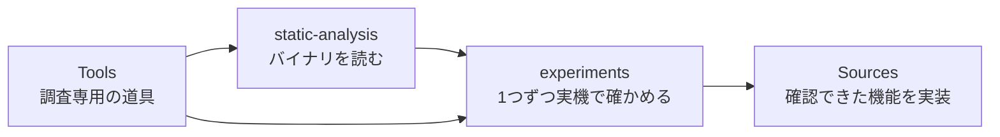

# 調査ガイド — 分かったことと、次に調べること

[製品のREADME](../README.md) · [やさしい仕様](../docs/specification.md) · [図で読む仕組み](../docs/architecture.md) · [対応する環境](../docs/compatibility.md)

このフォルダは、Logicを外から操作できる経路を調べた記録です。
**静的解析で見つけた処理**と、**専用プロジェクトで実際に動いた操作**を区別して記録します。
各記録の冒頭から英語版にも移動できます。

全体解析からエージェント利用までの優先順位・Ghidra起点・実験・完成条件は、
[調査・開発計画](plans/agent-ready-roadmap.md)にまとめています。
[22件の作業一覧](plans/agent-ready-backlog.tsv)には依存関係と合格条件もあります。
Logic Remote の初回受信は [EXP-REMOTE-001](experiments/EXP-REMOTE-001-receive-initial-state.md)、再接続の基準状態は [EXP-REMOTE-003](experiments/EXP-REMOTE-003-reconnect-selection-baseline.md)、その後の **選択変更1回の `/sti`・`/gtFaderData` 差分は [EXP-REMOTE-004](experiments/EXP-REMOTE-004-selection-delta.md)** に記録しています。各表示の通知は別々に届き、今回の8枠の選択更新の末尾までは65.7 msでした。これは1回の受信間隔で、全状態の完了保証ではありません。明示的な録音待機の比較は、操作前に中止した [EXP-REMOTE-005](experiments/EXP-REMOTE-005-aborted-explicit-arm.md) に未実施の範囲を記録しています。

2026-10-07 に専用プロジェクトでの実機実験と computer use は包括的に許可されました。以前の追加接続の回答待ちは解消しています。現在の主な実機確認の残りは、同じポートにある2台の MCU を整理した状態での読み戻し、明示的な録音待機、曲の切替、識別子の寿命です。研究用ピアの受信確認と、製品からの Remote 接続・書き込みは区別します。

## 最初に読む3つ

1. [接続経路の全体像](architecture.md)：MCU・Logic Remote・AppleEventなどの根拠をまとめた地図。
2. [AppleEventのCLI統合](experiments/EXP-AE-002-cli-backend.md)：現在使える再生・停止と、その検証結果。
3. [ネイティブ状態取得の候補](static-analysis/SA-AE-STATE-002-native-transport-state.md)：MCUを置き換えるために、何が未確認か。

## 現在の到達点

| 経路 | 確認できたこと | まだ分からないこと |
|---|---|---|
| MCU：仮想MIDI | 製品の状態取得・再生・停止・ミキサー操作。自動接続とバンク移動 | 名前の完全取得、プラグインなどの拡張 |
| private AppleEvent | 登録先・正しい引数・再生と停止。MCUで結果を検証するCLI実装 | 純粋な状態取得、他バージョン、録音など |
| Logic Remote | 静的な接続・送信手順、通信フレームとコマンド台帳。研究用ピアの初回受信と再接続、Swift/Pythonの保存記録の再生 | 初回の完全性の判定、操作と差分の実機対応、製品への接続統合 |
| OSC / Lua | 存在と関連する設定・スクリプト | 任意のCLIからの割り当て・応答の条件 |
| XPC | インストーラー関連の接続 | 操作用のサービスは未発見 |

「静的解析で確認」は、通信を実際に受け取ったことを意味しません。
`/keyCommandStateUpdate` の初回0省略は、ARM64分岐の解析結果です。
`/gtFaderData` の全項目モードとは別の経路で、実機の初回応答はまだ取得していません。

## 記録の使い分け

| 場所 | 入っているもの |
|---|---|
| `static-analysis/` | Ghidra、命令、メタデータ、ハッシュを使った根拠 |
| `experiments/` | 対象・初期状態・1回の操作・観測・再現回数 |
| `protocol/` | ワイヤーキー、コマンド台帳（`operation-catalog.tsv`）、Remote のスキーマ、領域別の対応表（`support-matrix.tsv`）、`t`・`c` の表と命令の照合表（`logic-remote-track-types.tsv`・`logic-remote-colour-bytes.tsv`・`logic-remote-trackcolor-anchors.tsv`。確認は `Tools/research-scripts/binary_anchors.py`）、受信とスキーマの対応（`logic-remote-state-coverage.tsv`・`logic-remote-captured-addresses.tsv`・`logic-remote-cs-feedback.tsv`。値は載せない）などの抽出表 |
| `notes/` | 関連資料・先行例 |
| `raw/` | ローカルの生出力。Gitには含めない |

## 静的解析の一覧

| 記録 | 内容 |
|---|---|
| [SA-001](static-analysis/SA-001-logic-control-bundle.md) | Logic Controlと音量の変換表 |
| [SA-002](static-analysis/SA-002-control-surface-assign-model.md) | 共通の割り当てモデルとRemoteのフレーム |
| [SA-003](static-analysis/SA-003-logic-framework-first-pass.md) | Logic.frameworkの初回調査 |
| [SA-004](static-analysis/SA-004-command-and-engine-boundaries.md) | コマンドと音声エンジンの境界 |
| [SA-005](static-analysis/SA-005-logic-remote-state-push.md) | Logic Remoteへの状態送信とキー定数 |
| [SA-REMOTE-SESSION-001](static-analysis/SA-REMOTE-SESSION-001.md) | Logic Remote の接続：広告・招待・承認・バージョンの順序と拒否の条件 |
| [SA-REMOTE-FRAME-001](static-analysis/SA-REMOTE-FRAME-001.md) | Logic Remote のフレーム：タグ・圧縮（MAZP）・形式の選び方・型と順序 |
| [SA-REMOTE-STATE-001](static-analysis/SA-REMOTE-STATE-001.md) | Logic の状態送信：初回送信の順序、`/ati`・`/sti`・`/gtFaderData`、差分、曲の切り替えと接続 |
| [SA-REMOTE-TRACKTYPE-001](static-analysis/SA-REMOTE-TRACKTYPE-001.md) | `/ati` の `t`（トラックの種類。判定の 8 規則）と `c`（色の 4 バイトは R, G, B, A）。命令・定数の照合表付き。受信値の確認範囲は実験記録に分けて記載 |
| [SA-REMOTE-KEYCOMMAND-001](static-analysis/SA-REMOTE-KEYCOMMAND-001.md) | `/keyCommand/actionNum` の番号（16 ビットに切り詰めた 0〜4950）は台帳の `command_id`。前面でも背面でも、共通のディスパッチャーへ `source` 2 で渡る。結果は待たず返事も無い（静的のみ。送信はしていない） |
| [SA-COMMAND-CATALOG-001](static-analysis/SA-COMMAND-CATALOG-001.md) | 登録コマンド 2353 件の台帳と、Remote のコマンド一覧（実行はしていない） |
| [SA-IDENTITY-001](static-analysis/SA-IDENTITY-001-binary-inputs.md) | 元Universal/thinファイル・arm64 slice・解析copy・Ghidra import metadataの識別と照合 |
| [AppleEvent登録](static-analysis/appleevent-registration.md) | handler・型・戻り値・モード分岐 |
| [コマンドへの橋渡し](static-analysis/appleevent-command-dispatch.md) | AppleEventからplay/stopの内部コマンドへ |
| [MACoreのAppleEvent調査](static-analysis/macore-appleevents.md) | x86側の候補と、陰性結果の限界 |
| [状態取得候補](static-analysis/SA-AE-STATE-002-native-transport-state.md) | 内部getter・外部購読・mode 4の副作用 |
| [テキスト操作の分岐](static-analysis/SA-AE-MODES-001-text-operations.md) | mode 7〜14の設定読み込み・ファイル書き込み・MIDI取込候補と、応答の限界 |
| [ファイル・リージョン分岐](static-analysis/SA-AE-FILE-001-file-region.md) | ファイル入力の型、対象・位置の決定、metadata変更、未知modeの到達 |
| [ファイル配置の位置変換](static-analysis/SA-AE-TIME-001-position-conversion.md) | 44100の初期値、固定小数点の算術、anchorとdelta、cache書き込み。単位は未確定 |
| [XML の項目と省略条件](static-analysis/SA-AE-XML-002-channel-node-schema.md) | Channel・Plugin・Parameter のタグと属性、空文字の省略、条件付き alert。公開APIではない |
| [書き出しと削除対象](static-analysis/SA-AE-EXPORT-002-temporary-output.md) | mode 12 の失敗時に directory path が削除 API へ届き得る経路。実行候補から除外 |
| [位置変換 context の更新と寿命](static-analysis/SA-AE-TIME-002-context-lifecycle.md) | rate/scale の更新、cache 世代、登録解除、fallback record。実際の曲への追従は未確認 |
| [AppleEvent の対象解決](static-analysis/SA-AE-TARGET-003-target-resolution.md) | 選択値・内部 record・container・object の違い、失敗と out parameter、lookup 内の生成・保存。安定 ID は未確定 |
| [子レコードと mode 14 の書き出し](static-analysis/SA-AE-TARGET-004-child-path-mutation.md) | 配列の所有権移動、filename・directory label・CRC の違い、選択書き出しと削除前置。成功は AE 応答へ伝わらない |
| [root・名前の容量・書き出しの再試行](static-analysis/SA-AE-TARGET-005-root-utf8-export-retry.md) | numeric root 1/2 の出どころ、62/63-byte の名前容量、phase flag・catch/retry・cleanup、owner の counters/mutex/通知。例外の型との対応は次の追補で確認 |
| [例外の型対応・metadata・loading](static-analysis/SA-AE-TARGET-006-exception-metadata-loading.md) | 固定2関数の LSDA / type-info 対応、mode 2 の archive / cache、同期 block invoke と mapping 更新、metadata の binary plist。キャッシュの読み戻しだけでは保存内容を検証できない |
| [mapping のクラス集合と index 範囲](static-analysis/SA-AE-TARGET-007-mapping-classes-index-ranges.md) | 登録可能な registry の copy と二つの数値 predicate。全 allowed classes・新 index の妥当性・公開 ID は未確定 |
| [archive のクラス候補と initializer](static-analysis/SA-AE-TARGET-008-archive-classes-initializers.md) | 三つの class 候補集合の構築と、私有 selector → 通常 initializer の転送。23候補行と実行中の集合の要素数・保存成功を区別 |
| [decode の追加候補・delegate・UUID](static-analysis/SA-AE-TARGET-009-decoder-delegate-uuid.md) | getter の追加3候補、mode 1 の代替 class、UUIDBytes の16バイトと長さ検査。復元・class 受理・生成成功は未確認 |
| [クラス名の登録・空マッピング・decode 終了](static-analysis/SA-AE-TARGET-010-registrations-null-mapping-finish.md) | 旧 class 名3件、属性を読まない代替 initializer、終了前 error の BOOL。getter は BOOL を使わず先に条件付き cache 保存を行う |
| [fallback・Logic の宛先・親の保存キー](static-analysis/SA-AE-TARGET-011-fallback-parent-encode.md) | 固定 fallback の RET、Logic 宛先の符号拡張、19保存キー。saved-value helper は double を返し、数値の保存を gate しない |
| [親 decoder の20キー・旧保存値・ID getter](static-analysis/SA-AE-TARGET-012-parent-decode.md) | 保存した19キーと旧longキーの読出し。nil・range入替え・保存値の優先順、32 bitのIDとLogicのconstant 0定義。実効dispatchと保存往復は未確認 |
| [旧 long の読み方・親の3アクセサ](static-analysis/SA-AE-TARGET-013-parent-helpers.md) | NSCoder category のキー別整数 / NSNumber 読出し、追加引数の用途、setter・旧long・flag getter。4定義260 bytesを照合。実効dispatchと旧値の移行は未確認 |
| [現在doubleとLogicのlong読出し](static-analysis/SA-AE-TARGET-014-parent-consumers.md) | savedValue の −1.0 / 現在doubleと、proxy の object → longValue。2定義112 bytesを照合。旧longの移行は未解決 |
| [proxy decoderの辞書・scalar・bytes](static-analysis/SA-AE-TARGET-015-proxy-decoder.md) | 13定義880 bytes。辞書値からarchiveへ渡す条件、型制限引数を使わないwrapper、signed32読出し、bytes長出力。実効dispatchとnative失敗は未確認 |
| [UIDと型別のオブジェクト復元](static-analysis/SA-AE-TARGET-016-archive-dispatch.md) | 2定義2280 bytes。UID cache・範囲検査、クラス名/subclassによる復元先、固定クラスfallback、version読出し。実効dispatchと保存往復は未確認 |
| [ファイルの入口と復元先クラス](static-analysis/SA-AE-TARGET-017-archive-containers.md) | 5定義1736 bytes。plist/plistZ・固定version、Class名alias、解決したClassの生成、KVC/root読出し。実機の受理と保存往復は未確認 |
| [配列・文字列・識別子の復元](static-analysis/SA-AE-TARGET-018-archive-helpers.md) | 8定義1996 bytes。番号付き配列/辞書、UTF8、固定の属性・色、NSNull時のUUID生成、Channel IDの整数幅、固定objectのcopy。実ファイルの受理と保存往復は未確認 |
| [Logic曲ファイルの入口と版判定](static-analysis/SA-PROJECT-FILE-001-logicx-loader.md) | 2定義2276 bytes。Alternativesの分類と旧archive経路、backup移動・表示復元・tmp削除・metadata書込。native ProjectData本体と実機の読込は未確認 |
| [版番号の比較と読込の委譲](static-analysis/SA-PROJECT-FILE-002-loader-delegation.md) | 3定義364 bytes。signed32の比較、実managerへの委譲、resolverが返したpathをURLへ渡す経路。返値enum・実dispatch・出力pointer契約は未確認 |
| [native入力の判定と曲パスの選択](static-analysis/SA-PROJECT-FILE-003-native-route.md) | 3定義4388 bytes。4つのheader比較、converter後のデータ選択、variantと低メモリ自動保存候補、モーダル返値・nil/flag経路。schema・実dispatch・実読込は未確認 |
| [rate の採用と失敗の意味](static-analysis/SA-AE-TIME-003-rate-adoption.md) | 判定前の保存、virtual 採用試行、token の返値、UI buffer・位置 map 更新。単純な bool getter ではない |
| [XML の空スロット判定と警告](static-analysis/SA-AE-XML-003-empty-slot-alert.md) | 先頭の空きも含む pointer 判定、MACore の設定参照、XML 追加とモーダル警告の別条件 |

テキストとファイルの分岐は、現時点では静的解析の記録です。helperの失敗が応答に反映されない経路や、対象を選ぶ段階で内部metadataを書き換える処理があります。製品CLIの対応機能としては公開していません。[入力と解析出力のmanifest](static-analysis/appleevent-mode-analysis-manifest.json)に、対象バイナリ・Ghidra条件・ローカル根拠のハッシュを記録しています。XML・書き出し・context更新の追補は[follow-up manifest](static-analysis/appleevent-followup-analysis-manifest.json)、対象解決・rate採用・XML警告の追補は[native boundaries manifest](static-analysis/appleevent-native-boundaries-manifest.json)で照合できます。子レコード・directory CRC・mode 14 書き出しの追補は [target mutations manifest](static-analysis/appleevent-target-mutations-manifest.json)、root・UTF8・例外経路の追補は [target boundaries manifest](static-analysis/appleevent-target-boundaries-manifest.json)、例外テーブル・metadata・loading の追補は [phase analysis manifest](static-analysis/appleevent-phase-analysis-manifest.json)、mapping のクラス集合・数値範囲は [mapping analysis manifest](static-analysis/appleevent-mapping-analysis-manifest.json)、class 候補集合・私有 initializer は [class construction manifest](static-analysis/appleevent-class-construction-manifest.json)、decoder の追加候補・delegate・UUID は [decoder analysis manifest](static-analysis/appleevent-decoder-analysis-manifest.json) に記録しました。クラス名の登録・空マッピング・終了処理は [registration / finish manifest](static-analysis/appleevent-registration-finish-manifest.json) に記録しました。 fallback・Logic の宛先・親の保存キーは [parent encode manifest](static-analysis/appleevent-parent-encode-manifest.json) に記録しました。各資料は日英版の切替と図を備えています。

## 実験の一覧

| 記録 | 内容 |
|---|---|
| [EXP-MCU-001〜009](experiments/EXP-MCU-001-009-virtual-mcu.md) | 仮想MCUの接続と基本操作 |
| [EXP-REMOTE-001](experiments/EXP-REMOTE-001-receive-initial-state.md) | 研究用ピアで 1 回接続し、初回送信を受信だけ：全フレームを復号、スキーマ違反 0。`t` の意味の推測 3 つは外れ、`gindex` は作成順 |
| [EXP-REMOTE-002](experiments/EXP-REMOTE-002-offline-state-replay.md) | 保存した受信からの状態の組み立て直し（オフライン）：未受信は null、識別子を分け、`complete` は推定しない。矛盾 0、`/sti` は `/ati` より先に届く |
| [EXP-REMOTE-003](experiments/EXP-REMOTE-003-reconnect-selection-baseline.md) | 120秒の再接続で14ストリップ、同じ選択のATI `t=7` / STI `t=2`。11,459フレームを日英・観測表・manifestに整理。選択変更の比較は未完了 |
| [EXP-REMOTE-004](experiments/EXP-REMOTE-004-selection-delta.md) | 選択をBallad→Pianoへ1回変更。STIと後続fader rの移動を11,396フレームで確認、受信後に画面で復元。関数実行ログは未取得 |
| [EXP-REMOTE-005](experiments/EXP-REMOTE-005-aborted-explicit-arm.md) | 明示REC実験を操作前に中止。9,296フレームを再読し初期状態だけを確認。未送信は担当者の記録に基づき、rの明示録音待機の意味は未検証 |
| [EXP-MCU-020](experiments/EXP-MCU-020-banking.md) | 8本を超えるストリップの到達と表示範囲 |
| [EXP-MCU-021](experiments/EXP-MCU-021-last-strip-db-text.md) | 最後のストリップだけ dB 表示の位置がずれる |
| [EXP-MCU-022](experiments/EXP-MCU-022-rename-reaches-surface.md) | トラック名の変更は MCU の表示に届く |
| [EXP-MCU-023](experiments/EXP-MCU-023-add-delete-reach-surface.md) | 追加・削除は届く。削除後に古いバンク位置を信じる不具合と修正。並べ替えは未確認 |
| [EXP-MCU-024](experiments/EXP-MCU-024-trace-add-delete.md) | 追加・削除で Logic が送る MIDI（削除では色の sysex が来ない） |
| [EXP-MCU-025](experiments/EXP-MCU-025-same-name-tracks.md) | 同名のトラックと `--expect-name` の限界 |
| [EXP-MCU-026](experiments/EXP-MCU-026-execution-contract-live.md) | 実行契約の実機確認：期限切れ・同じキーの再送・実行中の重複・世代の不一致 |
| [EXP-MCU-027](experiments/EXP-MCU-027-live-smoke.md) | 実機の抜き取り試験 `live_smoke.py` の初回実行（26 件合格） |
| [EXP-MCU-028](experiments/EXP-MCU-028-arm-and-position-live.md) | `track arm` と `state` の `position` を実機で確認。選択中のトラックの自動の録音待機が外れる副作用（一覧の「8 本」は 2 台目のため。EXP-MCU-029 で訂正） |
| [EXP-MCU-029](experiments/EXP-MCU-029-two-units-on-one-port.md) | 同じポートに Mackie Control が 2 台あり、LCD が混ざって走査が偽の complete を返した。`surface_conflict` で断るように修正 |
| [EXP-A3-001](experiments/EXP-A3-001-remote-port-per-launch.md) | 起動ごとに変わるRemoteのポート |
| [EXP-UNDO-001](experiments/EXP-UNDO-001-mixer-writes-and-undo.md) | 既定設定でのUndoと名前の更新 |
| [EXP-UNDO-002](experiments/EXP-UNDO-002-mixer-undo-enabled.md) | ミキサーUndoを有効にした場合 |
| [EXP-AE-001](experiments/EXP-AE-001-private-command-dispatch.md) | native送信の14ケースとMCUによる確認 |
| [EXP-AE-002](experiments/EXP-AE-002-cli-backend.md) | 製品CLIの統合・互換性・実機確認 |
| [実験テンプレート](experiments/TEMPLATE.md) | 新しい実験に記録する項目 |

## 次のGhidra解析

次の区切りは、**再生状態を外部から取得する経路を確定すること**です。

1. キーコマンドID `3` の状態評価分岐を追い、値の意味と副作用を命令で照合する。
2. `MAPeerRouter` の接続・バージョン確認・購読の条件を詰める（接続とバージョンの順序は [SA-REMOTE-SESSION-001](static-analysis/SA-REMOTE-SESSION-001.md)、初回送信は [SA-REMOTE-STATE-001](static-analysis/SA-REMOTE-STATE-001.md) で整理済み。実機の初回受信は確認済み、選択変更との比較は[E3-1](plans/PLAN-05-E3-manual-selection.md)の再試行への回答待ち）。
3. 専用プロジェクトで初回応答と後続更新を取得し、再生中・停止中の両方をMCUと照合する。

録音ID `7` の状態にはLive Loopsの条件もあります。状態の解析と、録音を実行する実験は別に扱います。
AppleEventのmode 4には条件付きのテンポ書き込みがあるため、状態取得APIとしては採用していません。

MCP層の設計参考は、[mcp-server-apple-eventsの適合性調査](notes/mcp-apple-events-reference.md)に構成図とともにまとめました。既存のSwift CLIをMCPで公開する境界が参考になり、Logic固有の送信・読み戻しはこのプロジェクト側で扱います。

Ghidraでは、API登録・名前付きメソッド・既知のメッセージを起点に追います。
デコンパイルの型だけで判断せず、命令と引数を照合し、対象のバージョン・ハッシュを記録します。
実験は `LogicCLI-Test.logicx` で、1回に変えるものを1つにします。[開発ルール](../AGENTS.md)・[関連資料](notes/prior-art.md)。
