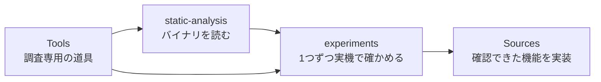

# 調査ガイド — 分かったことと、次に調べること

[製品のREADME](../README.md) · [やさしい仕様](../docs/specification.md) · [図で読む仕組み](../docs/architecture.md)

このフォルダは、Logicを外から操作できる経路を調べた記録です。
**静的解析で見つけた処理**と、**専用プロジェクトで実際に動いた操作**を区別して記録します。
各記録の冒頭から英語版にも移動できます。

全体解析からエージェント利用までの優先順位・Ghidra起点・実験・完成条件は、
[調査・開発計画](plans/agent-ready-roadmap.md)にまとめています。
[22件の作業一覧](plans/agent-ready-backlog.tsv)には依存関係と合格条件もあります。

## 最初に読む3つ

1. [接続経路の全体像](architecture.md)：MCU・Logic Remote・AppleEventなどの根拠をまとめた地図。
2. [AppleEventのCLI統合](experiments/EXP-AE-002-cli-backend.md)：現在使える再生・停止と、その検証結果。
3. [ネイティブ状態取得の候補](static-analysis/SA-AE-STATE-002-native-transport-state.md)：MCUを置き換えるために、何が未確認か。

## 現在の到達点

| 経路 | 確認できたこと | まだ分からないこと |
|---|---|---|
| MCU：仮想MIDI | 製品の状態取得・再生・停止・ミキサー操作。自動接続とバンク移動 | 名前の完全取得、プラグインなどの拡張 |
| private AppleEvent | 登録先・正しい引数・再生と停止。MCUで結果を検証するCLI実装 | 純粋な状態取得、他バージョン、録音など |
| Logic Remote | 通信フレーム、キー定数、`/gtFaderData`、キーコマンド状態の購読経路の静的解析 | 独立クライアントの接続、初回の完全な状態、状態値の実機対応 |
| OSC / Lua | 存在と関連する設定・スクリプト | 任意のCLIからの割り当て・応答の条件 |
| XPC | インストーラー関連の接続 | 操作用のサービスは未発見 |

「静的解析で確認」は、通信を実際に受け取ったことを意味しません。
`/keyCommandStateUpdate` の初回0省略は、ARM64分岐の解析結果です。
`/gtFaderData` の全項目モードとは別の経路で、実機の初回応答はまだ取得していません。

## 記録の使い分け

| 場所 | 入っているもの |
|---|---|
| `static-analysis/` | Ghidra、命令、メタデータ、ハッシュを使った根拠 |
| `experiments/` | 対象・初期状態・1回の操作・観測・再現回数 |
| `protocol/` | ワイヤーキーなどの抽出表 |
| `notes/` | 関連資料・先行例 |
| `raw/` | ローカルの生出力。Gitには含めない |

## 静的解析の一覧

| 記録 | 内容 |
|---|---|
| [SA-001](static-analysis/SA-001-logic-control-bundle.md) | Logic Controlと音量の変換表 |
| [SA-002](static-analysis/SA-002-control-surface-assign-model.md) | 共通の割り当てモデルとRemoteのフレーム |
| [SA-003](static-analysis/SA-003-logic-framework-first-pass.md) | Logic.frameworkの初回調査 |
| [SA-004](static-analysis/SA-004-command-and-engine-boundaries.md) | コマンドと音声エンジンの境界 |
| [SA-005](static-analysis/SA-005-logic-remote-state-push.md) | Logic Remoteへの状態送信とキー定数 |
| [SA-IDENTITY-001](static-analysis/SA-IDENTITY-001-binary-inputs.md) | 元Universal/thinファイル・arm64 slice・解析copy・Ghidra import metadataの識別と照合 |
| [AppleEvent登録](static-analysis/appleevent-registration.md) | handler・型・戻り値・モード分岐 |
| [コマンドへの橋渡し](static-analysis/appleevent-command-dispatch.md) | AppleEventからplay/stopの内部コマンドへ |
| [MACoreのAppleEvent調査](static-analysis/macore-appleevents.md) | x86側の候補と、陰性結果の限界 |
| [状態取得候補](static-analysis/SA-AE-STATE-002-native-transport-state.md) | 内部getter・外部購読・mode 4の副作用 |
| [テキスト操作の分岐](static-analysis/SA-AE-MODES-001-text-operations.md) | mode 7〜14の設定読み込み・ファイル書き込み・MIDI取込候補と、応答の限界 |
| [ファイル・リージョン分岐](static-analysis/SA-AE-FILE-001-file-region.md) | ファイル入力の型、対象・位置の決定、metadata変更、未知modeの到達 |
| [ファイル配置の位置変換](static-analysis/SA-AE-TIME-001-position-conversion.md) | 44100の初期値、固定小数点の算術、anchorとdelta、cache書き込み。単位は未確定 |

テキストとファイルの分岐は、現時点では静的解析の記録です。helperの失敗が応答に反映されない経路や、対象を選ぶ段階で内部metadataを書き換える処理があります。製品CLIの対応機能としては公開していません。[入力と解析出力のmanifest](static-analysis/appleevent-mode-analysis-manifest.json)に、対象バイナリ・Ghidra条件・ローカル根拠のハッシュを記録しています。

## 実験の一覧

| 記録 | 内容 |
|---|---|
| [EXP-MCU-001〜009](experiments/EXP-MCU-001-009-virtual-mcu.md) | 仮想MCUの接続と基本操作 |
| [EXP-MCU-020](experiments/EXP-MCU-020-banking.md) | 8本を超えるストリップの到達と表示範囲 |
| [EXP-A3-001](experiments/EXP-A3-001-remote-port-per-launch.md) | 起動ごとに変わるRemoteのポート |
| [EXP-UNDO-001](experiments/EXP-UNDO-001-mixer-writes-and-undo.md) | 既定設定でのUndoと名前の更新 |
| [EXP-UNDO-002](experiments/EXP-UNDO-002-mixer-undo-enabled.md) | ミキサーUndoを有効にした場合 |
| [EXP-AE-001](experiments/EXP-AE-001-private-command-dispatch.md) | native送信の14ケースとMCUによる確認 |
| [EXP-AE-002](experiments/EXP-AE-002-cli-backend.md) | 製品CLIの統合・互換性・実機確認 |
| [実験テンプレート](experiments/TEMPLATE.md) | 新しい実験に記録する項目 |

## 次のGhidra解析

次の区切りは、**再生状態を外部から取得する経路を確定すること**です。

1. キーコマンドID `3` の状態評価分岐を追い、値の意味と副作用を命令で照合する。
2. `MAPeerRouter` の接続・バージョン確認・購読の条件を詰める。
3. 専用プロジェクトで初回応答と後続更新を取得し、再生中・停止中の両方をMCUと照合する。

録音ID `7` の状態にはLive Loopsの条件もあります。状態の解析と、録音を実行する実験は別に扱います。
AppleEventのmode 4には条件付きのテンポ書き込みがあるため、状態取得APIとしては採用していません。

MCP層の設計参考は、[mcp-server-apple-eventsの適合性調査](notes/mcp-apple-events-reference.md)に構成図とともにまとめました。既存のSwift CLIをMCPで公開する境界が参考になり、Logic固有の送信・読み戻しはこのプロジェクト側で扱います。

Ghidraでは、API登録・名前付きメソッド・既知のメッセージを起点に追います。
デコンパイルの型だけで判断せず、命令と引数を照合し、対象のバージョン・ハッシュを記録します。
実験は `LogicCLI-Test.logicx` で、1回に変えるものを1つにします。[開発ルール](../AGENTS.md)・[関連資料](notes/prior-art.md)。
