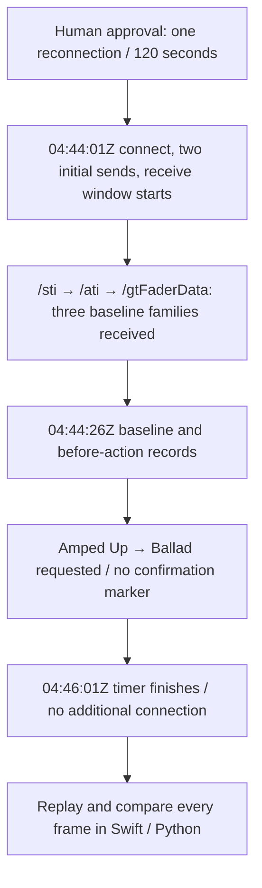

# EXP-REMOTE-003: A reconnection baseline and an unfinished selection comparison

[日本語](EXP-REMOTE-003-reconnect-selection-baseline.md) · [English](EXP-REMOTE-003-reconnect-selection-baseline.en.md) · [Plan](../plans/PLAN-05-E3-manual-selection.en.md)

**One reconnection yielded a baseline, and Swift and Python rebuilt the same state. The intended manual selection from Amped Up to Ballad was not confirmed during the receive window.** Mapping that selection difference to a sending function remains unfinished.

| Item | Record |
|---|---|
| Status | Saved-capture verification and Japanese/English review complete. A retry awaits approval for an additional connection; it has not connected |
| Date / environment | 2026-10-05, Logic Pro Creator Studio 12.3.1 (6682), macOS 27.0 |
| Approved scope | Dedicated test project, one reconnection with the same research peer, 120-second receive setting, one manual selection |
| Receive window (UTC) | `04:44:01Z → 04:46:01Z`. Wall-clock records have one-second precision |
| Measured duration | **120.0184 seconds**, from `receive_window` at `229.8 ms` to `finish` at `120248.2 ms`. The difference associated with scheduling the 120-second timer was 0.0184 seconds |
| Operations | Codex root performed no Logic selection click, edit, or save |
| Evidence | [Capture manifest](remote-e3-capture-manifest.json), [observations](../protocol/logic-remote-e3-observations.tsv), saved reception / approval / operator records, and offline comparisons |

## 1. The baseline arrived; the selection difference did not

Initial sends were one `/protocolVersion=10` and one `/jsonSupport=1`. `sent_initial` means that the local send API returned without an error; it is not a Logic acceptance ACK.

| Baseline family | Frame | Receiver event `t_ms` |
|---|---:|---:|
| `/sti` | 468 | 413.7 |
| `/ati` | 613 | 473.8 |
| `/gtFaderData` | 619 | 476.5 |

These `t_ms` values use the receiver event clock and are distinguished from decoder record times. Receiving these three families defined the experiment's baseline. It did not establish that all initial state had arrived.

Operator records contain `baseline`, `action_before`, and `abort`, with no `action_confirmed`. Both received `/sti` copies show Amped Up; neither provides a difference showing selection of Ballad. This attempt was abandoned after the timer finished.

This does not record that the user performed no operation at all. It does not guarantee every user action, selections outside the window, or Logic's state after termination or now.

## 2. State observed in this connection

| Observation | Result | Scope of the result |
|---|---|---|
| Frames / messages / addresses | **11,459 / 11,690 / 743** | Received counts for this connection |
| Decoding | Zero failures in Swift and Python | Both decoders read this capture |
| Known schema | Zero violations | This does not mean all unknown addresses or fields are understood |
| `/ati` and counts | 14 strips. `/allTrackCount` and `/trackCount` each arrived twice with value 14 | Wire list / counts, not a guarantee of every internal track in this song |
| Repeated list | Two `/ati` copies with equal contents | Duplication in this initial send |
| Selection | Amped Up, `gindex=132`, position 6, index 5, `tn=6` | Index and position kept separate and checked against the latest `/ati` |
| Kinds for that selection | `/ati.t=7`, `/sti.t=2` | Different values for the same strip; do not interchange them as one enum |
| Fader / track fields | **42/42 / 28/28** target fields known | Coverage retains received values and frames without replacing missing fields with 0 |
| Selected track's `r` | Raw value **3** | Retain the enum; do not classify it as Boolean record-arm or recording state |
| `g.vL` | Two values: `0x5A000000` and `0x7F000000` | Received raw values; no verified dB conversion formula |
| `complete` | **null** | Filled coverage does not imply completion |

The saved pre-run accessibility record showed 12 track headers including a collapsed stack. The 14 wire strips also include Stereo Out and Master, providing one correspondence with that view. The collapsed child tracks were not all enumerated.

The `/ati.t` / `/sti.t` distinction agrees with the [existing kind analysis](../static-analysis/SA-REMOTE-TRACKTYPE-001.en.md) and [kind table](../protocol/logic-remote-track-types.tsv). Reception alone does not prove execution of an individual branch or function entry.

The saved pre-run UI record contains no dB values. Current UI readings are not added later and tied to that earlier state; the `vL` record here is limited to the two received values.

## 3. Offline comparison with the actual Swift implementation

All 11,459 binary frames were replayed through the product's `RemoteFrameParser → RemoteStateBuilder` and the Python decoder / builder. Fixed 12-strip expectations from another capture were not used.

| Comparison | Result |
|---|---|
| Every decoded group / argument field | Zero differing frames. Normalize data to base64 and numbers by exact numeric equality; keep Bool as a separate type |
| Shared snapshot at 13 checkpoints and final | Zero differences, including source frames of known values, null, counts, and selection |
| Issues | Zero in both implementations |
| Nonissue `/docOpen` events | Four differences at frames 4, 5, 415, 675: Swift emits an event; Python updates the same state without that event |
| Python loader order | Before the fix, filename lexicographic sorting caused 146 backward steps; the first was `10009 → 1001`. Final state in this capture was unaffected |

Numeric sorting was fixed in `f0016cb`. All 73 related Python tests pass. Replaying this capture with the corrected default API gives consecutive counters 1–11,459 with zero backward steps, and final state agrees with the independent numeric replay. The 146 steps recorded here are the result before that fix.

Python's snapshot also retains colours, icons, and arrange flags, which the public Swift snapshot does not expose. Those are distinguished from the shared snapshot comparison; every field is compared in the decoded input. Empty orphan sets and issue arrays here do not newly validate every detail when those collections are nonempty.

## 4. Termination checks and remaining work

`finish` was the final event, with zero following events. Frame files, decoded records, and the termination count agree at 11,459, and reception has ended. Summary `connected=true` was collected in the termination path before disconnect; it is not evidence of an ongoing connection now.

Without a received manual-selection difference, the operation → difference → candidate-function comparison with the [static state-sending analysis](../static-analysis/SA-REMOTE-STATE-001.en.md) remains open. Same-ID delayed updates, reordering / ID reuse, a completion marker, and the full value range were not validated by this connection.

A retry awaits the response for an additional connection in the [E3 plan](../plans/PLAN-05-E3-manual-selection.en.md). No additional connection or selection operation has been performed. Raw reception / UI / operator / parity records remain ignored; public documents omit private host names, personal absolute paths, and complete raw logs.
