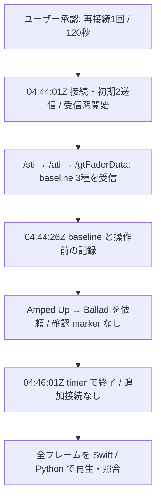

# EXP-REMOTE-003: 再接続で受信した baseline と、未完了の選択比較

[日本語](EXP-REMOTE-003-reconnect-selection-baseline.md) · [English](EXP-REMOTE-003-reconnect-selection-baseline.en.md) · [計画](../plans/PLAN-05-E3-manual-selection.md)

**1回の再接続で baseline を受信し、Swift と Python の状態が一致しました。予定した Amped Up → Ballad の手動選択は、受信時間内に確認できていません。** 選択差分と送信関数の対応づけは未完了です。

| 項目 | 記録 |
|---|---|
| 状態 | 保存記録の照合と日英レビュー完了。再試行は追加接続への承認待ち、未接続 |
| 日付・環境 | 2026-10-05、Logic Pro Creator Studio 12.3.1（6682）、macOS 27.0 |
| 承認範囲 | 専用テストプロジェクト、同じ研究用ピアで再接続1回、受信設定120秒、手動選択1回 |
| 受信窓（UTC） | `04:44:01Z → 04:46:01Z`。wall は秒単位の記録 |
| 実測時間 | `receive_window` の `229.8 ms` から `finish` の `120248.2 ms` まで **120.0184秒**。120秒 timer の処理に伴う差は0.0184秒 |
| 操作 | Codex root は Logic の選択クリック・編集・保存を行っていない |
| 根拠 | [capture manifest](remote-e3-capture-manifest.json)、[観察表](../protocol/logic-remote-e3-observations.tsv)、保存済みの受信・承認・操作記録とオフライン照合 |

## 1. baseline は取れたが、選択の差分は取れていない

初期送信は `/protocolVersion=10` と `/jsonSupport=1` 各1通でした。`sent_initial` はローカル送信 API がエラーを返さなかった範囲の成功であり、Logic の受理 ACK ではありません。

| baseline の種類 | frame | 受信側 event の `t_ms` |
|---|---:|---:|
| `/sti` | 468 | 413.7 |
| `/ati` | 613 | 473.8 |
| `/gtFaderData` | 619 | 476.5 |

この `t_ms` は受信側 event の時計で、decoder の記録時刻とは区別します。3種が届いたことを実験の baseline としました。初回状態がすべて揃ったという判定ではありません。

操作記録には `baseline`・`action_before`・`abort` があり、`action_confirmed` はありません。受信した2通の `/sti` はどちらも Amped Up を示し、Ballad への変更を示す差分はありませんでした。timer 終了後にこの試行を打ち切っています。

これは「ユーザーが一切操作しなかった」という記録ではありません。全ユーザー操作、時間窓外の選択、終了後や現在の Logic の状態は保証しません。

## 2. この接続で確認した受信状態

| 観察 | 結果 | この結果から言える範囲 |
|---|---|---|
| フレーム・メッセージ・アドレス | **11,459 / 11,690 / 743** | この接続で受信した数 |
| 復号 | Swift・Python とも失敗0 | この capture が両 decoder で読めた |
| 既知スキーマ | 違反0 | 未知の全アドレスや全フィールドを理解したという意味ではない |
| `/ati` と件数 | 14ストリップ。`/allTrackCount`・`/trackCount` は各2通、値14 | wire 上の一覧・件数。この曲の内部トラック全数の保証ではない |
| 同じ一覧の再送 | `/ati` は2通、内容一致 | この初回送信での重複 |
| 選択 | Amped Up、`gindex=132`、position 6、index 5、`tn=6` | index と position を区別し、最新の `/ati` に照合した結果 |
| 同じ選択の種別 | `/ati.t=7`、`/sti.t=2` | 同じストリップでも別の値。共通 enum として交換しない |
| フェーダー・トラック値 | **42/42・28/28** の対象フィールドが既知 | 欠落を0で補わず、受信値と frame を保持した coverage |
| 選択トラックの `r` | 生の値 **3** | enum のまま保持。Bool の録音待機・録音中とは判定しない |
| `g.vL` | `0x5A000000` と `0x7F000000` の2種 | 今回受信した生値。dB 換算式は未検証 |
| `complete` | **null** | coverage が埋まっても完了を推定しない |

保存した事前 AX 記録では、折り畳まれた stack を含む12個のトラックヘッダーが見えていました。wire の14ストリップには Stereo Out と Master も含まれ、この表示との対応例になります。折り畳まれた子トラックをすべて数えたわけではありません。

`/ati.t` と `/sti.t` の違いは、[既存の種別解析](../static-analysis/SA-REMOTE-TRACKTYPE-001.md)・[種別表](../protocol/logic-remote-track-types.tsv)と整合します。ただし、今回の通信だけで個別の分岐や関数 entry の実行を証明しません。

保存した事前 UI 記録には dB 値がありません。現在の UI を後から読み足して当時の値と結び付けず、今回の `vL` は2種の受信値までを記録します。

## 3. 本物の Swift 実装とのオフライン照合

全11,459個の binary frame を、製品の `RemoteFrameParser → RemoteStateBuilder` と Python decoder / builder で再生しました。別 capture の固定12ストリップ期待値は使っていません。

| 比較 | 結果 |
|---|---|
| 復号した全 group・argument フィールド | 差がある frame 0。data は base64、数値は厳密な数値同値へ正規化し、Bool は別型として比較 |
| 共有 snapshot の13 checkpoint と最終状態 | 差0。受信値の出どころの frame、null、件数、選択も比較 |
| issue | 両実装とも0 |
| `/docOpen` の非 issue event | frame 4・5・415・675 の4件だけ異なる。Swift は event を出し、Python は同じ状態だけを更新 |
| Python loader の順序 | 修正前はファイル名の辞書順で146回逆行。最初は `10009 → 1001`。この capture の最終状態には影響なし |

loader の数値順ソートは `f0016cb` で修正済みです。関連Python試験73件が通り、修正後の既定APIでこの記録を再生すると、1〜11,459の連続順で逆行0件、最終状態は独立した数値順の再生と一致しました。ここに記録した146回は修正前の検証結果です。

Python の snapshot は色・icon・arrange flags なども保持しますが、Swift の公開 snapshot にはそれらの欄がありません。共有 snapshot の比較対象からは区別し、元の復号結果では全フィールドを比較しました。今回 orphan と issue が空だったことは、非空の場合の全詳細の一致を新しく検証したことにはなりません。

## 4. 終了の確認と残った作業

`finish` は最後の event で、その後の event は0でした。frame files・decoded records・終了時の件数は11,459で一致し、受信を終了しています。summary の `connected=true` は切断前の終了処理で取得した状態で、現在も接続中という証拠ではありません。

手動選択の受信差分がないため、[状態送信の静的解析](../static-analysis/SA-REMOTE-STATE-001.md)との操作→差分→関数候補の比較は残っています。同じ ID の遅延更新、並べ替え・ID 再利用、完了合図、送信値の全範囲も、この接続で検証したとは扱いません。

再試行は [E3 計画](../plans/PLAN-05-E3-manual-selection.md)にある追加接続への回答待ちです。追加の接続や選択操作はまだ行っていません。raw の受信ログ・UI・操作・parity 記録は ignored 領域に保持し、公開資料には私用ホスト名・個人の絶対パス・生ログ全体を載せていません。
