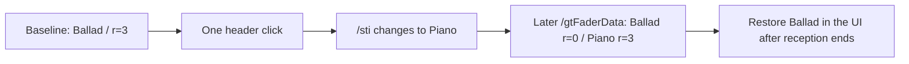

# EXP-REMOTE-004: How `/sti` and `r` changed after one selection click

[日本語](EXP-REMOTE-004-selection-delta.md) · [English](EXP-REMOTE-004-selection-delta.en.md) · [Manifest](remote-e3-selection-manifest.json) · [Observations](../protocol/logic-remote-e3-selection-observations.tsv)

**Moving the selection once from Ballad to Piano changed `/sti`, then exchanged two `r` values in subsequent `/gtFaderData` messages.** After reception ended, the operator restored Ballad's selection and the visible automatic record arm. This is a separate connection and recording from [EXP-REMOTE-003](EXP-REMOTE-003-reconnect-selection-baseline.en.md), which did not capture a selection delta.

| Item | Record |
|---|---|
| Date | 2026-10-07 JST (the UTC reception date is 2026-10-06) |
| Environment | Logic Pro Creator Studio 12.3.1 (6682), macOS 27.0 (26A5416b), arm64 |
| Project | Dedicated `LogicCLI-Test.logicx` |
| Initial state | Stopped; Ballad selected (row 3), with automatic record arm visible |
| Condition changed | One track-header click, moving selection Ballad → Piano (row 1) |
| Roles | Codex received with the same research peer; Claude operated selection and restoration through computer use |
| Authorization | The human authorized real experiments and computer use on the dedicated project for this session |
| Trials | One selection change, one receive connection; the restoration click after reception is a separate operation |
| Reception | 120-second setting, **120.0263 seconds** measured; 11,396 frames, 11,823 messages, 781 addresses |
| Local evidence | `Research/raw/remote-recv/20261007-010710-e1/`; operator sidecars in `Research/raw/live-arm/e3-select/`. Both are excluded from public Git |

## 1. Received selection information and fader values

The times below are the **frame receive event's `t_ms`** in `events.jsonl`. They are distinct from `decoded.jsonl` output timestamps and the time at which the operator was asked to act.

| Frame | Receive `t_ms` | Message | Received values |
|---:|---:|---|---|
| 456 | 415.2 | `/sti` | Ballad, index=2, tn=3, t=2 |
| 478 | 428.8 | `/ati` | List of 14 strips |
| 484 | 431.7 | `/gtFaderData` | Ballad trackID 262147: r=3; Piano 262145: r=0 |
| 489 | 434.0 | `/ati` | Same list as frame 478 |
| 509 | 442.1 | `/sti` | Same Ballad information as frame 456 |
| 5419 | 54669.9 | `/sti` | **`"Piano "`, index=0, tn=1, t=2** |
| 5496 | 54723.2 | `/gtFaderData` | **Ballad r: 3→0; Piano r: 0→3** |
| 5503 | 54727.1 | `/gtFaderData` | Same content as frame 5496 |

The trailing space in `"Piano "` was sent by Logic. Preserve the wire value, trimming whitespace only for a comparison with the displayed name. Index is zero-based; list position is one-based, so Piano's index=0 corresponds to position=1. TrackID and gindex are separate identifiers. In this `/ati`, Piano had trackID=262145 and gindex=88; Ballad had trackID=262147 and gindex=128.

Each of the three `/gtFaderData` messages contained 14 `g` entries with three fields (`vL`, `m`, `s`) and 14 `t` entries with two fields (`r`, `ip`). Only the two `r` values above changed. The entire `g` dictionary was resent unchanged, other `r` values remained unchanged, and every `ip` was 0. A message carrying a change may also carry unchanged fields.

Only the two initial `/ati` messages arrived; none was resent after the selection change. This is an observation of this 120-second recording, not a universal rule for every selection operation.

## 2. Click records and restoration

| Operation or observation | UTC | Evidence and scope |
|---|---|---|
| Receive window begins | 16:07:13Z, t_ms=218.3 | Peer `receive_window` event |
| “Recording ready” request | 16:07:56.545281 | Codex `action_before` marker; not the actual click time |
| Before and after selection click | **16:08:06.443477 → 16:08:08.465067** | Claude `before.txt` / `after.txt`; no single timestamp for the click itself was recorded |
| Receive Piano `/sti` | **16:08:07Z**, t_ms=54669.9 | Frame 5419; wall time has second precision and is consistent with the click interval |
| Reception ends | **16:09:13Z**, t_ms=120244.6 | Last event is `finish`, reason `receive_window_over` |
| Post-operation UI confirmation | 16:09:55.983889 | Claude `confirm.txt`; confirmation occurred after the receive window |
| Before and after restoring Ballad | **16:10:11.483477 → 16:10:17.248735** | `restore-before.txt` / `restore-after.txt`; a separate operation outside the receive window |
| Restored UI confirmation | 16:10:35.651068 | `restore-confirm.txt` |

The operator recorded Piano's row highlighted and “Track: Piano” in the inspector, with no active rename field. Piano's R was red and I orange; Ballad and Synth had R off. These are **operator UI observations**, not a definition of every meaning of wire value `r=3`.

After restoration, the operator recorded Ballad's row highlighted, “Track: Ballad” in the inspector, Ballad R red and I orange, Piano/Synth R off, and no active rename field. The window title was `LogicCLI-Test - トラック` before and after. The operator reported no Save, Undo or M/S/R operations.

Restoration happened after reception ended, so **this capture has no wire delta restoring Ballad**. Restoration is supported by the operator's UI record. This does not establish restoration of every parameter, a save/reopen round trip or all human actions.

## 3. Opening the nested MAZP exposes selection information

These `/sti` messages had an outer property list and an argument containing a MAZP-wrapped keyed archive. This agrees with the two layers in the existing [frame analysis](../static-analysis/SA-REMOTE-FRAME-001.en.md) and [state sending analysis](../static-analysis/SA-REMOTE-STATE-001.en.md).

The research peer's `decoded.jsonl` summarizes this argument by data length and leading bytes. The first `baseline` marker retained that summary. Codex reopened the preserved `.bin` frames using the existing `remote_capture.decode_frame` and `expand_argument`, then appended the actual Ballad values in a `baseline_expansion` marker. Received logs were not rewritten. The first marker is not evidence that the selection value had already been expanded.

The summarized output does not mean the product state builder cannot read selection. Independent Python replay of every frame resolved Ballad → Piano, produced zero issue events and ended with coverage of 42/42 `g` fields and 28/28 `t` fields. `complete` remains `null`.

Claude also replayed this capture with Swift's `RemoteStateBuilder` and added a reference test for `r` changing after selection, 14 strips, zero issues and all `ip=0`. The 27 passing tests from `swift test --filter RemoteState` are **Claude's execution report**. This independent audit reread every frame in Python and inspected the Swift test source; it does not claim a second Swift test execution. The reference test runs only when the local capture is available and skips in a checkout containing only public files.

## 4. Connection to static analysis

[SA-REMOTE-STATE-001](../static-analysis/SA-REMOTE-STATE-001.en.md) traced `handleUM_TRACKSEL:` (0x0168e0ac) to `updateSelectedTrackInfo` (0x0168e754), with `sendSelectedTrackInfo` (0x0168e3fc) sending `/sti`. The observed “selection operation → changed `/sti`” is consistent with that path.

The existing static fader candidates are `collectGInstFaderStatesForInstID:changedMask:` (0x0168c9e0), `_addGInstAndTrackFaderStatesDictForInstWithID:trackID:pSong:changedMask:` (0x0168c304) and `sendCollectedGInstAndTrackFaderDataIfNeeded` (0x0168ccdc). Reception showed `/sti` followed by `/gtFaderData`. **No function-entry log, stack or breakpoint was collected**, so reception alone does not establish that these entries executed or determine changedMask.

Hypothesis (confidence: medium): **The observed movement of `r=3` corresponds to the visible movement of automatic record arm in this trial.** The supporting evidence is the exchange on the two selected tracks and the operator's record of R moving. Possible counterexamples include explicit record arm, multiple selection and differing states among a stack's children. Do not interpret 3 as a general Boolean, active recording or a unique “record arm on” value.

Although the selected track's I was orange in the UI, `ip` stayed 0. Therefore, **do not equate `ip` with the displayed I lamp**. A next candidate condition is to keep selection fixed while stopped and change explicit record arm once, examining `r` and `ip` separately.

## 5. Evidence checks

All 11,396 frames were replayed in numeric order with contiguous counters 1–11,396. Frame files, receive events, decoded events and `decoded.jsonl` agreed on count and counter. Byte lengths, initial tags and addresses also matched recorded metadata. Known-schema violations and Python state issues were both zero, and regenerating `offline-report.json` from preserved frames gave the same report. This does not establish the semantics of all 781 addresses.

Each frame's SHA-256 was written to a local inventory in numeric order; hashes of all 11,422 input files were unchanged before and after the audit. Four operator messages were also preserved in a local extract. The [manifest](remote-e3-selection-manifest.json) records the inventory hash, selected frame hashes, receive logs, operator sidecars, message extract and source hashes. Public artifacts contain no private host discovery name, personal absolute path, actual UUID value or raw frame.

The only sends were one `/protocolVersion=10` and one `/jsonSupport=1`. These succeeded at the local send API; no Logic acceptance ACK is established. Summary `connected=true` was sampled during termination before disconnect and does not prove an ongoing connection. No events follow `finish`.
