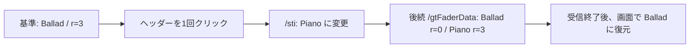

# EXP-REMOTE-004: 1回の選択変更で `/sti` と `r` がどう動いたか

[日本語](EXP-REMOTE-004-selection-delta.md) · [English](EXP-REMOTE-004-selection-delta.en.md) · [manifest](remote-e3-selection-manifest.json) · [観察表](../protocol/logic-remote-e3-selection-observations.tsv)

**Ballad から Piano へ1回選択を移すと、`/sti` の選択情報が変わり、後続の `/gtFaderData` で2本の `r` が入れ替わりました。** 受信を終えたあと、選択と画面上の自動録音待機を Ballad に戻しています。通信上の差分を取れなかった [EXP-REMOTE-003](EXP-REMOTE-003-reconnect-selection-baseline.md)とは、別の接続・記録です。

| 項目 | 記録 |
|---|---|
| 日時 | 2026-10-07 JST（受信の UTC 日付は2026-10-06） |
| 環境 | Logic Pro Creator Studio 12.3.1（6682）、macOS 27.0（26A5416b）、arm64 |
| プロジェクト | 専用 `LogicCLI-Test.logicx` |
| 初期状態 | 停止中。選択は Ballad（3行目）、画面上は自動録音待機あり |
| 変える条件 | トラックヘッダーを1回クリックし、Ballad → Piano（1行目）へ選択を移す |
| 分担 | Codex が同じ研究用ピアで受信。Claude が computer use で選択と復元を操作 |
| 承認 | ユーザーが今回の専用曲での実機実験・computer use を許可 |
| 回数 | 選択変更1回、受信1接続。受信終了後の復元クリックは別操作 |
| 受信 | 120秒設定、実測 **120.0263秒**。11,396フレーム、11,823メッセージ、781アドレス |
| 生記録 | `Research/raw/remote-recv/20261007-010710-e1/`、操作 sidecar は `Research/raw/live-arm/e3-select/`。どちらも公開 Git の対象外 |

## 1. 受信した選択情報とフェーダー値

以下の時刻は `events.jsonl` の **frame 受信 event の `t_ms`** です。`decoded.jsonl` の出力時刻や、操作を依頼した時刻とは区別します。

| frame | 受信 `t_ms` | メッセージ | 実際に入っていた値 |
|---:|---:|---|---|
| 456 | 415.2 | `/sti` | Ballad、index=2、tn=3、t=2 |
| 478 | 428.8 | `/ati` | 14ストリップの一覧 |
| 484 | 431.7 | `/gtFaderData` | Ballad の trackID 262147 は r=3、Piano の 262145 は r=0 |
| 489 | 434.0 | `/ati` | frame 478 と同じ一覧 |
| 509 | 442.1 | `/sti` | frame 456 と同じ Ballad の情報 |
| 5419 | 54669.9 | `/sti` | **`"Piano "`、index=0、tn=1、t=2** |
| 5496 | 54723.2 | `/gtFaderData` | **Ballad r: 3→0、Piano r: 0→3** |
| 5503 | 54727.1 | `/gtFaderData` | frame 5496 と同じ内容 |

`"Piano "` の末尾の空白は、Logic が送った値です。生の値を保持し、画面の名前と比較するときだけ空白を除きます。index は0始まり、一覧上の position は1始まりなので、Piano の index=0 は position=1 に対応します。trackID と gindex は別の識別子です。今回の `/ati` では Piano が trackID=262145・gindex=88、Ballad が trackID=262147・gindex=128 でした。

3通の `/gtFaderData` は、毎回 `g` が14対象×3項目（`vL`・`m`・`s`）、`t` が14対象×2項目（`r`・`ip`）でした。前後で変わった項目は上記2本の `r` だけです。`g` 全体は同値の再送、ほかの `r` は同値、`ip` は全対象で0でした。差分を伴うメッセージでも、変更されたキーだけが来るとは限りません。

`/ati` は初期の2通だけで、選択変更後には再送されませんでした。これは、この120秒の記録の観察です。あらゆる選択操作で一覧が送られないという一般規則までは確定しません。

## 2. クリックの記録と、復元の確認

| 操作・観察 | UTC | 根拠・範囲 |
|---|---|---|
| 受信窓の開始 | 16:07:13Z、t_ms=218.3 | peer の `receive_window` event |
| 「記録準備完了」の依頼 | 16:07:56.545281 | Codex の `action_before` marker。実クリック時刻ではない |
| 選択クリックの前後 | **16:08:06.443477 → 16:08:08.465067** | Claude の `before.txt`・`after.txt`。クリックそのものの一点の時刻は記録していない |
| Piano の `/sti` を受信 | **16:08:07Z**、t_ms=54669.9 | frame 5419。wall は秒単位で、クリック前後の区間と整合 |
| 受信終了 | **16:09:13Z**、t_ms=120244.6 | 最後の event は `finish`、理由は `receive_window_over` |
| 操作後の画面確認 | 16:09:55.983889 | Claude の `confirm.txt`。受信窓が終わった後の確認 |
| Ballad への復元クリックの前後 | **16:10:11.483477 → 16:10:17.248735** | `restore-before.txt`・`restore-after.txt`。受信窓の外で行った別操作 |
| 復元後の画面確認 | 16:10:35.651068 | `restore-confirm.txt` |

Claude の操作記録では、Piano の行が選択色になり、インスペクタは「トラック: Piano」。名前編集欄は開いていませんでした。Piano の R は赤、I は橙で、Ballad・Synth の R は消灯しています。これは**画面の観察記録**であり、通信の `r=3` の全意味を確定したものではありません。

復元後は、Ballad の行が選択色になり、インスペクタは「トラック: Ballad」、Ballad の R は赤・I は橙、Piano・Synth の R は消灯、名前編集欄は未使用と記録されています。ウインドウ名は前後とも `LogicCLI-Test - トラック` でした。操作担当者は保存・Undo・M/S/R 操作をしていないと報告しています。

復元は受信終了後なので、**Ballad へ戻る通信差分は今回の capture にありません**。確認できたのは操作担当者の画面記録です。全パラメーターの復元、保存して開き直した状態、全ユーザー操作をこの記録で保証するものではありません。

## 3. 入れ子の MAZP を開くと選択情報が読める

今回の `/sti` は、外側が property list、引数が MAZP で包まれた keyed archive でした。[既存のフレーム解析](../static-analysis/SA-REMOTE-FRAME-001.md)と[状態送信解析](../static-analysis/SA-REMOTE-STATE-001.md)にある2層の形式と整合します。

研究用ピアの `decoded.jsonl` は、この引数を data の長さと先頭バイトの要約として出力します。最初の `baseline` marker も、その要約を記録していました。Codex は受信した `.bin` を既存の `remote_capture.decode_frame`・`expand_argument` で読み直し、実際の Ballad の値を `baseline_expansion` marker に追記しました。元の受信ログを書き換えていません。最初の marker を、選択値を展開済みの証拠としては使いません。

この要約表示は、製品の状態ビルダーが選択を読めないという意味ではありません。独立した Python の全フレーム再生では Ballad → Piano が解決され、問題 event は0、最終 coverage は42/42の `g` 項目・28/28の `t` 項目でした。`complete` は引き続き `null` です。

Claude は Swift の `RemoteStateBuilder` でも同じ capture を再生し、選択が変わったあとで `r` が変わること、14ストリップ、問題0、全 `ip=0` を参照テストにしました。`swift test --filter RemoteState` の27件通過は **Claude の実行報告**です。今回の独立監査は Python の全フレーム再読と Swift テストのソース確認で、Swift の試験を二重に実行したという記録ではありません。テストは capture がローカルにある場合だけ動き、公開リポジトリだけの環境ではその参照試験は skip されます。

## 4. 静的解析と結び付く範囲

[SA-REMOTE-STATE-001](../static-analysis/SA-REMOTE-STATE-001.md)では、`handleUM_TRACKSEL:`（0x0168e0ac）が `updateSelectedTrackInfo`（0x0168e754）へ進み、`sendSelectedTrackInfo`（0x0168e3fc）が `/sti` を送ることを読んでいます。今回の「選択操作 → `/sti` の変更」は、この経路と整合します。

フェーダー側では `collectGInstFaderStatesForInstID:changedMask:`（0x0168c9e0）、`_addGInstAndTrackFaderStatesDictForInstWithID:trackID:pSong:changedMask:`（0x0168c304）、`sendCollectedGInstAndTrackFaderDataIfNeeded`（0x0168ccdc）が既存の静的な候補です。今回の受信順は `/sti`、後続 `/gtFaderData` でした。**関数 entry の実行ログ・スタック・breakpoint は取っていない**ので、これらの実行や、changedMask の値を通信だけから確定しません。

仮説（Hypothesis、確信度: 中）: **今回の `r=3` の移動は、画面で見た自動録音待機の移動に対応する。** 根拠は、選択した2本で値が入れ替わり、操作担当者が画面上の R の移動を記録したことです。反例候補は、明示的な録音待機、複数選択、stack の子の状態が異なる場合です。3を汎用の Bool、録音中、単独の「録音待機オン」値として扱いません。

画面で選択トラックの I が橙でも `ip` は0のままでした。したがって、**`ip` と画面の I ランプを同じ値として読み替えません**。次は停止中のまま選択を固定し、明示的な録音待機だけを1回変えて、`r` と `ip` の前後を分けて確かめる条件が候補です。

## 5. 記録を検査した範囲

全11,396フレームについて、数値順で counter 1〜11,396が連続し、frame ファイル・受信 event・復号 event・`decoded.jsonl` の件数と counter が一致しました。バイト長・先頭 tag・アドレスも記録と照合しました。既知スキーマの違反は0、Python の状態問題は0、`offline-report.json` は元フレームから作り直した結果と一致しています。781アドレスすべての意味が解明できたという意味ではありません。

各フレームの SHA-256 を数値順のローカル inventory に保存し、入力11,422ファイルの照合前後のハッシュが同じことを確認しました。操作担当者の連絡4件もローカルの抜粋に保存しました。[manifest](remote-e3-selection-manifest.json)には inventory のハッシュ、主要フレーム、受信記録、操作 sidecar、連絡の抜粋、使用したソースのハッシュを載せています。公開資料はホストの私用名・個人の絶対パス・実UUID・生フレームを含みません。

送信は `/protocolVersion=10` と `/jsonSupport=1` の各1通だけです。これはローカル送信 API の成功で、Logic が受理したという ACK ではありません。summary の `connected=true` は切断前に終了処理が取得した値で、接続が現在も続いている証拠ではありません。終了後の event は0でした。
