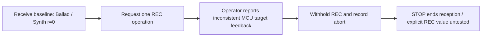

# EXP-REMOTE-005: Reception aborted before the explicit REC operation

[日本語](EXP-REMOTE-005-aborted-explicit-arm.md) · [English](EXP-REMOTE-005-aborted-explicit-arm.en.md) · [Manifest](remote-e4-abort-manifest.json) · [Observations](../protocol/logic-remote-e4-abort-observations.tsv)

**The plan was to change Synth's record arm once, but inconsistent MCU target feedback led to an abort; the operator reported withholding REC. This experiment did not test `r` during explicit record arm.** About 97 seconds of reception captured the initial state: two selection messages naming Ballad and one initial fader message.

| Item | Record |
|---|---|
| Date and environment | 2026-10-07 JST (2026-10-06 UTC), Logic Pro Creator Studio 12.3.1 (6682), macOS 27.0 (26A5416b), arm64 |
| Project | Dedicated `LogicCLI-Test.logicx` |
| Intended single operation | While stopped with Ballad selected, explicitly arm the unselected Synth using `track arm 2 on --expect-name Synth` |
| Outcome | **Objective not reached; aborted before REC.** An instruction marker is not execution confirmation |
| Roles | Codex received and terminated the research peer; Claude checked the MCU baseline and was the intended operator |
| Authorization | The human authorized real experiments and computer use on the dedicated project for this session |
| Reception | 120-second setting, ended by a STOP file after **97.3847 seconds**; 9,296 frames, 9,607 messages, 780 addresses |
| Local evidence | Reception `Research/raw/remote-recv/20261007-012114-e1/`; preceding passive browse `20261007-012048-e0/`. Excluded from public Git |

## 1. Wire state obtained before the operation

The table comes from reopening the original `.bin` files. `t_ms` is the **frame receive event clock** in `events.jsonl`, distinct from decoded output timestamps and the instruction time.

| Frame | Receive `t_ms` | Message | Values or content |
|---:|---:|---|---|
| 456 | 344.6 | `/sti` | Ballad, index=2, tn=3, t=2 |
| 477 | 358.0 | `/ati` | 14 strips |
| 483 | 360.6 | `/gtFaderData` | Synth: r=0, ip=0; Ballad: r=3, ip=0 |
| 488 | 362.9 | `/ati` | Same list as frame 477 |
| 508 | 370.5 | `/sti` | Same Ballad information as frame 456 |

Synth had trackID=262146 and gindex=100; Ballad trackID=262147 and gindex=128; Piano trackID=262145 and gindex=88. Index is zero-based, so Ballad's index=2 corresponds to list position=3. TrackID, gindex and position are not interchangeable identifiers.

The fader data arrived **only once**, in frame 483. It held 14 `g` entries with three fields (`vL`, `m`, `s`) and 14 `t` entries with two fields (`r`, `ip`). Ballad's `r` was 3, four entries had 0 and nine had 64; all 14 `ip` values were 0. No subsequent selection, list or fader information arrived.

This establishes the absence of later received messages showing a state change. It does not establish unsent state, all human actions or every displayed value being unchanged. There is no post-operation fader snapshot to compare with a performed REC action.

## 2. Distinguishing the instruction and abort from execution evidence

| Record | UTC and receive clock | Scope |
|---|---|---|
| Passive browse E0 | 16:20:51Z → 16:20:59Z | One peer discovered, protocolVersion=10 and hostType=0; zero invites, sends and received frames |
| E1 receive window begins | **16:21:17Z, t_ms=171.9** | 120-second timer setting |
| Baseline and `action_before` | 16:21:41.216291 | Baseline reception and instruction to Claude; the marker explicitly says it is not an actual MIDI send timestamp |
| Operator's hold report | 16:21:44Z (CLDE-037) | Operator reports pressing nothing and a mismatch between MCU LCD names and LED targets |
| `abort` marker | 16:22:54.213351 | Termination reason contains `requested arm action not performed` |
| Finish event | **16:22:54Z, t_ms=97556.6** | `finish`, reason `stop_file`, 9,296 frames, exit code 0 |
| Additional operator report | 16:38:59Z (CLDE-043) | Operator reports no MCU operation during reception |

The original abort JSON has no separate Boolean such as `arm_action_performed: false`. Evidence is the **abort reason string and the operator reports**; they are not converted into a newly measured no-send fact. This audit did not independently capture the MCU MIDI send trace.

The research peer sent only one `/protocolVersion=10` and one `/jsonSupport=1`. Its log does not enumerate every operation through the separate MCU path. Successful initial sends mean success at the local API, not a Logic acceptance ACK.

`finish` is the final event, with zero events afterward. Summary `connected=true` was sampled during termination before disconnect; it is not evidence of an ongoing connection.

## 3. Why the trial stopped, and the later diagnosis

Claude reported LCD names for positions 9–14 while selection/REC LEDs referred to positions 1–8, and a `state` result declaring six strips with `complete: true`. The initial Remote list contained 14 strips, starting Piano, Synth and Ballad. Because MCU name-based target matching was not established, the intended REC operation was withheld and reception ended.

In the later CLDE-038 report, the operator observed two different full LCD dumps on the same port after restarting and reported two configured Mackie Control surfaces. That diagnostic restart at 16:23:58Z and report at 16:27:01Z occurred after reception ended at 16:22:54Z.

This later diagnosis is **a separate operator observation and report**. The Remote recording alone does not establish configuration contents, when the second surface appeared or that Remote caused the MCU problem. The audit preparing this experiment record did not operate settings, Logic or the MCU.

## 4. Untested `r` and the scope of retrospective comparison

The original proposal was to investigate whether explicitly arming unselected Synth would move `r` from 0 to 1. **REC was not performed, so that prediction remains untested.** This recording does not establish whether 1 or 0x80 corresponds to explicit record arm.

The [current static analysis, SA-REMOTE-STATE-001 section 8.3](../static-analysis/SA-REMOTE-STATE-001.en.md), records negative *k* values (−2, −3) for software instrument type 0x43, including Synth, and an unread following negative branch. The reading mapping *k*=1 or 2 to 1 or 0x80 concerns the audio path and does not justify the original Synth prediction. Preserve raw `r`; do not convert it to a Boolean or recording-in-progress determination.

Retrospectively, this can be a **comparison candidate** for the selection change in [EXP-REMOTE-004](EXP-REMOTE-004-selection-delta.en.md): no selection delta or later fader update arrived during a period when the operator reported making no operation. It was not designed and repeated as a separate matched control, and MCU feedback was inconsistent. It does not guarantee that selection caused the observed `r` changes.

## 5. Offline checks and source updates

All 9,296 `.bin` frames were decoded in numeric order. Frame files, receive events, decoded events and `decoded.jsonl` agreed on counter and count; byte lengths, tags and addresses also matched. Decode failures, known-schema violations and Python state issues were zero. Final coverage was 42/42 `g` fields and 28/28 `t` fields, while `complete` remained `null`. Filled coverage does not establish complete state or the semantics of all addresses.

During the audit, the collaborator added a separate `/cs` display view to `remote_state.py`. **The replay tool changed; the received files did not.** Source hashes before and after that update are kept separate, and the audit was rerun with the current tool. All 9,317 input files were unchanged within the final audit. The coordination board continues to receive appended messages; only the cited messages were extracted and hashed, without treating the entire board as immutable.

The [manifest](remote-e4-abort-manifest.json) records hashes of the raw frame inventory, selected frames, receive records and sources used in the final audit. Public files contain no private host discovery name, personal absolute path, actual UUID value or raw frame. The offline audit made no new connection, used no shared `.build` and did not operate Logic.
