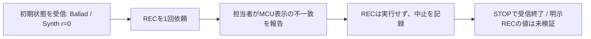

# EXP-REMOTE-005: 明示RECの操作前に中止した受信実験

[日本語](EXP-REMOTE-005-aborted-explicit-arm.md) · [English](EXP-REMOTE-005-aborted-explicit-arm.en.md) · [manifest](remote-e4-abort-manifest.json) · [観察表](../protocol/logic-remote-e4-abort-observations.tsv)

**Synth の録音待機を1回変える予定でしたが、MCU の対象表示が一致せず、操作担当者が REC 未送信と報告し、実験を中止しました。明示録音待機時の `r` は、この実験では検証できていません。** 約97秒の受信では初期状態を取得でき、選択は Ballad を示す2通、フェーダー情報は初期の1通だけでした。

| 項目 | 記録 |
|---|---|
| 日時・環境 | 2026-10-07 JST（UTC は2026-10-06）、Logic Pro Creator Studio 12.3.1（6682）、macOS 27.0（26A5416b）、arm64 |
| プロジェクト | 専用 `LogicCLI-Test.logicx` |
| 予定した1操作 | 停止中・選択 Ballad のまま、未選択の Synth を `track arm 2 on --expect-name Synth` で明示録音待機にする |
| 結果 | **狙いは未達。REC操作前に中止**。操作を依頼した marker は実行確認ではない |
| 分担 | Codex が研究用ピアの受信と終了処理。Claude が MCU の基準照合と操作担当 |
| 承認 | 今回の専用曲での実機実験・computer use はユーザーが許可 |
| 受信 | 120秒設定、STOP ファイルで **97.3847秒**に終了。9,296フレーム・9,607メッセージ・780アドレス |
| 生記録 | 受信 `Research/raw/remote-recv/20261007-012114-e1/`、事前の受動探索 `20261007-012048-e0/`。公開 Git の対象外 |

## 1. 操作前に得られた通信の状態

以下は元の `.bin` を開いて読んだ結果です。`t_ms` は `events.jsonl` の **frame 受信 event の時計**で、復号結果の出力時刻や依頼時刻とは別です。

| frame | 受信 `t_ms` | メッセージ | 値・内容 |
|---:|---:|---|---|
| 456 | 344.6 | `/sti` | Ballad、index=2、tn=3、t=2 |
| 477 | 358.0 | `/ati` | 14ストリップ |
| 483 | 360.6 | `/gtFaderData` | Synth: r=0・ip=0、Ballad: r=3・ip=0 |
| 488 | 362.9 | `/ati` | frame 477 と同じ一覧 |
| 508 | 370.5 | `/sti` | frame 456 と同じ Ballad の情報 |

Synth は trackID=262146・gindex=100、Ballad は trackID=262147・gindex=128、Piano は trackID=262145・gindex=88 でした。index は0始まりで、Ballad の index=2 は一覧の position=3 に対応します。trackID、gindex、position を交換可能な ID として扱いません。

フェーダー情報は frame 483 の**1通だけ**です。`g` は14対象×3項目（`vL`・`m`・`s`）、`t` は14対象×2項目（`r`・`ip`）でした。`r` は Ballad が3、4対象が0、9対象が64で、`ip` は14対象とも0です。選択・一覧・フェーダー情報の後続メッセージは届いていません。

これは「受信した状態に変化を示す後続メッセージが無かった」という観察です。送られなかった状態、全ユーザー操作、画面のすべての値が不変だったという保証ではありません。後続フェーダー情報がないため、実施済みREC操作との前後比較はありません。

## 2. 依頼と中止を、実行記録から分ける

| 記録 | UTC・受信時計 | 示す範囲 |
|---|---|---|
| 受動探索 E0 | 16:20:51Z → 16:20:59Z | 1ピアを発見、protocolVersion=10・hostType=0。招待・送信・受信フレームは0 |
| E1 の受信窓開始 | **16:21:17Z、t_ms=171.9** | 120秒 timer の設定 |
| baseline と `action_before` | 16:21:41.216291 | 基準受信と、Claude への実行依頼。marker 自身も実 MIDI 送信時刻ではないと記載 |
| 操作担当者の保留報告 | 16:21:44Z（CLDE-037） | 「私は何も押していません」と申告。MCU の LCD 名と LED の対象が一致しないと報告 |
| `abort` marker | 16:22:54.213351 | `requested arm action not performed` を含む中止理由を記録 |
| 終了 event | **16:22:54Z、t_ms=97556.6** | `finish`、理由 `stop_file`、9,296フレーム、終了コード0 |
| 担当者の追加報告 | 16:38:59Z（CLDE-043） | 受信時間帯には MCU を操作していないと申告 |

元の `abort` JSON に、独立した `arm_action_performed: false` のような Bool 欄はありません。**中止理由の文字列と操作担当者の申告**を根拠とし、新しい「未送信を実測した」事実には置き換えません。MCU の MIDI 送信 trace をこの監査で独立に取得したわけではありません。

研究用ピアが送ったのは `/protocolVersion=10` と `/jsonSupport=1` の各1通だけです。これはピアの送信記録で、別経路の MCU による全操作を網羅するログではありません。初期送信の成功もローカル API の成功で、Logic の受理 ACK ではありません。

`finish` は最後の event で、以後の event は0です。summary の `connected=true` は終了処理が切断前に取得した値で、接続が現在も続いている証拠ではありません。

## 3. なぜ止めたかと、後から分かったこと

Claude は、MCU の LCD が位置9〜14の名前を示す一方、選択・REC LED は位置1〜8の対象を示し、`state` が6本で `complete: true` を返したと報告しました。Remote の初期一覧は14ストリップで、Piano・Synth・Ballad は先頭3本でした。MCU の名前による対象照合が成立しないため、予定したRECを送らず終了しています。

受信終了後の CLDE-038 では、担当者が再起動時に異なる2種類の全面 LCD を同じポートで観察し、設定に2台の Mackie Control があると報告しました。診断の再起動16:23:58Zと報告16:27:01Zは、今回の受信終了16:22:54Zより後です。

この後続の診断は**担当者の別の観察・報告**です。今回の Remote 受信だけで設定内容、2台目が追加された時刻、Remote が MCU の問題を起こしたという因果は証明しません。この実験記録を作る監査では、設定・Logic・MCUを操作していません。

## 4. 検証できなかった `r` と、対照として使える範囲

当初は「未選択の Synth を明示録音待機にすると `r` が0→1になるのではないか」を調べる計画でした。**RECを実行していないので、この予測は未検証です。** 1や0x80が明示録音待機に対応するかを、今回の通信から確定しません。

[最新版の静的解析 SA-REMOTE-STATE-001 §8.3](../static-analysis/SA-REMOTE-STATE-001.md)は、Synth など種別0x43のソフトウェア音源では *k* が−2・−3となり、後続の負の経路が未読であることを記録しています。*k*=1・2から1・0x80へ進む読みはオーディオの経路で、Synth の当初の理由付けには使えません。`r` は生の値で保持し、Bool や録音中の判定に変換しません。

事後の位置付けとして、[EXP-REMOTE-004](EXP-REMOTE-004-selection-delta.md)の選択変更に対する**対照候補**にはなります。今回、担当者が何も操作しなかったと申告した受信期間には `/sti` の選択差分や後続フェーダー更新が無かった、という比較です。独立した同条件の対照実験として設計・反復したものではなく、MCU の表示不一致もあり、選択操作と `r` の変化の因果を保証しません。

## 5. オフライン検査と、ソース更新の扱い

全9,296フレームを元の `.bin` から数値順で再読しました。frame ファイル・受信 event・復号 event・`decoded.jsonl` の counter と件数、バイト長・tag・アドレスが一致し、復号失敗0、既知スキーマ違反0、Python の状態 issue 0でした。最終 coverage は42/42の `g` 項目・28/28の `t` 項目ですが、`complete` は `null` のままです。既知の項目が埋まることは、全状態の完成や全アドレスの解明ではありません。

監査の途中で、共同作業者が `remote_state.py` に `/cs` の独立した表示状態を追加しました。**受信ファイルの変更ではなく、再生するツールの更新**です。更新前後のソースのハッシュを分け、最新版で再監査しました。今回の最終監査では9,317入力ファイルが検査前後で不変でした。連絡帳は追記され続けるため、参照したメッセージだけを抜粋・ハッシュ化し、全連絡帳を不変とは扱いません。

[manifest](remote-e4-abort-manifest.json)には raw フレーム inventory・主要フレーム・受信記録・最終監査の使用ソースのハッシュを記録しています。公開資料は私用ホスト名・個人の絶対パス・実UUID・生フレームを含みません。新しい接続、共有 `.build`、Logic の操作は、このオフライン監査では行っていません。
