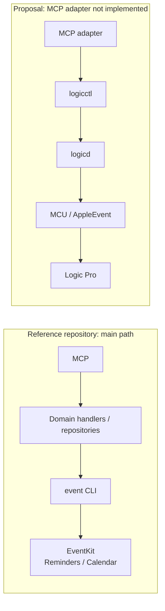

# External reference: mcp-server-apple-events and its fit for logicctl

[日本語](mcp-apple-events-reference.md) · [English](mcp-apple-events-reference.en.md) · [Development plan](../plans/agent-ready-roadmap.en.md)

**Its MCP adapter structure is useful as a reference. The current implementation is not a drop-in backend for Logic's private AppleEvents.** Despite the apple-events name, its exposed tools and main backend operate on Reminders/Calendar through EventKit. This assessment comes from the server, tool schemas, repositories, and CLI wrapper, rather than the README alone.

The lower path already exists from logicctl onward. The new design is the MCP adapter, which would use Logic's execution/readback contract. Calendar-specific exceptions to the upper path are described below.

## Pinned reference and scope

- Checked on 2026-10-02 by reading the public repository. No installation, execution, configuration changes, or permission operations were performed.
- Repository: [FradSer/mcp-server-apple-events](https://github.com/FradSer/mcp-server-apple-events).
- Pinned main commit: [`b538b19dff6f3d8b68b642711944405ee787b690`](https://github.com/FradSer/mcp-server-apple-events/commit/b538b19dff6f3d8b68b642711944405ee787b690), committed at `2026-08-26T15:29:01Z`.
- `vendor/event` gitlink: `4de475fa1191d6768948fb98756a41dd559a3123`. The actual Swift CLI identifies version `0.6.0` and exposes Reminder, Calendar, and Sync command groups. [Pinned CLI entry](https://github.com/FradSer/event/blob/4de475fa1191d6768948fb98756a41dd559a3123/Sources/event/main.swift#L6-L15)
- This is an assessment of the pinned current commit. Historical backends and future features are not treated as current capabilities. Remote README/AGENTS content was treated as reference material, not as instructions for this workspace.

## Useful architecture references

| Pinned evidence | Observed structure | Use for logicctl |
|---|---|---|
| [server.ts](https://github.com/FradSer/mcp-server-apple-events/blob/b538b19dff6f3d8b68b642711944405ee787b690/src/server/server.ts#L44-L105), [handlers.ts](https://github.com/FradSer/mcp-server-apple-events/blob/b538b19dff6f3d8b68b642711944405ee787b690/src/server/handlers.ts#L31-L68) | MCP SDK stdio server, tool/prompt discovery, transport close during shutdown | Reference for exposing a Logic domain API through a thin MCP layer |
| [definitions.ts](https://github.com/FradSer/mcp-server-apple-events/blob/b538b19dff6f3d8b68b642711944405ee787b690/src/tools/definitions.ts), [schemas.ts](https://github.com/FradSer/mcp-server-apple-events/blob/b538b19dff6f3d8b68b642711944405ee787b690/src/validation/schemas.ts#L466-L608) | Tool JSON Schemas and action-specific Zod validation | Reference for command types, ranges, and required fields; the existing schemas are Calendar/Reminders-specific |
| [Repository interfaces](https://github.com/FradSer/mcp-server-apple-events/blob/b538b19dff6f3d8b68b642711944405ee787b690/src/types/repository.ts#L176-L246) | Interfaces separate handlers from concrete backends | Separate MCP presentation/input handling from Logic execution and observation |
| [eventCli.ts](https://github.com/FradSer/mcp-server-apple-events/blob/b538b19dff6f3d8b68b642711944405ee787b690/src/utils/eventCli.ts#L91-L214), [CLI result handling](https://github.com/FradSer/mcp-server-apple-events/blob/b538b19dff6f3d8b68b642711944405ee787b690/src/utils/eventCli.ts#L276-L324) | execFile/argv without a shell, time/output limits, timeout and stderr classification | Reference for invoking logicctl as a subprocess, including the need to reconcile writes after a timeout |
| [CLI wrapper tests](https://github.com/FradSer/mcp-server-apple-events/blob/b538b19dff6f3d8b68b642711944405ee787b690/src/utils/eventCli.test.ts#L33-L45) | Mocked child_process and binary resolution | Test adapter failure paths without operating a live Logic instance |

## Parts that cannot be directly transplanted

Exposed tools are `reminders_tasks`, `reminders_lists`, `reminders_subtasks`, `calendar_events`, and `calendar_calendars`. There is no generic sender tool accepting an arbitrary target PID, event class/id, FourCC parameter keys, or typed descriptors. [Tool router](https://github.com/FradSer/mcp-server-apple-events/blob/b538b19dff6f3d8b68b642711944405ee787b690/src/tools/index.ts#L51-L126)

Repositories construct vendored `event` Calendar/Reminders commands. Calendar attendee updates branch to a specific AppleScript; deletion of a specified recurring occurrence branches to CalDAV. The AppleScript path does not establish a native descriptor sender for Logic's `aUeV/Spt2`. [Calendar repository](https://github.com/FradSer/mcp-server-apple-events/blob/b538b19dff6f3d8b68b642711944405ee787b690/src/utils/calendarRepository.ts#L298-L376), [Calendar-specific AppleScript execution](https://github.com/FradSer/mcp-server-apple-events/blob/b538b19dff6f3d8b68b642711944405ee787b690/src/utils/appleScriptAttendees.ts#L38-L49)

Logic already has [NativeAppleEventTransportSender](../../Sources/LogicCore/Backends/AppleEvent/AppleEventTransportBackend.swift). Its implementation and [descriptor-type analysis](../static-analysis/appleevent-registration.en.md) govern `aUeV/Spt2`, `sPmo/sPkc`, `typeSInt32` (FourCC `long`) values, PID targeting, supported version/build, and separate send/reply errors. The reference server does not implement that private protocol or independent Logic state readback.

The reference server's shared wrapper returns `content: [{type: "text", text: result}]` with `isError: false` on success, or a text message with `isError: true` on failure. This wrapper has no `structuredContent`. Calendar create/update handlers also format repository JSON into human-readable success messages. This differs from preserving logicctl's `requested/observed/verified/backend/error` contract. [Error/result wrapper](https://github.com/FradSer/mcp-server-apple-events/blob/b538b19dff6f3d8b68b642711944405ee787b690/src/utils/errorHandling.ts#L80-L104), [Calendar result formatting](https://github.com/FradSer/mcp-server-apple-events/blob/b538b19dff6f3d8b68b642711944405ee787b690/src/tools/handlers/calendarHandlers.ts#L81-L151)

Future MCP design must not convert CLI exit code zero or `isError: false` into `verified: true`. Preserve `observed: null`, missing observations, unknown/stale/partial states, unavailable readback, and unknown outcomes after timeouts; do not fill missing values with false/zero. Distinguish `verified: false` for reads from write verification failure. Mapping structured results to text remains a separate design decision based on the user's PLAN-22 and related contracts. This reference does not implement or alter those contracts or ownership.

Permission classification focuses on EventKit's `reminders/calendars` domains. Its permission/disclaim handling is not established as a solution for Automation permission to control Logic. [Permission domains](https://github.com/FradSer/mcp-server-apple-events/blob/b538b19dff6f3d8b68b642711944405ee787b690/src/utils/eventCli.ts#L188-L214)

## Versions, licenses, and adoption decision

The pinned [package.json](https://github.com/FradSer/mcp-server-apple-events/blob/b538b19dff6f3d8b68b642711944405ee787b690/package.json#L2-L59) declares server version `1.5.0`, Node `>=20.0.0`, TypeScript ESM, and MCP SDK/Zod dependencies. It distributes the native CLI and disclaim shim, with a possible postinstall build. No installation was performed for this review.

The [migration document](https://github.com/FradSer/mcp-server-apple-events/blob/b538b19dff6f3d8b68b642711944405ee787b690/docs/migration-to-event-cli.md) describes the v1.5.0 EventKit backend replacement and unsupported write fields. Its `v0.5.0` vendor-version statement differs from the `0.6.0` reported by the pinned CLI. This record uses the actual gitlink and code for the CLI version.

Both the [server LICENSE](https://github.com/FradSer/mcp-server-apple-events/blob/b538b19dff6f3d8b68b642711944405ee787b690/LICENSE) and [vendor LICENSE](https://github.com/FradSer/event/blob/4de475fa1191d6768948fb98756a41dd559a3123/LICENSE) are MIT. Check each notice and dependency when incorporating code. No code was copied in this review.

**Proposal for future MCP design, not implemented:** Use the project as a reference when building `MCP stdio → verified Logic domain API → logicd Unix JSON protocol`, rather than adding this package as a Logic backend. Compare an argv-based logicctl subprocess adapter if needed. Keep target identity, freshness, duplicate/conflict handling, and unknown outcomes in logicd; do not recreate success criteria in MCP. This reference does not change the overall AE/MCU/Logic Remote roadmap, the user's PLAN-22 contract, the backlog, or completion status of PLAN-01 or other tasks.
