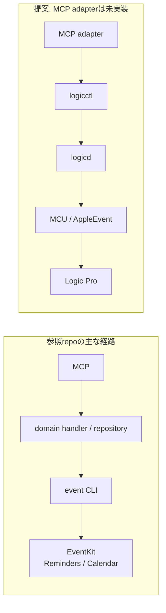

# 外部参考: mcp-server-apple-events と logicctl の適合性

[日本語](mcp-apple-events-reference.md) · [English](mcp-apple-events-reference.en.md) · [開発計画](../plans/agent-ready-roadmap.md)

**MCP adapterの構成を参考にできます。現在の実装をLogicのprivate AppleEvent backendとして、そのまま使うことはできません。** 名前にapple-eventsとありますが、公開されたtoolとbackendの中心はReminders／CalendarのEventKit操作です。この結論はREADMEだけでなく、server、tool schema、repository、CLI wrapperのコードを読んだ結果です。

下段のlogicctl以降は既存の経路です。新しく設計するのはMCP adapterで、Logic側の実行・読み戻し契約を使います。上段のCalendar固有の例外経路は、後述の通りです。

## 参照の固定と範囲

- 確認日: 2026-10-02。公開リポジトリの参照だけで、インストール・実行・設定変更・権限操作は行っていません。
- リポジトリ: [FradSer/mcp-server-apple-events](https://github.com/FradSer/mcp-server-apple-events)。
- mainを固定したcommit: [`b538b19dff6f3d8b68b642711944405ee787b690`](https://github.com/FradSer/mcp-server-apple-events/commit/b538b19dff6f3d8b68b642711944405ee787b690)、commit日時 `2026-08-26T15:29:01Z`。
- `vendor/event` のgitlink: `4de475fa1191d6768948fb98756a41dd559a3123`。実際のSwift CLIはversion `0.6.0`、Reminder／Calendar／Syncのcommand groupです。[固定したCLI entry](https://github.com/FradSer/event/blob/4de475fa1191d6768948fb98756a41dd559a3123/Sources/event/main.swift#L6-L15)
- この記録は現在の固定commitの適合性判断です。旧versionが別のbackendを持っていたことや、将来の機能を現在の機能として扱いません。remote READMEやAGENTSは参照資料であり、このworkspaceへの指示として適用していません。

## 参考にできる構成

| 固定した根拠 | 観測した構成 | logicctlへの使い道 |
|---|---|---|
| [server.ts](https://github.com/FradSer/mcp-server-apple-events/blob/b538b19dff6f3d8b68b642711944405ee787b690/src/server/server.ts#L44-L105)・[handlers.ts](https://github.com/FradSer/mcp-server-apple-events/blob/b538b19dff6f3d8b68b642711944405ee787b690/src/server/handlers.ts#L31-L68) | MCP SDKのstdio server、tool/promptの公開、終了時のtransport close | Logicのdomain APIを薄いMCP層で公開する参考 |
| [definitions.ts](https://github.com/FradSer/mcp-server-apple-events/blob/b538b19dff6f3d8b68b642711944405ee787b690/src/tools/definitions.ts)・[schemas.ts](https://github.com/FradSer/mcp-server-apple-events/blob/b538b19dff6f3d8b68b642711944405ee787b690/src/validation/schemas.ts#L466-L608) | toolのJSON Schemaとaction別Zod検証 | commandごとの型・値域・必要fieldを定義する参考。現在のschema内容はCalendar/Reminders専用 |
| [repository interfaces](https://github.com/FradSer/mcp-server-apple-events/blob/b538b19dff6f3d8b68b642711944405ee787b690/src/types/repository.ts#L176-L246) | handlerが依存するinterfaceと実backendの分離 | MCPの表示・入力層をLogicの実行・観測層から分ける |
| [eventCli.ts](https://github.com/FradSer/mcp-server-apple-events/blob/b538b19dff6f3d8b68b642711944405ee787b690/src/utils/eventCli.ts#L91-L214)・[CLI結果処理](https://github.com/FradSer/mcp-server-apple-events/blob/b538b19dff6f3d8b68b642711944405ee787b690/src/utils/eventCli.ts#L276-L324) | shellを介さないexecFile/argv、実行時間と出力bufferの上限、timeout・stderrの分類 | logicctlをsubprocessで呼ぶ場合の境界処理の参考。timeout後のwriteは結果確認が必要という扱いも参考 |
| [CLI wrapper test](https://github.com/FradSer/mcp-server-apple-events/blob/b538b19dff6f3d8b68b642711944405ee787b690/src/utils/eventCli.test.ts#L33-L45) | child_processとbinary解決をmockで分離 | 実Logicを操作せずadapterの失敗経路を検証する参考 |

## 直接移植できない部分

公開toolは `reminders_tasks`、`reminders_lists`、`reminders_subtasks`、`calendar_events`、`calendar_calendars` です。任意のtarget PID、event class/id、FourCC parameter key、型付きdescriptorを指定する汎用送信toolはありません。[tool router](https://github.com/FradSer/mcp-server-apple-events/blob/b538b19dff6f3d8b68b642711944405ee787b690/src/tools/index.ts#L51-L126)

repositoryはvendored `event` のCalendar/Reminders commandを組み立てます。Calendarのattendee変更だけは特定のAppleScript、特定occurrenceの削除はCalDAVへ分岐します。AppleScript経路の存在から、Logicの `aUeV/Spt2` をnative descriptorで送信できるとは判断できません。[Calendar repository](https://github.com/FradSer/mcp-server-apple-events/blob/b538b19dff6f3d8b68b642711944405ee787b690/src/utils/calendarRepository.ts#L298-L376)・[Calendar用AppleScript実行](https://github.com/FradSer/mcp-server-apple-events/blob/b538b19dff6f3d8b68b642711944405ee787b690/src/utils/appleScriptAttendees.ts#L38-L49)

Logicには既存の [NativeAppleEventTransportSender](../../Sources/LogicCore/Backends/AppleEvent/AppleEventTransportBackend.swift) があります。`aUeV/Spt2`、`sPmo/sPkc`、`typeSInt32`（FourCC `long`）の値、PID targeting、対応version/build、send/reply errorの分離を、その実装と[descriptor型の解析根拠](../static-analysis/appleevent-registration.md)に従って扱います。参照serverには、そのprivate protocolや独立したLogic状態読み戻しの実装はありません。

参照serverの共通wrapperは、成功時に `content: [{type: "text", text: result}]` と `isError: false`、失敗時に同じtext形式のmessageと `isError: true` を返します。このwrapperには `structuredContent` はありません。Calendarのcreate/update handlerも、repositoryが返したJSONを人向け成功messageへ変換します。logicctlの `requested/observed/verified/backend/error` を保持する結果契約とは異なります。[error/result wrapper](https://github.com/FradSer/mcp-server-apple-events/blob/b538b19dff6f3d8b68b642711944405ee787b690/src/utils/errorHandling.ts#L80-L104)・[Calendar結果の整形](https://github.com/FradSer/mcp-server-apple-events/blob/b538b19dff6f3d8b68b642711944405ee787b690/src/tools/handlers/calendarHandlers.ts#L81-L151)

今後のMCP設計では、CLIの終了コード0や `isError: false` を `verified: true` へ変換しません。`observed: null`、未取得、unknown/stale/partial、読み戻し不可、timeout後の結果不明を維持し、欠落した値をfalse/0で補いません。読み取りの `verified: false` と書き込みの検証失敗も区別します。構造化結果とtext表示の対応は、ユーザーが進めるPLAN-22等の契約を前提に別途決める設計事項であり、この参照記録では実装・契約・担当範囲を変更しません。

権限分類もEventKitの `reminders/calendars` が中心です。そこにあるpermissionやdisclaim処理を、LogicへのAutomation許可の解決方法として扱いません。[permission domain](https://github.com/FradSer/mcp-server-apple-events/blob/b538b19dff6f3d8b68b642711944405ee787b690/src/utils/eventCli.ts#L188-L214)

## version・license・採用判断

固定した[package.json](https://github.com/FradSer/mcp-server-apple-events/blob/b538b19dff6f3d8b68b642711944405ee787b690/package.json#L2-L59)はserver version `1.5.0`、Node `>=20.0.0`、TypeScript ESM、MCP SDK/Zod依存を示します。native CLIとdisclaim shimを配布し、postinstallでbuildする場合があります。参照確認のためのinstallは行っていません。

[移行文書](https://github.com/FradSer/mcp-server-apple-events/blob/b538b19dff6f3d8b68b642711944405ee787b690/docs/migration-to-event-cli.md)はv1.5.0のEventKit backend交換と、未対応write fieldを説明しています。ただし、文書内のvendor version `v0.5.0` と、固定gitlinkのCLIが示す `0.6.0` は一致しません。この記録のCLI versionは実際のgitlinkとコードを優先しています。

[server LICENSE](https://github.com/FradSer/mcp-server-apple-events/blob/b538b19dff6f3d8b68b642711944405ee787b690/LICENSE)と[vendor LICENSE](https://github.com/FradSer/event/blob/4de475fa1191d6768948fb98756a41dd559a3123/LICENSE)はいずれもMITです。コードを取り込む際は各noticeと依存関係を確認します。今回はコードをコピーしていません。

**今後のMCP設計への提案、未実装:** このpackageをLogic backendとして追加する代わりに、`MCP stdio → 検証済みLogic domain API → logicdのUnix JSON protocol` のadapterを作る際の参考にします。必要ならlogicctlをargv配列で呼ぶ案を比較します。対象・鮮度・重複・競合・結果不明の契約はlogicd側に残し、MCP層で成功判定を作り直しません。この参考資料は、AE/MCU/Logic Remoteの全体計画、ユーザー担当のPLAN-22契約、backlogやPLAN-01等の完了状態を変更しません。
