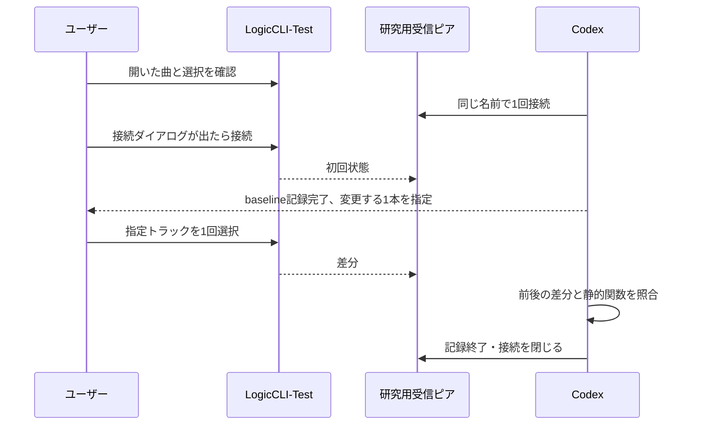

# PLAN-05 E3-1: 手動の選択変更と Remote の差分を照合する

[日本語](PLAN-05-E3-manual-selection.md) · [English](PLAN-05-E3-manual-selection.en.md) · [前回の承認範囲](PLAN-05-approval-brief.md)

**目的は、人が Logic で選択した操作を、受信メッセージと静的な送信関数に対応づけることです。** 前回は初回送信だけを受信しました。今回は受信中に選択を1回変え、`/sti` などの差分と既存の Ghidra の結果を照合します。

| 項目 | 内容 |
|---|---|
| 状態 | 2026-10-05にユーザー承認後、1回接続して120秒で終了。選択変更は時間内に観測できず、比較は未完了。再試行は追加接続への回答を待つ |
| プロジェクト | 専用 `LogicCLI-Test.logicx` のみ。他の曲を開いたまま実施しない |
| 接続 | 同じ研究用ピア `logicctl-research-peer`、1回。初期送信は `/protocolVersion=10` と `/jsonSupport=1` 各1通のみ |
| 変更する条件 | 選択だけ。追加・削除・並べ替え・音量・mute/solo・曲切替は同時に行わない |
| 時間 | 接続と初期2送信の成功後の `receive_window` から最大120秒。baseline 待ちと手動操作の待ち時間も含む |
| 保存先 | `Research/raw/remote-recv/<日時>-e1/`。公開するのは整理した結果と日英の実験記録だけ |

## 手順

1. ユーザーが専用プロジェクトを開き、選択中のトラックと停止中であることを確認する。Codex が初期状態を記録する。名前はその時点の画面で決める。
2. 修正後の source から研究用 app を build し、source と起動する executable の hash を控え、`run.sh e1 --seconds 120 --target <現在の広告名>` を1回実行する。新しい名前を使わない。Logic の確認が出ればユーザーが押す。初期2通の `sent` event と送信失敗がないことを確認する。成功とは `MCSession.send` がエラーを返さなかった範囲であり、Logic の受理の保証ではない。
3. 初回 `/ati`・`/sti`・`/gtFaderData` が復号されて受信できた時点を、Codex がログから baseline として記録する。これは受信全体が完了したという判定ではなく、実験用の区切り。三つが届かない、復号に失敗する、操作を指示する時間が残らない場合は、選択を変えずに終了する。
4. Codex の合図後、ユーザーが別の1本を選択する。名前と操作前後の時刻・frame を記録し、その間はほかの操作をしない。baseline の検知や手動操作の marker は、受信ピアの自動機能ではなく Codex とユーザーの運用である。
5. `/sti`、`/ati`、`/gtFaderData`、`/cs/…` で変わったものと変わらなかったものを列挙する。1回で届かない項目は「来なかった」と記録し、値0として補わない。
6. 時間切れ、切断、ユーザーの停止合図、予期しない画面変更で記録を終了する。人が中止を判断した場合は Codex が `touch <出力先>/STOP` を行い、`finish` と summary を確認する。選択を元へ戻す場合は受信終了後にユーザーが戻し、復帰は別操作として記録する。保存や Undo は自動実行しない。

baseline と操作は、受信ファイルと別の `manual-actions.jsonl` に追記する。各行には `kind`（baseline / action_before / action_confirmed / abort / restore）、UTC 時刻、直近の受信 frame、baseline の `/ati`・`/sti`・`/gtFaderData` の各 frame と `t_ms`、選択の名前・index を記録する。人の操作時刻は受信 frame の厳密な因果順を保証するものではないので、操作前後の範囲として比べる。peer の受信ログへ外から書き込まない。

## 照合する点

| 観察 | 静的な候補 / 判定 |
|---|---|
| 選択変更の後に `/sti` が届くか | [SA-REMOTE-STATE-001](../static-analysis/SA-REMOTE-STATE-001.md) の `sendChannelStripInfo:` と選択 handler。届いたことだけで特定アドレスの実行そのものを証明しない |
| `/sti` の index・名前・`tn` が現在の `/ati` と対応するか | Swift `RemoteStateBuilder` とオフライン検査器で同じスナップショットに結び付くか |
| 同じ操作で `/ati` や fader も更新されるか | 初回と差分の重複、順序、未受信フィールドを区別する |
| 選択に録音待機の変化が伴うか | 選択の観測と自動連動した状態変化を分ける。録音待機を試す追加操作はこの実験に含めない |

前回1回の初回受信に差分はありませんでした。この実験でも、識別子が並べ替えをまたいで安定すること、送信値の全範囲、初回送信の完了合図は検証しません。**並べ替えの前後の比較は次の別実験**として、baseline を取り直して行います。

## 開始前に確認する理由

[既存の計画書](PLAN-05-approval-brief.md) は「E3 以降は、E2 の結果を見てから改めて相談」としています。今回は再接続と受信中の手動操作が増えます。前回と同じ名前でも Logic の確認ダイアログや端末登録が発生する可能性を残し、ユーザーが本計画を了承してから開始します。接続ツールは受信専用のままで、編集コマンドは送りません。

## 1回目と再試行案

1回目は `20261005-134359-e1`。初回3メッセージの baseline を記録し、Amped Up から Ballad への選択を合図しましたが、120秒の受信中にはその変更を観測できませんでした。接続を終了しており、追加の接続はまだ行っていません。

再試行では、追加接続1回・最大120秒をユーザーが了承した後、**baseline の取得直後に Codex が computer use で別のトラックの選択用コントロールを1回クリック**します。専用プロジェクト・停止状態・現在の選択を取り直し、クリック前後の AX 状態と `manual-actions.jsonl` の範囲を記録します。名前欄の編集や M/S/R ボタンは使いません。ユーザーは受信終了までほかの操作をせず、接続確認が出た場合だけ押します。選択以外の操作や保存・Undo・新しい接続名の使用は含めません。
