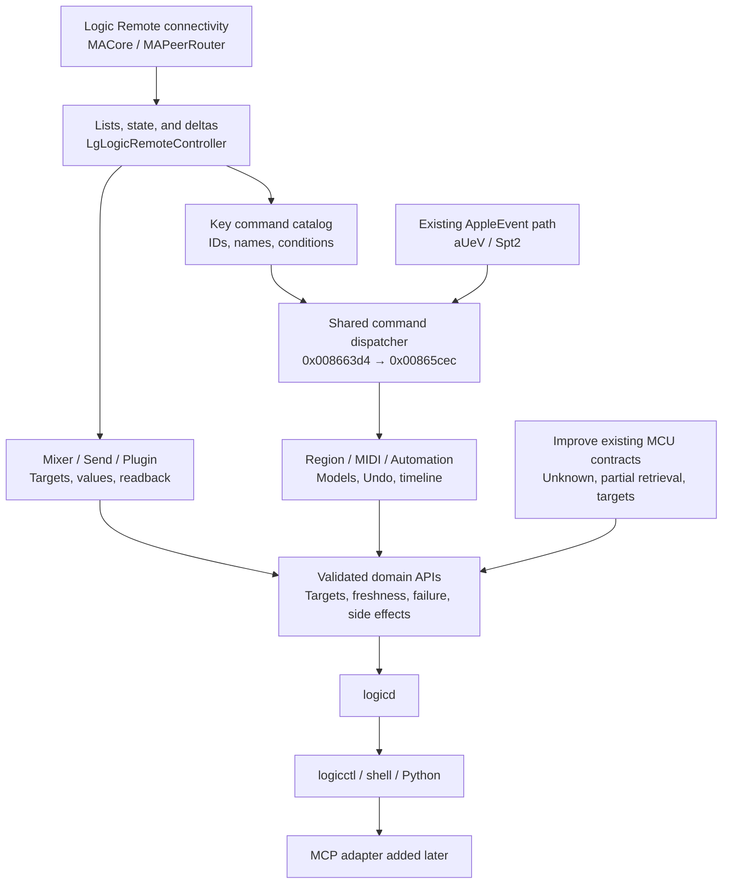

# Roadmap for comprehensive analysis and agent use

[日本語](agent-ready-roadmap.md) · [English](agent-ready-roadmap.en.md) · [Research guide](../README.md) · [Backlog](agent-ready-backlog.tsv)

**The priorities are Logic Remote connectivity and state retrieval, a shared command catalog, and then the mixer, plug-in, and editing models.**
We will pursue Ghidra analysis alongside APIs that agents can use reliably.

| Baseline for this plan | Details |
|---|---|
| Created | 2026-10-01 |
| Research baseline | Logic Pro Creator Studio 12.3.1 / build 6682, ARM64, macOS 27.0 |
| Current implementation | Basic operations through MCU; play/stop through explicitly selected AppleEvents. AppleEvent readback uses MCU |
| Status of this document | A future plan. It does not promise implementation, live validation, or delivery dates for new features |

## 1. Completion criteria for comprehensive analysis and broad agent access

The goal is to **catalog the required operations and explain which paths can execute and verify them**.
Reading every instruction in the binaries is not a completion requirement.

Agents should be able to discover available capabilities, identify targets, act within an authorized scope, and assess the results.
We will not advertise unresolved operations as available. Each area will be exposed once it meets its completion criteria.

| Area | Information and operations to cover | Completion criteria |
|---|---|---|
| Project | Current song, switching, open, save, close, alternatives | Verify song identity, dirty state, and file results |
| Transport | Play/stop, position, seek, cycle, locators, tempo, time signature, record | Verify units, recording state, and differences in Live Loops |
| Tracks and mixer | Full names, types, hierarchy, selection, volume, pan, mute/solo, record enable, creation, deletion, reordering | Distinguish tracks from channel strips and address the same target after movement |
| Routing | Input/output, bus/aux, sends, pre/post, bypass | Read back destinations, values, and volume units |
| Plug-ins | Lists, inserts, types, bypass, parameters, presets, addition, replacement | Identify tracks, inserts, plug-ins, and parameters separately |
| Automation | Modes, parameters, times, points, curves, read/write, scope in Live Loops | Validate values, the timeline, Undo, and behavior during playback |
| Regions and MIDI | Lists, positions and lengths, movement, duplication, editing, notes/CC, import/export | Preserve region/event targets and musical time |
| Audio and output | Audio regions, bounce, export, long-running operations | Verify completion, failure, output files, and settings |
| Other commands | Editors, browsers, markers, Smart Controls, Step Sequencer, and others | Establish command names, IDs, required views/selections, and state |

The final capability catalog will label each item `verified / experimental / unsupported / unknown`.
`unsupported` is a conclusion limited to a particular investigated path and version. It does not establish that no undiscovered entry point exists.
Analysis coverage and the number of implemented capabilities will be counted separately.
Research for an area is complete only when every item within its scope is cataloged and each classification has evidence.
`unknown` remains incomplete; record reasons for deferral or exclusion. An unimplemented capability can be fully analyzed, but will not be presented as usable.

## 2. Research map for expanding coverage efficiently



Trace **external entry → controller → command/model → Undo and automation → audio engine**, in that order.
Record the discovery of an internal getter or setter separately from whether that capability is externally callable.

## 3. Files to investigate

Paths are relative to the target application's `Contents/` directory.
Candidate classes and search terms are starting points for exploration; they do not imply that external APIs exist.
P0 is the foundation to start now; P1 extends operations next; P2 covers editing and output; P3 fills remaining gaps.

| Priority | Target | Entry points and search terms | Desired findings |
|---|---|---|---|
| P0 | `Frameworks/MACore.framework/Versions/A/MACore` | `MAPeerRouter`, `MAPeer`, invitations, connections, version, sending/receiving, `maUncompressedData`, `Bg*` | Independent peer connection procedure; frames, types, compression, ordering |
| P0 | `Frameworks/Logic.framework/Versions/A/Logic` | `LgLogicRemoteController`, `LgLogicRemoteMessageRouter`, `DfDocument`, `keyCommands:` | Complete state, subscriptions, command catalog, project switching |
| P0 supplementary | Locally analyzable Logic Remote app binaries/resources (availability unconfirmed) | Client invitations/initialization, messages sent by each view, state decoder | Resolve payload and ordering ambiguities from server analysis. Continue server analysis if client resources are unavailable |
| P1 | `Frameworks/Logic.framework/Versions/A/Logic` | `FUN_008663d4`, `FUN_00865cec`, command registration, `befehlStatus:`, `performBefehl:` | Handlers per ID, availability conditions, state evaluation, runtime side effects |
| P1 | `PlugIns/MIDI Device Plug-ins/Logic Remote.bundle`, `Logic Control.bundle`, `TouchOSC.bundle` | `_CSDefault`, Assign, `WrappedAssign`, `CPlugInUserCommunicator_OSC*` | Shared track parameters, sends, automation, plug-in paths |
| P1 | `Logic.framework` → `MAMixer.framework` | Callees from fader/send/routing paths. Search terms: `trackObj`, `globalObj`, bus, insert, channel strip | Track-to-instrument/strip mapping; routing state and changes |
| P1 | `Logic.framework` → `MAPlugInGUI.framework`, `MACore.framework` | Generic plug-ins, `GetParameterInfo`, `SetParameterFloatingValue`, `BroadcastParameterValueChange` | Identification, values, and notifications for host-owned plug-in instances and parameters |
| P2 | `Logic.framework` → `MAAudioEngine.framework` | Callees of confirmed setters, queues, parameter scheduling, automation | Boundary where model changes reach audio processing. Decoding the entire audio engine has lower priority |
| P2 | `Logic.framework`, `LogicAppFramework`, resources | Region, event, Piano Roll, automation, Undo, document, save, bounce | Editing models, time units, project lifecycle |
| P2 supplementary | The dedicated project's `.logicx` package, alternatives, presets, and other saved resources | Structure/file differences before and after saving. Identify formats before interpreting them | Independently compare IDs, values, and times retained through save/reload |
| P3 | `MACore.framework/Resources/MIDI Device Scripts/`, related resources | Lua loaders and feedback, Scripter, preset/definition resources, AX UI elements | Supplementary paths and constraints for operations unavailable through native/Remote paths |

The main implementation resides in the frameworks. The main executable is a small startup stub.
We will narrow the scope in this order based on [SA-003](../static-analysis/SA-003-logic-framework-first-pass.en.md) and the [path investigation](../architecture.en.md).
No XPC control service has been found. The presence of `InstallerHelperTool` does not establish a control XPC service.
Public AU APIs alone are also not assumed to control plug-in instances owned by Logic in another process.

## 4. Known Ghidra starting points

**Addresses are image addresses before the slide in the baseline build. They are not runtime addresses or public APIs.**
Locate them again for other builds. Logic and MACore also have separate address spaces.

### 4.1 Entry points from existing organized analysis

| Binary | Starting point | Next question | Evidence |
|---|---|---|---|
| Logic | AE registration `0x004f11fc` → handler `0x00590e30` | Arguments, return values, and side effects outside mode 6. Avoid mode 4 writes | [Registration](../static-analysis/appleevent-registration.en.md) |
| Logic | File/region helper `0x00591de0`, `sPfi`, `sPrg`, and others | Import/spot/update by mode, target selection, position/length units. Do not assume an arbitrary region editing API | [Registration](../static-analysis/appleevent-registration.en.md) |
| Logic | Dispatcher `0x008663d4` → evaluator `0x00865cec` | Distinguish state evaluation from execution; establish context, aliases, and availability per ID | [SA-004](../static-analysis/SA-004-command-and-engine-boundaries.en.md) |
| Logic | Command table `0x026883b0`; construction `0x00863ec4` → `0x008630b4` → `0x00864230`; aliases `0x01cd1d98` | Recover registration groups, IDs, handlers, and arguments; connect them to runtime names | [SA-004](../static-analysis/SA-004-command-and-engine-boundaries.en.md) |
| Logic | `isPlaying` `0x014fc9d4`, `isRecording` `0x014fcb04` | Compare with externally received values. Recording also includes Live Loops | [State analysis](../static-analysis/SA-AE-STATE-002-native-transport-state.en.md) |
| Logic | `didConnectToPeerID:` `0x016837a0` → block `0x01699828`; wakeup `0x016843b8` | Connection conditions, initial state transmission order, active song change notifications | [SA-005](../static-analysis/SA-005-logic-remote-state-push.en.md), [state analysis](../static-analysis/SA-AE-STATE-002-native-transport-state.en.md) |
| Logic | Receive `0x011df620` → route `0x011e0118` → state setup `0x01683ad8`; update `0x0168e1d4` | `/keyCommand/keyCommandDictResponse` subscription and evaluation branches for IDs 3/7 | [State analysis](../static-analysis/SA-AE-STATE-002-native-transport-state.en.md) |
| Logic | Transport update `0x0168f070`, play flags `0x0168f238`, clock `0x0168f314` | Establish position/tempo units without reducing button states directly to booleans | [State analysis](../static-analysis/SA-AE-STATE-002-native-transport-state.en.md) |
| Logic | `handleFader:` → queue `0x00791330` | Whether Assign class 5 reaches the same queue; target IDs and event types | [SA-004](../static-analysis/SA-004-command-and-engine-boundaries.en.md) |
| MACore | `MAPeerRouter::processReceivedData:fromPeer:`, `CPlugInUserCommunicator_OSC*` | Frame types, compression, class allowlists, plug-in communication bridge | [SA-002](../static-analysis/SA-002-control-surface-assign-model.en.md) |

The command table covers IDs 0–4950. **This does not mean 4,951 operations are available.**
Trace IDs in the 40-byte entries, handlers at `+0x18`, arguments at `+0x20`, and registration by feature, then catalog the entries actually registered.
AE, UI, and Remote paths use different call flags, so a shared ID alone does not establish identical behavior.

### 4.2 Further candidates identified from function lists in this pass

This pass **rechecked names and entry locations** from function lists. Some entries, such as frames and fader dictionaries, already have partial analysis.
The questions in the “First bounded analysis” column, reachability from an independent peer, and complete specifications remain unresolved.
Treat “this function implements the intended operation,” when inferred from its name alone, as a **Hypothesis, confidence: low to medium**.
Do not add them to product capabilities until a bounded analysis and experiment record exists.

| Binary | Function name | Entry | First bounded analysis |
|---|---|---|---|
| MACore | `MAPeerRouter::connectToPeer:` | `0x000f51c0` | Peer types, invite context, acceptance conditions |
| MACore | `MAPeerRouter::session:peer:didChangeState:` | `0x000f8608` | Transmission order by connection state; disconnect/reconnect |
| MACore | `MAPeerRouter::_handleLowLevelMessage:argument:peer:` | `0x000f777c` | Check receive branches such as `/protocolVersion` against ARM64 |
| MACore | `MAPeerRouter::processReceivedData:fromPeer:` | `0x000f7ac8` | Type tags, compression, message boundaries, limits |
| Logic | `LgLogicRemoteController::keyCommands:` | `0x01683e10` | Dictionaries of IDs, names, groups, localization |
| Logic | `…::_addGInstAndTrackFaderStatesDictForInstWithID:trackID:pSong:changedMask:` | `0x0168c304` | `g/t`, track/instrument IDs, volume representation |
| Logic | `…::collectGInstFaderStatesForInstID:changedMask:` / `sendCollectedGInstAndTrackFaderDataIfNeeded` | `0x0168c9e0` / `0x0168ccdc` | Conditions for full collection, deltas, and transmission |
| Logic | `…::setAllTrackInfo:` | `0x016867b4` | Target coverage, ordering, and full names in `/ati` |
| Logic | `…::pluginsForTrack:isMIDI:` | `0x01690a38` | Audio/MIDI insert lists and plug-in identifiers |
| Logic | `…::connectToGenericPlugin:onTrack:` | `0x01693060` | Connection, value subscriptions, instance lifetime |
| Logic | `…::sendUpdatedGenericPluginParameterInfo:` | `0x0169370c` | IDs, scope, ranges, display values, notifications |
| Logic | `…::sendFeedbackForPlugin:withParameterID:` | `0x0169390c` | Sources of parameter readback and deltas |
| Logic | `…::routeGenericPluginMessage:withArgument:` | `0x016939e8` | Write destinations, types, Undo and automation paths |
| Logic | `…::setProjectAutomationEnabled:` | `0x0168fb54` | Actual scope of this setter; do not assume it is a point editing API |
| Logic | `…::handleRegionTransferData:` | `0x01686edc` | Meaning of transfer; do not assume arbitrary region editing |

The source is the existing local output `Research/raw/ghidra/{Logic,MACore}.arm64.functions.tsv`.
The relevant rows were checked again on 2026-10-01. `…::` abbreviates `LgLogicRemoteController::`.
Function list extraction retains some incorrect prototypes, so this plan does not adopt those types as an API specification.

## 5. Work order and gates for proceeding

Proceed based on **observed results**, rather than time estimates.
Static research for R1/R2 and R3 can run alongside product improvements in R0. Live writes from R4 onward require established targets and state.
The backlog's `depends_on` lists prerequisites for completion, live experiments, or release. Static work using existing material can begin earlier.

| Stage | Work | Acceptance criteria and deliverables |
|---|---|---|
| R0: Foundation | Define observation contracts, sessions, unknown/partial states, retrieval failures, capabilities, side effects, and execution contracts for all operations | Do not treat missing data, connection changes, or incomplete retrieval as success. Make `state` coverage machine-readable. Validate project/session/revision preconditions, timeouts, duplicates, and conflicts before broadly exposing writes |
| R1: Independent connection | Analyze MACore invitations, version, hostType, JSON exchange, and frames; build a research Swift peer | Describe the target and messages to be sent/received, then obtain explicit approval before connecting. Actually receive application messages in three independent connections. Identify disconnect/reconnect. Save the connection procedure and fixtures |
| R2: Readback | Assemble `/ati`, `/sti`, `/gtFaderData`, transport, and clock from initial messages and deltas | Compare across multiple tracks/values, false/0, reconnects, and song switches. Determine coverage and missing fields |
| R3: Command catalog | Compare Remote commands/groups queries with registration tables. Audit state evaluation for IDs 3/7 first | Record IDs, names, categories, handlers, aliases, required context, side effects, and evidence. Do not execute commands indiscriminately |
| R4: Expand basic operations | Add stable target references, native/Remote mixer operations, transport seek/cycle, sends/routing | Meet the R0 execution contract; compare with existing MCU capabilities; zero wrong-target writes; fresh readback across multiple values. Recording requires a separate dedicated experiment |
| R5: Plug-ins | Progress from lists → metadata → current values → one parameter change → bypass/preset/load | Separate tracks, inserts, plug-ins, and parameters. Verify values with the GUI closed. Distinguish two instances of the same type |
| R6: Editing models | Recover region/event models, MIDI notes/CC, automation modes/points/curves, and Undo boundaries | Match position, length, time units, and targets. Validate save/reload and Undo/Redo separately |
| R7: Songs and output | Open/save/close, import/export, bounce, jobs, interruption and completion detection | Detect dirty state and song switches. Track long-running work by job ID. Read back and verify artifacts |
| R8: Agent access | Stabilize CLI/domain APIs; provide a thin MCP adapter, schemas, preview, watch, and batch | CLI and MCP yield the same results. Agents can assess timeouts, conflicts, partial failures, and unknown builds |

Split each operation in R4–R7 into “read → one change → readback → side-effect check.”
Pass the shared gate for targets, timeouts, duplicates, and conflicts (PLAN-09) before broadly exposing new writes. Do not defer it until MCP implementation.
Completed areas can be exposed within their validated scope before later stages are complete.

### First six work items

1. **PLAN-01 / PLAN-02**: Fix the version/hash and evidence inventory; align the current MCU contracts for unknown, partial, and freshness states.
2. **PLAN-03**: Trace only the three MACore functions above and Logic's connection block; document the order of invitation, acceptance, and version exchange.
3. **PLAN-04**: Analyze receiving, sending, and compression; create tagged plist/JSON fixtures and a parser specification.
4. **PLAN-05**: Prepare a research peer using macOS MultipeerConnectivity. Describe the target and messages to be sent/received, and obtain explicit approval before attempting a new connection to receive lists and state. Limit sent messages to connection/protocol configuration; send no editing commands.
5. **PLAN-06 / PLAN-07**: Combine initial state and subsequent updates; build an operation map from commands queries. Trace play/record state evaluation statically in parallel.
6. **PLAN-08**: Establish track/instrument/strip IDs, full names, and hierarchy. Base subsequent writes on this target contract.

The research peer will initially use Apple's MPC APIs. This is an implementation choice based on the existing code's use of MCSession; successful connection has not been confirmed.
Consider reimplementing raw TCP, ICE, and STUN only after establishing why the MPC APIs cannot reach the target.
Network captures alone may not expose readable application payloads. Correlate data obtained in the peer's receive callback with network records when needed.
Comparison with a real Logic Remote will be a separate experiment when an iPad/iPhone is available.
The 2022 prior PoC is not a specification for the current build; do not copy unlicensed code. [Prior research](../notes/prior-art.en.md)

## 6. Common analysis pitfalls and their experiments

| Issue | Current findings | Next verification |
|---|---|---|
| Connection port | The Bonjour port changes between launches | Discover `_apple-lgremote._tcp`; reacquire the port, peer, and session. Do not hardcode the port |
| Version | Logic's connection block rejects peer versions <10 | Verify a version 10 connection, including invitation context, peer type, and exchange order |
| Wire format | MACore's lower 7 tag bits use 4=JSON and 1=plist; bit 7 indicates compression | Verify compression, archive class restrictions, dictionary/array ordering, numeric keys, and binary arguments. Do not derive a raw TCP/OSC specification from `useTCP` alone |
| Initial zero omission | `/keyCommandStateUpdate` setup omits zero; IDs 0/5 are also excluded from initial evaluation | Distinguish missing messages from false. Find a path for explicit 0/false. Do not infer stopped state from absence |
| All fader fields | `/gtFaderData` includes all keys when `changedMask==0` | Verify full collection conditions, missing initial targets, and delta merging. Do not apply key-command zero omission to this path |
| Volume | `vL` represents a signed byte shifted into the high bits | Compare 0, -3, -6, -12 dB and silence on tracks 1/2/8, one value at a time. Establish ranges, rounding, and scale |
| Mute/solo | Remote parameters are 9/3; MCU uses 128/129 | Distinguish toggle from desired-state behavior and separate solo-induced mute. Verify both ON and OFF |
| Transport | stopButtonState is a UI state with values 0/1/2; the recording getter also considers Live Loops | Compare ID 3/7 flags=2, button flags, normal playback, pause, and cell states. Keep this separate from executing recording |
| Mode 4 | Conditional writes to tempo records/song flags exist | Do not use it as a pure status API. Audit return values and side effects in other modes before experiments |
| Plug-ins | Named generic plug-in candidates exist | Separate insert slots, instances, parameter scope/IDs, and normalized/raw/display values. Establish GUI dependencies and lifetime |
| Undo | Recording in Undo differs by mixer settings, and operations may merge | Trace Undo groups and automation relationships. Do not treat Undo as a universal rollback |

Evidence: [SA-002](../static-analysis/SA-002-control-surface-assign-model.en.md), [SA-005](../static-analysis/SA-005-logic-remote-state-push.en.md), [state analysis](../static-analysis/SA-AE-STATE-002-native-transport-state.en.md), [port experiment](../experiments/EXP-A3-001-remote-port-per-launch.en.md), [Undo experiment](../experiments/EXP-UNDO-002-mixer-undo-enabled.en.md).

## 7. API contracts for agent access

Additional fields and capabilities here are **design proposals, not implemented**. See the [product specification](../../docs/specification.md) for current behavior.

| Required contract | Proposal | Acceptance criteria |
|---|---|---|
| Targets | Separate project session, entity ID, entity kind, display order, and parent | Do not write to a different target after duplicate names, rename, reordering, additions/deletions, or song switches |
| ID lifetime | Measure native ID stability. Use snapshot/session references for paths without confirmed stability | Do not claim stability across reloads without evidence. Return explicit errors for stale references |
| Observation | Value, known/unknown/stale, observed_at, revision, source, precision, generation | Distinguish 0, false, null, and missing data. Do not derive verified/no-op success from default values |
| State coverage | Complete/partial/unsupported by area, retrieval scope, scan errors | Distinguish empty lists, failed scans, and incomplete retrieval. Do not claim all Logic state was retrieved |
| Capabilities | Schema per command, availability, backend/profile, constraints, side effects, readback precision | Distinguish implemented capabilities, availability in the current environment, and experimental status |
| Execution | Requested/observed; distinguish sent, replied, applied, verified, and unknown | Do not automatically retry after a lost reply or silently switch backends |
| Concurrency | Expected session/revision, bounded queue, deadlines, serialized shutdown | Return precondition conflicts for concurrent changes by agents or people |
| Duplicates | Idempotency keys, content hashes, and a journal separate from correlation request IDs | Reject different operations with the same key. Reconcile unknown execution; do not promise unconditional exactly-once behavior |
| Batch | Validate/preview, sequential execution, per-operation results, stop-on-error | Explain partial success. Compensate from before-values only for supported operations; stop automatic restoration on conflicts |
| Long-running work | Job IDs, progress, status, artifacts, cancel requests and stop results | Retrieve results after CLI disconnects. Do not report cancellation complete until actual stopping is confirmed |
| Authorized scope | Metadata for pure reads, surface/UI changes, reversible edits, destructive/external operations | Act autonomously within the preauthorized scope. Do not expose unlimited raw debug/private ID execution as standard tools |
| Interface | Domain API → CLI → thin MCP adapter. Japanese descriptions, fixed machine keys, JSON Schema | Keep success criteria consistent across adapters. Allow agents to discover schemas/capabilities |
| Compatibility | Manage CLI/daemon wire versions separately from Logic builds/profiles | Do not send through the wrong path with older clients/daemons. Do not label unknown builds as verified |

Current track numbers represent mixer positions. `state` covers transport, selection, and strip lists.
In [MCUBackend](../../Sources/LogicCore/Backends/MCU/MCUBackend.swift), normal transport output reads raw LEDs; a home failure during list scanning yields an empty array.
Generalize the freshness validation implemented for AppleEvents and first improve the distinction between retrieval failures.

MCU `track list` moves banks, and `track get` sends fader touch. Selection may also move record enable when automatic record enable is active.
Record “reads a value” separately from “does not affect the UI/surface” in capabilities.
Current request IDs are for correlation; duplicate suppression, revision contracts, and MCP are not implemented.

## 8. Continuing Ghidra analysis

1. Record version, build, architecture, and UUID, with separate SHA-256 values for the entire installed source file and the selected arm64 slice. Verify the source file's arm64 slice → analysis copy → the Ghidra program's stored Executable SHA-256. Do not directly compare the universal file's full hash with the thin arm64 hash. If the source file is already thin arm64, the hashes match. The general `query.sh` has no hash guard, so do not skip this check.
2. Reuse existing programs read-only. Import copies/slices of new frameworks and manage them as separate profiles.
3. Trace one path at a time. For example: received message → route branch → handler → model getter/setter → reply/notification.
4. Recover ObjC selectors, CFStrings, chained pointers, and callers; compare against ARM64 arguments, return values, and branches. Do not assign types from inferred C prototypes alone.
5. Keep short organized records covering execution context, locks/threads, dirty state/Undo/automation, units, ranges, and errors.
6. Create parser fixtures and isolated experiments; promote findings to product implementations/capabilities only after live comparison.

Baseline SHA-256 values (checked again on 2026-10-02):

| Target | Entire installed source file | arm64 slice, analysis copy, and Ghidra's stored Executable SHA-256 |
|---|---|---|
| Logic: thin arm64 | `2f141e1a1f7b90a4fb0205ffec3dbe187baf601d20e9acb398acfadcdf050998` | `2f141e1a1f7b90a4fb0205ffec3dbe187baf601d20e9acb398acfadcdf050998` |
| MACore: universal x86_64 + arm64 | `76ab2a5f50b3ef120786369b5bf8b53dfc87a3b4107438e0894ab5f9b8095c52` | `99a4a9adbf79c92046682eb821d8ef35145f4915a29b88839c4f026ae63cd076` |

The [binary identity record](../static-analysis/SA-IDENTITY-001-binary-inputs.en.md) and [identity manifest](../static-analysis/binary-identity-12.3.1-6682.json) record each hash, architecture, UUID, slice location, and Ghidra metadata separately.
This manifest covers the binary identity subset of PLAN-01. It does not mark the whole of PLAN-01 complete.

These are bounded query examples for the existing `Logic.arm64` program. Run them from the repository root after checking the hash.
They produce static output and send no commands to Logic.

```sh
Tools/ghidra/query.sh Logic.arm64 q-plan-peer \
  0x016837a0 0x01699828 0x016843b8
Tools/ghidra/query.sh Logic.arm64 q-plan-command-state \
  0x00865cec 0x01683ad8 0x0168e1d4
Tools/ghidra/query.sh Logic.arm64 q-plan-plugins \
  0x01690a38 0x01693060 0x0169370c 0x0169390c 0x016939e8
```

Use the same method for MACore after checking its corresponding analyzed program.
There is no need to decompile every function in every framework again for each investigation.
Do not run headless queries, reports, imports, or updates concurrently in the same Ghidra project, including read-only operations.
Parallel workers can read ordinary files or perform other work; run Ghidra operations one at a time.

## 9. Experiments, deliverables, and parallel work

Live experiments use only the dedicated `LogicCLI-Test.logicx`. For editing experiments, record contents and initial state, and start from the same state each time.
Change one condition per experiment, then reproduce with other values or targets. [Experiment template](../experiments/TEMPLATE.en.md), [development rules](../../AGENTS.en.md)
Investigate persistence formats using copies of the dedicated project and differences before/after saving. Do not make direct rewriting of files with unresolved formats a prerequisite for product editing paths.

| Workstream | Main responsibility | Boundary |
|---|---|---|
| A: Remote | MACore connections, frames, initial state | Connection prototypes, parsers, live receive records |
| B: Commands/models | Dispatcher, state evaluation, domain handlers | Bounded Ghidra analysis, catalogs, evidence of side effects |
| C: Product contracts | Sessions, targets, freshness, concurrency, schemas | Swift daemon/core, fake backend/CLI tests |
| D: Integration/docs | Experiments, result comparisons, capability catalog, Japanese/English explanations | One worker at a time for live writes; root integrates and validates |

Work in B/C can continue if connection analysis stalls. Share documents and fixtures; do not change the same live application's state concurrently.
If measurement requires `sudo`, signature changes, SIP changes, or Logic binary modifications, follow the confirmation requirements in [AGENTS.md](../../AGENTS.md).
New peer connections in PLAN-05 require explicit approval, as directed by the user on 2026-10-02. Static analysis, offline fixtures/parsers, and prototype preparation can proceed beforehand.
Start with static analysis and receive records collected with normal permissions. Do not make injection into a running process a product prerequisite.

**Planned deliverables** (these are not a list of files already created):

- `Research/protocol/operation-catalog.tsv`: Domain, command ID, message, context, backend, status, constraints, evidence.
- `Research/protocol/logic-remote.schema.json`: Known frames/payloads. Supplement binary portions with structural schemas and golden fixtures.
- `Research/static-analysis/SA-REMOTE-SESSION-001.md`, `SA-COMMAND-CATALOG-001.md`: Organized connection and command registration findings.
- `Research/experiments/EXP-REMOTE-001.md` onward: Separate records for initial receiving, deltas, and each write.
- `Tests/Fixtures/logic-remote/`: Minimal reproduction payloads; malformed, unknown-field, partial, and reconnect cases.
- `Sources/LogicCore/`: Product state/profile/backend/domain APIs. No runtime dependencies on Research/Tools.
- Japanese/English schema explanations, capability tables, and practical examples. Keep raw binaries, full decompilations, and Ghidra databases in local areas such as `Research/raw/`; do not add them to Git.

## 10. Release decisions and progress measurement

| Release stage | What can be exposed | Required validation |
|---|---|---|
| A: Basic operations | CLI with improved existing transport/mixer contracts | Unknown values, freshness, list failures, target references, side effects, compatibility |
| B: Broad readback | Full names, state by domain, native/Remote snapshots and watch | Initial messages, deltas, 0/false, reconnects, song switches. Claim MCU independence only within demonstrated scope |
| C: Production operations | Add verified sends, plug-ins, automation, regions, and other operations individually | Pass the shared execution gate, then validate multiple values/targets, wrong-target prevention, save/reload, Undo and readback limits |
| D: Agent operation | MCP, batches, long-running jobs, autonomous actions within authorized scope | Schema discovery, conflicts, timeouts, duplicates, partial failures, artifact verification |

Measure progress as **investigated capabilities / capabilities within the target scope, and live-validated operations / operations intended for release**.
Define denominators after fixing the catalog scope, build, and retrieval method.
Do not convert string counts or decompiled function counts into a percentage of all Logic analysis.

Released operations require a target profile, input schema, units, preconditions, readback, side effects, failure behavior, and evidence.
Choose unit/parser/golden tests, fake-daemon compatibility tests, and dedicated-project integration checks to fit each new feature.
Documentation-only changes do not require operating Logic.

Follow the dependencies in the [backlog](agent-ready-backlog.tsv).
**A completed increment includes analysis records + fixtures/experiments + implementation + relevant validation + Japanese/English documentation.**
Commit each such increment, then push to the remote after the increment is complete.
