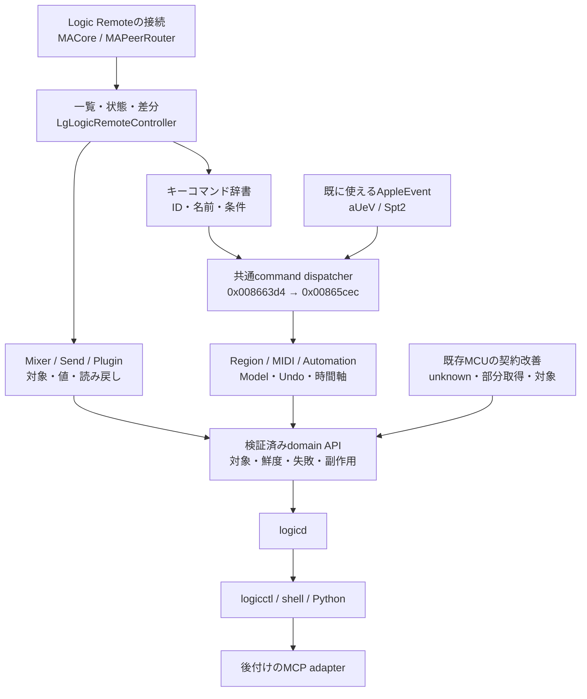

# 全体解析とエージェント利用に向けた開発計画

[日本語](agent-ready-roadmap.md) · [English](agent-ready-roadmap.en.md) · [調査ガイド](../README.md) · [作業一覧](agent-ready-backlog.tsv)

**最優先は、Logic Remoteの接続・状態取得、共通コマンドの辞書化、その先のミキサー・プラグイン・編集モデルです。**
Ghidra解析と、エージェントが安心して使えるAPIの整備を並行して進めます。

| この計画の基準 | 内容 |
|---|---|
| 作成日 | 2026-10-01 |
| 調査基準 | Logic Pro Creator Studio 12.3.1 / build 6682、ARM64、macOS 27.0 |
| 現在の実装 | MCUで基本操作、明示AppleEventでplay/stop。AppleEventの読み戻しはMCU |
| この文書の性質 | 今後の計画。新機能の実装・実機検証・納期を約束するものではない |

## 1. 「全解析」と「自由に使える」の完成条件

目指すのは、**必要な操作を一覧化し、どの経路で実行・確認できるかを説明できる状態**です。
バイナリの全命令を読み切ることを、完成の条件にはしません。

エージェントは、利用可能な機能を自分で調べ、対象を特定し、許可された範囲で操作し、結果を判断できるようにします。
未解明の操作まで使えるとは表示しません。完成条件を満たした領域から段階的に公開します。

| 領域 | 最終的に扱う情報・操作 | 完成の目安 |
|---|---|---|
| プロジェクト | 現在の曲、切り替え、開く、保存、閉じる、alternative | 曲の同一性・dirty状態・ファイル結果を確認できる |
| トランスポート | play/stop、位置、seek、cycle、locator、tempo、拍子、record | 単位・録音状態・Live Loopsの違いまで確認できる |
| トラック・ミキサー | 完全な名前、種類、階層、選択、音量、pan、mute/solo、録音待機、作成・削除・並べ替え | Trackとchannel stripを区別し、移動後も同じ対象を指定できる |
| ルーティング | input/output、bus/aux、send、pre/post、bypass | 接続先・値・音量の単位を読み戻せる |
| プラグイン | 一覧、insert、種類、bypass、parameter、preset、追加・差し替え | track・insert・plugin・parameterを別々に識別できる |
| オートメーション | mode、parameter、時刻、point、curve、read/write、Live Loopsの適用範囲 | 値と時間軸、Undo、再生時の動作を検証できる |
| リージョン・MIDI | 一覧、位置・長さ、移動・複製・編集、note/CC、import/export | region/eventの対象と音楽的な時間を保持できる |
| 音声・出力 | 音声region、bounce、書き出し、長時間処理 | 完了・失敗・出力ファイルと設定を確認できる |
| その他のコマンド | editor、browser、marker、Smart Controls、Step Sequencerなど | コマンド名・ID・必要な画面や選択・状態を把握できる |

最終的な機能台帳には、各項目を `verified / experimental / unsupported / unknown` で記録します。
`unsupported` は調べた特定の経路・バージョンに限った判断です。未発見の入口がないと断定しません。
解析の網羅性と、実装済みの機能数は別々に集計します。
各領域の調査完了には、scope内の全項目が台帳に載り、判定に根拠があることが必要です。
`unknown` は未完了として残し、延期・除外は理由を記録します。未実装でも解析済みにはできますが、操作可能とは表示しません。

## 2. 最短で広がる調査の地図



**外部入口 → controller → command/model → Undo・automation → audio engine** の順で追います。
内部getterやsetterが見つかったことと、外部からその機能を呼べることは分けて記録します。

## 3. どのファイルを漁るか

パスは調査対象アプリの `Contents/` からの相対パスです。
候補クラス・検索語は探索の起点であり、外部APIの存在を意味しません。
P0は今着手する土台、P1はその次の操作拡張、P2は編集・出力、P3は不足を補う経路です。

| 優先 | 対象 | 調べる入口・検索語 | 得たいもの |
|---|---|---|---|
| P0 | `Frameworks/MACore.framework/Versions/A/MACore` | `MAPeerRouter`、`MAPeer`、招待・接続・version、送受信、`maUncompressedData`、`Bg*` | 独立peerの接続手順、フレーム・型・圧縮・順序 |
| P0 | `Frameworks/Logic.framework/Versions/A/Logic` | `LgLogicRemoteController`、`LgLogicRemoteMessageRouter`、`DfDocument`、`keyCommands:` | 完全な状態、購読、コマンド辞書、project切り替え |
| P0補助 | 手元で解析可能なLogic Remoteアプリのbinary/resources（取得可否は未確認） | client側の招待・初期化、各画面の送信message、state decoder | server側だけでは曖昧なpayload・送信順序を照合。未入手でもserver解析を進める |
| P1 | `Frameworks/Logic.framework/Versions/A/Logic` | `FUN_008663d4`、`FUN_00865cec`、command登録、`befehlStatus:`、`performBefehl:` | IDごとのhandler、利用条件、状態評価、実行時の副作用 |
| P1 | `PlugIns/MIDI Device Plug-ins/Logic Remote.bundle`・`Logic Control.bundle`・`TouchOSC.bundle` | `_CSDefault`、Assign、`WrappedAssign`、`CPlugInUserCommunicator_OSC*` | 共通のtrack parameter、send、automation、plugin経路 |
| P1 | `Logic.framework` → `MAMixer.framework` | fader/send/routingからの呼び先。探索語 `trackObj`、`globalObj`、bus、insert、channel strip | Trackとinstrument/stripの対応、ルーティングの状態と変更 |
| P1 | `Logic.framework` → `MAPlugInGUI.framework`・`MACore.framework` | generic plugin、`GetParameterInfo`、`SetParameterFloatingValue`、`BroadcastParameterValueChange` | hostが保持するplugin instanceとparameterの識別・値・通知 |
| P2 | `Logic.framework` → `MAAudioEngine.framework` | 確認したsetterの呼び先、queue、parameter scheduling、automation | モデルの変更が音声処理へ届く境界。音声engine全体の解読は後順位 |
| P2 | `Logic.framework`・`LogicAppFramework`・resources | region、event、Piano Roll、automation、Undo、document、save、bounce | 編集model、時間単位、プロジェクトのライフサイクル |
| P2補助 | 専用曲の `.logicx` package、alternative、preset等の保存資源 | 保存前後の構造・file差分。形式は確認してから解釈する | 保存・再読込で保持されるID・値・時間の独立した照合 |
| P3 | `MACore.framework/Resources/MIDI Device Scripts/`・関連resources | Luaのloader・feedback、Scripter、preset/定義資源、UIのAX要素 | native/Remoteで届かない操作の補助経路と制約 |

主要な処理はFramework側にあります。メイン実行ファイルは起動用の小さなstubです。
[SA-003](../static-analysis/SA-003-logic-framework-first-pass.md)・[経路の調査](../architecture.md)を根拠に、この順で範囲を絞ります。
XPCの操作用serviceは未発見です。`InstallerHelperTool` の存在から操作用XPCを想定しません。
AUの公開APIだけで、別プロセスのLogicが所有するplugin instanceを操作できるとも想定しません。

## 4. 既に位置が分かっているGhidraの起点

**アドレスは基準ビルドのslide前イメージアドレスです。実行時アドレス・公開APIではありません。**
別buildでは再特定します。LogicとMACoreのアドレス空間も別です。

### 4.1 既存の整理済み解析から追う入口

| バイナリ | 起点 | 次に答えること | 根拠 |
|---|---|---|---|
| Logic | AE登録 `0x004f11fc` → handler `0x00590e30` | mode 6以外の引数・返値・副作用。mode 4の書き込みを回避する | [登録](../static-analysis/appleevent-registration.md) |
| Logic | file/region helper `0x00591de0`、`sPfi`・`sPrg` 等 | mode別のimport/spot/update、対象決定、位置・長さの単位。任意region編集APIとは判断しない | [登録](../static-analysis/appleevent-registration.md) |
| Logic | dispatcher `0x008663d4` → evaluator `0x00865cec` | 状態評価と実行の違い、IDごとのcontext、alias、実行可否 | [SA-004](../static-analysis/SA-004-command-and-engine-boundaries.md) |
| Logic | command table `0x026883b0`、構築 `0x00863ec4` → `0x008630b4` → `0x00864230`、alias `0x01cd1d98` | 登録group・ID・handler・引数を復元。runtime名と結び付ける | [SA-004](../static-analysis/SA-004-command-and-engine-boundaries.md) |
| Logic | `isPlaying` `0x014fc9d4`、`isRecording` `0x014fcb04` | 外部で受け取る値と一致するか。録音はLive Loopsも含む | [状態解析](../static-analysis/SA-AE-STATE-002-native-transport-state.md) |
| Logic | `didConnectToPeerID:` `0x016837a0` → block `0x01699828`、wakeup `0x016843b8` | 接続条件と初期状態の送信順序、active song変更の通知 | [SA-005](../static-analysis/SA-005-logic-remote-state-push.md)・[状態解析](../static-analysis/SA-AE-STATE-002-native-transport-state.md) |
| Logic | receive `0x011df620` → route `0x011e0118` → state setup `0x01683ad8`、更新 `0x0168e1d4` | `/keyCommand/keyCommandDictResponse` の購読と、ID 3/7の評価分岐 | [状態解析](../static-analysis/SA-AE-STATE-002-native-transport-state.md) |
| Logic | transport update `0x0168f070`、play flags `0x0168f238`、clock `0x0168f314` | ボタン状態を真偽値へ短絡せず、位置・tempoの単位を確定する | [状態解析](../static-analysis/SA-AE-STATE-002-native-transport-state.md) |
| Logic | `handleFader:` → queue `0x00791330` | Assign class 5から同じqueueへ届くか、対象IDとイベント型 | [SA-004](../static-analysis/SA-004-command-and-engine-boundaries.md) |
| MACore | `MAPeerRouter::processReceivedData:fromPeer:`、`CPlugInUserCommunicator_OSC*` | frame型、圧縮、型の許可リスト、plugin通信用のbridge | [SA-002](../static-analysis/SA-002-control-surface-assign-model.md) |

command tableのID範囲は0〜4950です。**4951個の操作が使えるという意味ではありません。**
40-byte entryのID、handler `+0x18`、引数 `+0x20`、機能別登録を追い、実際に登録された項目を台帳化します。
AE・UI・Remoteでは呼び出しflagが違うため、同じIDだけで同じ挙動とは判断しません。

### 4.2 今回、関数一覧から拾った次の探索候補

今回は関数一覧から**名前と入口の位置を再確認**しました。frameやfader辞書のように、既存の部分解析があるものも含みます。
表の「最初の限定解析」で挙げた問い、独立peerからの到達、完全な仕様は未確立です。
名前だけから推測した「この関数が目的の操作を実現する」は **Hypothesis、確信度: 低〜中** として扱います。
次の限定解析・実験記録ができるまで、製品のcapabilityには入れません。

| バイナリ | 関数名 | 入口 | 最初の限定解析 |
|---|---|---|---|
| MACore | `MAPeerRouter::connectToPeer:` | `0x000f51c0` | peer種別、invite context、承認条件 |
| MACore | `MAPeerRouter::session:peer:didChangeState:` | `0x000f8608` | 接続状態ごとの送信順序、切断・再接続 |
| MACore | `MAPeerRouter::_handleLowLevelMessage:argument:peer:` | `0x000f777c` | `/protocolVersion` 等の受信分岐をARM64で照合 |
| MACore | `MAPeerRouter::processReceivedData:fromPeer:` | `0x000f7ac8` | 型tag・圧縮・メッセージ単位・制限 |
| Logic | `LgLogicRemoteController::keyCommands:` | `0x01683e10` | ID・名称・group・localizationの辞書 |
| Logic | `…::_addGInstAndTrackFaderStatesDictForInstWithID:trackID:pSong:changedMask:` | `0x0168c304` | `g/t`、track/instrument ID、音量の表現 |
| Logic | `…::collectGInstFaderStatesForInstID:changedMask:` / `sendCollectedGInstAndTrackFaderDataIfNeeded` | `0x0168c9e0` / `0x0168ccdc` | 全件収集・差分・送信の条件 |
| Logic | `…::setAllTrackInfo:` | `0x016867b4` | `/ati` が含む対象の範囲、並び順、完全名 |
| Logic | `…::pluginsForTrack:isMIDI:` | `0x01690a38` | audio/MIDI insertの一覧とplugin識別子 |
| Logic | `…::connectToGenericPlugin:onTrack:` | `0x01693060` | 接続と値の購読、instanceの寿命 |
| Logic | `…::sendUpdatedGenericPluginParameterInfo:` | `0x0169370c` | ID、scope、値域、表示値、通知 |
| Logic | `…::sendFeedbackForPlugin:withParameterID:` | `0x0169390c` | parameter読み戻し・差分の生成元 |
| Logic | `…::routeGenericPluginMessage:withArgument:` | `0x016939e8` | 書き込み先、型、Undo・automation経路 |
| Logic | `…::setProjectAutomationEnabled:` | `0x0168fb54` | このsetterの実際の範囲。point編集APIとは決めつけない |
| Logic | `…::handleRegionTransferData:` | `0x01686edc` | transferが表すもの。任意のregion編集とは決めつけない |

出典は既存のローカル出力 `Research/raw/ghidra/{Logic,MACore}.arm64.functions.tsv`。
2026-10-01に該当行を再確認しました。`…::` は `LgLogicRemoteController::` の省略です。
一覧抽出には誤ったprototypeが残るため、この計画ではその型をAPI仕様として採用していません。

## 5. 実行する順番と、次へ進む合格条件

日数による区切りより、**観測できた結果**で次へ進みます。
R1/R2とR3の静的調査、R0の製品改善は並行できます。R4以降の実機書き込みには、対象と状態の確立が必要です。
作業一覧の`depends_on`は、完了判定・実機移行・公開に必要な前提です。既存資料だけでできる静的整理は先行できます。

| 段階 | 作業 | 合格条件・残す成果物 |
|---|---|---|
| R0：土台 | 全操作の観測契約、session、unknown/partial、取得失敗、capabilities、副作用、実行契約を整える | 未受信・接続変更・途中取得を成功にしない。`state` の取得範囲を機械可読にする。広いwrite公開前にproject/session/revisionの事前条件、timeout・重複・競合を検証 |
| R1：独立接続 | MACoreの招待・version・hostType・JSON交換・frameを解析し、研究用Swift peerを作る | 独立した3回の接続でアプリmessageを実際に受信。切断・再接続を識別。接続手順とfixtureを保存 |
| R2：読み取り | `/ati`・`/sti`・`/gtFaderData`・transport・clockを初回＋差分で組み立てる | 複数track・複数値・false/0・再接続・曲切り替えで照合。取得範囲と未取得を判定できる |
| R3：コマンド台帳 | Remoteのcommands/groups queryと登録tableを照合。ID 3/7の状態評価を先に監査 | ID・名前・category・handler・alias・必要context・副作用・根拠を記録。無差別実行はしない |
| R4：基本操作拡張 | stableな対象参照、native/Remote mixer、transport seek/cycle、send/routingを追加 | R0の実行契約を満たし、現在のMCU機能との比較、誤対象ゼロ、複数値のfresh readback。recordは専用の別実験 |
| R5：plugin | 一覧→metadata→現在値→1parameter変更→bypass/preset/loadへ進む | track/insert/plugin/parameterを分離。GUIを閉じても値を確認。同種2instanceでも混同しない |
| R6：編集model | region/event、MIDI note/CC、automation mode/point/curve、Undoの境界を復元 | 位置・長さ・時間単位と対象が一致。保存・再読込・Undo/Redoを別々に検証 |
| R7：曲と出力 | open/save/close、import/export、bounce、jobと中断・完了判定 | dirty/曲切り替えを検出。長時間処理はjob IDで追跡。生成物を読み返し確認 |
| R8：agent公開 | CLI/domain APIを固め、薄いMCP adapter、schema、preview、watch、batchを用意 | CLIとMCPで同じ結果。timeout・競合・部分失敗・未知buildをagentが判断できる |

R4〜R7は、各操作を「読み取り → 1つの変更 → 読み戻し → 副作用確認」で細分化します。
共通の対象・timeout・重複・競合のgate（PLAN-09）は、新しいwriteを広く公開する前に通します。MCP作成まで先送りしません。
後段が未完成でも、合格した領域は限定して公開できます。

### まず着手する6件

1. **PLAN-01 / PLAN-02**：version/hashと根拠の一覧を固定し、現在のMCUにもunknown・partial・鮮度の契約をそろえる。
2. **PLAN-03**：上記MACoreの3関数と、Logicの接続blockだけを追い、招待・承認・version交換の順序を文書化する。
3. **PLAN-04**：受信・送信・圧縮を解析し、tagged plist/JSONのfixtureとparser仕様を作る。
4. **PLAN-05**：macOSのMultipeerConnectivityを使う研究用peerで、一覧・状態の受信を試す。接続・protocol設定以外の編集commandは送らない。
5. **PLAN-06 / PLAN-07**：初回stateと後続更新を統合し、commands queryから操作の地図を作る。play/recordの状態評価は並行して静的に追う。
6. **PLAN-08**：Track/instrument/stripのID・完全名・階層を確定する。以降の書き込みはこの対象契約に載せる。

研究用peerは、まずAppleのMPC APIを使う方針です。既存コードがMCSessionを使うことからの実装上の判断であり、接続成功は未確認です。
生TCP・ICE・STUNの再実装は、MPC APIで到達できない理由を確認してから検討します。
network captureだけでアプリpayloadが読めるとは限りません。peerの受信callbackで取得するデータと、必要に応じたnetwork記録を対応付けます。
実際のLogic Remoteを使った比較は、iPad/iPhoneを利用できる場合に別実験として行います。
2022年の先行PoCは現buildの仕様ではなく、ライセンスのないコードをコピーしません。[先行調査](../notes/prior-art.md)

## 6. 特に間違えやすい解析と、その実験

| 論点 | 今分かっていること | 次に確かめること |
|---|---|---|
| 接続port | Bonjourのportは起動ごとに変わる | `_apple-lgremote._tcp` を探索し、port・peer・sessionを再取得。portを固定しない |
| version | Logicの接続blockはpeer version <10を拒否する | 招待context・peer type・交換順序を含めて、version 10での接続を確認 |
| 通信方式 | MACoreのtagは下位7bitが4=JSON、1=plist、bit7は圧縮 | 圧縮方式、archiveの型制限、辞書/配列の順序、数値keyとbinary引数を検証。`useTCP`だけで生TCP/OSC仕様を決めない |
| 初回0省略 | `/keyCommandStateUpdate` のsetupは0を省略。ID 0/5も初回評価対象外 | 未受信とfalseを区別。明示的な0/falseを得る経路を探す。欠落だけから停止判定しない |
| fader全項目 | `/gtFaderData` は `changedMask==0` なら全keyを入れる | 全対象を収集する条件、初回の対象欠落、差分mergeを確認。key-command経路の0省略を混同しない |
| 音量 | `vL` は符号付きbyteを上位へshiftした表現 | track 1/2/8で0、-3、-6、-12 dB、無音を1値ずつ照合。値域・丸め・scaleを確定 |
| mute/solo | Remoteのparameterは9/3、MCUは128/129 | toggleとdesired-stateの違い、Solo-induced muteを分離。ONとOFFを双方確認 |
| transport | stopButtonStateは0/1/2のUI状態。record getterはLive Loopsも見る | ID 3/7のflags=2、button flags、通常再生・pause・cell状態との対応を確認。録音実行と分ける |
| mode 4 | tempo record/song flagへの条件付き書き込みがある | 純粋なstatus APIとして使わない。他modeも返値と副作用を監査してから実験 |
| plugin | 名前付きのgeneric-plugin候補がある | insert slot、instance、parameter scope/ID、normalized/raw/displayを分離。GUI依存と寿命を確認 |
| Undo | mixer設定で記録が異なり、操作が合流する場合がある | Undo groupとautomationとの関係を追う。Undoを万能rollbackとして扱わない |

根拠： [SA-002](../static-analysis/SA-002-control-surface-assign-model.md)、[SA-005](../static-analysis/SA-005-logic-remote-state-push.md)、[状態解析](../static-analysis/SA-AE-STATE-002-native-transport-state.md)、[port実験](../experiments/EXP-A3-001-remote-port-per-launch.md)、[Undo実験](../experiments/EXP-UNDO-002-mixer-undo-enabled.md)。

## 7. エージェントに公開するためのAPI契約

ここにある追加field・機能は**設計案、未実装**です。現在の仕様は[製品仕様](../../docs/specification.md)を参照してください。

| 必要な契約 | 設計案 | 合格条件 |
|---|---|---|
| 対象 | project session、entity ID、entity kind、display order、parentを分離 | 同名・rename・並べ替え・追加削除・曲切り替えでも別対象に書かない |
| IDの寿命 | native IDの安定範囲を実測。確認できない経路はsnapshot/session限定参照 | 再読込後もstableと根拠なく称さない。古い参照には明示error |
| 観測 | value、known/unknown/stale、observed_at、revision、source、precision、generation | 0/false/null/未取得を区別。初期値からverified/no-op成功を作らない |
| 状態の網羅性 | 領域ごとのcomplete/partial/unsupported、取得範囲、scan error | 空一覧・走査失敗・途中取得を区別。全Logic stateを取得したと誤表示しない |
| capabilities | command単位のschema、available、backend/profile、制約・副作用、readback精度 | 実装の有無、現環境で使えるか、experimentalを別々に判断できる |
| 実行 | requested/observed、送信・応答・適用・確認済み・不明を区別 | 応答消失後の自動再送や暗黙backend切り替えをしない |
| 競合 | expected session/revision、bounded queue、deadline、shutdownの直列化 | 複数agent・人の同時変更でprecondition conflictを返す |
| 重複 | 相関用request IDとは別にidempotency key・内容hash・journalを用意 | 同じkeyで異なる操作を拒否。不明な実行は照合し、exactly-onceを無条件に約束しない |
| batch | validate/preview、逐次実行、操作ごとの結果、stop-on-error | 部分成功を説明。before値からの補償は対応操作のみ、競合時は自動復元を止める |
| 長時間処理 | job ID、progress、status、artifact、cancel要求と停止結果 | CLI接続断後も結果を取得。実停止が未確認ならcancel完了としない |
| 利用範囲 | pure read、surface/UI変化、reversible edit、destructive/externalをmetadata化 | 事前に許可された範囲で自律実行。raw debug/private IDの無制限実行を標準toolにしない |
| interface | domain API → CLI → 薄いMCP adapter。日本語説明、固定機械key、JSON Schema | adapterによる成功判定の差を作らない。schema/capabilityを自分で探索できる |
| 互換性 | CLI/daemon wire versionとLogic build/profileを別管理 | 旧client/daemonでも誤経路に送らない。未知buildは検証済みと表示しない |

現在のtrack番号はミキサー位置です。`state` はtransport・選択・strip一覧までです。
[MCUBackend](../../Sources/LogicCore/Backends/MCU/MCUBackend.swift)では、通常のtransport表示はraw LEDを読み、一覧走査のhome失敗は空配列になります。
AppleEvent用に実装した鮮度検証を共通化し、取得失敗の区別を先に改善します。

MCUの`track list`はbankを移動し、`track get`はfader touchを送ります。selectは、自動録音待機が有効な場合に録音待機も移動し得ます。
「値を読む」ことと「UI/surfaceに影響しない」ことを分けてcapabilityに記録します。
現在のrequest IDは相関用で、重複抑止・revision契約・MCPは未実装です。

## 8. Ghidra解析を継続する方法

1. バージョン・build・architecture・UUID・SHA-256を記録し、インストール済みfile、解析copy、Ghidra programの一致を確認する。汎用`query.sh`自体にはhash guardがないので、照合を省かない。
2. 既存programをread-onlyで再利用する。新frameworkはcopy/sliceにimportし、別profileとして管理する。
3. 一度に1本の経路を追う。例：受信message → route分岐 → handler → model getter/setter → 返信/通知。
4. ObjC selector、CFString、chained pointer、callerを復元し、ARM64の引数・返値・分岐と照合する。Cの推定prototypeだけで型を決めない。
5. 実行context、lock/thread、dirty/Undo/automation、単位・値域・エラーを含めた短い整理記録を残す。
6. parser fixtureと単独実験を作り、実機照合後にだけ製品実装・capabilityへ昇格する。

基準SHA-256：

- Logic：`2f141e1a1f7b90a4fb0205ffec3dbe187baf601d20e9acb398acfadcdf050998`
- MACore：`76ab2a5f50b3ef120786369b5bf8b53dfc87a3b4107438e0894ab5f9b8095c52`

既存program `Logic.arm64` の限定クエリ例です。hashを確認した後、リポジトリのrootで実行します。
この例は静的出力を作り、Logicへcommandを送信しません。

```sh
Tools/ghidra/query.sh Logic.arm64 q-plan-peer \
  0x016837a0 0x01699828 0x016843b8
Tools/ghidra/query.sh Logic.arm64 q-plan-command-state \
  0x00865cec 0x01683ad8 0x0168e1d4
Tools/ghidra/query.sh Logic.arm64 q-plan-plugins \
  0x01690a38 0x01693060 0x0169370c 0x0169390c 0x016939e8
```

MACoreも同じ方法で、対応する解析済みprogramを確認してから限定queryを実行します。
全frameworkの全関数を毎回再デコンパイルする必要はありません。
同じGhidra projectでのheadless query/report/import/更新は、read-onlyも含めて同時実行しません。
並行workerは通常のfile読取りや別作業を進め、Ghidra実行は1本ずつ順番に行います。

## 9. 実験・成果物・並行作業

実機実験は専用 `LogicCLI-Test.logicx` のみ。編集実験では内容・初期状態を控え、毎回同じ状態から始めます。
1回に変更する条件は1つ、次に値や対象を変えて再現します。[実験テンプレート](../experiments/TEMPLATE.md)・[開発ルール](../../AGENTS.md)
保存形式の調査は専用曲のcopyと保存前後の差分を使います。形式が未解明のfileを直接書き換えることを、製品の編集経路の前提にしません。

| 作業線 | 主担当範囲 | 境界 |
|---|---|---|
| A：Remote | MACore接続・frame・初期state | 接続prototype、parser、実機受信記録 |
| B：command/model | dispatcher・状態評価・領域別handler | Ghidra限定解析、台帳、副作用の根拠 |
| C：製品契約 | session・対象・freshness・競合・schema | Swift daemon/core、fake backend/CLI試験 |
| D：統合・文書 | 実験、結果照合、機能台帳、日英説明 | 実機書き込みは1workerずつ。rootが統合・検証 |

接続解析が詰まっても、B/Cの作業は進められます。資料・fixturesを共有し、同じ実機の状態を同時に変えません。
計測に`sudo`、署名変更、SIP変更、Logicバイナリ改変が必要になった場合だけ、[AGENTS.md](../../AGENTS.md)の確認要件に従います。
まず静的解析と通常権限の受信記録を使います。実行中processへの注入を製品の前提にしません。

**今後作る成果物**（下記は作成済みfileの一覧ではありません）：

- `Research/protocol/operation-catalog.tsv`：領域、command ID、message、context、backend、状態、制約、根拠。
- `Research/protocol/logic-remote.schema.json`：既知のframe/payload。binary部分は構造schemaとgolden fixtureで補う。
- `Research/static-analysis/SA-REMOTE-SESSION-001.md`、`SA-COMMAND-CATALOG-001.md`：接続・コマンド登録の整理。
- `Research/experiments/EXP-REMOTE-001.md`以降：初回受信、差分、各書き込みを別記録にする。
- `Tests/Fixtures/logic-remote/`：必要最小限の再現用payload、malformed/unknown-field/partial/reconnect例。
- `Sources/LogicCore/`：製品用state/profile/backend/domain API。実行時にResearch/Toolsへ依存させない。
- 日英のschema説明・capability表・実用例。生binary、全decompile、Ghidra DBは`Research/raw/`等のローカル領域に置き、Gitへ入れない。

## 10. 公開判断と進捗の見方

| 公開段階 | 公開できる内容 | 必要な確認 |
|---|---|---|
| A：基本操作 | 既存transport/mixerの契約を整えたCLI | unknown・鮮度・一覧失敗・対象参照・副作用・互換性を検証 |
| B：広い読み取り | 完全名、領域別state、native/Remote snapshot・watch | 初回・差分・0/false・reconnect・曲切り替え。MCU非依存は実証した範囲だけ |
| C：制作操作 | 検証済みsend/plugin/automation/region等を操作単位で追加 | 共通実行gateを通した上で、複数値・複数対象、誤対象防止、保存再読込、Undoや読み戻しの限界を検証 |
| D：agent運用 | MCP、batch、長時間job、許可範囲内の自律操作 | schema discovery、競合・timeout・重複・部分失敗・artifact確認 |

進捗は、**調査した機能／対象scope内の機能、実機検証した操作／公開予定操作**で数えます。
台帳のscope・build・取得方法を固定してから分母を作ります。
抽出した文字列数・デコンパイルした関数数を「Logic全体の解析率」に置き換えません。

公開する操作には、対象profile・入力schema・単位・事前条件・読み戻し・副作用・失敗時の挙動・根拠が必要です。
新機能に合わせてunit/parser/golden、fake daemonによる互換性、専用曲のintegrationを選びます。
文書だけの変更でLogicを操作する必要はありません。

作業は[backlog](agent-ready-backlog.tsv)の依存順で進めます。
**1つの区切りは「解析記録＋fixture/実験＋実装＋関連検証＋日英文書」がそろった状態**です。
この単位でcommitし、区切りが完了した後にremoteへpushします。
