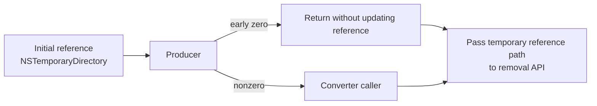

[日本語](SA-AE-EXPORT-002-temporary-output.md) | [English](SA-AE-EXPORT-002-temporary-output.en.md)

# SA-AE-EXPORT-002 — Temporary output and cleanup boundaries in mode 12

When the mode 12 producer returns zero early, the caller can **pass a directory path derived from `NSTemporaryDirectory` to the removal API**. It performs cleanup even after zero and rereads the mutable temporary CFileRef immediately before removal. This is a statically observed removal-request path; no actual directory deletion was observed.



The requested and temporary paths occupy separate locals, and lower-level blocks may participate in later CFileRef updates. The evidence does not prove that every return path targets only a temporary file. **Do not admit mode 12 to product capabilities or live testing.** Every finding has `runtime_verified=false`. This note supplies no new authorization to send events or connect.

## Target and evidence

| Item | Details |
|---|---|
| Date | 2026-10-02, Asia/Tokyo |
| Baseline | Logic Pro Creator Studio 12.3.1 / build 6682, `Logic.framework` thin ARM64 |
| Executable SHA-256 | `2f141e1a1f7b90a4fb0205ffec3dbe187baf601d20e9acb398acfadcdf050998` |
| Ghidra program / language | `Logic.arm64` / `AARCH64:LE:64:AppleSilicon` |
| Addresses | Image addresses before the slide in this baseline; not runtime pointers |
| Scope | Pointer and return boundaries in the mode 12 caller, `0x0037b858`, `0x00354128`, and lower helper `0x00377278` |
| Method and execution | Compare saved C and instructions from `-readOnly -noanalysis` output. No runtime Logic operations, events, or connections |

See [binary identity](SA-IDENTITY-001-binary-inputs.en.md), the [earlier mode record](SA-AE-MODES-001-text-operations.en.md), and the [follow-up manifest](appleevent-followup-analysis-manifest.json). The manifest preserves program identity and output/script hashes. Full decompilations and large instruction dumps remain local raw evidence.

| Local evidence | Purpose |
|---|---|
| `q-appleevent-modes-001-machinecode.txt` | Caller `0x017b201c` and common reply after `0x005912a0` |
| `q-appleevent-text-modes-001.c` | Caller control-flow aid; prototypes/aliases are not authoritative |
| `q-appleevent-export-paths-002.c`, `q-appleevent-export-paths-002-machinecode.txt` | Producer `0x0037b858` and converter `0x00354128` |
| `q-appleevent-export-lower-002.c`, `q-appleevent-export-lower-002-machinecode.txt` | Lower producer `0x00377278`; block bodies and wait/render callees remain unaudited |
| `q-appleevent-mode-strings-001.txt` | CFString `0x023469a8` is `aac`, length 3 |

## 1. Caller locals and call ABI

Here `sp` denotes the local frame of `FUN_017b201c`. It loads the selection field at song `+0xd8` as signed 16-bit; `-1` exits without production or cleanup (`0x017b2058..0x017b2060`). Otherwise it constructs two separate references.

| Local | Initialization and role |
|---|---|
| `sp+0x80` | Requested `sPpn` through `fileURLWithPath:` and the CFileRef constructor (`0x017b2064..0x017b2088`). The caller reads the requested path from this local |
| `sp+0x18` | `NSTemporaryDirectory → fileURLWithPath: → CFileRef` (`0x017b209c..0x017b20c0`). Passed to production as a mutable pointer and reread during cleanup |
| `sp+0x10` | A 64-bit integer containing the selection field minus 1; passed to production by pointer (`0x017b20f8..0x017b2104`) |

At `0x017b211c → FUN_0037b858`, inputs are `x0=song`, `w1=song+0x10`, `x2=&track integer`, `x3=&temporary CFileRef`, `x4=x5=0`, `w6=0`, `x7=0x2200` or `0x40002200`, and zero for stack arguments 1 and 2. The requested CFileRef pointer is not passed here (`0x017b20cc..0x017b211c`). Operation names for the flags remain unresolved.

Only producer `w0!=0` enters conversion. The caller replaces the requested path extension with `aac`, then calls `0x017b2180 → FUN_00354128` with `x0=that NSString`, `x1=&temporary CFileRef`, **`x2=the return from CFileRef::None()`**, `w3=0`, and `x4..x7=0` (`0x017b2124..0x017b2180`). The C alias suggesting that the third argument is also the destination string is inaccurate.

## 2. Producer ownership boundaries

`FUN_0037b858` saves caller `x3` at its own `sp+0x80` (`0x0037b88c`). Uses of that local occur in a lower call's stack argument and a later CFileRef assignment.

| Path | Pointer handling confirmed by instructions |
|---|---|
| Early zero return | Guards for song type, folder-selector resolution, bounds, target pointer, and target `+0x30` bit 0 branch to `0x0037c9fc` (`0x0037c8b8..0x0037c994`). `w20=0 → cleanup → and w0,w20,1 → return` (`0x0037c9fc..0x0037ca80`), bypassing the lower call and later assignment |
| Lower call | `ldp x10,x8,[sp,+0x78]` retrieves the saved pointer and places it in the **first stack argument** to `FUN_00377278` (`0x0037d5b4..0x0037d5d4`); it is distinct from register `x3` |
| Later assignment | Tests the first output-vector CFileRef with `IsFile`; if nonzero, calls `operator=` with `x0=caller temporary CFileRef`, `x1=that output CFileRef` (`0x0037ecfc..0x0037ed18`). Empty-vector paths or `IsFile=0` bypass this assignment |
| Normal result | The shared return masks `w20 & 1`; the later path also inverts a byte state (`0x0037f210`). This bit alone does not prove a completed file |

The prefix also calls song/context preparation helpers. Do not interpret early zero as leaving all song and file state unchanged. This audit follows explicit temporary-reference transfers and their effect on the cleanup target.

## 3. Lower producer findings and remaining frontier

`FUN_00377278` loads the first stack argument from `[x29,+0x10]` into `x25` (`0x0037752c`). This is the caller's temporary CFileRef pointer. It captures the pointer in block `FUN_003795a4` and passes that block to `FUN_003642d8` (`0x00377558..0x003775e8`, capture at block offset `+0x50`). Later blocks also capture this pointer.

The same helper's `CFileRef::operator=`, `IsFolder`, addition of `Audio Files`, directory creation, and parent navigation (`0x003774c4..0x00377528`) target **a separate local at `sp+0x330`**. They do not directly prove that the caller's temporary reference changes from directory to file.

The lower helper has zero-return paths for target-resolution/type guards and count/error checks. Its result is not established as the CFileRef pointer shown by C: one path loads a candidate 32-bit count into `w20` and returns it in `x0` (`0x00377da8..0x00377dbc`, `0x003778e8`). Avoid ownership conclusions based on variable names.

**Unresolved:** Bodies of captured blocks `0x003795a4`, `0x003798fc`, `0x00379988`, `0x00379b74`, `0x00379c64`, execution boundary `0x003642d8`, and `0x00368cbc`. Calling `0x00368cbc` a candidate render helper is a **Hypothesis, confidence: low**. The final temporary path after lower processing, pointer updates on every failure path, and synchronous production completion remain unresolved. Blocks or progress labels alone establish neither asynchronous nor synchronous execution.

## 4. Path that submits a directory to cleanup

The confirmed early path follows this order:

```text
temporary CFileRef := URL derived from NSTemporaryDirectory
producer: guard failure -> w0 = 0; bypass lower call / later file assignment
caller 017b2120: cbz w0 -> 017b219c
017b21bc: CopyFileSystemPath(&temporary, 0)
017b21d0: removeItemAtPath:error:(copiedPath, nil)
```

Caller removal is reached even without conversion (`0x017b219c..0x017b21d0`). This caller has no preceding guard for `IsFile`, containment within a temporary area, inequality with the requested path, or a generated-file identity. It does not branch on the removal result and proceeds to releases/destructors (`0x017b21d4..0x017b21f0`).

The assumption that cleanup targets only the generated temporary file is therefore unsupported. **A directory-path removal request is statically reachable; actual deletion, OS failure reasons, and impact remain unobserved.** Do not send this mode to test the finding.

## 5. Converter writes, completion, and errors

`FUN_00354128` constructs a local `CAudioFileIO` from the temporary CFileRef (`0x003541a8..0x003541b4`). It uses `x2` as an optional second input through `IsValid`/`Open` (`0x00354584..0x0035459c`). It retains the requested destination as a separate NSString.

When global `0x025ce23c == 0x63616666`, it replaces the retained destination's extension with CFString `0x0233eaa8` (`0x003547ac..0x00354808`). It derives a working basename from `NSUUID::UUIDString`, removes its extension, appends CFString `0x02343808`, and joins it to the destination's parent directory (`0x0035481c..0x003548a4`). These two CFString payloads were not checked in this pass. The caller's `.aac` argument alone does not guarantee that the final basename or extension matches the requested string.

| Operation | Confirmed instruction boundary and limits |
|---|---|
| Destination removal before writing | The ordinary conversion path passes the requested NSString to `removeItemAtPath:error:` (`0x00354554..0x00354560`), before converter creation or packet writes. It does not branch on BOOL. Early guard exits bypass this call |
| Inline conversion loop | Passes callback `0x00355640` to `AudioConverterFillComplexBuffer` (`0x00354f34..0x00354f54`). After `AudioFileWritePackets`, zero returns to the loop (`0x00355068..0x00355090`). Buffer processing and packet writes execute in this call frame |
| Close and move | After `AudioFileClose` (`0x00354a54..0x00354a60`), the zero-status branch joins a temporary basename to the requested directory and calls `moveItemAtPath:toPath:error:` (`0x00354af8..0x00354b48`). A false move result sets return status `-48` (`0x00354b7c..0x00354b84`) |
| Error handling | Nonzero status calls removal for the working path (`0x00354a68..0x00354abc`). Early status examples include `-43`/`-50`/`-41`. The shared return moves `x25` into `x0` (`0x00354c60`); C's double-pointer result type is not authoritative |
| Higher-rate path | The `>48000` branch uses local input copies and a `tmp` extension, calls `FUN_0048fd94 → FUN_00491c18`, recursively calls this converter, then deletes local copies (`0x00354440..0x003546dc`). Lower-level units and wait/completion behavior remain unaudited |

This shows that the converter's main loop executes before return. It does not prove completion of every asynchronous production task or a completed file available for readback. The `aac` extension, display labels, and format fourCCs alone do not establish the actual codec, storage format, or audio range.

The mode 12 caller ignores converter status, releases objects, and enters cleanup (`0x017b2180..0x017b219c`). The common handler produces a zero reply independently of helper status (`0x005912a0..0x005912bc`). **The reply cannot verify conversion errors, destination-removal failure, final-removal failure, completion, overwrite, or scope.**

## 6. Next bounded checks and admission gate

1. Limit the next pass to captured blocks and `FUN_003642d8`; tabulate every caller temporary-pointer write, basename/directory decision, and final path on zero/nonzero returns.
2. Trace render completion, waits, callbacks, and error returns in `FUN_00368cbc` and higher-rate helpers `FUN_0048fd94`/`FUN_00491c18`.
3. Design static ownership checks, target restrictions, and independent completion readback. Keep mode 12 excluded from product and live testing until every success, failure, and overwrite path can be explained as targeting only temporary generated output.

This note claims no pure read-only API, Undo behavior, or retry safety. Do not substitute static inference for experimentally verified success.
