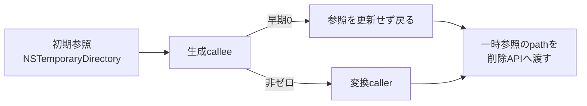

[日本語](SA-AE-EXPORT-002-temporary-output.md) | [English](SA-AE-EXPORT-002-temporary-output.en.md)

# SA-AE-EXPORT-002 — mode 12 の一時出力とcleanup境界

mode 12 の生成calleeが早期に0を返す経路では、callerが **`NSTemporaryDirectory`由来のdirectory pathを削除APIへ渡し得る**。返値0でもcleanupを省略せず、削除直前にmutableな一時CFileRefのpathを読み直すためである。これは静的に確認した削除要求の経路であり、実際にdirectoryが削除されたという観測ではない。



要求先pathと一時pathは別のlocalで、生成後のCFileRef書き換えには下位blockも関与し得る。すべての返却経路で一時ファイルだけが対象になるとは証明できない。**mode 12 を製品capabilityやlive試験へ進めない**。全行`runtime_verified=false`。本記録は新たなイベント送信や接続の許可を与えない。

## 対象と証拠

| 項目 | 内容 |
|---|---|
| 調査日 | 2026-10-02、Asia/Tokyo |
| 基準 | Logic Pro Creator Studio 12.3.1 / build 6682、`Logic.framework` thin ARM64 |
| Executable SHA-256 | `2f141e1a1f7b90a4fb0205ffec3dbe187baf601d20e9acb398acfadcdf050998` |
| Ghidra program / language | `Logic.arm64` / `AARCH64:LE:64:AppleSilicon` |
| アドレス | 基準イメージのslide前アドレス。実行時pointerではない |
| 今回の範囲 | mode 12 caller、`0x0037b858`、`0x00354128`、下位`0x00377278`のpointerと返却境界 |
| 方法・実行 | 保存済み`-readOnly -noanalysis`出力のCと命令を照合。Logicの実行時操作・送信・接続なし |

[バイナリ識別](SA-IDENTITY-001-binary-inputs.md)、[先行mode記録](SA-AE-MODES-001-text-operations.md)、[follow-up manifest](appleevent-followup-analysis-manifest.json)を参照。manifestはprogram identity、出力とscriptのhashを保持する。全decompile・大量の機械語はローカルrawだけに置く。

| ローカル根拠 | 用途 |
|---|---|
| `q-appleevent-modes-001-machinecode.txt` | `0x017b201c` callerと`0x005912a0`の共通返信 |
| `q-appleevent-text-modes-001.c` | callerの制御フロー補助。prototype/aliasを優先しない |
| `q-appleevent-export-paths-002.c`、`q-appleevent-export-paths-002-machinecode.txt` | 生成callee `0x0037b858`、変換callee `0x00354128` |
| `q-appleevent-export-lower-002.c`、`q-appleevent-export-lower-002-machinecode.txt` | 下位生成 `0x00377278`。block本体・wait/render calleeは今回未監査 |
| `q-appleevent-mode-strings-001.txt` | CFString `0x023469a8`が`aac`、length 3である根拠 |

## 1. callerのlocalと呼出しABI

以下の`sp`は`FUN_017b201c`のlocal frame。songの選択フィールド`+0xd8`をsigned16で読み、`-1`なら生成もcleanupもせず退出する（`0x017b2058..0x017b2060`）。それ以外は次の2つを作る。

| local | 初期化と用途 |
|---|---|
| `sp+0x80` | 要求`sPpn`から`fileURLWithPath:`、CFileRef constructor（`0x017b2064..0x017b2088`）。要求先pathを読むだけのcaller側local |
| `sp+0x18` | `NSTemporaryDirectory → fileURLWithPath: → CFileRef`（`0x017b209c..0x017b20c0`）。生成へmutable pointerを渡し、cleanupで読み直すlocal |
| `sp+0x10` | 選択フィールドminus 1の64-bit整数。生成へpointerを渡す（`0x017b20f8..0x017b2104`） |

`0x017b211c → FUN_0037b858`は`x0=song`、`w1=song+0x10`、`x2=&track整数`、`x3=&一時CFileRef`、`x4=x5=0`、`w6=0`、`x7=0x2200`または`0x40002200`、stack引数1・2は0。要求先CFileRefのpointerをここへ渡していない（`0x017b20cc..0x017b211c`）。flagsの操作名は未確定。

生成の`w0!=0`だけで変換へ進む。要求先pathの拡張子を除去して`aac`を付け、`0x017b2180 → FUN_00354128`へ`x0=そのNSString`、`x1=&一時CFileRef`、**`x2=CFileRef::None()`の返値**、`w3=0`、`x4..x7=0`を渡す（`0x017b2124..0x017b2180`）。Cのaliasに見える「第3引数も要求先文字列」は不正確。

## 2. 生成calleeの所有境界

`FUN_0037b858`はcallerの`x3`を自身の`sp+0x80`へ保存する（`0x0037b88c`）。同localの使用は、下位callへのstack引数と後半のCFileRef代入に現れる。

| 経路 | 命令で確認したpointerの扱い |
|---|---|
| 早期0返却 | songの種別、folder selectorの解決、範囲、対象pointer、対象`+0x30`のbit0などのguardが`0x0037c9fc`へ分岐する（`0x0037c8b8..0x0037c994`）。`w20=0`→cleanup→`and w0,w20,1`→return（`0x0037c9fc..0x0037ca80`）。下位callと後半代入を通らない |
| 下位へ渡す | `ldp x10,x8,[sp,+0x78]`で保存したpointerを読み、**第1stack引数**へ置いて`FUN_00377278`を呼ぶ（`0x0037d5b4..0x0037d5d4`）。register `x3`の対象とは別 |
| 後半代入 | 出力候補vectorの先頭CFileRefを`IsFile`で調べ、非ゼロなら`x0=callerの一時CFileRef`、`x1=その出力CFileRef`で`operator=`（`0x0037ecfc..0x0037ed18`）。vectorが空の経路やIsFileが0の経路ではこの代入をしない |
| 通常返値 | 共通returnは`w20 & 1`。後半にはbyte状態の反転もある（`0x0037f210`）。「非ゼロならファイル完成」をこのbitだけでは証明できない |

prefixにはsong/context準備calleeもある。早期0を「songもファイルも一切変更しない」とは扱わない。この調査が追ったのは、一時CFileRefの明示的な受け渡しとcleanup対象への影響である。

## 3. 下位生成calleeで分かったことと未解決点

`FUN_00377278`では最初のstack引数を`[x29,+0x10]`から`x25`へ読む（`0x0037752c`）。これがcallerの一時CFileRef pointerである。block `FUN_003795a4`のcaptureへ保存し、`FUN_003642d8`へ渡す（`0x00377558..0x003775e8`、block基準`+0x50`のcapture）。後続のblockにもこのpointerを保持する。

一方、同calleeの`CFileRef::operator=`、`IsFolder`、`Audio Files`追加、directory作成、親への移動（`0x003774c4..0x00377528`）は**別のlocal `sp+0x330`**をreceiverとする。これらをcallerの一時CFileRefがdirectoryからファイルへ変わる直接証拠として扱わない。

下位には対象解決失敗・type guard・count/error判定から0を返す経路がある。返値はCが示すCFileRef pointerではなく、最後に32-bit count候補を`w20`へ読み`x0`で返す経路もある（`0x00377da8..0x00377dbc`、`0x003778e8`）。変数名による所有権判定を避ける。

**未解決:** captured block `0x003795a4`、`0x003798fc`、`0x00379988`、`0x00379b74`、`0x00379c64`、実行境界`0x003642d8`、`0x00368cbc`の本体。`0x00368cbc`をrender候補とする呼称は**Hypothesis、確信度: 低**。下位処理後の最終一時path、全失敗経路のpointer更新、生成完了の同期性は確定していない。blockの存在や進捗labelだけで非同期・同期を決めない。

## 4. cleanupがdirectory pathを受け取る経路

確認した早期経路は次の順になる。

```text
temporary CFileRef := NSTemporaryDirectory由来のURL
producer: guard failure -> w0 = 0; lower call / late file assignmentを通らない
caller 017b2120: cbz w0 -> 017b219c
017b21bc: CopyFileSystemPath(&temporary, 0)
017b21d0: removeItemAtPath:error:(copiedPath, nil)
```

callerの削除呼出しは変換を通らなかった場合にも到達する（`0x017b219c..0x017b21d0`）。削除直前に`IsFile`、pathの一時領域内包含、要求先との相違、生成物IDを確認するguardはこのcallerにない。削除結果はbranchせずrelease/destructorへ進む（`0x017b21d4..0x017b21f0`）。

したがって「削除されるのは生成した一時ファイルだけ」という前提は成立しない。**directory pathへの削除要求は静的に到達可能、実際の削除・OS側の失敗理由・被害範囲は未観測**。検証のためにこのmodeを送信しない。

## 5. 変換側の書き込み・完了・error境界

`FUN_00354128`は一時CFileRefからlocal `CAudioFileIO`を作る（`0x003541a8..0x003541b4`）。`x2`はoptionalな別入力として`IsValid`/`Open`に使う（`0x00354584..0x0035459c`）。要求先は別のNSStringとして保持する。

保持した宛先は、global `0x025ce23c == 0x63616666`の場合に拡張子をCFString `0x0233eaa8`へ置き換える（`0x003547ac..0x00354808`）。作業basenameは`NSUUID::UUIDString`から拡張子を除去し、CFString `0x02343808`を付けて宛先のparent directoryへ結ぶ（`0x0035481c..0x003548a4`）。この2つのCFString本文は今回未照合。callerが`.aac`を渡すことだけで、最終basenameや拡張子が要求文字列と同じだとは保証しない。

| 処理 | 確認した命令境界と限界 |
|---|---|
| 要求先の事前削除 | 通常変換経路では、要求先NSStringを`removeItemAtPath:error:`へ渡す（`0x00354554..0x00354560`）。変換作成・packet書き込みより前。BOOLを分岐しない。早期guard退出ではこの呼出しを通らない |
| 同じ関数内の変換loop | `AudioConverterFillComplexBuffer`へcallback `0x00355640`を渡す（`0x00354f34..0x00354f54`）。`AudioFileWritePackets`後に返値0ならloopへ戻る（`0x00355068..0x00355090`）。buffer処理とpacket書き込みはこのcall frame内で進む |
| closeと移動 | `AudioFileClose`（`0x00354a54..0x00354a60`）後、statusが0のbranchは一時basenameを要求先directoryへ結び、`moveItemAtPath:toPath:error:`（`0x00354af8..0x00354b48`）。move falseなら返却statusを`-48`へする（`0x00354b7c..0x00354b84`） |
| error処理 | 非ゼロstatus側は作業pathの削除APIへ進む（`0x00354a68..0x00354abc`）。early status例は`-43`/`-50`/`-41`。共通returnで`x25`を`x0`へ移す（`0x00354c60`）。返値はCのdouble pointer型を採用しない |
| 高rate側 | `>48000`のbranchは入力のlocal copyと`tmp`拡張子を使い、`FUN_0048fd94 → FUN_00491c18`後に自身を再帰呼出しし、local copyの削除へ進む（`0x00354440..0x003546dc`）。下位処理の単位・wait/completionは未監査 |

これは変換の主loopが返却前に実行される証拠であり、生成側の非同期作業すべての完了や、readback可能な完成ファイルを証明するものではない。拡張子`aac`、表示label、formatのfourCCだけで実際のcodec・保存形式・音声範囲を確定しない。

mode 12 callerは変換返値を使わずreleaseしてcleanupへ進む（`0x017b2180..0x017b219c`）。共通handlerはhelper返値と独立して0返信を作る（`0x005912a0..0x005912bc`）。**変換error、事前削除失敗、最終削除失敗、完成・上書き・scopeをreplyから確認できない**。

## 6. 次の限定確認と到達gate

1. captured blockと`FUN_003642d8`を限定し、caller一時pointerへの全write、basename・directory決定、0/非ゼロ返却時の最終pathを表にする。
2. `FUN_00368cbc`と高rate経路`FUN_0048fd94`/`FUN_00491c18`で、render終了・wait・callback・errorの返却境界を追う。
3. 静的な所有境界の再検証、削除対象の限定方法、独立した完成readbackを設計する。成功・失敗・上書きの全経路で一時生成物だけを対象とすると説明できるまでは、mode 12の製品化・live試験gateを閉じたままにする。

本記録は純粋なread-only API、Undo、再試行の安全性を主張しない。実験結果の代わりに静的推定を成功判定へ使わない。
