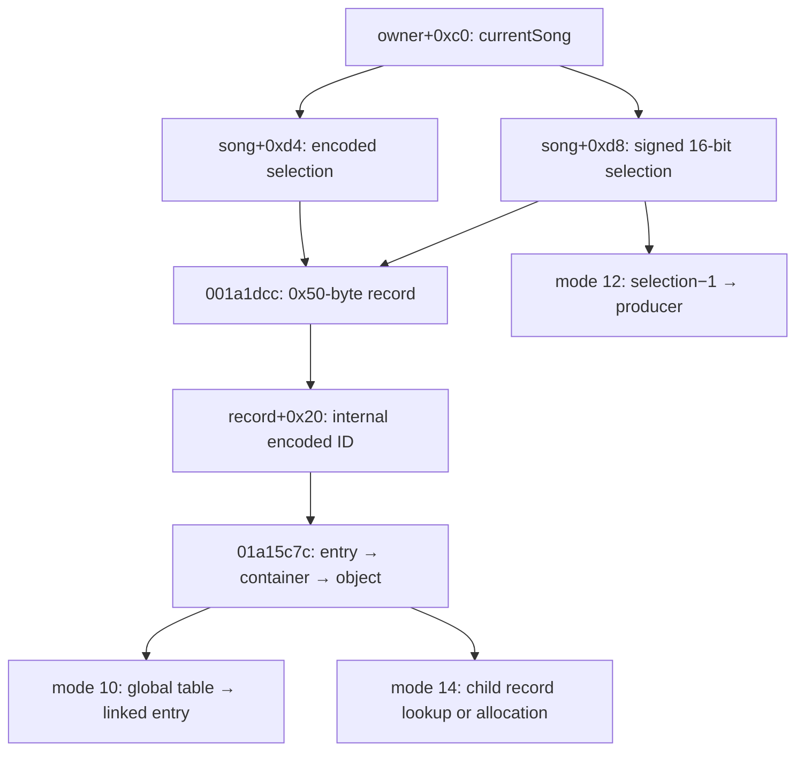

[日本語](SA-AE-TARGET-003-target-resolution.md) | [English](SA-AE-TARGET-003-target-resolution.en.md)

# SA-AE-TARGET-003 — Resolving AppleEvent selection fields to internal targets

Modes 7/8/9/10/14 use currentSong selection fields, but the selection values, 0x50-byte record, internal entry, container, and object are separate stages. Mode 12 takes a different path. This investigation establishes lookup inputs, bounds checks, fallback, and mutations. It does not establish an external ID that continues to identify the same entity after selection changes, or a contract preventing writes to stale targets. Every item has `runtime_verified=false` and `product_capability=false`.

The arrows represent statically observed data flow. The internal ID in this diagram, XML `id`, and MCU/Remote `gindex` / `instID` are not established as the same namespace. This report supplements [MODES-001](SA-AE-MODES-001-text-operations.en.md), [FILE-001](SA-AE-FILE-001-file-region.en.md), and [XML-002](SA-AE-XML-002-channel-node-schema.en.md).

## Profile and evidence

| Item | Value |
|---|---|
| Date / target | 2026-10-02; Logic Pro Creator Studio 12.3.1 / build 6682; thin ARM64 `Logic.framework` |
| Executable SHA-256 | `2f141e1a1f7b90a4fb0205ffec3dbe187baf601d20e9acb398acfadcdf050998` |
| Program / addresses | `Logic.arm64` / `AARCH64:LE:64:AppleSilicon`, image base 0. Addresses are unslid image addresses, not runtime pointers |
| Method | Bounded headless `-readOnly -noanalysis` output from the saved program, checked against ARM64 instructions, call ABI, branches, and stores. Identity and instruction scripts guard the saved program name and SHA. Decompiled types and variable names alone do not establish semantics |
| Runtime scope | No AppleEvent sends, Logic connections or runtime actions, or product code changes. Target lifetime, UI representation, and persistence remain unverified |

Existing output provenance is recorded in the [mode manifest](appleevent-mode-analysis-manifest.json) / [followup manifest](appleevent-followup-analysis-manifest.json); new output is recorded in the [native boundaries manifest](appleevent-native-boundaries-manifest.json). The new identity matches the SHA above with `expected_name_and_hash_match=true`; its log completed normally. Raw evidence is stored locally and excluded from Git.

| Local evidence filename | Checked scope |
|---|---|
| `q-appleevent-modes-001-machinecode.txt`, `q-appleevent-text-modes-001.c` | Handler and mode 7/8/9/10/12/14 inputs and callers |
| `q-appleevent-modes-callees-001-machinecode.txt`, `q-appleevent-object-resolvers-001.c` | `0x001a1dcc`, `0x01a15c7c`, and the mode 8 generator |
| `q-appleevent-xml-block-001-machinecode.txt` | Mode 8 encoded index, filter, and iterator stores |
| `q-appleevent-native-targets-003.c`, `q-appleevent-native-targets-003-machinecode.txt`, `.identity.json`, `.log` | Four newly exported functions; inventory byte sizes appear below |
| `q-appleevent-target-jumptable-003.txt`, `q-appleevent-time-adoption-callees-003.log` | Type jump-table bytes guarded against the same SHA, and output log |
| [appleevent-target-resolution.tsv](../protocol/appleevent-target-resolution.tsv) | Six statically observed mode paths; not runtime results or a public ID mapping |

## 1. The two primary resolvers

`R1=0x001a1dcc` (296 bytes) takes `x0=song, w1=selection32, w2=selection16`. It requires song magic `0xabc04723` / `0xabc04713` and signed `selection16>=1` (`0x001a1dcc..0x001a1df8`). Ordinary selection32 values require `(value & 0x80000003)==0` and use `value>>2` to select from the pointer array `song+0x788 → +0x228/+0x230`.

| R1 alternative path | Observed representation and guards |
|---|---|
| `0x7ffffffc` | song `+0x759 & 0x12` is zero; first pointer in the nonempty `+0x318/+0x320` range |
| `0x7ffffff8` | Same flag guard; byte difference of that range is at least `0x11`; pointer at start `+0x10` |
| Selected container → record | Non-null, bit 0 of uint16 `+0x30` clear. Returns record `(selection16 & 0x7fff)-1` in the stride `0x50` range `+0x330/+0x338`. A failed guard returns null (`0x001a1e94..0x001a1ef0`) |

`R2=0x01a15c7c` (308 bytes) takes `x0=song, w1=internal ID, x2=optional out-container pointer`. It uses the same song magic and a different array, `song+0x788 → +0x1e0/+0x1e8`. Ordinary values use `ID>>2`. Incompatible upper / low two bits, an out-of-range index, or a null requested pointer instead **fall back to the first entry of the nonempty array** (`0x01a15c84..0x01a15cfc`). Invalid IDs do not invariably fail closed.

It checks entry byte `+0x69==0x11` and signed byte `v=+0x335<13`, choosing base `0x20` for `v<=9`, otherwise `0x50`. If `base+4v` is nonnegative and in range, its right shift by 2 selects a container from the `+0x150/+0x158` pointer array (`0x01a15d00..0x01a15d7c`). The entry's signed short `+0x320` then selects an object from container `+0x50/+0x58`.

The out parameter has two failure contracts. Early failure clears both return and out (`0x01a15d18..0x01a15d24`). After storing the container at `0x01a15d84`, an invalid inner index reaches the null return at `0x01a15da8` without clearing out. Thus a null return can coexist with a non-null out container. The out value alone does not establish successful object resolution.

## 2. Scope and mapping by mode

Handler `0x00590e30` reads global owner `0x0276de68` and `owner+0xc0`, then passes currentSong and text to the helper. Targets are derived from the internal fields below. There is no evidence here that `sPpn` is an external target ID.

| Mode | Target path and call anchors | Established scope limits |
|---:|---|---|
| 7 | d8/d4 → R1 (`0x017af4d4..0x017af4e4`) → record `+0x20` (`0x017af4ec`). Two local pointers go to `loadSettingFromURL:…intoTrack:withGinst:…` (`0x017af5cc`) | The intoTrack local maps d8 -1/0 to -1, otherwise d8−1. The withGinst local starts as record+20. Folder `song+0x10` and songID `+0x860` are separate arguments. Selector names do not establish equality with Remote IDs |
| 8 | Inline d4 container lookup → R1 (`0x017b1da0`) → generator (`0x017b1db0`). Record+20 feeds a single-object R2 path or the iterator filter | The callback compares entry+30 or +48 with the ID. The iterator stores its encoded index to entry+30 first. Multiple nodes may be generated; a one-to-one selected-record / XML-node mapping is unproven |
| 9 | Inline d4 container lookup → R1 (`0x017afe98`) → `createFileChecksForTrack:inSong:inSeqID:` (`0x017afeb0`) | Actual x2 is the R1 record pointer, x3 the song, x4 the container pointer. The selector spelling does not make inSeqID a numeric public ID |
| 10 | d4/d8 → R1 → record+20 → R2 (`0x017b1ecc..0x017b1ee0`) → two lookups below → linked entry | Depends on object type and indices. This is not established as an input/output API for UI plugin-slot numbers |
| 12 | Signed d8 (`0x017b2058`) equal to -1 exits. The d8−1 local and `song+0x10` go to producer `0x0037b858` (`0x017b20f4..0x017b211c`) | This helper does not use d4 / R1 / record+20 / R2. Final producer target and completion are separate frontiers. Excluded from runtime tests and product capabilities because of the directory-deletion request documented in [EXPORT-002](SA-AE-EXPORT-002-temporary-output.en.md) |
| 14 | d4/d8 → R1 → positive record+20 → R2 (`0x017b1a00..0x017b1a30`). R2 resolves the same ID again (`0x017b1b1c`) → `0x0022cadc` (`0x017b1b30`) → `0x0022c914` (`0x017b1b70`) | Initial object/container are also passed to the final `0x002bfdb0` (`0x017b1b90`). This caller shows no comparison between the two resolution results |

FILE-001's `sPtn` is an ordinal transformed through a predicate; XML Plugin `id` comes from child `+0xbc`, and Parameter `id` is a loop index. Similar numeric values do not unify those representations with selection fields or record+20.

## 3. Additional lookups and mutations in modes 10/14

| Function / size | Instruction-confirmed behavior |
|---|---|
| `0x002c8a10`, 372 bytes | Returns global `0x0261c5e8 + signed32(index)*0x1a0` for unsigned index `<13`, otherwise null (`0x002c8a28..0x002c8a38`). An uninitialized guard at `0x0261db08` invokes `__cxa_guard_acquire`, 13 calls to `0x002c8b84`, atexit registration, and guard release (`0x002c8a58..0x002c8b68`). Lookup includes lazy initialization |
| `0x002c90cc`, 296 bytes | Null x0 or a negative signed index returns null. Low 16 bits of type select a jump table for `0x40..0x4d`. Mode 10 types `0x43` / `0x4b` are confirmed by the byte/branch calculation below. Concrete UI entity names remain unproven |
| `0x0022cadc`, 324 bytes | Checks object type bit6, type `!=0xc0`, and signed `+0x54>=1`. The sum of signed shorts `+0x4a/+0x4c/+0x4e/+0x50/+0x52` indexes object `+0x30/+0x38` and may return an existing child (`0x0022cafc..0x0022cb48`). Otherwise calls `operator.new(0xc4)`, performs initialization stores and conditional `CUUIDBase::Init`, then `0x01a18cd8(song,container,object,newRecord)` (`0x0022cb4c..0x0022cc04`). This is not merely a target getter. [TARGET-004](SA-AE-TARGET-004-child-path-mutation.en.md) supplements attachment and array ownership. Dirty / Undo behavior remains unaudited |
| `0x0022c914`, 288 bytes | Resolves the ID through R2 again (`0x0022c940`), requiring a non-null child through the same type/count/sum-index path. Copies input x2 CFileRef into a local, resolves symlinks, obtains GetPath, calls `0x003e99e4`, and stores the low 16 bits of w0 to child `+0xae` (`0x0022c9e8..0x0022c9f0`). It does not directly assign a CFileRef to the object. [TARGET-004](SA-AE-TARGET-004-child-path-mutation.en.md) establishes a directory-derived CRC16, superseding the earlier registration/lookup Hypothesis |

Mode 10 requires `(object.type & ~8)==0x43` and uint16 `object+0x48<=0x0c` (**decimal 12**), passing the latter to `0x002c8a10`, and type plus signed short `k=object+2` to `0x002c90cc` (`0x017b1ee8..0x017b1f20`). Jump table `0x01cb04ee` index 3 (type `0x43`) contains byte `0x0a`, and index 11 (type `0x4b`) contains `0x09`. Branch base `0x002c9104 + byte*4` gives `0x002c912c` / `0x002c9128`; only the latter shifts k left by 1 first. The resulting index is checked against signed count `table+0xee`; a non-null base pointer `table+0x48` supplies a stride `0x3c0` record (`0x002c9128..0x002c9140`, `0x002c919c..0x002c91a4`).

The returned record offset is `+0xe8` when mask `0x8` of the saved type is clear, otherwise `+0xf0`. Its `+0x28` linked list supplies the first entry with `entry+0x10==0` to preset loader `0x004b2a08` (`0x017b1f28..0x017b1f94`). This path selects the first matching internal entry; it does not expose an arbitrary UI-slot selector.

Mode 14 first copies/fixes the directory name into the record and writes `+0xae=0` (`0x017b1b44..0x017b1b60`). Subsequent `0x0022c914` can overwrite that field with the low 16 bits derived from the path. Names, paths, and an internal reference are connected here, but this does not justify naming the field a public file ID or sample ID.

## 4. Snapshot and stale-write limits

- **Dependence on current state:** The handler obtains currentSong; helpers later read d4/d8 separately. Modes 8/9 consult the table in both inline lookup and R1, and mode 14 resolves a fixed ID several times. Atomic capture of the entire target selection is unproven.
- **Lookup success versus identity:** Bounds checks examine the range during that lookup. They do not prove the same entity or generation as an earlier observation. R2 fallback can also direct an invalid value to another entry.
- **Pointer lifetime:** The reviewed entry points and resolvers show no document revision, generation, caller-supplied target token, or object-retain-based snapshot contract. Thread/queue contracts and lower functions remain unaudited. No actual race or wrong-target write was observed.
- **Mutations and verification:** Mode 8 cache/entry stores, mode 10 lazy initialization, and mode 14 allocation / UUID initialization / record stores are included. `sPer=0` does not establish target identity, freshness, operation success, or readback.

**Proposed contract, not an existing capability:** A future target snapshot would keep the binary profile, process/document epoch, raw selection values, and evidence of resolved identity as separate fields, then recheck before writing. An unresolved match would not become an executable target. The ability to obtain a suitable epoch and stable identity remains unverified.

## 5. Finite follow-up gates

| Gate | Bounded scope | Acceptance condition |
|---|---|---|
| T1: lower lookup mutations | `0x002c8b84` (132 B), `0x01a18cd8` (356 B), `0x003e99e4` (344 B), filename helper `0x0022cc34` (180 B) | [TARGET-004](SA-AE-TARGET-004-child-path-mutation.en.md) records initialization, array insertion, ownership transfer, names, and directory CRC. Remaining owner virtual / container lower calls and wrapper coverage follow its bounded frontier |
| T2: identity mapping | AE selection, record+20, XML id, and MCU/Remote IDs investigated by the user's PLAN-08 work | Keep scope, namespace, and generation separate. Names or equal numbers alone do not establish a mapping |
| T3: future freshness validation | Defined session-authorized experiments using only `LogicCLI-Test.logicx` | Change one condition at a time across multiple targets; compare selection changes, additions/removals, and song switches with before/after evidence and independent readback. Preserve mode 12 / 14 exclusion and the PLAN-05 connection gate. This report grants no send/connection authorization |

Without runtime mapping, freshness, and readback, the current target snapshot cannot be published as a reliable agent write capability.
