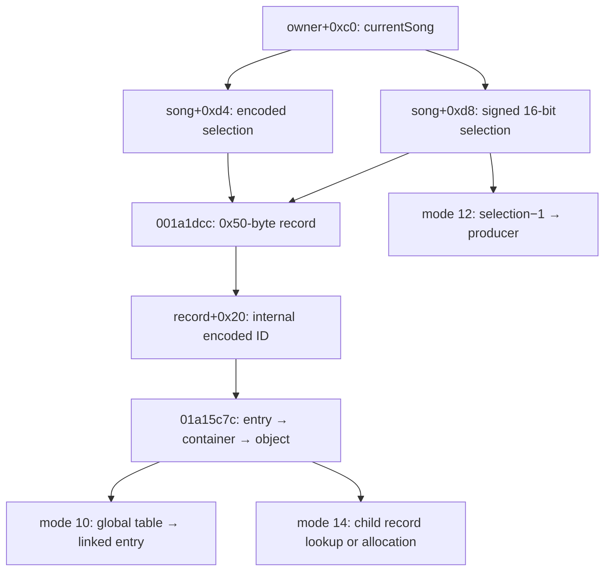

[日本語](SA-AE-TARGET-003-target-resolution.md) | [English](SA-AE-TARGET-003-target-resolution.en.md)

# SA-AE-TARGET-003 — AppleEvent の選択値から内部対象を解決する境界

mode 7/8/9/10/14 は currentSong の選択フィールドを使いますが、選択値、0x50 バイトレコード、内部 entry、container、object は別の段階です。mode 12 は別経路です。今回確認したのは各 lookup の入力・範囲検査・fallback・変更であり、選択が変わっても同じ対象を指す外部 ID や、古い対象への書き込みを防ぐ契約ではありません。全項目 `runtime_verified=false`、`product_capability=false` です。

矢印は静的に確認したデータの流れです。図の internal ID、XML の `id`、MCU/Remote の `gindex` / `instID` を同一視しません。[MODES-001](SA-AE-MODES-001-text-operations.md)、[FILE-001](SA-AE-FILE-001-file-region.md)、[XML-002](SA-AE-XML-002-channel-node-schema.md) の補足として読みます。

## 対象と証拠

| 項目 | 内容 |
|---|---|
| 日付・対象 | 2026-10-02、Logic Pro Creator Studio 12.3.1 / build 6682、thin ARM64 `Logic.framework` |
| Executable SHA-256 | `2f141e1a1f7b90a4fb0205ffec3dbe187baf601d20e9acb398acfadcdf050998` |
| program / address | `Logic.arm64` / `AARCH64:LE:64:AppleSilicon`、image base 0。スライド前アドレスであり実行時 pointer ではない |
| 方法 | 保存済み program への headless `-readOnly -noanalysis` 限定出力を、ARM64 命令・call ABI・分岐・store と照合。identity と命令 script は program 名・保存済み SHA を guard。C の推定型・変数名だけで意味を確定しない |
| 実行範囲 | AppleEvent 送信、Logic 接続・実機操作、製品コード変更なし。対象の lifetime・UI 表示・永続化は未検証 |

既存出力の provenance は [mode manifest](appleevent-mode-analysis-manifest.json) / [followup manifest](appleevent-followup-analysis-manifest.json)、新規出力は [native boundaries manifest](appleevent-native-boundaries-manifest.json)。新規 identity は上記 SHA と `expected_name_and_hash_match=true`、log は正常終了を示します。raw はローカル保存・Git 対象外です。

| ローカル証拠ファイル | 照合した範囲 |
|---|---|
| `q-appleevent-modes-001-machinecode.txt`、`q-appleevent-text-modes-001.c` | handler、mode 7/8/9/10/12/14 の入力と caller |
| `q-appleevent-modes-callees-001-machinecode.txt`、`q-appleevent-object-resolvers-001.c` | `0x001a1dcc`、`0x01a15c7c`、mode 8 generator |
| `q-appleevent-xml-block-001-machinecode.txt` | mode 8 の encoded index、filter と iterator store |
| `q-appleevent-native-targets-003.c`、`q-appleevent-native-targets-003-machinecode.txt`、`.identity.json`、`.log` | 新規 4 関数。inventory の byte size は下表 |
| `q-appleevent-target-jumptable-003.txt`、`q-appleevent-time-adoption-callees-003.log` | 同 SHA を guardした type jump table の byte と出力記録 |
| [appleevent-target-resolution.tsv](../protocol/appleevent-target-resolution.tsv) | 6 mode の静的な対応表。実行結果・公開 ID mapping の表ではない |

## 1. 二つの基本 resolver

`R1=0x001a1dcc`（296 bytes）は `x0=song, w1=selection32, w2=selection16`。song magic `0xabc04723` / `0xabc04713` と signed `selection16>=1` を要求します（`0x001a1dcc..0x001a1df8`）。通常の `selection32` は `(value & 0x80000003)==0` の場合に `value>>2` で `song+0x788 → +0x228/+0x230` の pointer 配列を選びます。

| R1 の別経路 | 確認した表現・guard |
|---|---|
| `0x7ffffffc` | song `+0x759 & 0x12` が 0、`+0x318/+0x320` の非空範囲の先頭 pointer |
| `0x7ffffff8` | 同じ flag guard、同範囲の byte 差が `0x11` 以上、先頭から `+0x10` の pointer |
| 選択 container → record | 非 null、uint16 `+0x30` の bit 0 が clear。`+0x330/+0x338` の stride `0x50` 範囲から `(selection16 & 0x7fff)-1` 番目を返す。guard 失敗は null（`0x001a1e94..0x001a1ef0`） |

`R2=0x01a15c7c`（308 bytes）は `x0=song, w1=internal ID, x2=任意の out-container pointer`。同じ song magic と、別配列 `song+0x788 → +0x1e0/+0x1e8` を使います。通常値は `ID>>2` で引きますが、上位 bit / 下位 2 bits が不適合、index が範囲外、または指定 pointer が null なら、**非空配列の先頭 entry へ fallback** します（`0x01a15c84..0x01a15cfc`）。無効 ID を常に拒否する resolver ではありません。

entry byte `+0x69==0x11`、signed byte `v=+0x335<13` を検査し、`v<=9` なら base `0x20`、それ以外は `0x50` を選びます。`base+4v` が非負で範囲内なら、右に 2 bit ずらして `+0x150/+0x158` の pointer 配列から container を得ます（`0x01a15d00..0x01a15d7c`）。続いて entry の signed short `+0x320` で container `+0x50/+0x58` の pointer 配列を引き object を返します。

out の契約には区別が必要です。前段失敗は return / out とも 0（`0x01a15d18..0x01a15d24`）。一方 `0x01a15d84` で container を out に保存した**後**、inner index の範囲外で `0x01a15da8` の return 0 へ進むため、null return と非 null out が共存し得ます。out だけで対象 object の解決成功とは判断しません。

## 2. mode ごとの scope と mapping

handler `0x00590e30` が global owner `0x0276de68` と `owner+0xc0` を使い、helper に currentSong と text を渡します。対象指定は下表の内部フィールドから読みます。`sPpn` を外部 target ID と扱う根拠はありません。

| mode | 対象経路と call anchor | 確認できた scope の限界 |
|---:|---|---|
| 7 | d8/d4 → R1（`0x017af4d4..0x017af4e4`）→ record `+0x20`（`0x017af4ec`）。`loadSettingFromURL:…intoTrack:withGinst:…`（`0x017af5cc`）に二つの local pointer | `intoTrack` local は d8 の -1/0 を -1、それ以外を d8−1。`withGinst` local の初期値は record+20。folder `song+0x10`、songID `+0x860` も別引数。selector 名だけで Remote ID と一致とはしない |
| 8 | d4 の inline container lookup → R1（`0x017b1da0`）→ generator（`0x017b1db0`）。record+20 を単一 object の R2 または iterator filter に使う | callback は entry+30 または +48 と ID を比較。iterator は entry+30 に encoded index を先に保存する。複数 node を生成し得るため、選択 record と XML node の 1 対 1 対応は未証明 |
| 9 | d4 の inline container lookup → R1（`0x017afe98`）→ `createFileChecksForTrack:inSong:inSeqID:`（`0x017afeb0`） | 実引数 x2 は R1 の record pointer、x3 は song、x4 は container pointer。`inSeqID:` が数値の公開 ID を受けるとは言えない |
| 10 | d4/d8 → R1 → record+20 → R2（`0x017b1ecc..0x017b1ee0`）→ 下記二つの lookup → linked entry | object の type と index に依存。UI の plugin slot 番号を入力・返却する入口とは未確認 |
| 12 | signed d8（`0x017b2058`）が -1 なら退出。d8−1 local と `song+0x10` を producer `0x0037b858` へ（`0x017b20f4..0x017b211c`） | この helper は d4 / R1 / record+20 / R2 を使わない。producer 内の最終対象・生成完了は別 frontier。[EXPORT-002](SA-AE-EXPORT-002-temporary-output.md) の directory 削除要求を理由に実行試験・製品機能から除外 |
| 14 | d4/d8 → R1 → 正値 record+20 → R2（`0x017b1a00..0x017b1a30`）。同 ID を R2 で再解決（`0x017b1b1c`）→ `0x0022cadc`（`0x017b1b30`）→ `0x0022c914`（`0x017b1b70`） | 初回 object/container を最後の `0x002bfdb0`（`0x017b1b90`）にも渡す。二回の解決結果を比較する命令はこの caller に見えない |

FILE-001 の `sPtn` は predicate を通す ordinal、XML の Plugin `id` は child `+0xbc`、Parameter `id` は loop index です。これらの表現と本記録の selection / record+20 を、数値が似ているだけで統合しません。

## 3. mode 10/14 の追加 lookup と変更

| 関数・サイズ | 命令で確認した処理 |
|---|---|
| `0x002c8a10`、372 bytes | global `0x0261c5e8 + signed32(index)*0x1a0` を返す。ただし unsigned index `<13`、それ以外は null（`0x002c8a28..0x002c8a38`）。guard `0x0261db08` が未初期化なら `__cxa_guard_acquire`、13 回の `0x002c8b84`、atexit 登録、guard release（`0x002c8a58..0x002c8b68`）。lookup に lazy initialization が含まれる |
| `0x002c90cc`、296 bytes | x0 が null または signed index が負なら null。type の下位16 bitsを `0x40..0x4d` の jump table に使う。mode 10 の type `0x43` / `0x4b` は下記の byte・branch 計算で確定。具体的な UI entity 名は未確定 |
| `0x0022cadc`、324 bytes | object の type bit6、type `!=0xc0`、signed `+0x54>=1` を検査。signed short `+0x4a/+0x4c/+0x4e/+0x50/+0x52` の合計を index とし、object `+0x30/+0x38` の pointer 配列から既存 child を返す（`0x0022cafc..0x0022cb48`）。失敗側は `operator.new(0xc4)`、初期化 store、条件付き `CUUIDBase::Init`、`0x01a18cd8(song,container,object,newRecord)`（`0x0022cb4c..0x0022cc04`）。対象探索だけの getter ではない。下位 call の attachment / dirty / Undo は未監査 |
| `0x0022c914`、288 bytes | ID を R2 で再解決（`0x0022c940`）、同じ type/count/sum-index で非 null child を要求。入力 x2 の CFileRef を local に copyし、symlink 解決 path、`GetPath`、`0x003e99e4` を経て、返値 w0 の下位16 bits を child `+0xae` に保存（`0x0022c9e8..0x0022c9f0`）。この本体は CFileRef の object への直接代入ではない。path の登録・lookup という意味は Hypothesis、確信度: 中 |

mode 10 は `(object.type & ~8)==0x43`、uint16 `object+0x48<=0x0c`（**十進12**）を要求し、後者を `0x002c8a10`、type と signed short `k=object+2` を `0x002c90cc` に渡します（`0x017b1ee8..0x017b1f20`）。jump table `0x01cb04ee` の index 3（type `0x43`）は byte `0x0a`、index 11（type `0x4b`）は `0x09`。branch base `0x002c9104 + byte*4` はそれぞれ `0x002c912c` / `0x002c9128`、後者だけ `k<<1` を先に行います。その index と signed count `table+0xee`、base pointer `table+0x48` を検査し、stride `0x3c0` で record を返す経路を確定しました（`0x002c9128..0x002c9140`、`0x002c919c..0x002c91a4`）。

返された record の offset は保存した type の mask `0x8` が clear なら `+0xe8`、set なら `+0xf0`。その `+0x28` の linked list から `entry+0x10==0` の最初の entry を preset loader `0x004b2a08` に渡します（`0x017b1f28..0x017b1f94`）。この経路で選ぶのは任意の UI slot ではなく、条件に合う最初の内部 entry です。

mode 14 は上記 record に directory 名を copy/fix して `+0xae=0` を先に保存します（`0x017b1b44..0x017b1b60`）。後続の `0x0022c914` は同 field に path 由来の下位16 bitsを上書きし得ます。名前・path・内部 reference が関係することは確認できますが、field を public file ID / sample ID と命名しません。

## 4. snapshot と古い対象への書き込みの限界

- **現在状態への依存:** handler は currentSong を得ますが、helper はその後に d4/d8 を別々に読む。mode 8/9 は inline lookup と R1 で表を再参照し、mode 14 は固定した ID を複数回解決する。対象選択全体が原子的に固定されるとは確認していません。
- **lookup の成功と同一性:** 範囲検査はその lookup の範囲を調べるもので、前の観測と同じ entity / 同じ世代である証明ではありません。R2 の fallback により、無効値が別 entry を指すこともあります。
- **pointer の lifetime:** 調査した入口・resolver に document revision、generation、caller supplied target token、object retain による snapshot 契約は見えません。thread / queue の契約と下位処理は未監査です。実際の race や誤書き込みを観測したという主張ではありません。
- **副作用と確認:** mode 8 の cache / entry store、mode 10 の lazy initialization、mode 14 の allocation / UUID 初期化 / record store を含みます。`sPer=0` は target の一致・freshness・実行成功・読み戻しを示しません。

**提案する契約（既存機能ではない）:** 将来の対象 snapshot は binary profile、process/document epoch、選択の生値、解決した対象の識別根拠を別 field で持ち、書き込み直前に再照合します。一致を確定できない場合は実行可能対象へ昇格しません。epoch・安定識別根拠を実際に取得できるかは未検証です。

## 5. 有限の次工程と受け入れ条件

| gate | 限定範囲 | 受け入れ条件 |
|---|---|---|
| T1: lookup の下位変更 | `0x002c8b84`（132 B）、`0x01a18cd8`（356 B）、`0x003e99e4`（344 B）、filename helper `0x0022cc34`（180 B） | initialization / child attachment / path 値の型と失敗を、store・返値・call ABI で表にする。engine 全体へ広げない |
| T2: identity の対応 | AE selection、record+20、XML id、ユーザーの PLAN-08 で調べる MCU/Remote ID | scope・namespace・世代を別々に保持。名称一致・同じ数値だけでは mapping を確定しない |
| T3: 将来の freshness 検証 | session で許可された定義済み実験と `LogicCLI-Test.logicx` のみ | 一条件ずつ複数対象で、選択変更・追加削除・song 切替の前後差分と独立 readbackを照合。mode 12 の実行除外と PLAN-05 の接続 gate を維持。本記録は送信・接続の許可を与えない |

runtime の対応・freshness・readback が無い現時点では、対象 snapshot を信頼できる agent write capability として公開できません。
