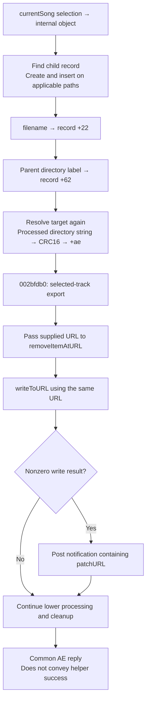

# SA-AE-TARGET-004: Child records, names, directory CRC, and mode 14 export

[日本語](SA-AE-TARGET-004-child-path-mutation.md) · [English](SA-AE-TARGET-004-child-path-mutation.en.md) · [Target resolution](SA-AE-TARGET-003-target-resolution.en.md)

**Mode 14 calls selected-track export after target metadata updates.** A lower function removes the supplied URL before writing it. Filename, directory label, and directory CRC are distinct representations, none established as a stable public target ID. This follow-up closes T1 through array insertion, ownership transfer, and path calculation; it adds no runtime experiment or product capability.

| Item | Value |
|---|---|
| Date / profile | 2026-10-03 JST, Logic Pro Creator Studio 12.3.1 / build 6682 |
| Logic / MACore | ARM64, unslid addresses. MACore addresses are explicitly identified below |
| Logic SHA-256 | `2f141e1a1f7b90a4fb0205ffec3dbe187baf601d20e9acb398acfadcdf050998` |
| MACore ARM64 SHA-256 | `99a4a9adbf79c92046682eb821d8ef35145f4915a29b88839c4f026ae63cd076` |
| Method / evidence | Ghidra `-noanalysis -readOnly`, ARM64, CFString, import symbols. [Manifest](appleevent-target-mutations-manifest.json), [binary identity](SA-IDENTITY-001-binary-inputs.en.md) |
| Runtime scope | No events, new connections, or preference changes. All [mapping rows](../protocol/appleevent-target-mutations.tsv) have `runtime_verified=false`, `product_capability=false` |

## 1. Flow

This diagram shows static calls and stores, not atomicity or success of the whole operation.

## 2. Child creation and ownership

When existing-child lookup does not succeed, `0x0022cadc` allocates `0xc4` bytes and initializes type `5`, index `0`. After `0x01a18cd8(song,container,object,newRecord)`, it returns the saved new record pointer (`0x0022cbf4..0x0022cc08`), rather than forwarding a lower status.

| Function | Confirmed updates and conditions |
|---|---|
| `0x01a18cd8`, 356 B | Insertion requires new child type bit 6 clear, parent bit 6 set, and parent type `!=0xc0`. If the old pointer matches the cell recomputed from its own type/index, clear that cell and call `0x01999088(old)` (`0x01a18dc0..0x01a18dd0`) |
| `0x019b289c`, 752 B | group=`child.type&0xf`; destination=`signed16 child.index + preceding signed16 group counts`. Parent `+0x30/+0x38/+0x40` are pointer-array begin/end/capacity. Supply null cells and grow storage as needed |
| Transfer in that function | **Clear the caller local at `0x019b2af0`**; retain child pointer in an inner local passed to `0x019b2b90`. If index is at least group count, conditionally save count=`index+1` as uint16 (`0x019b2b50..0x019b2b60`). Replacement can remove a following null cell |
| `0x019b2b90`, 472 B | Store the actual child pointer for spare-capacity append (`0x019b2c44`), middle insertion after memmove (`0x019b2cac`), or reallocation (`0x019b2cf0`). Update begin/end/capacity and return the insertion cell; do not clear the inner local |
| `0x01999088`, 736 B | Type-dispatched cleanup. Type 5 uses byte `0x76` at jump table `0x01cb7bd4+5`, branch base `0x019990fc + 4*0x76 = 0x019992d4`, then passes the original pointer to `operator.delete` at `0x019992e4`. Other types need not behave identically |

Normal transfer avoids the caller-local delete at `0x01a18df8..0x01a18e00`; this sequence does not establish an unconditional use-after-free. There are also returns without insertion for an inapplicable parent, so **a returned pointer alone does not prove attachment**. The meaning of owner `song+0x7c0` virtual slots `+0x18/+0x20` and the non-null-container call to `0x01a18254` remains unresolved.

For a new type 5 / index 0 child and valid parent with `+0x54==0`, one path inserts at the sum of the preceding five counts (`+0x4a/+0x4c/+0x4e/+0x50/+0x52`) and sets `+0x54` to 1. This is an internal group count. The object type is loaded before its null check (`0x01a18d20`, `0x01a18d24`), so this is not an API safely rejecting arbitrary inputs.

## 3. Three string / numeric representations

| Field | Input, capacity and stores |
|---|---|
| Filename at child `+0x22` | `0x0022cc34(song,ID,UTF8 pointer)`; clear 64 bytes, UTF8 copy capacity argument `63`, UTF8 repair (`0x0022cc88..0x0022cca8`) |
| Directory label at child `+0x62` | Mode 14 filesystem path → parent directory → lastPathComponent → replace `/` with empty string. Clear 64 bytes, copy capacity argument `64`, UTF8 repair (`0x017b1b3c..0x017b1b5c`) |
| Directory CRC at child `+0xae` | Filename / label updates first set 0. `0x0022c914` subsequently stores the path helper return as uint16 to a newly resolved child without testing numerical success (`0x0022c9e8..0x0022c9f0`) |

With both R2 object and out-container non-null, the filename helper **calls `0x0022cadc` before checking the name pointer** (`0x0022cc7c`, `0x0022cc80`). Return 0 for a null name does not guarantee absence of earlier changes; a non-null empty string follows the update path. It does not inspect copy length or lower results, and returns 1 after `0x019c9664(0x20)` and `0x00226400(song,ID,1)`. Mode 14 ignores that return.

`0x019c9664` uses lazy owner virtual slot `+0x48`, builds local type `0x127`, stores zero-extended input32 at record `+0x28`, and passes `&record` to `0x019c1044` (`0x019c96a8..0x019c96e4`). Consumer, queue, dirty state, Undo, and persistence are unaudited. Concrete UTF8 helper implementations are also unaudited; capacity arguments do not establish a character-count guarantee.

## 4. The path helper computes a directory CRC

`0x003e99e4` copies the input with `strlcpy` capacity `0x400`, then replaces the last `/` with NUL to remove the filename (`0x003e9a10..0x003e9a2c`). Null input or no slash returns 0. Truncation status is not checked.

If the path prefix obtained from `0x00575150(CFileRef,2)` matches, it uses the suffix; otherwise it tries numeric root `1`. For a root 1 match with prefix length at least 1, it replaces the byte immediately before the suffix with `~` and computes from there. Length 0 skips replacement (`0x003e9b24`, `0x003e9b28`). Other cases use the whole copied directory (`0x003e9a9c..0x003e9b34`). Prefix matching uses `strncmp(directory,root,strlen(root))` without a separate path-component boundary test in this body. **The meanings of numeric roots 2/1 remain unresolved.**

Logic import stub `_ECCRC16` at `0x01aee0cc` reaches **MACore** implementation `0x00052c8c`, 564 B. Confirmed arithmetic: initial `0xffff`, polynomial `0x1021`, bit 7→0 per byte, 16 zero-bit steps after termination, final `0xffff` mask (MACore `0x00052eb8`). No particular standard CRC variant name is asserted. Translating the empty-string arithmetic gives `0x1d0f`, distinct from the path helper's early 0; this is not a measurement from calling the actual function.

This supersedes the earlier path registration/lookup Hypothesis. Removing filenames and reducing to 16 bits means **the value alone cannot uniquely identify a file or target**. Initialization 0, early-return 0, and CRC results are not a common success/failure flag.

## 5. Mode 14 finishes with selected-track export

Mode 14 preserves its first object/container and ID for `0x002bfdb0`, passing `w5=0` (`0x017b1b78..0x017b1b90`). That branch calls **`exportSelectedTracksInSong:toURL:error:`** (`0x002bff18..0x002bff24`, static IMP `0x016328b4`, 1380 B). It differs from the nonzero branch using `exportChannelInSong:gindex:toURL:error:`; selector spelling `gindex` does not establish Remote ID equality.

The selected-track exporter rereads `song+0xd4` and its container, collecting candidates using bit 5 at `+0x14` in stride-`0x50` records. It excludes type bytes 5/12 at `+0x10` and uses lower hierarchy predicates. The complete schema and coverage of the wrapper-generation call (`0x01632c28`) remain unaudited. Its output set is not guaranteed to equal the single object used for name updates.

| Instructions | Output URL handling |
|---|---|
| `0x01632d20..0x01632d28` | Pass the saved URL to `NSFileManager.removeItemAtURL:error:` with nil error |
| `0x01632d2c..0x01632d34` | Proceed toward writing without checking removal result |
| `0x01632d38..0x01632d48` | `writeToURL:options:originalContentsURL:error:`, options 0, original nil, error nil. No branch here checks a non-null / completed wrapper |

This is a static remove-before-write boundary, not an observation of destination type, actual deletion, completion, recovery, or rollback. The exporter preserves and returns the write result, while `0x002bfdb0` uses a nonzero result to post the imported `MAUserPatchSavedNotification` symbol with a dictionary corresponding to `{"patchURL": URL}` (`0x002bff28..0x002bff90`). Key CFString `0x0233f828 → 0x01d6c149`, length 8, is verified; the notification name's actual string payload has not been read from its provider.

`0x002bfdb0` also temporarily removes some child pointers, repeatedly calls `0x002c048c`, and uses `0x01a18cd8` in restoration. Complete coverage, restoration during exceptions, and transitive effects remain unaudited. The write result is not conveyed through helper / AE caller as operation success; the common `sPer=0` in [MODES-001](SA-AE-MODES-001-text-operations.en.md) does not prove saving. With this remove/write boundary, mode 14 is not admitted to live tests or product capability in this milestone.

## 6. Initializer and reproducibility

Table initializer `0x002c8b84` (132 B) zeroes many fields and stores uint32 `+0x28=1`, uint32 `+0x120=0xffff`, raw32 `+0x190=0x3f800000`, self pointers `+0x140→+0x148` / `+0x158→+0x160`. Its body has no calls and does not establish external owner class or project/hardware identity. It is not described as clearing every byte unconditionally.

Fresh raw evidence comprises `q-appleevent-target-mutations-004`, `q-appleevent-target-ownership-004`, `q-appleevent-target-crc-004`, and `q-appleevent-target-export-data-004.txt`. The first two data attempts failed while reading an uninitialized import placeholder. Failed logs remain separate; PointerDataReport now checks 32-byte ranges and uninitialized blocks. The final run reads ordinary CFString / jump-table data, explicitly skips the placeholder, and completes C/ASM/data exports successfully. Failed jobs are not presented as successful evidence.

## 7. Bounded next steps

The 2026-10-05 follow-up is in [TARGET-005](SA-AE-TARGET-005-root-utf8-export-retry.en.md). It establishes numeric roots 1/2, UTF8 byte capacity, wrapper dispatch, index arithmetic and owner counters/mutex/notification. Exception ranges omitted from defined function bodies contain catch/retry and cleanup; LSDA mapping remains unresolved. The items below are retained as the next steps at this report's original date.

1. Inspect numeric roots `2/1` in `0x00575150` and concrete UTF8 copy behavior only as far as needed.
2. Trace wrapper-generation selector, `0x002c048c`, `0x01a18254`, and owner virtual slots `+0x18/+0x20`; separate output coverage, restoration of temporary changes, and notification order.
3. Independently establish stable target identity, pointer lifetime, epoch, readback, and reopening saved content. CRC, pointer, and `sPer=0` do not substitute for these.

Whole-operation atomicity, Undo, dirty flags, persistence, and transitive rollback remain unestablished. MCU experiments, Remote ID mapping, and PLAN-05 connection conditions remain separate from this static investigation.
