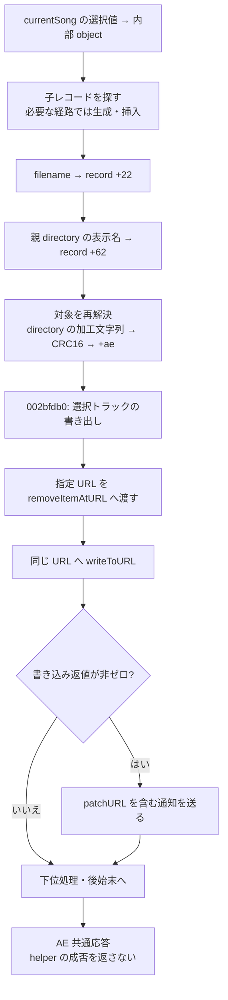

# SA-AE-TARGET-004: 子レコード・名前・directory CRC と mode 14 の書き出し

[日本語](SA-AE-TARGET-004-child-path-mutation.md) · [English](SA-AE-TARGET-004-child-path-mutation.en.md) · [対象解決](SA-AE-TARGET-003-target-resolution.md)

**mode 14 は対象の metadata 更新に続き、選択トラックの書き出しを呼びます。** 下位関数には、指定 URL を削除してから書き込む経路があります。名前・directory label・directory CRC は別の表現で、いずれも安定した公開 target ID として扱えません。前回の T1 を配列挿入・所有権移動・path 算出まで追いましたが、実機実験・製品 capability の追加は行っていません。

| 項目 | 内容 |
|---|---|
| 日付・profile | 2026-10-03 JST、Logic Pro Creator Studio 12.3.1 / build 6682 |
| Logic / MACore | ARM64、slide 前アドレス。MACore のアドレスには本文で image 名を付ける |
| Logic SHA-256 | `2f141e1a1f7b90a4fb0205ffec3dbe187baf601d20e9acb398acfadcdf050998` |
| MACore ARM64 SHA-256 | `99a4a9adbf79c92046682eb821d8ef35145f4915a29b88839c4f026ae63cd076` |
| 方法・根拠 | Ghidra `-noanalysis -readOnly`、ARM64・CFString・import symbol。[manifest](appleevent-target-mutations-manifest.json)、[binary identity](SA-IDENTITY-001-binary-inputs.md) |
| 実行範囲 | イベント送信・新規接続・設定変更なし。全 [対応表](../protocol/appleevent-target-mutations.tsv) は `runtime_verified=false`、`product_capability=false` |

## 1. 処理の流れ

図は静的な call / store の関係です。処理全体の原子性や成功を示す図ではありません。

## 2. 子レコードの生成と所有権

`0x0022cadc` は既存 child の探索が成立しない経路で `0xc4` bytes を確保し、type `5`、index `0` を初期化します。`0x01a18cd8(song,container,object,newRecord)` の後は、保存した new record pointer をそのまま返します（`0x0022cbf4..0x0022cc08`）。下位の status を caller に返す契約ではありません。

| 関数 | 確定した更新・条件 |
|---|---|
| `0x01a18cd8`、356 B | 新 child の type bit 6 が clear で、parent の bit 6 が set、type `!=0xc0` の経路で挿入へ進む。既存 pointer の own type/index から再計算した cell と pointer が一致した場合、cell を 0 にして `0x01999088(old)` を呼ぶ（`0x01a18dc0..0x01a18dd0`） |
| `0x019b289c`、752 B | group=`child.type&0xf`、destination=`signed16 child.index + 前方 group の signed16 count 合計`。parent の `+0x30/+0x38/+0x40` は pointer array の begin/end/capacity。必要なら null cell を補い、配列を拡張 |
| 同関数の transfer | **`0x019b2af0` で caller-local を 0 にする**。child pointer は inner local に保存し `0x019b2b90` へ渡す。index が group count 以上なら、条件付きで count=`index+1` を uint16 保存（`0x019b2b50..0x019b2b60`）。置換では挿入位置の次の null cell を取り除き得る |
| `0x019b2b90`、472 B | spare capacity の末尾（`0x019b2c44`）、中間の memmove 後（`0x019b2cac`）、再確保（`0x019b2cf0`）で実 child pointer を配列へ保存。begin/end/capacity も更新し、insertion cell を返す。inner local は clear しない |
| `0x01999088`、736 B | type 別 cleanup。type 5 は jump table `0x01cb7bd4+5` の byte `0x76`、branch base `0x019990fc + 4*0x76 = 0x019992d4` を経て、`0x019992e4` で original pointer を `operator.delete` へ渡す。他の type も同じ動作とはしない |

正常な transfer 経路では、`0x01a18df8..0x01a18e00` の caller-local delete は実行されません。この並びから無条件の use-after-free を主張しません。parent が対象外なら挿入をしないまま戻る経路もあり、**返却 pointer だけでは attachment 成功を示しません**。owner `song+0x7c0` の virtual `+0x18/+0x20`、container 非 null 時の `0x01a18254` は意味未確定です。

type 5 / index 0 の新 child と valid parent で `+0x54==0` なら、前方 5 count（`+0x4a/+0x4c/+0x4e/+0x50/+0x52`）の合計位置へ挿入して `+0x54` を 1 にする経路です。これは内部 group の count です。null object は type を読む命令の後に検査されるため（`0x01a18d20`、`0x01a18d24`）、安全に任意入力を拒否する API とも扱えません。

## 3. 三つの文字列・数値表現

| field | 入力・容量・保存 |
|---|---|
| child `+0x22` の filename | `0x0022cc34(song,ID,UTF8 pointer)`。64 byte clear、UTF8 copy の容量引数 `63`、UTF8 修復（`0x0022cc88..0x0022cca8`） |
| child `+0x62` の directory label | mode 14 の filesystem path → 親 directory → lastPathComponent → `/` を空文字へ置換。64 byte clear、copy 容量引数 `64`、UTF8 修復（`0x017b1b3c..0x017b1b5c`） |
| child `+0xae` の directory CRC | filename / label 更新で一度 0 にする。その後 `0x0022c914` が再解決した child に、path helper の返値を成否検査なしで uint16 保存（`0x0022c9e8..0x0022c9f0`） |

filename helper は R2 の object と out-container が両方非 null のとき、**name pointer を検査する前に `0x0022cadc` を呼びます**（`0x0022cc7c`、`0x0022cc80`）。null name の返値 0 は前段の変更なしを保証しません。非 null の空文字も更新経路です。copy 長と下位 call 結果は検査せず、`0x019c9664(0x20)`、`0x00226400(song,ID,1)` 後に 1 を返します。mode 14 はこの返値を無視します。

`0x019c9664` は lazy owner の virtual `+0x48` を使い、local record の type `0x127`、record `+0x28` に zero-extended input32 を保存し、`0x019c1044(&record)` に渡します（`0x019c96a8..0x019c96e4`）。consumer・queue・dirty・Undo・永続化の意味は未監査です。UTF8 helper の具体的な実装も未監査なので、容量引数から文字数保証を導きません。

## 4. path helper は directory の CRC

`0x003e99e4` は入力 path を容量 `0x400` で `strlcpy` し、最後の `/` を NUL にして filename を除きます（`0x003e9a10..0x003e9a2c`）。null input / slash なしは 0 を返します。切り詰めの返値は検査しません。

`0x00575150(CFileRef,2)` の path prefix が一致すれば prefix 後の残部、使えない場合は numeric root `1` を試します。root 1 一致時は prefix 長が 1 以上なら、prefix 後の位置の直前を `~` に置換し、そこから CRC を取ります。長さ 0 なら置換しません（`0x003e9b24`、`0x003e9b28`）。それ以外は directory 全体です（`0x003e9a9c..0x003e9b34`）。prefix 比較は `strncmp(directory,root,strlen(root))` で、別の path-component 境界検査は見えません。**numeric root 2/1 の具体的な意味は未確定**です。

Logic の import stub `_ECCRC16` `0x01aee0cc` が指す **MACore** の実装は `0x00052c8c`、564 B。初期 `0xffff`、polynomial `0x1021`、各 byte の bit 7→0、終端後 16 zero-bit step、最後に `0xffff` mask（MACore `0x00052eb8`）を確認しました。特定の標準 CRC 方式名には決め打ちしません。空文字の命令転記による算術結果は `0x1d0f` で、path helper の早期 0 とは別です。これは実関数を呼んだ測定ではありません。

前回の「path の登録・lookup」という Hypothesis は、この directory CRC の解析に置き換えます。filename を除いていること、16-bit に集約することから、**この値だけではファイルや対象を一意に識別できません**。初期化の 0・早期終了の 0・CRC 結果を同じ成功／失敗フラグとしても扱いません。

## 5. mode 14 の最後は選択トラックを書き出す経路

mode 14 は初回の object/container と ID を保持して `0x002bfdb0` を呼び、`w5=0` を渡します（`0x017b1b78..0x017b1b90`）。その分岐は **`exportSelectedTracksInSong:toURL:error:`**（`0x002bff18..0x002bff24`、static IMP `0x016328b4`、1380 B）を呼びます。nonzero branch の `exportChannelInSong:gindex:toURL:error:` と分けます。selector の `gindex` という名前から Remote ID との一致を導きません。

selected-track exporter は `song+0xd4` と container を再参照し、stride `0x50` の record 配列の `+0x14` bit 5 を条件に候補を集めます。type byte `+0x10` の 5/12 を除外し、階層に関する下位 predicate も使います。wrapper 生成 call（`0x01632c28`）の完全な schema・対象 coverage は未監査です。名前更新で使った一つの object と出力集合が同一とは保証しません。

| 命令 | output URL の扱い |
|---|---|
| `0x01632d20..0x01632d28` | 同じ保存済み URL を `NSFileManager.removeItemAtURL:error:`、error nil へ渡す |
| `0x01632d2c..0x01632d34` | 削除結果を検査せず、wrapper の書き込み準備へ進む |
| `0x01632d38..0x01632d48` | `writeToURL:options:originalContentsURL:error:`、options 0、original nil、error nil。wrapper の非 null / 完成をここで検査する branch はない |

既存内容を消してから書く静的境界であり、保存先の種類、実際の削除、完成、復旧・rollback を実機で確認したものではありません。書き込み返値は exporter 内で保持して返す一方、`0x002bfdb0` は非ゼロの場合だけ `MAUserPatchSavedNotification` import symbol と `{"patchURL": URL}` に相当する辞書を使って通知します（`0x002bff28..0x002bff90`）。key の CFString `0x0233f828 → 0x01d6c149`、length 8 は照合済み。通知名の実際の文字列値は import 先をまだ読み出していません。

`0x002bfdb0` には一部 child pointer を一時的に配列から外す処理、`0x002c048c` の反復、`0x01a18cd8` を使う戻し処理もあります。全対象・例外時の復元・下位副作用は未監査です。exporter の write 返値は helper / AE caller へ成功 status として伝わらず、[MODES-001](SA-AE-MODES-001-text-operations.md) の共通 `sPer=0` は保存の証明になりません。この削除・書き込み境界を持つ mode 14 は、今回も実機試験・製品機能へ昇格しません。

## 6. initializer と再現性

table initializer `0x002c8b84`（132 B）は多数の field を 0 にし、uint32 `+0x28=1`、uint32 `+0x120=0xffff`、raw32 `+0x190=0x3f800000`、self pointer `+0x140→+0x148` / `+0x158→+0x160` を保存します。関数本体は call を持たず、外部 owner の class や project/hardware の同一性は示しません。対象 table を無条件に全 byte zero とも記述しません。

新 raw は `q-appleevent-target-mutations-004`、`q-appleevent-target-ownership-004`、`q-appleevent-target-crc-004` と `q-appleevent-target-export-data-004.txt`。初回 2 回の data 出力では import placeholder の未初期化領域を読みエラーになりました。failed log を別保存し、PointerDataReport に 32-byte range / 未初期化領域の検査を追加しました。最終再実行は通常 CFString と jump table を読み、placeholder を明示して skip、C/ASM/data すべて正常終了しています。失敗した job を正常な証拠としては扱いません。

## 7. 次の有限境界

1. numeric root `2/1` を作る `0x00575150` と UTF8 copy の実装を必要な範囲だけ確認する。
2. wrapper 生成 selector、`0x002c048c`、`0x01a18254`、owner virtual `+0x18/+0x20` を追い、出力 coverage・一時変更の復元・通知順序を区別する。
3. stable target identity、pointer lifetime、epoch、読み戻し・保存後再読込を独立に確立する。今回の CRC、pointer、`sPer=0` はその代用にしない。

全体の atomicity、Undo、dirty flag、永続化、全 transitive callee の rollback は未確定です。MCU 実験・Remote の ID mapping・PLAN-05 の接続条件は、この静的解析とは別に維持します。
