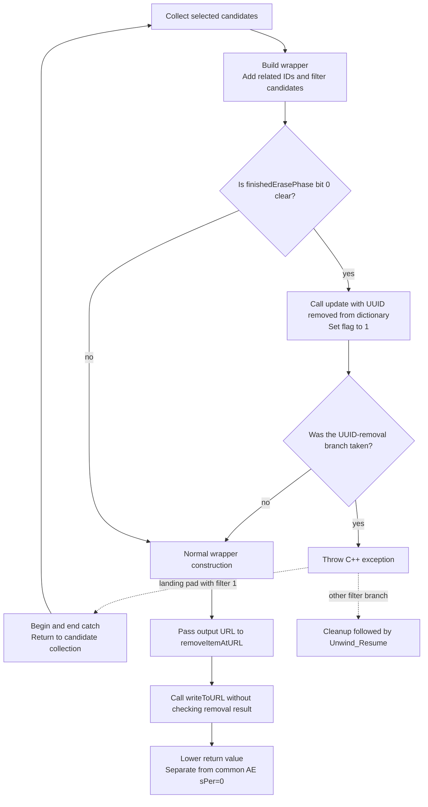

# SA-AE-TARGET-005: Root sources, name capacity and export retry

[日本語](SA-AE-TARGET-005-root-utf8-export-retry.md) · [English](SA-AE-TARGET-005-root-utf8-export-retry.en.md) · [Previous boundary](SA-AE-TARGET-004-child-path-mutation.en.md)

**Mode 14 export includes model updates, an exception retry branch, and removal followed by writing at the output URL.** Its internal `finishedErasePhase` marks one phase, not successful saving. This pass also establishes the sources of numeric roots 1/2 and maximum byte counts for filename / directory label. These are static findings. No events, live exports or product capabilities were added.

| Item | Value |
|---|---|
| Date / profile | 2026-10-05 JST, Logic Pro Creator Studio 12.3.1 / build 6682 |
| Addresses | ARM64, before slide. Only addresses explicitly identified as MACore belong to the other image |
| Logic SHA-256 | `2f141e1a1f7b90a4fb0205ffec3dbe187baf601d20e9acb398acfadcdf050998` |
| MACore ARM64 SHA-256 | `99a4a9adbf79c92046682eb821d8ef35145f4915a29b88839c4f026ae63cd076` |
| Evidence | Ghidra 12.1.4 `-noanalysis -readOnly`, bounded LLVM disassembly and SDK enum definitions. [Manifest](appleevent-target-boundaries-manifest.json), [mapping](../protocol/appleevent-target-boundaries.tsv) |
| Execution scope | All mapping rows have `runtime_verified=false`, `product_capability=false`. Raw output is excluded from Git |

## 1. Three boundaries that do not mean a successful save

The diagram shows reachable calls / branches. Exception tables have not been matched, so it does not establish that every throw maps to this catch.



Model byte stores and dictionary-update calls occur before file-wrapper preparation. Complete model restoration after a failed save, Undo, and confirmation by reopening are not part of this diagram.

## 2. Static sources of numeric roots 1/2

`0x00574164` constructs 50 slots with stride `0x78`. Each entry starts with a C-string label pointer, has its selector at `+8` and a CFileRef at `+0x10`. Selector 1 occupies slot 0 / label `User`, selector 2 slot 3 / label `App Presets` (stores `0x005741c4`, `0x00574224`). The first 7 slots have labels; slot 7 retains label 0 and key `0x23` (`0x00574294`). The walk uses the label pointer as its continuation condition, so a key alone does not activate an entry. Static BSS bytes are not a snapshot of current paths.

| Selector | Cache construction | Subsequent return / limits |
|---|---|---|
| **1** | Calls `NSFileManager.URLForDirectory:inDomain:appropriateForURL:create:error:` with directory **18**, domain **1**, create **0**. These SDK values are `NSMusicDirectory` / `NSUserDomainMask`. The path appending `Audio Music Apps` calls `CFileUtilCreateDir(...,0x1ed)` (`0x00574acc`). Copies to cache if final `IsFolder` is nonzero | Derived from a user Music-directory URL. Concrete path, trailing slash and creation success were not obtained |
| **2** | Uses a nonempty string from `DfPreferences.additionalContentRootFolderOrDevLibraryBundleFolder`. Uses it directly if bit 0 of `useNewLibraryStructure` is set; otherwise appends `Application Support` and calls `fileURLWithPath:`. This initializer's cache copy has no final `IsFolder` gate | Preference-derived. Default local state for an empty string and current preferences are unaudited. Does not establish a public preset ID |

Directory 18/domain 1 were matched against enums in the local SDK's `NSPathUtilities.h`. Literal `0x01d5fbe0` is `Audio Music Apps` (16 bytes); CFString `0x0233ec68 → 0x01d5fba0` is `Application Support` (length 19). This does not equate Foundation enums with Logic's internal selectors 1/2.

`0x00575150` first invalidates the destination, then prepares the registry through `0x005745c0` (`0x00575188/0x0057518c`). After copying a matching entry's `+0x10` into the destination, nonzero `IsFolder` gives low32 **0**, otherwise **`0xffffff88` (signed32 -120)** (`0x0057526c..0x00575288`). An error can follow a copy, so error does not mean the destination remained unchanged. A registry miss for selectors 1/2 bypasses switch 7..36 and returns -120 through the default path.

**A root lookup can reach a directory-creation request during cache construction.** Setup traverses the whole registry, so lookup of selector 2 can also pass through selector 1's creation call. Actual creation was not attempted. Construction guard `0x02633b28` differs from state flag `0x026323a0`. State writers, the full cache-rebuild conditions and current preference values remain unresolved.

The previous CRC helper still compares **byte prefixes**, root 2 followed by root 1. These findings narrow the root sources; they do not add nonempty / slash-boundary guarantees or CRC uniqueness.

## 3. Stored names have byte limits, not character limits

| Field | Copy capacity N | Maximum payload excluding NUL | Evidence |
|---|---:|---:|---|
| child `+0x22` filename | 63 | **62 bytes** | caller `0x0022cca0`, MACore terminal store `0x0005ce84` |
| child `+0x62` directory label | 64 | **63 bytes** | caller `0x017b1b54`, same terminal store |

MACore `_utf8_strlcpy` at `0x0005cdb4` consumes `x0=destination`, `x1=source`, `x2=N`. It stores NUL at `destination[N-1]` and **returns the destination pointer** (`0x0005ce84/0x0005ce88`), not source length or truncation status. It skips leading continuation bytes, infers widths 1/2/3/4 from the leader byte class and copies a unit only if the entire inferred width fits the payload. Before copying, it does not validate all continuation bytes or a NUL inside the unit.

MACore `_utf8_check_and_fix` at `0x0005d2b4` checks leader / continuation patterns and **shortens the string by writing NUL** at the start of an invalid or incomplete sequence (`0x0005d354..0x0005d360`). It returns 0 if shortened, 1 if unchanged. It neither inserts a replacement character nor expands the string. No second-byte restrictions for E0/ED/F0/F4 are visible, so this is not a guarantee of strict Unicode scalar validation or normalization.

Both callers clear 64 bytes, call copy / repair with positive N and nonnull inputs, and ignore both returns. The table's payload bounds apply if this bounded path returns. They do not establish character / display-length limits, arbitrary-pointer or zero-capacity safety, or save success. For Japanese names, different long inputs can produce the same stored string; names alone must not become stable target IDs.

## 4. Wrapper and exception retry

Dispatch stub `0x01b21660` uses selector slot `0x0254a150 → 0x01e791f0`, **`createFileWrapperForTracks:inSeqID:finishedErasePhase:patchURL:`**, IMP `0x0162cb10`. ARM64 ABI is `x2=local list address`, `x3=container`, `x4=out byte pointer`, `x5=patch URL` (`0x0162cb30..0x0162cb48`). The decompiler's by-value list rendering is not used as ABI evidence.

Input candidates form a primary ID set and local root list; conditional branches add related IDs and filter parent/child candidates. Neither equality with the input list, a complete project dump, nor equality with public Remote IDs is established. For eligible records, the next record's `+0x12` byte is stored directly into the current record's `+0x12` (`0x0162cd94`). The field's UI meaning and full backup / restoration remain unknown.

Dictionary-key CFString `0x023eb0c8 → 0x01e112b6` was checked against bytes `UUID`, length 4.

| Stage | Instruction-level evidence |
|---|---|
| Erase-phase gate | Skip if out pointer is null or bit 0 of its existing byte is set (`0x0162cf5c..0x0162cf68`) |
| Dictionary-update call | For each primary ID, call `0x01a18ae8(song,ID,2)`. If `UUID` exists, remove it from a mutable copy and call `0x0022ce34(song,ID,2,copy)` (`0x0162d0e4..0x0162d140`). Getter/setter bodies are unread, so durable removal is not claimed |
| Phase marker | Set out byte to **1** after the loop (`0x0162d15c`), including passes with no UUID |
| Throw | If any UUID-removal branch ran, prepare an 8-byte exception, vtable `0x02329fb8`, type-info `0x02329f60`, and call `__cxa_throw` (`0x0162d400..0x0162d424`) |
| Selected exporter's catch | If saved filter `w26` is **1**, call `__cxa_begin_catch` / `__cxa_end_catch` (`0x01632e30/0x01632e34`); `0x01632e58 → 0x01632930` returns to candidate collection |
| Preserved flag | Byte initialization is at `0x016328fc`, before the retry target. The catch/retry branch does not clear it, and the next wrapper call can read bit 0. No direct caller-side byte load appears in the inspected ranges |
| Unwind | Wrapper gap cleans up local objects / lists and calls `_Unwind_Resume` at `0x0162d574`; selected filter!=1 branch cleans up and calls it at `0x01632f04` |

**The retry branch is established; the throw-to-catch type mapping is not.** LSDA call-site / type tables have not been matched. This does not establish that the UUID throw necessarily reaches this retry, that all exceptions restore state, or a retry-count bound. A normal wrapper return reaches the previously documented `removeItemAtURL:` → unchecked-removal-result → `writeToURL:` path. The exporter saves and returns the write result. Lower serializers, postprocessors, nil returns and filesystem effects remain unaudited.

## 5. Temporary changes and concrete owner effects

`0x002c048c(song,ID,inputIndex,rawDelta)` re-resolves the ID and clears the selected child's old cell only if that cell matches the pointer. Its store is **`child+2 = lower16(inputIndex + rawDelta)`** (`0x002c0538/0x002c053c`), not an increment of the old child index. It then reattaches through `0x01a18cd8` and passes a captured block to `blockInstID:whileLoading:`. Block execution timing is unresolved.

In `0x002bfdb0` normal flow, pre calls cover input 2..15 / delta -2, 14 calls; post calls cover 14..0 / delta +2, 15 calls. Arrays and counts change between them. These are not described as a simple symmetric inverse or exception rollback.

`0x01a18254` updates 16 bytes at container `+0x93..0xa2`, 16 shorts at eligible parents' `+0x4a..0x69`, and 16 shorts at container `+0x6a..0x88` (`0x01a183ac`, `0x01a1847c/0x01a18480`). With nonnull song, it zero-appends, reallocates or shortens the end of the `+0x50/+0x58/+0x60` pointer vector to match the sum. Mapped types also allow early scan termination; a complete scan of every object is not established.

Constructor `0x00196c5c` stores vtable `0x022e94b8` and the original object pointer in a 16-byte owner, then attaches it at `song+0x7c0` (`0x00196ca0..0x00196cb4`, `0x00196fb8`). Lower calls for virtual `+0x18 → 0x00e65454 → 0x010a44a0` and `+0x20 → 0x00e65464 → 0x010a4844` show:

- Mask-conditional increments/decrements at `song+0x678`. Conditional changes at `+0x640` are not symmetric with the enter boolean.
- Outer paths use `pthread_mutex_lock` / `unlock` on `*global+0x911c8` (`0x010a4544`, `0x010a4a1c`). Counter stores precede acquisition.
- Under conditions including the global song-pointer comparison, post `SongMemoryDidChange` (`0x010a49e8`). CFString `0x02348f48` is verified; object is a vector entry's weak reference or nil. No delivery acknowledgment is checked.

These are static evidence for nesting-related counters, mutex use and notification. They do not establish Undo registration, atomic commit, exception-balanced scopes, model / file restoration or completed UI refresh.

## 6. Reproducibility and omitted function-body ranges

Ghidra's defined function bodies omitted a 204-byte gap in the selected exporter and a 336-byte gap in the wrapper. New `InstructionRangeReport.java` emits **existing listing and bytes only**, explicitly marking undefined instructions. It does not reanalyze, disassemble or save the database. A known 16-byte range was also checked.

The gap bytes were disassembled with bounded LLVM commands and every instruction word compared with Ghidra's raw bytes. A 36-byte tail for filter!=1 was added. LLVM's nearby-symbol annotations are not used as function ownership; numeric call targets were checked against the Ghidra inventory. Analysis copies, the selected ARM64 slices of installed binaries and Ghidra's stored import hashes were rechecked. The MACore universal-file hash and slice hash are recorded separately in the manifest.

Range ends are **exclusive**, start and length must be aligned to 4 bytes, and each range is limited to 4096 bytes. A program-name or import-SHA mismatch aborts. Add this form to a headless command running through the shared lock:

```text
-postScript InstructionRangeReport.java output.txt Logic.arm64 <expected-import-sha256> 0x01632d90:0x01632e5c
```

Jobs used one shared absolute lock path and were serialized; successful logs and fresh output were checked. The manifest records hashes of tool sources, raw outputs and SDK excerpts. Previous manifests retain their historical source hashes and unresolved findings.

## 7. Next bounded checks

1. **LSDA / landing-pad mapping**: relate type-info `0x02329f60`, throw call site and filter 1; establish which exceptions take retry or outer cleanup.
2. **Dictionary getter/setter**: `0x01a18ae8` (188 B), `0x0022ce34` (736 B). Check mode 2's target, update result, ownership and readback.
3. **Wrapper postprocessors and loading block**: `0x0162dbc8` (356 B), `0x0162dd90` (188 B), `0x002c061c` (24 B), `0x00edc344` (52 B). Check direct mutation, nil behavior and callback timing.
4. Keep larger-serializer coverage unresolved. Any live experiment must separately validate target identity, epoch, model restoration and reopening after save.

This investigation is separate from MCU experiments, Logic Remote state and PLAN-05's connection conditions. Modes 12/14 are not promoted to product operations by these findings.
