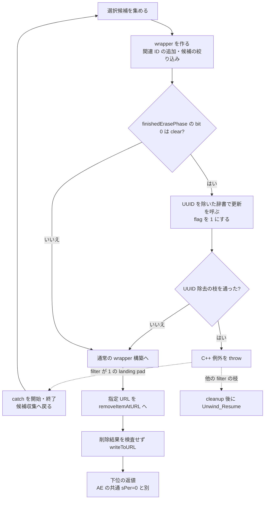

# SA-AE-TARGET-005: root の出どころ・名前の容量・書き出しの再試行

[日本語](SA-AE-TARGET-005-root-utf8-export-retry.md) · [English](SA-AE-TARGET-005-root-utf8-export-retry.en.md) · [前回の境界](SA-AE-TARGET-004-child-path-mutation.md)

**mode 14 の書き出しには、モデルの更新、例外による再試行、出力先の削除と書き込みが含まれます。** 内部の `finishedErasePhase` は一段階を通った印であり、保存成功の印ではありません。numeric root 1/2 の出どころと、filename / directory label の最大 byte 数も確認しました。ここまでの結果は静的解析です。イベント送信・実機書き出し・製品 capability の追加は行っていません。

| 項目 | 内容 |
|---|---|
| 日付・profile | 2026-10-05 JST、Logic Pro Creator Studio 12.3.1 / build 6682 |
| アドレス | ARM64、slide 前。MACore と明記したものだけ別 image |
| Logic SHA-256 | `2f141e1a1f7b90a4fb0205ffec3dbe187baf601d20e9acb398acfadcdf050998` |
| MACore ARM64 SHA-256 | `99a4a9adbf79c92046682eb821d8ef35145f4915a29b88839c4f026ae63cd076` |
| 根拠 | Ghidra 12.1.4 `-noanalysis -readOnly`、限定した LLVM disassembly、SDK の enum 定義。[manifest](appleevent-target-boundaries-manifest.json)、[対応表](../protocol/appleevent-target-boundaries.tsv) |
| 実行範囲 | 全対応表で `runtime_verified=false`、`product_capability=false`。生出力は Git 対象外 |

## 1. 保存成功と混同しない三つの境界

図は到達し得る call / branch を示します。すべての throw がこの catch に対応することは、例外テーブルをまだ照合していないため保証しません。



file wrapper の準備前にもモデルの byte 書き換えと辞書更新呼び出しがあります。ファイルへの保存失敗からモデルを完全に戻す保証、Undo、再読込による確認は、この図には含めません。

## 2. numeric root 1/2 の静的な出どころ

`0x00574164` は stride `0x78` の 50 slots を構築します。entry の先頭は label の C-string pointer、`+8` は selector、`+0x10` は CFileRef です。selector 1 は slot 0 / label `User`、selector 2 は slot 3 / label `App Presets`（stores `0x005741c4`、`0x00574224`）。初期の 7 slots に label があり、slot 7 は label 0・key `0x23` のままです（`0x00574294`）。walk は label pointer を continuation 条件にするため、key だけでは active entry になりません。BSS の静的 bytes は現在の path を示しません。

| selector | cache を作る処理 | その後の返値・限界 |
|---|---|---|
| **1** | `NSFileManager` の `URLForDirectory:inDomain:appropriateForURL:create:error:` に directory **18**、domain **1**、create **0**。SDK では `NSMusicDirectory` / `NSUserDomainMask`。`Audio Music Apps` を付加する経路で `CFileUtilCreateDir(...,0x1ed)` を呼ぶ（`0x00574acc`）。最終 `IsFolder` が非ゼロなら cache へ copy | user Music-directory URL 由来。具体的な path・末尾 slash・作成成功は未取得 |
| **2** | `DfPreferences.additionalContentRootFolderOrDevLibraryBundleFolder` の非空文字列を使用。`useNewLibraryStructure` の bit 0 が set なら直接、clear なら `Application Support` を付加して `fileURLWithPath:`。この initializer の cache copy に最終 `IsFolder` gate はない | preference 由来。空文字時の default local の内部状態と、現在の設定値は未監査。公開 preset ID の証明にはしない |

directory 18/domain 1 はローカル SDK `NSPathUtilities.h` の enum と照合しました。literal `0x01d5fbe0` は `Audio Music Apps`（16 bytes）、CFString `0x0233ec68 → 0x01d5fba0` は `Application Support`（length 19）。Foundation enum を Logic 内部の selector 1/2 と同一視したものではありません。

`0x00575150` は先に destination を `Invalidate`、次に `0x005745c0` で registry を準備します（`0x00575188/0x0057518c`）。一致した entry の `+0x10` を destination へ copy した後、`IsFolder` 非ゼロで low32 **0**、そうでなければ **`0xffffff88`（signed32 -120）**（`0x0057526c..0x00575288`）。copy の後に error となるため、error だけで「destination は変更されなかった」とは読めません。selector 1/2 が registry に無い枝は switch 7..36 に入らず、default で -120 を返します。

**root の問い合わせも、cache の構築時に directory 作成要求へ到達し得ます。** setup は registry 全体を巡回するので、selector 2 の lookup でも selector 1 の作成 call を通り得ます。実際の作成は試していません。構築 guard `0x02633b28` と state flag `0x026323a0` は別です。state writer、cache の再構築条件の全体、現在の preference 値は未確定です。

前回の CRC helper は引き続き root 2、root 1 の順に **byte prefix** を比較します。これで root の出どころは絞れましたが、非空・slash 境界の保証や CRC の一意性は増えません。

## 3. 保存する名前は文字数ではなく byte 数で制限される

| field | copy の容量 N | NUL を除く最大 payload | 根拠 |
|---|---:|---:|---|
| child `+0x22` filename | 63 | **62 bytes** | caller `0x0022cca0`、MACore terminal store `0x0005ce84` |
| child `+0x62` directory label | 64 | **63 bytes** | caller `0x017b1b54`、同じ terminal store |

MACore `_utf8_strlcpy` `0x0005cdb4` は `x0=destination`、`x1=source`、`x2=N`。`destination[N-1]` に NUL を保存し、**destination pointer を返します**（`0x0005ce84/0x0005ce88`）。source 長や切り詰め status の返値ではありません。先頭の continuation bytes を飛ばし、leader の byte class から幅 1/2/3/4 を決め、幅全体が payload に収まるとき copy します。copy 前に全 continuation bytes や unit 内の NUL は検査しません。

MACore `_utf8_check_and_fix` `0x0005d2b4` は leader / continuation の並びを確認し、不正・不完全な並びの先頭へ **NUL を書いて短くします**（`0x0005d354..0x0005d360`）。短くした場合 0、変更不要なら 1。replacement character の挿入や文字列の延長はしません。E0/ED/F0/F4 の second-byte 制約は見えず、厳密な Unicode scalar 検証・正規化の保証にはなりません。

両 caller は 64 bytes を clear してから正の N と非 null 入力で copy / repair を呼び、両返値を無視します。上の最大 payload は、この bounded path が戻った場合の byte 上限です。文字数・見た目の長さ・任意の不正 pointer やゼロ容量の安全性・保存成功は示しません。日本語名では、異なる長い名前が同じ保存文字列になり得るため、名前だけを安定した target ID にしません。

## 4. wrapper と例外による再試行

dispatch stub `0x01b21660` の selector slot `0x0254a150 → 0x01e791f0` は **`createFileWrapperForTracks:inSeqID:finishedErasePhase:patchURL:`**、IMP は `0x0162cb10`。ARM64 ABI は `x2=local list address`、`x3=container`、`x4=out byte pointer`、`x5=patch URL`（`0x0162cb30..0x0162cb48`）。decompiler の by-value list 表示を ABI として使いません。

入力候補から primary ID 集合・local root list を作り、条件に応じて関連 ID を追加し、親子候補を絞ります。入力リストそのまま、完全な project dump、公開 Remote ID と同じ集合のいずれとも保証しません。条件に合う record では次 record の `+0x12` byte を現在 record の `+0x12` に直接保存します（`0x0162cd94`）。この field の UI 上の意味、保存・復元の全体は未確定です。

辞書 key の CFString `0x023eb0c8 → 0x01e112b6` は bytes `UUID`、length 4 と照合しました。

| 段階 | 命令で確認したこと |
|---|---|
| erase phase の gate | out pointer が null、または既存 byte の bit 0 が set なら skip（`0x0162cf5c..0x0162cf68`） |
| 辞書更新の呼び出し | primary ID ごとに `0x01a18ae8(song,ID,2)`。`UUID` があると mutable copy からその key を除き、`0x0022ce34(song,ID,2,copy)`（`0x0162d0e4..0x0162d140`）。getter/setter 本体未読のため永続的な除去成功は未主張 |
| phase の印 | loop 後、out byte を **1** にする（`0x0162d15c`）。UUID の無い pass でも設定される |
| throw | UUID 除去の枝を一度でも通ると、8-byte exception・vtable `0x02329fb8`・type-info `0x02329f60` を用意して `__cxa_throw`（`0x0162d400..0x0162d424`） |
| selected exporter の catch | 保存した filter `w26` が **1** なら `__cxa_begin_catch` / `__cxa_end_catch`（`0x01632e30/0x01632e34`）、`0x01632e58 → 0x01632930` で候補収集へ戻る |
| flag の保持 | byte 初期化は `0x016328fc`、戻り先はその後。catch/retry の枝は byte を clear せず、次 wrapper call が bit 0 を読む構造。caller 自身が byte を読む命令はこの確認範囲にない |
| unwind | wrapper の gap は local object / list の cleanup 後 `0x0162d574`、selected の filter!=1 の枝は cleanup 後 `0x01632f04` で `_Unwind_Resume` |

**retry の branch は確認済みですが、throw と catch の type 対応は未確定です。** LSDA の call-site / type table を照合していないため、上の UUID throw が必ずその retry に届くこと、全例外の復元、回数上限は保証しません。正常な wrapper return 後は、前回の `removeItemAtURL:` の結果を検査せず `writeToURL:` に進む経路へ続きます。write の返値は exporter 内で保存して返します。下位 serializer、postprocessor、nil return、filesystem 副作用は未監査です。

**追補（SA-AE-TARGET-006）：** [例外の型対応・metadata・loading の解析](SA-AE-TARGET-006-exception-metadata-loading.md)で、上の wrapper call / throw の LSDA と type-info を照合しました。この固定 2 関数については、named exception と filter 1 の静的な型対応が確定しています。実行時の捕捉・再試行成功・回数上限・外側の復元は引き続き未確認です。

## 5. 一時変更と owner の具体的な効果

`0x002c048c(song,ID,inputIndex,rawDelta)` は ID を再解決し、選んだ child の旧 cell が pointer と一致すれば clear します。保存するのは **`child+2 = lower16(inputIndex + rawDelta)`**（`0x002c0538/0x002c053c`）であり、旧 child index に delta を加える式ではありません。その後 `0x01a18cd8` で reattach、captured block を `blockInstID:whileLoading:` に渡します。block の実行時機は未確認です。

`0x002bfdb0` の normal flow の pre calls は input 2..15 / delta -2 の 14 回、post calls は 14..0 / delta +2 の 15 回です。間に配列・count の変更もあるため、単純に対称な逆操作・例外時の rollback と記述しません。

`0x01a18254` は container の `+0x93..0xa2` へ 16 bytes、適格 parent の `+0x4a..0x69` へ 16 shorts、container の `+0x6a..0x88` へ 16 shorts を更新します（`0x01a183ac`、`0x01a1847c/0x01a18480`）。song 非 null の経路では合計に合わせて `+0x50/+0x58/+0x60` pointer vector を零追加・再確保・end 短縮します。mapped type による scan の早期終了もあり、全 object の完全走査を保証しません。

constructor `0x00196c5c` は 16-byte owner に vtable `0x022e94b8` と元 object pointer を保存し、その owner を `song+0x7c0` に付けます（`0x00196ca0..0x00196cb4`、`0x00196fb8`）。virtual `+0x18 → 0x00e65454 → 0x010a44a0`、`+0x20 → 0x00e65464 → 0x010a4844` の下位で、次を確認しました。

- mask 条件の下で `song+0x678` を増減。`+0x640` の条件付き増減は enter boolean と対称ではありません。
- 外側の経路では `*global+0x911c8` に `pthread_mutex_lock` / `unlock`（`0x010a4544`、`0x010a4a1c`）。counter stores は lock より先です。
- song の global pointer 比較などの条件が成立すると `SongMemoryDidChange` を post（`0x010a49e8`）。CFString `0x02348f48` を照合。object は vector entry の weak reference または nil。delivery acknowledgment は検査しません。

これらは nesting に伴う counter・mutex・通知の静的根拠です。Undo の登録、atomic commit、例外時の balanced scope、モデル／ファイルの復元、UI 更新完了を保証するものではありません。

## 6. 再現性と関数本体の見落としへの対処

Ghidra の定義済み function body だけでは、selected exporter の 204-byte gap と wrapper の 336-byte gap が出力に入りませんでした。追加の `InstructionRangeReport.java` は **既存 listing と bytes だけ**を出し、未定義箇所を明示します。database の再解析・disassembly・保存は行いません。16-byte の既知箇所も併せて確認しました。

gap の bytes を LLVM で限定 disassembly し、Ghidra の raw bytes と全命令 word を照合しました。filter!=1 の 36-byte tail も追加しました。LLVM の近隣 symbol 注釈は所属 function として使わず、numeric call target を Ghidra inventory と照合しています。解析コピー・installed binary の選択 ARM64 slice・Ghidra stored import hash も再確認しました。MACore の universal 全体 hash と slice hash は別々に manifest に記録します。

range の終端は **exclusive**、始点・長さは 4-byte alignment、各 range は最大 4096 bytes です。program 名と import SHA が一致しなければ中止します。共有 lock を通した headless command に、次の形式で付加できます。

```text
-postScript InstructionRangeReport.java output.txt Logic.arm64 <expected-import-sha256> 0x01632d90:0x01632e5c
```

共通の絶対パスの lock で job を直列化し、正常 log と新出力を確認しました。manifest には tool source・各 raw output・SDK excerpt の hash を残しています。前回の manifest は、当時の source hash と未解決事項を持つ履歴として維持します。

## 7. 次の限定した確認

1. **LSDA / landing pad の対応**：type-info `0x02329f60`、throw call site、filter 1 を結び、retry と外側の cleanup がどの例外に適用されるか確認する。
2. **辞書 getter/setter**：`0x01a18ae8`（188 B）、`0x0022ce34`（736 B）。mode 2 の対象、更新結果、ownership、読み戻しを確認する。
3. **wrapper postprocessor と loading block**：`0x0162dbc8`（356 B）、`0x0162dd90`（188 B）、`0x002c061c`（24 B）、`0x00edc344`（52 B）。direct mutation、nil、callback の時機を確認する。
4. larger serializer は coverage 未確定として残す。実機試験へ進む場合は target identity・epoch・モデルの復元・保存後再読込を別々に検証する。

MCU 実験・Logic Remote の状態・PLAN-05 の接続条件とは別の調査です。mode 12/14 をこの解析から製品操作へ昇格しません。
