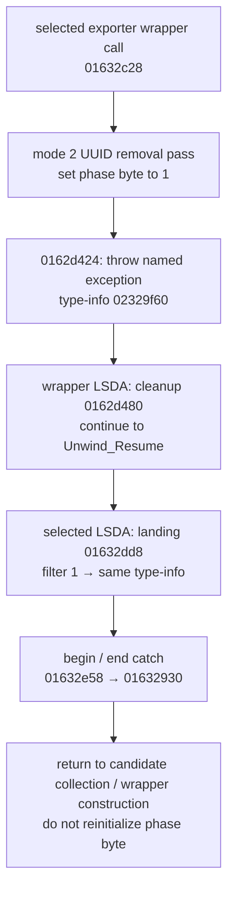

# SA-AE-TARGET-006: Exception type mapping, metadata storage, and loading execution

[日本語](SA-AE-TARGET-006-exception-metadata-loading.md) · [English](SA-AE-TARGET-006-exception-metadata-loading.en.md) · [Previous](SA-AE-TARGET-005-root-utf8-export-retry.md)

**The exception after UUID removal is now statically mapped to the selected exporter's retry path.** The throw and catch use the same type-info for `CLgMainStageExportMemoryChangedException`. The mode 2 update also targets an internal category 7 / index 2 record that holds archive bytes and a cached object. The loading block is invoked immediately, and lower paths can update or remove mappings. These findings do not establish successful storage, complete restoration, or Undo guarantees.

| Item | Details |
|---|---|
| Date / profile | 2026-10-05 JST, Logic Pro Creator Studio 12.3.1 / build 6682 |
| Addresses | ARM64, before slide. Only entries explicitly marked MACore belong to another image |
| Logic SHA-256 | `2f141e1a1f7b90a4fb0205ffec3dbe187baf601d20e9acb398acfadcdf050998` |
| MACore ARM64 SHA-256 | `99a4a9adbf79c92046682eb821d8ef35145f4915a29b88839c4f026ae63cd076` |
| Method | Ghidra `-noanalysis -readOnly` under the shared lock; Mach-O / LSDA / fixup reading for exactly two functions. Runtime exception handling remains unverified |
| Evidence | [Manifest](appleevent-phase-analysis-manifest.json), [boundary table](../protocol/appleevent-phase-boundaries.tsv), [call-site table](../protocol/appleevent-export-exception-sites.tsv) |
| Capability | Every table entry has `runtime_verified=false` and `product_capability=false`. No messages sent to Logic, new connections, or live exports |

## 1. Exception type and retry mapping

The diagram represents EH mappings recorded in the binary and the instruction sequence. It does not show that runtime handling, cleanup completion, storage, or retry succeeded.

| Relationship | What the encoded tables / instructions establish |
|---|---|
| selected → wrapper | For call `0x01632c28`, return IP−1 is `0x01632c2b`. Range **`[0x01632c14,0x01632c34)`** → landing `0x01632dd8`, action entry 5 |
| Action chain | At LSDA `0x0219991c`, offsets 117→115→113 encode **filters 1→0→0**. Filter 1 is a type index; 0 is cleanup. This is not a count of cleanup executions |
| Catch type | Add the signed PC-relative displacement at classInfo−4, `0x02199994`, to that field's address → slot `0x02280698`. Its chained fixup format 6 rebase target is **`0x02329f60`** |
| Throw type | `0x0162d418` prepares that same type-info, `0x0162d420` prepares the destructor, and `0x0162d424` calls `__cxa_throw` |
| Wrapper cleanup | The throw's return IP−1, `0x0162d427`, is in **`[0x0162d414,0x0162d428)`** → landing `0x0162d480`, action 0. All 41 wrapper rows have action 0; there is no typed catch |
| Retry | After the catch, selected's filter 1 path returns to `0x01632930`. This is after phase-byte initialization at `0x016328fc`, so byte 1 is retained. The other-filter branch continues unwinding |

The RTTI name is `40CLgMainStageExportMemoryChangedException`. `c++filt -t` returns `CLgMainStageExportMemoryChangedException`. The vtable bind is `__si_class_type_info` +16; the base bind is `std::exception` RTTI. **The catch maps to the named exception type; it must not be broadened to a catch for all std::exception types.** The name pointer's high8 `0x80` was checked against the Apple ARM64 non-unique name tag. The raw value and the name with the tag removed were recorded separately.

Personality slot `0x0228ba20` binds to `___gxx_personality_v0`. The saved file's bind/rebase representation is not treated as a resolved pointer in the currently loaded process. The previous uncertainty about LSDA type mapping is now **resolved for the static mapping of these exact two functions**. Retry counts, EH in other functions, and restoration guarantees remain unresolved.

## 2. Format references and verification scope

The two-level `__unwind_info` index was searched only for the targets. A 124-byte window was read for selected and a 244-byte window for wrapper. Each window was bounded by the smaller of the distance to the next LSDA index offset and 512 bytes; this is not a general definition of LSDA size.

Mach-O layout, ARM64 compact unwind, and chained pointer formats were checked against local SDK headers. The LSDA payload was checked against the official [LLVM personality implementation](https://github.com/llvm/llvm-project/blob/llvmorg-21.1.0/libcxxabi/src/cxa_personality.cpp#L662-L838), and compact entry interpretation against [UnwindCursor](https://github.com/llvm/llvm-project/blob/llvmorg-21.1.0/libunwind/src/UnwindCursor.hpp#L1885-L1977). RTTI base representation was checked against [private_typeinfo.h](https://github.com/llvm/llvm-project/blob/llvmorg-21.1.0/libcxxabi/src/private_typeinfo.h#L145-L155) and local `typeinfo`. **Identity between the installed Apple runtime implementation and this LLVM tag remains unverified.**

- Checked 34 raw slices against the original binary's file offsets, lengths, and hashes.
- Consumed all selected 19 / wrapper 41 entries, totaling **60 call-site rows**, through the table ends. Checked ascending, non-overlapping ranges and function / landing-pad bounds.
- Checked 43 landing-pad words and 4 BL/B targets against existing Ghidra / LLVM bytes and independent calculations.
- Checked positive LEB examples and a truncated-continuation negative example. Independent reader review found no disagreement in the main results.

The parser is limited to these exact two LSDAs and the known encodings. Raw bytes, the parser, and format-source hashes remain in ignored raw storage; published artifacts contain the tables and manifest.

## 3. Mode 2 is a category 7 / index 2 record

`0x01a18ae8(song,internalID,mode)` resolves the target again, then selects a vector cell using the preceding seven category counts and the mode. Mode 2 selects category 7 / index 2. The getter sends `count` to the object returned by lower helper `0x019d82b4(record)` and returns an autoreleased value if nonempty. Resolver, type, bounds, null, and empty failures converge on nil. The decompiler's `void` is not the correct ABI.

The nonnil-input branch of `0x0022ce34` creates a **64-byte record** with type 7 / lower16(mode), then passes it to storage helper `0x01a12e40` and attachment helper `0x01a18cd8`. Status 1 is the normal-path return value, without inspecting lower return values. The nil-input deletion branch also has a path that returns 1 even though a pointer mismatch prevented deletion. The wrapper ignores this status as well.

| Record representation | Direct facts from `0x01a12e40` / `0x019d82b4` |
|---|---|
| `+0x20` | Stores the archived-data length as lower32 (`0x01a12edc`). The getter requires signed length >0 |
| `+0x30/+0x38` | Initializes a memory-buffer holder, calls `MAMem::Alloc`, and performs a rounded copy if the allocation result is nonzero. The buffer helper's full contract has not been read |
| `+0x28` | **Retains the original input object and stores it in the cache** (`0x01a12f24/0x01a12f2c`). There is no explicit deep copy |
| Archive | Passes 1 to private `initRequiringSecureCoding_ma:`, uses key **`dictionary`** for `encodeObject:forKey:`, then finishEncoding and `encodedData`. The private initializer implementation has not been read |
| Lazy decode | The no-cache path uses an `NSData` bytes-no-copy wrapper and `NSKeyedUnarchiver`, passes 0 to `setDecodingFailurePolicy:`, creates a class-set, and calls `decodeObjectOfClasses:forKey:`. The complete class-set / private-helper scope remains unresolved |
| Cache store | After decoding, retains/stores the cache only if it is still null, inside an unfair lock (`0x019d8490..0x019d84bc`). The getter itself can modify lazy state |

There is no combined storage status covering nil archive data, the allocation result, and attachment success. Even after the allocation-result gate, the normal storage path stores the object in the cache and proceeds to release at the tail. Archive bytes and a cache do not guarantee disk storage, reloading, or successful UUID removal. Because the getter returns a cached object without decoding archive bytes, an immediate readback cannot validate the archive contents or a persisted round trip. The nested aux-key repair branch modifies an object beneath the top-level copy; a nested copy is not explicit.

## 4. Loading invokes synchronously; lower paths update mappings

`0x00edc344` saves global32 `0x026e9b30`, places the incoming ID there, and **immediately invokes the block's `+0x10` invoke pointer with `blr`** (`0x00edc364`). After normal return, it restores the global (`0x00edc368`). This 52-byte body contains no enqueue or skip. Restoration on exception and thread isolation remain unverified.

Captured block `0x002c061c` passes `(song,internalID,inputIndex,lower32(inputIndex+rawDelta))` to `0x0032daec`. The lower helper copies a dictionary-like object for mode **1**, copies each value's array, and invokes enumeration block `0x0032dfa4`. This is distinct from the mode 2 UUID metadata.

The block checks a class predicate, `logicOnlyGInstID`, and `index`. For candidates whose index equals oldInputIndex + `0x1c` or `0x48`, a lower predicate determines whether to pass a new index to `_setParameterIndex:` and set the changed byte to 1, or add the item to the array's removal indices (`0x0032e060/0x0032e070/0x0032e080`). Copies of the array and dictionary do not establish a deep copy of the mapping objects. The lower predicate's meaning is not inferred from its name alone.

The changed path calls the mode 1 setter and ignores its status. Another branch follows related internal IDs. When the changed and loading-state conditions are both met, it calls `reloadWorkspaceAndMappingsInDocument:`. Reload completion, synchrony of every lower operation, termination / cycles in the ID chain, and restoration remain unverified.

**Follow-up:** [SA-AE-TARGET-007](SA-AE-TARGET-007-mapping-classes-index-ranges.en.md) establishes the two predicates' numeric ranges and the extensible set returned by `mappingClasses`. New-index validation, the full allowed-class set, and successful storage remain unresolved.

## 5. Wrapper metadata and a cache branch that appears unreachable

`0x0162dbc8` chooses processing using the collection count and bit 0 of the input flag / authoring predicate. It builds a one-entry dictionary from `FileChecks` and `allObjects`, then calls property-list serialization with **format 200 / options 0**. The SDK enum confirms that 200 denotes the binary format.

For nonnull data, it sends `addRegularFileWithContents:preferredFilename:` to the wrapper receiver, using filename **`com.apple.musicapps.metadata.plist`**. There is no nil gate for the receiver, success check on the addition result, or inspection of the error contents. This does not establish successful disk storage.

Immediately before `length`, `0x0162dd90` sets the **receiver to literal nil** (`0x0162ddbc/0x0162ddc0`). The stub was confirmed to use ordinary `objc_msgSend`. The static inference is that **ordinary nil dispatch yields zero at the gate and does not enter the cache branch**. This is not a conclusion from observing that branch at runtime.

The branch contains `dataUsingEncoding:`, `maCompressedDataWithCompressionLevel:` (-1), and wrapper attachment under filename **`com.apple.musicapps.intermediate.cache.zxml`**. The presence of the filename is not treated as evidence of a cache file actually produced. The trailing release(nil) is not proof of storage status 0 either.

The caller flag selector is `disableALPOverwrite`; the collection provider is `createFileChecksForTrack:inSeqID:`. Neither implementation nor the element schema has been read. MACore `_IsALPModePatchAuthoring` at `0x00070ad8` depends on Logic / GarageBandIOS predicates or a user-defaults bool. Predicate names do not establish the current mode, setting, or overwrite safety.

## 6. Next boundaries

1. Concrete failures, class-set, and ownership of the private archive initializer / unarchiver helpers, plus reloading metadata after storage.
2. Mapping predicates, collection elements, and reload implementation / timing. Independently establish whether these internal IDs match public Remote IDs.
3. EH in setters, loading, and outer helpers beyond selected / wrapper, plus restoration of changes and Undo.
4. Coverage of the large serializer, and stable target identity / epoch / readback. Do not substitute the current name, CRC, cached pointer, or phase byte for those guarantees.

No live mode 12/14 tests or additions to product operations were performed in this round either.
