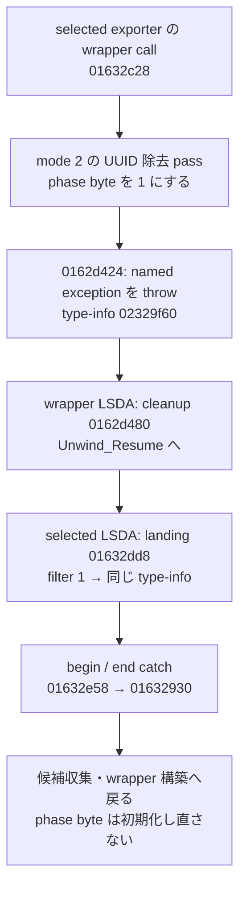

# SA-AE-TARGET-006: 例外の型対応・metadata の保存形式・loading の実行

[日本語](SA-AE-TARGET-006-exception-metadata-loading.md) · [English](SA-AE-TARGET-006-exception-metadata-loading.en.md) · [前回](SA-AE-TARGET-005-root-utf8-export-retry.md)

**UUID 除去後の例外と、selected exporter の再試行を静的に対応付けました。** throw と catch の type-info は同じ `CLgMainStageExportMemoryChangedException` です。また mode 2 の更新先は内部 category 7 / index 2 の record で、archive bytes と cached object を持ちます。loading block はその場で呼ばれ、下位では mapping の更新・除去が行われる経路があります。保存成功・完全復元・Undo の保証には昇格していません。

| 項目 | 内容 |
|---|---|
| 日付・profile | 2026-10-05 JST、Logic Pro Creator Studio 12.3.1 / build 6682 |
| アドレス | ARM64、slide 前。MACore と明記したものだけ別 image |
| Logic SHA-256 | `2f141e1a1f7b90a4fb0205ffec3dbe187baf601d20e9acb398acfadcdf050998` |
| MACore ARM64 SHA-256 | `99a4a9adbf79c92046682eb821d8ef35145f4915a29b88839c4f026ae63cd076` |
| 方法 | 共通 lock による Ghidra `-noanalysis -readOnly`、固定 2 関数の Mach-O / LSDA / fixup 読取。実行時の例外捕捉は未確認 |
| 根拠 | [manifest](appleevent-phase-analysis-manifest.json)、[対応表](../protocol/appleevent-phase-boundaries.tsv)、[call-site 表](../protocol/appleevent-export-exception-sites.tsv) |
| capability | 全対応表で `runtime_verified=false`、`product_capability=false`。Logic への送信・新規接続・実機書き出しなし |

## 1. 例外の型と再試行の対応

図は binary に記録された EH 対応と命令列です。実行時の捕捉、cleanup の完走、保存や再試行の成功を示しません。

| 関係 | encoded table / 命令で確認したこと |
|---|---|
| selected → wrapper | call `0x01632c28` の return IP−1 は `0x01632c2b`。範囲 **`[0x01632c14,0x01632c34)`** → landing `0x01632dd8`、action entry 5 |
| action chain | LSDA `0x0219991c` の offsets 117→115→113 は **filters 1→0→0**。filter 1 は型 index、0 は cleanup。cleanup の実行回数の表ではない |
| catch の型 | classInfo−4 の `0x02199994` から signed PC-relative displacement を加算 → slot `0x02280698`。chained fixup format 6 の rebase target は **`0x02329f60`** |
| throw の型 | `0x0162d418` はその同じ type-info、`0x0162d420` は destructor を準備し、`0x0162d424` が `__cxa_throw` を呼ぶ |
| wrapper の cleanup | throw の return IP−1 `0x0162d427` は **`[0x0162d414,0x0162d428)`** → landing `0x0162d480`、action 0。wrapper の 41 rows はすべて action 0で typed catch はない |
| 再試行 | selected の filter 1 は catch 後 `0x01632930` へ戻る。phase byte の初期化 `0x016328fc` より後なので byte 1 を保持する。別 filter の枝は unwind 継続 |

RTTI name は `40CLgMainStageExportMemoryChangedException`。`c++filt -t` は `CLgMainStageExportMemoryChangedException` を返します。vtable bind は `__si_class_type_info` +16、基底の bind は `std::exception` RTTI。**catch は named exception の型対応であり、std::exception 全般への catch と広げません。** name pointer の high8 `0x80` は Apple ARM64 の non-unique name tag と照合し、raw value と tag を除いた name を別々に記録しました。

personality slot `0x0228ba20` は `___gxx_personality_v0` の bind です。保存ファイルの bind/rebase を、現在ロードされている完成 pointer と扱いません。今回、前回の「LSDA の型対応未確定」はこの **固定 2 関数の静的対応について解決**しました。retry 回数、他関数の EH、復元の保証は残ります。

## 2. 解読の根拠と検証範囲

`__unwind_info` の二段 index から対象だけを探し、selected の 124-byte window、wrapper の 244-byte window を読みました。window 上限は次 LSDA index と 512 bytes の小さい方で、一般の LSDA サイズ定義ではありません。

Mach-O layout・ARM64 compact unwind・chained pointer format はローカル SDK header、LSDA payload は公式 [LLVM personality 実装](https://github.com/llvm/llvm-project/blob/llvmorg-21.1.0/libcxxabi/src/cxa_personality.cpp#L662-L838)、compact entry の解釈は [UnwindCursor](https://github.com/llvm/llvm-project/blob/llvmorg-21.1.0/libunwind/src/UnwindCursor.hpp#L1885-L1977) に照合しました。RTTI の基底表現は [private_typeinfo.h](https://github.com/llvm/llvm-project/blob/llvmorg-21.1.0/libcxxabi/src/private_typeinfo.h#L145-L155) とローカル `typeinfo` を参照しました。**installed Apple runtime とこの LLVM tag の実装同一性は未確認**です。

- 34 raw slices を元 binary の file offset・length・hash と照合。
- selected 19 / wrapper 41、計 **60 call-site rows** を table end まで消費。非重複・昇順・function / landing-pad bounds を確認。
- 43 landing-pad words と 4 BL/B targets を、既存 Ghidra / LLVM bytes と独立計算で確認。
- LEB の正例と truncated continuation の負例を確認。別 reader review でも主要結果に不一致なし。

parser は固定 2 LSDA と既知 encoding に限定します。生の bytes・parser・format source hashes は ignored raw に残し、公開物には対応表と manifest を置きます。

## 3. mode 2 は category 7 / index 2 の record

`0x01a18ae8(song,internalID,mode)` は対象を再解決し、category の前方 7 counts と mode から vector cell を選びます。mode 2 は category 7 / index 2。getter は下位 `0x019d82b4(record)` の object に `count` を送り、非空なら autorelease 返値、resolver/type/bounds/null/空の失敗は nil へまとまります。decompiler の `void` は正しい ABI ではありません。

`0x0022ce34` の nonnil input 枝は type 7 / lower16(mode) の **64-byte record** を作り、storage helper `0x01a12e40`、attach `0x01a18cd8` に渡します。status 1 は下位返値を検査しない正常経路の返値です。nil input の削除枝でも、pointer 不一致で削除しなかったのに 1 を返す経路があります。wrapper もこの status を無視します。

| record の表現 | `0x01a12e40` / `0x019d82b4` の direct facts |
|---|---|
| `+0x20` | archived data の length を lower32 で保存（`0x01a12edc`）。getter は signed length >0 を要求 |
| `+0x30/+0x38` | memory-buffer holder を初期化し、`MAMem::Alloc`、nonzero allocation result なら rounded copy。buffer helper の全契約は未読 |
| `+0x28` | **元 input object を retain して cache へ保存**（`0x01a12f24/0x01a12f2c`）。明示的な deep copy ではない |
| archive | private `initRequiringSecureCoding_ma:` へ 1、`encodeObject:forKey:` の key **`dictionary`**、finishEncoding、`encodedData`。private initializer の実装は未読 |
| lazy decode | cache が無い経路は `NSData` の bytes-no-copy wrapper と `NSKeyedUnarchiver` を使い、`setDecodingFailurePolicy:` へ 0、class-set を作って `decodeObjectOfClasses:forKey:`。class-set / private helper の全範囲は未確定 |
| cache store | decode 後、unfair lock 内で cache がまだ null なら retain/store（`0x019d8490..0x019d84bc`）。getter 自体にも lazy state の変更がある |

archive data の nil、allocation の結果、attachment の成功をまとめた保存 status はありません。normal storage path は allocation-result gate の後も object を cache に保存し、末尾は release へ進みます。archive bytes と cache があることは disk 保存・再読込・UUID 除去成功を保証しません。getter は cached object があれば archive bytes を decode せず返すため、更新直後の読み戻しだけでは archive の内容や保存後の再読込を検証できません。nested aux-key 修復の枝では top-level copy の下の object を変更し、nested copy は明示されていません。

## 4. loading は同期呼び出し、下位では mapping を更新する

`0x00edc344` は global32 `0x026e9b30` を保存して incoming ID を置き、block `+0x10` の invoke pointer を **その場で `blr`**（`0x00edc364`）、normal return 後に global を復元（`0x00edc368`）。この 52-byte body に enqueue/skip はありません。例外時復元と thread isolation は未確認です。

captured block `0x002c061c` は `(song,internalID,inputIndex,lower32(inputIndex+rawDelta))` を `0x0032daec` へ渡します。下位は mode **1** の dictionary-like object を copy し、各 value の配列を copy して `0x0032dfa4` の enumeration block を呼びます。mode 2 の UUID metadata と分けます。

block は class predicate、`logicOnlyGInstID`、`index` を照合します。index が oldInputIndex + `0x1c` または `0x48` の候補では、下位 predicate に応じて新 index を `_setParameterIndex:` に渡して changed byte を 1 にするか、配列の removal index に追加します（`0x0032e060/0x0032e070/0x0032e080`）。配列・辞書の copy は mapping object の deep copy を示しません。下位 predicate の意味は名前だけから決めません。

changed の経路は mode 1 setter を呼び、status を無視します。内部の関連 ID を辿る枝もあり、changed と loading 状態の条件がそろうと `reloadWorkspaceAndMappingsInDocument:` を呼びます。reload の完了、全下位処理の同期性、ID chain の終了・cycle、復元は未確認です。

**追補：** [SA-AE-TARGET-007](SA-AE-TARGET-007-mapping-classes-index-ranges.md)で、二つの predicate の数値範囲と `mappingClasses` の登録可能な集合を確認しました。new index の検証・全 allowed classes・保存成功は引き続き未確定です。

## 5. wrapper metadata と到達しないように見える cache 枝

`0x0162dbc8` は collection の count と入力 flag / authoring predicate の bit 0 で処理を選びます。`FileChecks` と `allObjects` から一項目の辞書を作り、**format 200 / options 0** で property-list serialization を呼びます。SDK enum で 200 は binary format と照合しました。

data 非 null の場合、wrapper receiver に `addRegularFileWithContents:preferredFilename:` を送り、名前は **`com.apple.musicapps.metadata.plist`**。receiver の nil gate、追加結果の成功判定、error 内容の確認はありません。ここから disk 保存成功を導きません。

`0x0162dd90` は `length` の直前に **receiver を literal nil** にします（`0x0162ddbc/0x0162ddc0`）。stub は通常の `objc_msgSend` と確認しました。**通常の nil dispatch ならゼロ gate で cache 枝を通らない**という静的推論です。実機で枝を観測した結論ではありません。

その枝には `dataUsingEncoding:`、`maCompressedDataWithCompressionLevel:`（-1）、**`com.apple.musicapps.intermediate.cache.zxml`** の wrapper attachment があります。filename の存在を実行済み cache file と扱いません。末尾の release(nil) も保存 status 0 の証明ではありません。

caller flag の selector は `disableALPOverwrite`、collection provider は `createFileChecksForTrack:inSeqID:`。両実装・element schema は未読です。MACore `_IsALPModePatchAuthoring` `0x00070ad8` は Logic / GarageBandIOS predicates、または user defaults の bool に依存します。predicate 名から現在の mode・setting・上書きの安全性は決めません。

## 6. 次の境界

1. 私有 archive initializer / unarchiver helper の具体的な失敗・class-set・ownership と、metadata の保存後再読込。
2. mapping predicates、collection の要素、reload 実装・時機。今の internal ID と公開 Remote ID の同一性を独立に確認する。
3. selected / wrapper 以外の setter・loading・outer helper の EH と、変更の復元・Undo。
4. 大きな serializer の coverage と、安定した target identity / epoch / readback。今回の name・CRC・cached pointer・phase byte を代用にしない。

mode 12/14 の実機試験・製品操作への追加は今回も行っていません。
