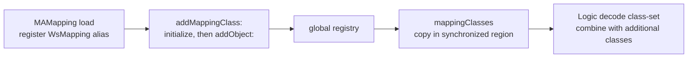

# SA-AE-TARGET-007: Mapping class sets and index ranges

[日本語](SA-AE-TARGET-007-mapping-classes-index-ranges.md) · [English](SA-AE-TARGET-007-mapping-classes-index-ranges.en.md) · [Previous](SA-AE-TARGET-006-exception-metadata-loading.en.md)

**The `mappingClasses` result is a copy of a registry that registration can extend.** The two previously unread predicates test two numeric ranges of a 64-bit index. These findings do not establish validity of a new index, successful archive storage, or public track identity.

| Item | Details |
|---|---|
| Profile | 2026-10-05 JST, Logic Pro Creator Studio 12.3.1 / build 6682 |
| Image / SHA-256 | MACore ARM64 `99a4a9adbf79c92046682eb821d8ef35145f4915a29b88839c4f026ae63cd076`, Logic ARM64 `2f141e1a1f7b90a4fb0205ffec3dbe187baf601d20e9acb398acfadcdf050998` |
| Method | Shared lock, Ghidra `-noanalysis -readOnly`. Seven MACore bodies (492 bytes), two Logic import thunks (24 bytes), three fixed data locations |
| Evidence | [Manifest](appleevent-mapping-analysis-manifest.json), [boundary table](../protocol/appleevent-mapping-boundaries.tsv), previous getter / enumeration ASM |
| Capability | Every row has `runtime_verified=false` and `product_capability=false`. No messages to Logic, new connections, or live archive operations |

## 1. Classes can be registered; the copy is a container at that moment

MACore `0x0009a7c0` retains global `0x001b5eb8`, calls `copy` inside `objc_sync_enter`, exits synchronization, then returns the copy through autorelease. This getter itself has no dispatch-once / nonnull gate. The container copy does not establish a deep copy of class objects, fixed membership throughout decoding, or a disk snapshot.

After dispatch-once, `0x0009a820` sends `addObject:` (`0x0009a860`) to the same registry. `0x0009a76c` calls `NSKeyedUnarchiver`'s `setClass:forClassName:` and passes the original incoming self to registration. Alias CFString `0x0018e820` was confirmed as **`WsMapping`**. All registration sources and current membership have not been enumerated.

The previous Logic getter combines the `mappingClasses` result with an additional class-set before passing it to `decodeObjectOfClasses:forKey:`. The registry copy alone is not the full allowed-class set. The delegate, private unarchiver initializer, and decode failure handling remain unresolved.

| Other class-set helper (MACore) | Boundary established here |
|---|---|
| `defaultPlistClasses` `0x000c9d38` | Returns global `0x001b63a0` after dispatch-once through retain/autorelease. It does not return a copy |
| `commonCoreClasses` `0x000c9d78` | Captures the incoming receiver in a block and returns global `0x001b63b0` after dispatch-once in the same way |

The initialization block bodies remain unread. Their names do not determine membership or immutability, and these reads do not establish that Logic's getter uses these two helpers.

## 2. Each predicate tests a numeric range of sixteen values

| MACore body | ARM64 condition | Index values returning true |
|---|---|---|
| `_IsWsChannelParameterSend` `0x000a4a9c` | `unsigned64(index - 0x1c) < 0x10` | `0x1c`–`0x2b` |
| `_IsWsChannelParameterSendMute` `0x000a4abc` | `unsigned64(index - 0x48) < 0x10` | `0x48`–`0x57` |

The instructions are `sub x8,x0,base` → `cmp x8,0x10` → `cset w0,cc`. The comparison uses all 64 bits of x0 as unsigned, returning exactly 0 / 1. Logic `0x01aee54c` / `0x01aee558` are import thunks with the same names. Final load-time binding and runtime results were not observed. These numbers are not promoted to public API parameter numbers or a send-slot specification.

The previous enumeration block's candidate check uses `signExtend(oldInputIndex32)+0x1c` or `+0x48`. It then applies the predicates to the **actual index**, obtained again, selects a base, and passes `base+signExtend(newIndex32)` to the setter. It therefore cannot be read as always validating oldInputIndex itself in 0–15. This block also has no branch that validates the new index range again.

## 3. Next bounded reads

1. Map private archive / unarchive initializer selectors to implementations, then examine failure, delegate, and ownership.
2. Read the registry initialization block and only necessary registration sources to record permitted classes reproducibly for a specific profile.
3. Define verification of an archive round trip without the cache, and constraints on the new index in mapping updates. Investigate restoration and Undo separately.

No product code additions or live writes were performed in this round either.
