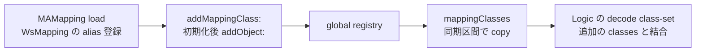

# SA-AE-TARGET-007: mapping のクラス集合と index の範囲

[日本語](SA-AE-TARGET-007-mapping-classes-index-ranges.md) · [English](SA-AE-TARGET-007-mapping-classes-index-ranges.en.md) · [前回](SA-AE-TARGET-006-exception-metadata-loading.md)

**`mappingClasses` が返す集合は、登録によって増やせる registry の copy です。** また、前回未読だった二つの predicate は、64-bit index の二つの数値範囲を調べます。新しい index の妥当性、archive の保存成功、公開トラック ID の保証にはつながりません。

| 項目 | 内容 |
|---|---|
| profile | 2026-10-05 JST、Logic Pro Creator Studio 12.3.1 / build 6682 |
| image / SHA-256 | MACore ARM64 `99a4a9adbf79c92046682eb821d8ef35145f4915a29b88839c4f026ae63cd076`、Logic ARM64 `2f141e1a1f7b90a4fb0205ffec3dbe187baf601d20e9acb398acfadcdf050998` |
| 方法 | 共通 lock、Ghidra `-noanalysis -readOnly`。MACore 7 本体（492 bytes）、Logic 2 import thunks（24 bytes）、固定 data 3 箇所 |
| 根拠 | [manifest](appleevent-mapping-analysis-manifest.json)、[境界表](../protocol/appleevent-mapping-boundaries.tsv)、前回の getter / enumeration ASM |
| capability | 全行 `runtime_verified=false`、`product_capability=false`。Logic への送信・新規接続・実機の archive 操作なし |

## 1. クラス集合は登録可能、copy はその時点の容器

MACore `0x0009a7c0` は global `0x001b5eb8` を retain し、`objc_sync_enter` 内で `copy`、sync exit 後に copy の autorelease 返値を返します。この getter 自身に dispatch-once / nonnull gate はありません。容器の copy を class objects の deep copy、全読み出し期間の固定 membership、disk snapshot と扱いません。

`0x0009a820` は dispatch-once の後、同じ registry へ `addObject:`（`0x0009a860`）を送ります。`0x0009a76c` は `NSKeyedUnarchiver` の `setClass:forClassName:` を呼び、元の incoming self を登録に渡します。alias の CFString `0x0018e820` は **`WsMapping`** と確認しました。すべての登録元や現在の集合は列挙していません。

Logic の前回 getter は `mappingClasses` の返値に追加の class-set を結合し、`decodeObjectOfClasses:forKey:` に渡します。registry の copy だけが全 allowed classes ではありません。delegate、private unarchiver initializer、decode の失敗処理も引き続き未確定です。

| 別の class-set helper（MACore） | 今回確定した境界 |
|---|---|
| `defaultPlistClasses` `0x000c9d38` | dispatch-once 後の global `0x001b63a0` を retain/autorelease 返値として返す。copy ではない |
| `commonCoreClasses` `0x000c9d78` | incoming receiver を block に capture し、dispatch-once 後の global `0x001b63b0` を同じ方法で返す |

初期化 block 本体は未読です。名前から membership や immutable 性を決めず、これら二つを Logic の getter が使っているとも決めません。

## 2. 二つの predicate は 16 個ずつの数値範囲

| MACore の本体 | ARM64 の条件 | true となる index |
|---|---|---|
| `_IsWsChannelParameterSend` `0x000a4a9c` | `unsigned64(index - 0x1c) < 0x10` | `0x1c`〜`0x2b` |
| `_IsWsChannelParameterSendMute` `0x000a4abc` | `unsigned64(index - 0x48) < 0x10` | `0x48`〜`0x57` |

命令は `sub x8,x0,base` → `cmp x8,0x10` → `cset w0,cc`。判定は x0 全 64 bits の unsigned 比較で、返値は厳密な 0 / 1 です。Logic 側の `0x01aee54c` / `0x01aee558` は同名 import thunks。ロード時の最終 binding や実行結果は観測していません。これらの数値を公開 API のパラメータ番号・send slot の仕様に昇格しません。

前回 enumeration block の候補照合は `signExtend(oldInputIndex32)+0x1c` または `+0x48`。その後、再取得した **実際の index** に predicate を適用して base を選び、`base+signExtend(newIndex32)` を setter に渡します。したがって、oldInputIndex 自身を常に 0〜15 に検証する処理とは読めません。new index の範囲を再検証する枝も、この block にはありません。

## 3. 次に読む範囲

**追補：** [SA-AE-TARGET-008](SA-AE-TARGET-008-archive-classes-initializers.md)で、registry / plist / common core の初期化と私有 initializer の実装対応を確認しました。候補の個数と実行中の集合の要素数は区別しています。

1. private archive / unarchive initializer の最終 dispatch、失敗・追加 class-set・delegate・ownership。
2. 必要な後続登録元と first receiver を読み、registry の全メンバーや decode 可能性を初期化候補だけから決めない。
3. cache を使わない archive round trip の検証条件と、mapping 更新の新 index の制約。復元・Undo は別の境界として調べる。

今回も製品コードの追加・実機書き込みは行っていません。
