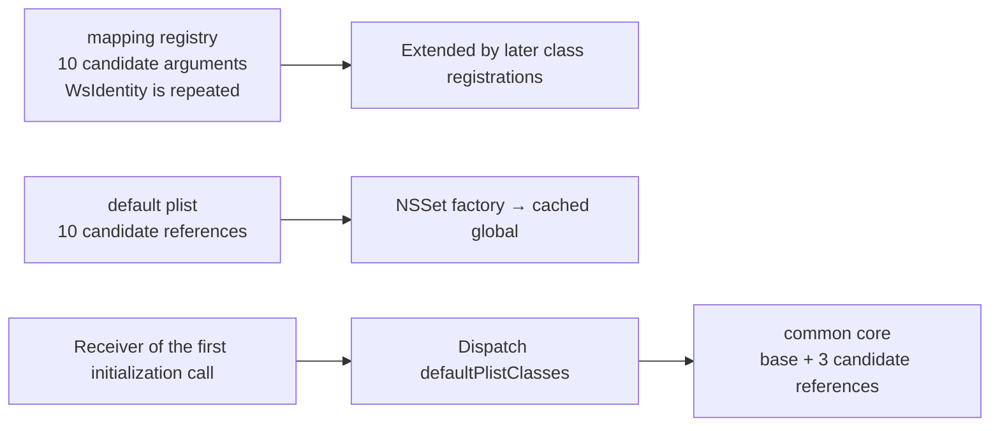

# SA-AE-TARGET-008: Archive class candidates and private initializer mappings

[日本語](SA-AE-TARGET-008-archive-classes-initializers.md) · [English](SA-AE-TARGET-008-archive-classes-initializers.en.md) · [Previous](SA-AE-TARGET-007-mapping-classes-index-ranges.en.md)

**The class references used to construct three sets, and the implementation mappings for two private initializers, are established.** The mapping registry, general plist set, and common core set are constructed separately. Combining them does not establish a fixed whitelist for every decoder or guarantee successful saving.

| Item | Details |
|---|---|
| Profile | 2026-10-05 JST, Logic Pro Creator Studio 12.3.1 / build 6682 |
| MACore ARM64 SHA-256 | `99a4a9adbf79c92046682eb821d8ef35145f4915a29b88839c4f026ae63cd076` |
| Logic ARM64 SHA-256 | `2f141e1a1f7b90a4fb0205ffec3dbe187baf601d20e9acb398acfadcdf050998` |
| Method | Shared lock, Ghidra `-noanalysis -readOnly`. 7 functions / 880 bytes, 17 fixed class slots and 2 local symbols, two-selector search within categories |
| Evidence | [Manifest](appleevent-class-construction-manifest.json), [23 class-candidate rows](../protocol/appleevent-archive-class-candidates.tsv), [initializer mappings](../protocol/appleevent-archive-initializers.tsv) |
| Capability | Every row has `runtime_verified=false` and `product_capability=false`. No live archive operations, messages to Logic, or new connections |

## 1. The three sets differ in role and construction

| Initializer (MACore) | Class candidates and container established by instructions |
|---|---|
| registry `0x0009a8ac` | In order: `NSArray`, `NSNumber`, `NSDictionary`, `WsIdentity`, **`WsIdentity` (repeated)**, `NSMutableData`, `NSString`, `NSAttributedString`, `MAKeyboardLayer`, `NSColor`. Ten arguments plus a nil terminator to `NSMutableSet.setWithObjects:` |
| default plist `0x000c9ed4` | `NSString`, `NSArray`, `NSDictionary`, `NSData`, `NSMutableString`, `NSMutableArray`, `NSMutableDictionary`, `NSMutableData`, `NSDate`, `NSNumber`. An array with count 10 → `NSSet.setWithArray:` |
| common core `0x000c9dec` | Sends `defaultPlistClasses` to the receiver at block `+0x20`, then adds an array with count 3 containing `NSNull`, `NSValue`, `NSURL` to the result |

**Ten arguments, ten array elements, and three additional candidates are distinct from actual set cardinality.** The registry has nine distinct candidate names, with the same direct class reference repeated. Nil values, factory failures, dynamic dispatch, later registration, and the first receiver have not been checked live. Common core is not described as an unconditional set of thirteen classes.

Class names were not guessed from the decompiler's omitted arguments. Chained-fixup membership / import names for 17 import slots and defined symbols for 2 direct class addresses were matched. `0x001acdd8` is `WsIdentity`, `0x001ad828` is `MAKeyboardLayer`, `0x0017c540` is `NSAttributedString`, and `0x0017c2a0` is `NSColor`. A bind recorded in the saved file is not a class object observed in the current process.

The three normal paths retain the collection result, store it in a global, and release the previous global and temporary objects. They contain no explicit nil / error / success-status check. Exception cleanup, libdispatch's full lifetime contract, immutability, and a disk snapshot are not established.

## 2. Private selectors forward to standard initializers

MACore's `MAExtensions` categories were followed through metadata in the saved binary. The method list uses `0x8000000c`, relative entries with stride 12, and selectors through selrefs. Signed displacements for selector / types / IMP are calculated relative to each field itself.

| Class and private selector | Category / method entry | IMP → native-selector stub |
|---|---|---|
| `NSKeyedArchiver` / `initRequiringSecureCoding_ma:` | `0x001a1f18` / `0x001332f8` | `0x000ca058` → `0x00129ee0` / `initRequiringSecureCoding:` |
| `NSKeyedUnarchiver` / `initForReadingFromData_ma:error:` | `0x001a1f58` / `0x00133310` | `0x000ca014` → `0x00129e60` / `initForReadingFromData:error:` |

Each IMP is a 4-byte `b`. Its 20-byte destination replaces x1 with the native selector and tail-branches to `objc_msgSend`. **This forwarding range does not change the receiver in x0, the flag / data in x2, or the error pointer in x3.** The previous archive helper's flag 1 is preserved through this forwarding range in the saved binary. No additional fallback, error clearing, or conversion of failure into success appears in this range.

The type encodings are respectively `@20@0:8B16` and `@32@0:8@16^@24`. They do not establish a successful archive or Foundation's internal failure handling. Loaded-category precedence, overrides, final dispatch, and the native initializer bodies remain unverified.

The search was limited to categories' instance / class method lists: 25 categories / 230 method entries in MACore and 51 categories / 600 method entries in Logic. There were no matches in this Logic search scope. **Method lists of the classes themselves, outside categories, were not searched, so this is not a claim of absence throughout the image.**

## 3. Verification and remaining boundaries

The 220 instructions in 7 functions and 37 extracted slices were matched against the original ARM64 bytes after resolving VM → file offsets. Readers for class references and category / method entries are restricted to hashes and known formats; the manifest records source references, extracted slices, and source hashes. Pointer formats were checked against the local SDK and the official [Apple dyld header](https://github.com/apple-oss-distributions/dyld/blob/main/include/mach-o/fixup-chains.h), and relative-method / category formats against the official [Apple objc4 header at a fixed commit](https://github.com/apple-oss-distributions/objc4/blob/fb265098298302243cd7eeaa1f63f0ba7786dd9a/runtime/objc-runtime-new.h). That public source has not been established as identical to the current runtime.

Each reader rejected three kinds of invalid input. The original binaries were unchanged; checks included a hash mismatch, out-of-range access, and an unsupported synthetic header. A separate read-only parser independently recalculated class references, category search counts, relative fields, and all 37 slices, with matching results. These are not general ObjC / Mach-O parsers.

1. These class candidates are not the full allowed-class set. Logic's getter uses an additional class-set and delegate, so those separate paths still need inspection.
2. All registration sources, current registry membership, the first receiver, decode failures, and accepted classes remain unverified.
3. The [limits of readback through the cache](SA-AE-TARGET-006-exception-metadata-loading.en.md) remain. Reopening after archive storage, UUID removal, restoration, and Undo require separate verification.

No additions to product code or live operations were made in this round either.
