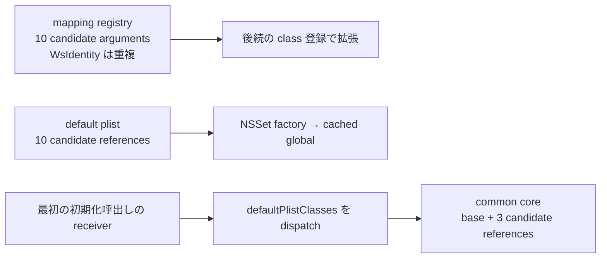

# SA-AE-TARGET-008: archive のクラス候補と私有 initializer の対応

[日本語](SA-AE-TARGET-008-archive-classes-initializers.md) · [English](SA-AE-TARGET-008-archive-classes-initializers.en.md) · [前回](SA-AE-TARGET-007-mapping-classes-index-ranges.md)

**三つの集合を作るときの class 参照と、二つの私有 initializer の実装対応を確認しました。** mapping の登録集合・汎用 plist 集合・common core 集合は別の構築です。これらを合算した固定の全 decoder whitelist や、保存成功の保証にはしません。

| 項目 | 内容 |
|---|---|
| profile | 2026-10-05 JST、Logic Pro Creator Studio 12.3.1 / build 6682 |
| MACore ARM64 SHA-256 | `99a4a9adbf79c92046682eb821d8ef35145f4915a29b88839c4f026ae63cd076` |
| Logic ARM64 SHA-256 | `2f141e1a1f7b90a4fb0205ffec3dbe187baf601d20e9acb398acfadcdf050998` |
| 方法 | 共通 lock、Ghidra `-noanalysis -readOnly`。7 functions / 880 bytes、固定 class slots 17・local symbols 2、category の二 selector 検索 |
| 根拠 | [manifest](appleevent-class-construction-manifest.json)、[class 候補23行](../protocol/appleevent-archive-class-candidates.tsv)、[initializer 対応](../protocol/appleevent-archive-initializers.tsv) |
| capability | 全行 `runtime_verified=false`、`product_capability=false`。実機の archive、Logic への送信、新規接続なし |

## 1. 三つの集合は役割と構築が異なる

| initializer（MACore） | 命令から確認した class 候補と容器 |
|---|---|
| registry `0x0009a8ac` | `NSArray`, `NSNumber`, `NSDictionary`, `WsIdentity`, **`WsIdentity`（重複）**, `NSMutableData`, `NSString`, `NSAttributedString`, `MAKeyboardLayer`, `NSColor` の順。`NSMutableSet.setWithObjects:` へ10引数＋nil終端 |
| default plist `0x000c9ed4` | `NSString`, `NSArray`, `NSDictionary`, `NSData`, `NSMutableString`, `NSMutableArray`, `NSMutableDictionary`, `NSMutableData`, `NSDate`, `NSNumber`。count 10 の配列 → `NSSet.setWithArray:` |
| common core `0x000c9dec` | block `+0x20` の receiver へ `defaultPlistClasses` を送り、その返値に `NSNull`, `NSValue`, `NSURL` の count 3 の配列を追加 |

**10引数・10配列要素・3追加候補は、実際の集合の要素数とは分けます。** registry の名前は9種で同じ direct class 参照が重複します。nil、factory 失敗、dynamic dispatch、後続登録、最初の receiver は実機で確認していません。common core を無条件に13種類の集合とはしません。

class 名は decompiler の省略された引数から推測していません。17 import slots の chained-fixup membership / import names と、2 direct class addresses の定義 symbol を照合しました。`0x001acdd8` は `WsIdentity`、`0x001ad828` は `MAKeyboardLayer`、`0x0017c540` は `NSAttributedString`、`0x0017c2a0` は `NSColor`。保存ファイルの bind は現在の process の class object ではありません。

三つの正常経路は collection の返値を retain し、global へ置き、前の global と一時 object を release します。明示的な nil / error / 成功 status の検査はありません。exception cleanup・libdispatch の全 lifetime 契約・immutable 性・disk snapshot は証明しません。

## 2. 私有 selector は通常の initializer へ転送する

MACore の `MAExtensions` category を保存バイナリの metadata で辿りました。method list は `0x8000000c`、stride 12 の relative entries で、selector は selref を介します。selector / types / IMP の signed displacement は各 field 自身を基準に計算しています。

| class と私有 selector | category / method entry | IMP → native-selector stub |
|---|---|---|
| `NSKeyedArchiver` / `initRequiringSecureCoding_ma:` | `0x001a1f18` / `0x001332f8` | `0x000ca058` → `0x00129ee0` / `initRequiringSecureCoding:` |
| `NSKeyedUnarchiver` / `initForReadingFromData_ma:error:` | `0x001a1f58` / `0x00133310` | `0x000ca014` → `0x00129e60` / `initForReadingFromData:error:` |

各 IMP は4-byte の `b`。20-byte の転送先は x1 を native selector に差し替え、`objc_msgSend` へ tail branch します。**この転送区間で x0 の receiver、x2 の flag / data、x3 の error pointer を変更しません。** 前回の archive helper の flag 1 は、この保存バイナリ内の転送区間で維持されます。追加の fallback・error 消去・失敗を成功へ変える命令はこの区間にはありません。

型情報はそれぞれ `@20@0:8B16` と `@32@0:8@16^@24`。成功した archive や Foundation 内部の失敗処理を示すものではありません。現在ロードされた category の優先順位・overrides・最終 dispatch・native initializer 本体は未確認です。

検索範囲は category の instance / class method lists に限定しました。MACore は25 category / 230 method entries、Logic は51 category / 600 method entries を調べました。Logic のこの範囲に一致はありませんが、**category 外の class 本体の method lists は未検索なので image 全体の不在とは言いません。**

## 3. 検証と残る境界

7 functions の220命令と37個の抽出 slice を、VM→file offset を解いた元の ARM64 bytes と照合しました。class references と category / method entry の reader は、hash と既知 formats に限定し、参照元・抽出 slice・source hashes を manifest に残しました。pointer format はローカル SDK と公式 [Apple dyld header](https://github.com/apple-oss-distributions/dyld/blob/main/include/mach-o/fixup-chains.h)、relative method / category の形式は commit を固定した公式 [Apple objc4 header](https://github.com/apple-oss-distributions/objc4/blob/fb265098298302243cd7eeaa1f63f0ba7786dd9a/runtime/objc-runtime-new.h) に照合しました。この公開 source と現在の runtime の同一性は未確認です。

両 reader はそれぞれ3種類の不正入力を拒否しました。元バイナリを変更せず、hash 不一致・範囲外・未対応の synthetic header などを検査しました。別の読み取り専用 parser で、class references・category の走査数・relative fields・全37 slice を独立に再計算して一致しています。汎用の ObjC / Mach-O parser ではありません。

1. 今回の class 候補は全 allowed classes ではありません。Logic の getter の追加 class-set・delegate と UUID coder は [SA-AE-TARGET-009](SA-AE-TARGET-009-decoder-delegate-uuid.md)で確認しました。実機での class 受理・decode 成功は未確認です。
2. すべての登録元と現在の registry、first receiver、decode の失敗・受理した class は未確認です。
3. [キャッシュを使う読み戻しの限界](SA-AE-TARGET-006-exception-metadata-loading.md)は残ります。archive の保存後再読込・UUID 除去・復元・Undo を別に検証します。

製品コードや実機操作への追加は今回も行っていません。
