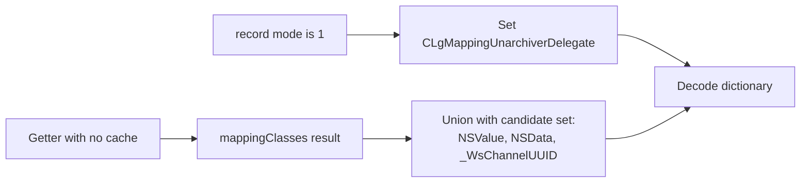

# SA-AE-TARGET-009: Additional decode candidates, delegate, and UUID byte paths

[日本語](SA-AE-TARGET-009-decoder-delegate-uuid.md) · [English](SA-AE-TARGET-009-decoder-delegate-uuid.en.md) · [Previous](SA-AE-TARGET-008-archive-classes-initializers.en.md)

**The three class candidates added by the getter, the mode 1 delegate, and UUID encode / decode paths are established.** If the list of original class names contains `MAMapping`, the delegate returns a `MANullParameterMapping` class candidate. UUID data has 16 bytes; that alone does not establish restoration after saving or stable track identity.

| Item | Details |
|---|---|
| Profile | 2026-10-05 JST, Logic Pro Creator Studio 12.3.1 / build 6682 |
| Logic ARM64 SHA-256 | `2f141e1a1f7b90a4fb0205ffec3dbe187baf601d20e9acb398acfadcdf050998` |
| Method | Shared lock, Ghidra `-noanalysis -readOnly`. 6 new functions / 596 bytes, matched against the existing getter ASM and fixed metadata |
| Evidence | [Manifest](appleevent-decoder-analysis-manifest.json), [boundary table](../protocol/appleevent-decoder-boundaries.tsv), [previous class candidates](../protocol/appleevent-archive-class-candidates.tsv) |
| Capability | Every row has `runtime_verified=false` and `product_capability=false`. No live archive / decode operations or messages to Logic |

## 1. The getter adds three candidates to the registry result

The range `0x019d83f4..0x019d841c` in getter `0x019d82b4` preserves the results of three `_objc_opt_class` calls. The first candidate for `NSSet.setWithObjects:` is passed in x2, the second and third on the stack, followed by a nil terminator. `setByAddingObjectsFromSet:` combines this set with the registry result at `0x019d8440`; decode with key `dictionary` is at `0x019d8460`.

`NSValue` / `NSData` were matched through import slots; `_WsChannelUUID` through the name / method list in local class metadata. Definition symbols corresponding to the two exact class addresses were not obtained in this search, so their names were not inferred from symbols. Fixups were followed from class → class data → name. **Establishing the path that adds three candidates does not establish the full current allowed-class set or successful decoding.** Nil factory results, the dynamic registry, and Foundation's acceptance rules are separate boundaries.

Only when record `+0x02` is 1 does `0x019d83ac` allocate / initialize the delegate and `0x019d83c0` pass it to `setDelegate:`. This conditional setup is not generalized to mode 2. There is no explicit nil check on alloc/init; the normal path releases the delegate after the finish-decoding call.

## 2. Delegate substitution does not establish reconstruction of the original mapping

| Callback | Instruction-level behavior |
|---|---|
| `0x019a66d8`, 300 bytes | Scans `originalClasses` (incoming x4) by fast enumeration. Sends `isEqualToString:` to each element, with constant string **`MAMapping`** |
| Match branch `0x019a6770` | Returns the `_objc_opt_class` result for imported `MANullParameterMapping` |
| Empty / all unmatched `0x019a679c` | Returns literal nil |

The unarchiver in incoming x2 and requested class name in x3 do not participate in this body's conditions. Enumeration stops at a matching candidate; enumeration mutation checking and a stack guard are present. The type encoding is `#40@0:8@16@24@32`.

This is a static mapping to **an alternative class candidate returned when Foundation invokes the callback**. The conditions under which the callback actually runs, acceptance of the returned class, and preservation of the original mapping's meaning or values have not been established. The `MANullParameterMapping` body is also outside this pass.

## 3. UUID paths handle 16 bytes under `UUIDBytes`

| Function | Static facts and limits |
|---|---|
| `supportsSecureCoding` `0x019a386c`, 8 bytes | `mov w0,#1; ret`. Matched against class-method metadata. This is not a check of the whole archive's success / failure |
| `initWithCoder:` `0x019a39f0`, 156 bytes | Calls `decodeBytesForKey:returnedLength:` with key `UUIDBytes`. Returns nil if the returned length is not 16 |
| Length-16 branch `0x019a3a40..0x019a3a58` | Reads 16 bytes from the decode result, stores the result of `CFUUIDCreateFromUUIDBytes` at receiver `+0x08`, and returns the receiver. There is no explicit nil check on the byte pointer or CFUUID creation result |
| `encodeWithCoder:` `0x019a3aa8`, 92 bytes | Passes receiver `+0x08` to `CFUUIDGetUUIDBytes` and saves returned x0 / x1 on the stack. Calls `encodeBytes:length:forKey:` with length 16 and key `UUIDBytes` |

The initializer's normal path retains / releases the coder and receiver; the length-16 branch retains the receiver to be returned before entering the shared release path. Complete EH coverage, native CFUUID failure handling, and the full ownership contract remain unverified. The returned-length stack slot is not initialized before the call in this body. Dependence on the coder writing its out parameter is not a guarantee of live safety.

The two 20-byte selector stubs tail-branch to ordinary `objc_msgSend`. Selector-slot fixup membership and the actual strings were matched; keys and arguments were not determined from unresolved decompiler names alone. Encode arguments are bytes in x2, length in w3, and key in x4. The decompiler rendering that mixed a CFUUID value with the incoming selector was distinguished from the machine-code stores of x0 / x1.

## 4. Verification and next boundaries

The 149 instructions in the 6 new functions and the 149 instructions in the previous getter were matched against the original binary. Fixed metadata checks covered 3 class import slots, paths to the names of 2 local classes, 4 method entries, 2 CFStrings, and 2 coder selectors. Raw fixups, Ghidra's resolved pointer display, and external placeholders are treated as distinct representations. The fixed reader rejected three kinds of invalid input. Independent instruction, metadata, and hash checks with a separate parser also agreed.

1. The invoke pointer in getter once block `0x02337fc0` was confirmed as `0x019d87e8` (a 4-byte thunk). The registration body remains unread.
2. Examine the implementation of `finishDecoding_ma`, and `MANullParameterMapping` decoding, failures, and value preservation next.
3. Foundation's internal dispatch / class acceptance, a round trip without the cache, reopening after saving, restoration, and Undo remain unverified live.

No additions to product code or live operations were made in this round either.

**Follow-up (2026-10-05):** The static parts of items 1 and 2 above are covered by [SA-AE-TARGET-010](SA-AE-TARGET-010-registrations-null-mapping-finish.en.md): old class-name registration, an empty mapping path that does not use coder attributes, the pre-finish error BOOL, and the getter path that ignores it. Native failures, runtime acceptance, and restoration after saving remain unverified.
