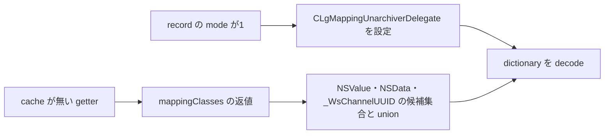

# SA-AE-TARGET-009: decode の追加候補・delegate・UUID の byte 経路

[日本語](SA-AE-TARGET-009-decoder-delegate-uuid.md) · [English](SA-AE-TARGET-009-decoder-delegate-uuid.en.md) · [前回](SA-AE-TARGET-008-archive-classes-initializers.md)

**getter に追加される三つの class 候補、mode 1 の delegate、UUID の encode / decode を確認しました。** delegate は元クラス名の一覧に `MAMapping` があれば `MANullParameterMapping` の class 候補を返します。UUID の byte 数は16ですが、そのことだけで保存後の復元や安定したトラック ID を保証しません。

| 項目 | 内容 |
|---|---|
| profile | 2026-10-05 JST、Logic Pro Creator Studio 12.3.1 / build 6682 |
| Logic ARM64 SHA-256 | `2f141e1a1f7b90a4fb0205ffec3dbe187baf601d20e9acb398acfadcdf050998` |
| 方法 | 共通 lock、Ghidra `-noanalysis -readOnly`。新規6関数 / 596 bytes、既存 getter の ASM と固定 metadata の照合 |
| 根拠 | [manifest](appleevent-decoder-analysis-manifest.json)、[境界表](../protocol/appleevent-decoder-boundaries.tsv)、[前回のクラス候補](../protocol/appleevent-archive-class-candidates.tsv) |
| capability | 全行 `runtime_verified=false`、`product_capability=false`。実機での archive / decode と Logic への送信なし |

## 1. getter は registry に三つの候補を追加する

getter `0x019d82b4` の `0x019d83f4..0x019d841c` は三つの `_objc_opt_class` の返値を保持します。`NSSet.setWithObjects:` の第1候補を x2、第2・第3候補を stack に置き、nil で終端します。registry の返値との `setByAddingObjectsFromSet:` は `0x019d8440`、`dictionary` を key にした decode は `0x019d8460` です。

`NSValue` / `NSData` は import slots、`_WsChannelUUID` は local class metadata の name / method list で照合しました。二つの exact class address に対応する定義 symbol は今回の検索で得られなかったため、symbol 名から推定していません。class → class data → name の fixup を読みました。**三つの候補を追加する経路が分かっても、現在の全 allowed classes や decode の成功は未確定です。** factory の nil、動的 registry、Foundation の受理規則は別の境界です。

record `+0x02` が1のときだけ、`0x019d83ac` で delegate を alloc/init し、`0x019d83c0` で `setDelegate:` へ渡します。mode 2 にはこの条件付き設定を一般化しません。明示的な alloc/init の nil 検査はなく、正常経路では finish-decoding 呼出しの後に delegate を release します。

## 2. delegate が返すのは元 mapping の再現ではない

| callback | 命令から確認した処理 |
|---|---|
| `0x019a66d8`、300 bytes | `originalClasses`（incoming x4）を fast enumeration で走査。各要素へ `isEqualToString:`、定数文字列は **`MAMapping`** |
| 一致の枝 `0x019a6770` | import slot の `MANullParameterMapping` に対する `_objc_opt_class` の返値を返す |
| 空・全不一致 `0x019a679c` | literal nil を返す |

incoming x2 の unarchiver、x3 の要求 class name は、この body の条件に使われません。一致候補があればそこで走査を終え、列挙中の mutation check と stack guard があります。型情報は `#40@0:8@16@24@32` です。

これは **Foundation が callback を呼んだときに返す代替 class 候補**の静的対応です。callback が実際に呼ばれる条件、返された class の受理、元 mapping の意味や値を保存するかは確認していません。`MANullParameterMapping` 本体も今回の対象外です。

## 3. UUID は `UUIDBytes` の16バイトを扱う

| 関数 | static facts と限界 |
|---|---|
| `supportsSecureCoding` `0x019a386c`、8 bytes | `mov w0,#1; ret`。class method の metadata と照合。archive 全体の成功・失敗を示す検査ではない |
| `initWithCoder:` `0x019a39f0`、156 bytes | `decodeBytesForKey:returnedLength:`、key `UUIDBytes`。returned length が16でなければ nil を返す |
| 長さ16の枝 `0x019a3a40..0x019a3a58` | decode の返値から16バイトを読み、`CFUUIDCreateFromUUIDBytes` の返値を receiver `+0x08` に保存して receiver を返す。byte pointer と CFUUID 生成結果の明示的な nil 検査はない |
| `encodeWithCoder:` `0x019a3aa8`、92 bytes | receiver `+0x08` を `CFUUIDGetUUIDBytes` へ渡し、戻った x0 / x1 を stack へ保存。`encodeBytes:length:forKey:` へ長さ16・key `UUIDBytes` を渡す |

initializer の正常経路では coder と receiver を retain/release し、長さ16の枝は返す receiver を retain してから共通の release 経路へ進みます。全 EH・native CFUUID の失敗処理・所有権の全契約は未確認です。returned-length の stack slot は、この body では call 前に初期化していません。coder が out parameter を書く契約への依存を、実機での安全性の保証にしません。

二つの20-byte selector stub は通常の `objc_msgSend` へ tail branch します。selector slots の fixup membership と実文字列を照合し、decompiler の未解決名だけで key や引数を決めていません。encode の引数は bytes が x2、length が w3、key が x4 です。CFUUID の値と input selector が混ざっていた decompiler 表示は、機械語の x0 / x1 保存と区別しました。

## 4. 検証と次の境界

新規6関数の149命令と、前回 getter の149命令を元バイナリへ照合しました。固定 metadata は3 class import slots、2 local class の名前への経路、4 method entries、2 CFString、2 coder selectors を確認しました。raw fixup と、Ghidra が解決後に表示する pointer / 外部 placeholder は別の表現として扱います。固定 reader は3種類の不正入力を拒否しました。別 parser による命令・metadata・ハッシュの独立照合でも一致しました。

1. getter の once block `0x02337fc0` の invoke は `0x019d87e8`（4-byte thunk）と確認しました。本体の登録処理は未読です。
2. `finishDecoding_ma` の実装、`MANullParameterMapping` の decode と失敗・値の保持を次に調べます。
3. Foundation 内部の dispatch / class 受理、cache を使わない round trip、保存後再読込・復元・Undo は実機未確認です。

今回も製品コードや実機操作への追加は行っていません。
