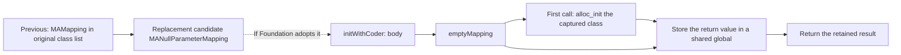
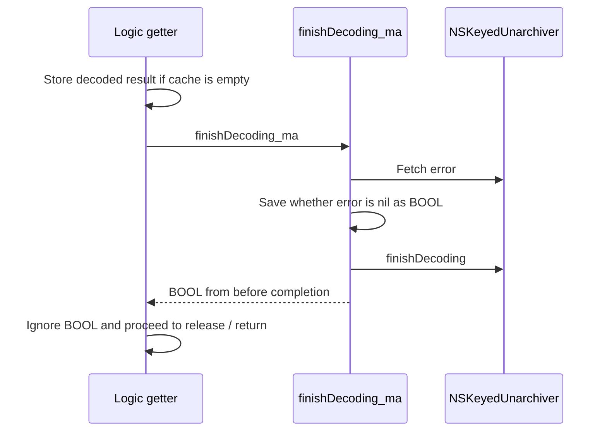

# SA-AE-TARGET-010: Class-name registrations, empty mappings, and decode completion

[日本語](SA-AE-TARGET-010-registrations-null-mapping-finish.md) · [English](SA-AE-TARGET-010-registrations-null-mapping-finish.en.md) · [Previous](SA-AE-TARGET-009-decoder-delegate-uuid.en.md)

**The replacement class leads to a path that returns a shared empty mapping, without reading back the original attributes.** Also, `finishDecoding_ma` returns whether `error` was nil **before** completion. The getter does not use this BOOL and first stores the decoded result if the cache is empty. Consequently, the getter's value or a read from the cache alone cannot confirm successful decode completion or successful restoration after saving.

| Item | Details |
|---|---|
| profile | 2026-10-05 JST, Logic Pro Creator Studio 12.3.1 / build 6682 |
| Logic ARM64 SHA-256 | `2f141e1a1f7b90a4fb0205ffec3dbe187baf601d20e9acb398acfadcdf050998` |
| MACore ARM64 SHA-256 | `99a4a9adbf79c92046682eb821d8ef35145f4915a29b88839c4f026ae63cd076`. This differs from the hash of the whole installed universal binary |
| Method | Shared lock, Ghidra `-noanalysis -readOnly`. Cross-checked 18 newly queried functions / 816 bytes and the existing 596-byte getter against the original machine code |
| Evidence | [Manifest](appleevent-registration-finish-manifest.json), [class-name registration table](../protocol/appleevent-unarchiver-aliases.tsv), [boundary table](../protocol/appleevent-registration-finish-boundaries.tsv) |
| capability | Every row has `runtime_verified=false`, `product_capability=false`. This investigation sent nothing to Logic and performed no live decoding |

## 1. Call sites registering three legacy class names

The operation confirmed here is a call to `setClass:forClassName:` on `NSKeyedUnarchiver`. It is separate from the **candidate set passed to decoding** in the previous investigation.

| Image / function | Class name in the archive | Class candidate passed in x2 | Call site |
|---|---|---|---|
| Logic, once body `0x019d87ec` | `WsKeyboardLayer` | `_objc_opt_class` return value for `MAKeyboardLayer` | `0x019d8844` |
| Logic, same body | `WsDirectToChannelMIDIParameterMapping` | `_objc_opt_class` return value for `MAChannelMIDIParameterMapping` | `0x019d8868` |
| MACore, `MANullParameterMapping +load` `0x001094f8` | `WsNoParameterMapping` | `_objc_opt_class` return value for the direct `MANullParameterMapping` class | `0x0010952c` |

The invoke pointer of the Logic getter's once block `0x02337fc0` leads to `0x019d87e8` → B `0x019d87ec`. The body contains a C++ initialization guard. If bit 0 of byte `0x02777217` is set, it skips the two registration calls and returns. The initialization branch zeros the qword containing this byte, but this body does not set the gate to 1. The gate's current value and any subsequent changes have not been observed. The outer `_dispatch_once` and this byte condition must be distinguished.

After the two calls, the body selects the pointer value at `0x025ecef8` as the receiver if it is non-nil, or `0x025ecf00` if it is nil, then tail-branches to `[vtable +0x18]`. **The current target of this indirect call remains unresolved.** Ghidra's candidate Ref `0x019d8958` is not treated as an unconditional execution target. Another guard registers a cleanup function through `__cxa_atexit`; its return value and the full cleanup behavior are outside this investigation's scope.

After registering the alias, MACore `+load` sends `addMappingClass:` to the direct `MAMapping` class. The argument in x2 is the **incoming self** of `+load`. This argument comes from incoming self; the alias argument is taken from the `_objc_opt_class` return value.

Import slots, library ordinals, the direct class name, CFString flags / lengths / actual strings, and selector stubs were cross-checked. **Runtime registration order, the effects of other categories or later registrations, acceptance by Foundation, and effective alias behavior have not been verified.** These three call sites do not establish whole-archive restoration capability or a complete list of class names.

## 2. `MANullParameterMapping` does not read the coder's attributes

| Function / image | Normal path confirmed from the instructions |
|---|---|
| MACore `initWithCoder:` `0x001093b4`, 64 bytes | Does not use the coder in incoming x2; sends `emptyMapping` to the direct class `0x001aeb38`. Retains that return value, releases the original receiver, and returns the value. This body contains no call to the superclass's `initWithCoder:` and no attribute decoding |
| MACore `emptyMapping` `0x00109548`, 116 bytes | Captures the incoming class at block `+0x20`. Calls `_dispatch_once` if token `0x001b6ca8` is not −1, then returns global `0x001b6ca0` with retain/autorelease handling |
| Its block `0x001095c4`, 40 bytes | Passes the captured class to `_objc_alloc_init` and stores **return value x0** in the global. Releases the previous global value. There is no explicit nil check |

Here, “shared” refers to the static path through one process global and a once token. It does not mean that successful creation, a non-nil result, or identity across all calls has been verified live. The block's decompiler displayed the captured class value as the value stored in the global, but the machine code stores the **return value** of `_objc_alloc_init`.

The finding is that **this initializer body in MACore contains no operation that reads archive attributes**. It cannot serve as a path guaranteeing preservation of the original mapping's meaning or values. However, live callback invocation, the conditions under which Foundation adopts the candidate, and loaded-category precedence remain unverified.

## 3. Constant getters have image and dispatch boundaries

| Definition body in MACore | Return value |
|---|---|
| `supportsSecureCoding` `0x001095bc` | w0 = 1 |
| `supportsMappingRelation` `0x001093f4` | w0 = 0 |
| `destination` `0x0010944c` | x0 = −1 |
| `midiStatus` `0x00109454` | w0 = 0 |
| `index` `0x001094d0` | x0 = −1. Method metadata is `q16@0:8`, a signed 64-bit getter. The decompiler's `char *` is not adopted |

The class metadata names `MAParameterMapping` as the superclass. The fixed MACore instance-method list with 10 entries and the 19-entry `MANullParameterMapping(LogicAdditions)` list in Logic contain no `encodeWithCoder:`. **This does not establish the absence of encoding through the superclass or other loaded categories, or the final runtime dispatch.** The superclass's `encodeWithCoder:` body has not been read.

In particular, LogicAdditions defines `destination` at `0x013f62c8`. Its body was not read in this investigation. MACore's `destination = −1` is not generalized to the effective value while Logic is running. Similarly, `supportsSecureCoding = 1` is not evidence that archiving or decoding succeeds.

## 4. The wrapper returns the error state before completion; the getter ignores the BOOL

Reading row 1 of method list `0x00133308` in `NSKeyedUnarchiver(MAExtensions)` through its signed relative fields established `finishDecoding_ma` → **`0x000ca018` / 64 bytes**. It is separate from the adjacent initializer's four-byte thunk. Its type encoding is `B16@0:8`.

The wrapper obtains `error` at `0x000ca028` and saves the nil-comparison result in w20 at `0x000ca034..0x000ca038`. After releasing that object, it calls `finishDecoding` at `0x000ca044` and returns the saved BOOL. **It does not fetch `error` again after completion.** The internals of `finishDecoding` itself and all control flow involving exceptions or failure have not been analyzed.

On the normal path, the existing getter `0x019d82b4` stores the decoded result at record `+0x28` at `0x019d84a8` if the cache is empty, then calls the wrapper at `0x019d84c4` after unlocking. The next instruction, `0x019d84c8`, overwrites x0 with another object before proceeding to release; there is no conditional branch on the wrapper's return value. An existing cache value causes the store branch to be skipped. This does not claim that a nil decoded result creates a non-nil cache.

At this call site, the BOOL from before completion is not used to decide success. Errors after completion, cache handling during exceptions, decoding again without using the cache, and reloading after saving each require separate verification.

## 5. Validation and the next boundary

The 204 instructions from the 18 newly queried functions and the existing getter's 149 instructions were cross-checked against the original ARM64 bytes. Class names, selectors, and category method entries were verified through raw chained-fixup page membership and the bases of their relative fields. The hashes of the whole installed universal binary, the ARM64 slice, the analysis copy, and the Ghidra program were distinguished and cross-checked. An independent reader agreed on the instruction, metadata, and CFString results.

**Follow-up:** The fixed fallback target, LogicAdditions' `destination`, the parent encoder and small helper definitions are now checked in [SA-AE-TARGET-011](SA-AE-TARGET-011-fallback-parent-encode.en.md). The fixed fallback target is RET, Logic's destination sign-extends `logicOnlyGInstID`, and the parent encoder has calls for 19 keys. “Unread” in this text describes the scope at 010; this follow-up does not establish effective runtime dispatch. Foundation acceptance and failure, native allocation, a round trip without using the cache, restoration after saving, and Undo remain unverified live.

These results are static evidence for incorporating the replacement candidate and cache behavior into the readback contract. They add no product AppleEvent capability.
