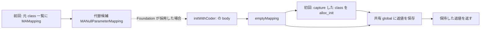
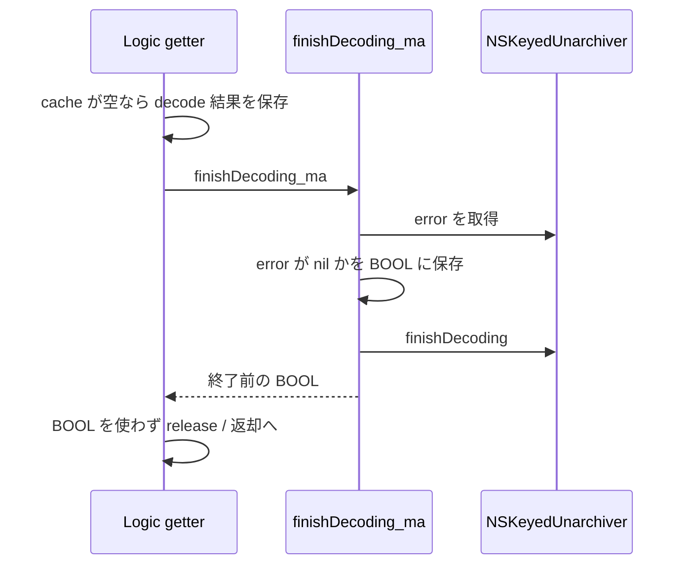

# SA-AE-TARGET-010: クラス名の登録・空マッピング・decode の終了処理

[日本語](SA-AE-TARGET-010-registrations-null-mapping-finish.md) · [English](SA-AE-TARGET-010-registrations-null-mapping-finish.en.md) · [前回](SA-AE-TARGET-009-decoder-delegate-uuid.md)

**代替 class の先は、元の属性を読み戻す処理ではなく、共有の空マッピングを返す経路でした。** また、`finishDecoding_ma` が返すのは終了**前**の `error` が nil かどうかです。getter はこの BOOL を使わず、空の cache に decode 結果を保存する処理を先に行います。したがって、getter の値や cache からの読み戻しだけでは、decode の終了や保存後の復元が成功したことを確認できません。

| 項目 | 内容 |
|---|---|
| profile | 2026-10-05 JST、Logic Pro Creator Studio 12.3.1 / build 6682 |
| Logic ARM64 SHA-256 | `2f141e1a1f7b90a4fb0205ffec3dbe187baf601d20e9acb398acfadcdf050998` |
| MACore ARM64 SHA-256 | `99a4a9adbf79c92046682eb821d8ef35145f4915a29b88839c4f026ae63cd076`。installed universal 全体の hash とは別 |
| 方法 | 共通 lock、Ghidra `-noanalysis -readOnly`。新規18関数 / 816 bytes と、既存 getter 596 bytes を元の機械語へ照合 |
| 根拠 | [manifest](appleevent-registration-finish-manifest.json)、[クラス名の登録表](../protocol/appleevent-unarchiver-aliases.tsv)、[境界表](../protocol/appleevent-registration-finish-boundaries.tsv) |
| capability | 全行 `runtime_verified=false`、`product_capability=false`。本調査では Logic への送信・実機 decode を行っていない |

## 1. 三つの旧 class 名を登録する call site

ここで確認したのは `NSKeyedUnarchiver` への `setClass:forClassName:` 呼出しです。前回の **decode に渡す候補集合**とは、別の処理です。

| image / 関数 | archive 内の class 名 | x2 に渡す class 候補 | call site |
|---|---|---|---|
| Logic、once body `0x019d87ec` | `WsKeyboardLayer` | `MAKeyboardLayer` の `_objc_opt_class` 返値 | `0x019d8844` |
| Logic、同上 | `WsDirectToChannelMIDIParameterMapping` | `MAChannelMIDIParameterMapping` の `_objc_opt_class` 返値 | `0x019d8868` |
| MACore、`MANullParameterMapping +load` `0x001094f8` | `WsNoParameterMapping` | direct `MANullParameterMapping` class の `_objc_opt_class` 返値 | `0x0010952c` |

Logic getter の once block `0x02337fc0` の invoke は `0x019d87e8` → B `0x019d87ec` です。body には C++ 初期化 guard があり、byte `0x02777217` の bit 0 が立っていれば二つの登録 call を省いて戻ります。この byte を含む qword は初期化の枝で0にしますが、この body は gate を1にしていません。現在の gate 値や、その後の変更は未観測です。外側の `_dispatch_once` と、この byte 条件を混同しません。

二つの call の後は、`0x025ecef8` の pointer が非 nil ならその値、nil なら `0x025ecf00` を receiver に選び、`[vtable +0x18]` へ tail branch します。**この間接 call の現在の対象は未確定です。** Ghidra の候補 Ref `0x019d8958` を、無条件の実行先とは扱いません。もう一つの guard では `__cxa_atexit` への登録があり、その戻り値や全 cleanup は今回の対象外です。

MACore `+load` は alias 登録の後、direct `MAMapping` class へ `addMappingClass:` を送ります。こちらの引数 x2 は、`+load` の **incoming self** です。alias に渡した `_objc_opt_class` の返値と同じ変数ではありません。

import slots、library ordinal、direct class の name、CFString の flags / 長さ / 実文字列、selector stub を照合しました。**実行時の登録順、別カテゴリや後続登録の影響、Foundation による受理、alias の実効性は確認していません。** 三つの call site は archive 全体の復元能力や完全な class 名一覧を表しません。

## 2. `MANullParameterMapping` は coder の属性を読まない

| 関数 / image | 命令から確認した正常経路 |
|---|---|
| MACore `initWithCoder:` `0x001093b4`、64 bytes | incoming x2 の coder を使わず、direct class `0x001aeb38` へ `emptyMapping` を送る。その返値を retain し、元 receiver を release して返す。親の `initWithCoder:` や属性の decode は、この body にない |
| MACore `emptyMapping` `0x00109548`、116 bytes | incoming class を block `+0x20` に capture。token `0x001b6ca8` が −1 でなければ `_dispatch_once` を呼び、global `0x001b6ca0` を retain/autorelease して返す |
| 同 block `0x001095c4`、40 bytes | capture した class を `_objc_alloc_init` へ渡し、その **返値 x0** を global に保存。以前の global を release。明示的な nil 検査はない |

ここでいう「共有」は一つの process global と once token の静的経路を指します。生成成功、非 nil、全 call の同一性を実機で確認した表現ではありません。block の decompiler は class の capture 値を global に保存するように表示しましたが、機械語では `_objc_alloc_init` の **返値**を保存しています。

これは **MACore のこの initializer body が、archive 属性を読む処理を持たない**という結果です。元 mapping の意味や値の保持を保証する経路にはできません。ただし、実行中の callback 発生、Foundation が候補を採用する条件、loaded categories の優先順位は未確認です。

## 3. 定数 getter は image と dispatch の境界を持つ

| MACore の定義 body | 返値 |
|---|---|
| `supportsSecureCoding` `0x001095bc` | w0 = 1 |
| `supportsMappingRelation` `0x001093f4` | w0 = 0 |
| `destination` `0x0010944c` | x0 = −1 |
| `midiStatus` `0x00109454` | w0 = 0 |
| `index` `0x001094d0` | x0 = −1。method metadata は `q16@0:8`、64-bit signed getter。decompiler の `char *` を採用しない |

class metadata では superclass は `MAParameterMapping` です。固定で読んだ MACore 自身の instance method list 10件と、Logic の `MANullParameterMapping(LogicAdditions)` 19件には `encodeWithCoder:` がありません。**親や他の loaded categories の encode、runtime の最終 dispatch がないことを意味しません。** 親の `encodeWithCoder:` の body は未読です。

特に LogicAdditions の `destination` は `0x013f62c8` に定義されています。その body は今回未読です。MACore `destination = −1` を Logic 実行中の有効な値へ一般化しません。`supportsSecureCoding = 1` も、archive / decode の成功を検証した結果ではありません。

## 4. 終了前の error を返し、getter は BOOL を使わない

`NSKeyedUnarchiver(MAExtensions)` の method list `0x00133308`、row 1 を signed relative fields から読んだ結果、`finishDecoding_ma` → **`0x000ca018` / 64 bytes** と分かりました。隣接する initializer の4-byte thunkではありません。type encoding は `B16@0:8` です。

wrapper の `0x000ca028` は `error` を取得し、`0x000ca034..0x000ca038` で nil 比較の結果を w20 に保持します。その object を release した後、`0x000ca044` で `finishDecoding` を呼び、保存した BOOL を返します。**終了後の `error` を再取得する処理はありません。** `finishDecoding` 自体の内部、例外や失敗時の全制御フローは未解析です。

既存 getter `0x019d82b4` は、正常経路で cache が空なら `0x019d84a8` で decode 結果を record `+0x28` に保存し、unlock の後 `0x019d84c4` で wrapper を呼びます。次の `0x019d84c8` は x0 を別の object に上書きして release へ進み、wrapper の返値には条件分岐しません。別の既存 cache があれば保存の枝を省きます。nil の decode 結果が非 nil cache を作ると主張しているわけではありません。

この call site では、終了前 BOOL を成功判定に使っていません。終了後のエラー、例外時の cache の扱い、cache を使わない再 decode、保存後の再読込は、それぞれ別の検証が必要です。

## 5. 検証と次の境界

新規18関数の204命令と、既存 getter の149命令を元の ARM64 byte へ照合しました。クラス名・selector・category method entry は raw chained fixup の page membership と relative field の基準を確認しました。installed universal 全体、ARM64 slice、解析 copy、Ghidra program の hash を区別して照合しています。別 reader でも命令・metadata・CFString の結果が一致しました。

次は getter から呼ばれる once body の末尾の間接 call を、その fallback object / vtable の固定 metadata から追います。親の encode と LogicAdditions の `destination` を読む場合も、定義 body と runtime dispatch を区別します。Foundation の受理・失敗、native allocation、cache を使わない round trip、保存後の復元・Undo は引き続き実機未確認です。

今回の結果は、代替候補と cache の挙動を読み戻し契約に反映させるための静的証拠です。製品の AppleEvent capability を追加したものではありません。
