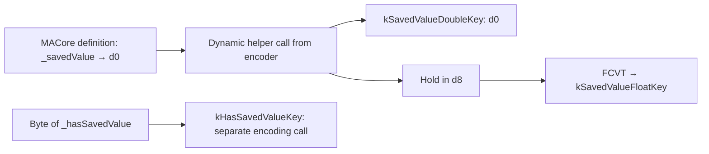

# SA-AE-TARGET-011: The fixed fallback, Logic's destination, and the parent's encoding keys

[日本語](SA-AE-TARGET-011-fallback-parent-encode.md) · [English](SA-AE-TARGET-011-fallback-parent-encode.en.md) · [Previous](SA-AE-TARGET-010-registrations-null-mapping-finish.en.md)

**Two previously unread areas have now been examined within the scope of their definitions.** The function pointed to by the fixed fallback contains only `RET`. The empty mapping's `destination` in Logic sign-extends the return value of `logicOnlyGInstID`. The parent `MAParameterMapping` encoder contains encoding calls for 19 keys and passes the saved value as both double and float. Despite its name, this definition of `shouldUseSavedValueWithCoder:` does not return a boolean.

These findings concern **definitions and call sites in the binaries**. The final dispatch while running, the resulting archive, and the values after reloading have not been verified. They are not evidence that attributes replaced by an empty mapping can be restored to their original state.

| Item | Details |
|---|---|
| profile | 2026-10-05 JST, Logic Pro Creator Studio 12.3.1 / build 6682 |
| Logic ARM64 SHA-256 | `2f141e1a1f7b90a4fb0205ffec3dbe187baf601d20e9acb398acfadcdf050998` |
| MACore ARM64 SHA-256 | `99a4a9adbf79c92046682eb821d8ef35145f4915a29b88839c4f026ae63cd076`. The whole installed universal binary is `76ab2a5f50b3ef120786369b5bf8b53dfc87a3b4107438e0894ab5f9b8095c52` |
| Method | Shared lock, Ghidra `-noanalysis -readOnly`. Compared 14 functions / 860 bytes / 215 instruction words against the current analysis copies. Separately read the fixed 20-byte Logic selector stub and 24 bytes of MACore native import stubs |
| Evidence | [Manifest](appleevent-parent-encode-manifest.json), [encoding-key table](../protocol/appleevent-parent-encode-keys.tsv), [boundary table](../protocol/appleevent-parent-encode-boundaries.tsv) |
| capability | Every row has `runtime_verified=false`, `product_capability=false`. This investigation performed no Logic operation, connection, or AppleEvent send |

## 1. The fixed fallback target simply returns

The previous once body `0x019d87ec` selected a receiver after registration and tail-branched to `[vtable +0x18]`. Its **embedded fallback's initial metadata** was read using raw chained-fixup page membership.

`0x025ecf00 → 0x02337b58` and slot `0x02337b70 → 0x019d8958` are both rebases. Function `0x019d8958` is four bytes and contains only `RET x30`. It is not a B-instruction thunk. This fixed body contains no additional registration, decoding, or cleanup.

**This does not establish that every call reaches this RET.** A non-nil external receiver, changes to the vptr while running, and the object's state after initialization remain unobserved. The boundary closed here is one branch: the fixed fallback's target.

## 2. Logic's `destination` widens a signed32 result to signed64

The method list for Logic's `MANullParameterMapping(LogicAdditions)` was checked against each relative field's own base and the imported owner class.

| Definition | Metadata / body |
|---|---|
| Logic `destination` | IMP `0x013f62c8`, 24 bytes, type `q16@0:8` |
| Selector called | Stub `0x01b5ade0` → `logicOnlyGInstID`. The `_objc_msgSend` import was verified |
| Return-value conversion | After BL `0x013f62d0`, `SXTW x0,w0` at `0x013f62d4`. Widens signed 32 bits to 64 bits and returns |
| Fixed getter candidate | `logicOnlyGInstID` in the same category → IMP `0x013f622c`, type `i16@0:8`. **Its body was not read in this investigation** |

The previous MACore definition, `destination = −1`, cannot describe this Logic definition. However, the final getter reached by this BL while running, its value, and loaded-category precedence remain unresolved. There is also no evidence equating `logicOnlyGInstID` with a public track number, UUID, or Remote identifier.

## 3. The parent encoder's 19 encoding keys

MACore `MAParameterMapping::encodeWithCoder:` is at `0x0009b460` / 636 bytes. It retains the coder in incoming x2 and uses it as the receiver of each encoding selector. The 19 CFStrings were checked for flags `0x7c8`, character pointers, lengths, terminators, and actual bytes. The `k…Key` entries in the table are also **actual strings**, rather than names assigned by the analyst.

| Encoding key | Encoding selector | Value source / condition in this body |
|---|---|---|
| `rangeLow` | `encodeLong:forKey:` | `_rangeLow`, signed64 |
| `rangeHigh` | `encodeLong:forKey:` | `_rangeHigh`, signed64 |
| `rangeIsFlipped` | `encodeBool:forKey:` | `_mappingRangeMode == 1` |
| `kRangeMappingModeKey` | `encodeLong:forKey:` | `_mappingRangeMode` itself, signed64 |
| `momentaryType` | `encodeBool:forKey:` | Byte of `_momentaryType` |
| `takeVelocity` | `encodeBool:forKey:` | Byte of `_takeVelocity` |
| `wasAutoset` | `encodeBool:forKey:` | Byte of `_wasAutoset` |
| `scalingGraph` | `encodeObject:forKey:` | `_scalingGraph`. **Called only when non-nil** |
| `alternativeGraph` | `encodeObject:forKey:` | `_alternativeGraph`. **Called only when non-nil** |
| `kSavedValueDoubleKey` | `encodeDouble:forKey:` | d0 from `shouldUseSavedValueWithCoder:` |
| `kSavedValueFloatKey` | `encodeFloat:forKey:` | Holds the above double in d8, then converts it to float with `FCVT s0,d8` |
| `kIsNewSavedValueKey` | `encodeBool:forKey:` | Byte of `_isNewSavedValueType` |
| `kHasSavedValueKey` | `encodeBool:forKey:` | Byte of `_hasSavedValue` |
| `kFilterMappingKey` | `encodeBool:forKey:` | Byte of `_filterMapping` |
| `kDisplayIndexKey` | `encodeInteger:forKey:` | `_displayIndex`, signed64 |
| `kGInstIDKey` | `encodeInteger:forKey:` | signed32 `_logicOnlyGInstID`, extended by `LDRSW x2` |
| `kDiscreteStepsKey` | `encodeBool:forKey:` | Byte of `_isStepped` |
| `kDisplayParameterValueAsPercentageKey` | `encodeBool:forKey:` | Byte of `_displayParameterValueAsPercentage` |
| `kMappingCreatedFromSmartMapKey` | `encodeBool:forKey:` | Return value of `createdFromSmartMap` |

Here, signed64 / signed32 / byte describe the correspondence between instructions and declared ivar types. They do not mean that byte normalization as a boolean, each value's meaning, or its initialization state has been established live.

**On the normal path, there is no branch that skips a scalar encoding call because its value is 0 or false.** Among these 19 call sites, calls are omitted when either of the two graph objects is nil. This is a condition in the caller. It is not a live observation that Foundation's resulting archive always contains all 19 keys. Paths terminated partway through by an exception are also excluded from the table's “normal path.”

## 4. `shouldUseSavedValueWithCoder:` is a double getter

This helper's MACore definition at `0x0009b450` is 16 bytes. Its method metadata is `d24@0:8@16`. Despite the BOOL suggested by the name, **it reads the receiver's `_savedValue` into d0 and returns it**. This body does not use coder x2.

The encoder calls the helper at `0x0009b590`, holds the value in d8 at `0x0009b594`, encodes the double at `0x0009b5a4`, converts it to float at `0x0009b5a8`, and encodes the float at `0x0009b5b8`. There is no conditional branch on the return value. `_hasSavedValue` is passed as a separate BOOL at `0x0009b5f0` and does not gate the two numeric encoding calls.

Consequently, interpreting this as “include the numeric keys only when the saved value is judged usable” does not fit this caller and the MACore definition. It also does not establish that the float conversion preserves the double's precision. Whether the helper's **effective dispatch reaches this MACore definition**, or another category changes the value, remains unverified.

The MACore definition of `createdFromSmartMap` at `0x0009bf78` is also 16 bytes. It is a getter declared with type `B16@0:8` and reads the byte of `_createdFromSmartMap` into w0. The encoder passes that return value to the final BOOL key. Final runtime dispatch is a separate boundary here too.

## 5. The superclass encoding call and remaining boundaries

At its final call, `0x0009b6b8`, the encoder calls `_objc_msgSendSuper2` using the stack's `objc_super = {self, MAParameterMapping class}`, selector `encodeWithCoder:`, and coder x2. The target of current-class reference `0x00195b20` and the class / superclass metadata were cross-checked.

The fixed `MAMapping::encodeWithCoder:` body at `0x0009a744` is four bytes and contains only `RET`. However, native super dispatch and other categories' precedence have not been observed live. This is not generalized to a claim that “the parent call encodes nothing on every execution.”

The inheritance relationship `MANullParameterMapping → MAParameterMapping`, established previously, allows this encoder to be read as a static parent definition. However, **an actual empty-mapping instance reaching this inherited encoder, or encoding the same values as the original mapping, has not been verified**. The previous finding that the replacement initializer does not read archive attributes remains unchanged.

No operation fetching and testing the encoder's `error` was found in this body. Encoding completion, native failure, all cleanup during exceptions, symmetry with the decoder, a round trip without using the cache, reloading after saving, and Undo require separate verification.

## 6. Cross-checks and the next reading scope

The 215 instruction words in the 14 newly queried functions were cross-checked against the function inventory's entries / sizes and the current analysis copies. An independent reader also verified the 19 CFString keys, selected method entries, ivar names / types, and raw fixup pointers. The hashes of the installed universal binary, ARM64 slice, analysis copy, and Ghidra program were distinguished. Comparison counts and local evidence hashes are recorded in the manifest.

The next static boundaries are the body of Logic's `logicOnlyGInstID`, for which only metadata was read here; the correspondence between the parent's `initWithCoder:` and these 19 keys; and Logic's saved-value helper definition. Work will continue in small batches with fixed targets, keeping method names and Ghidra Refs separate from claims about runtime values, stable IDs, or encoding success.

This investigation provides static evidence for refining the restoration contract. It adds no product AppleEvent capability.
