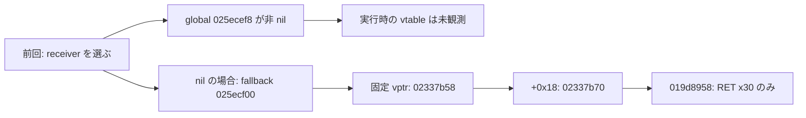
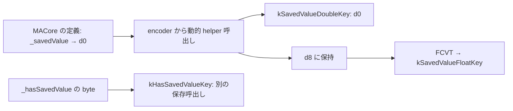

# SA-AE-TARGET-011: 固定の fallback・Logic の宛先・親の保存キー

[日本語](SA-AE-TARGET-011-fallback-parent-encode.md) · [English](SA-AE-TARGET-011-fallback-parent-encode.en.md) · [前回](SA-AE-TARGET-010-registrations-null-mapping-finish.md)

**前回の二つの未読部分を、定義の範囲で確認しました。** 固定の fallback が指す関数は `RET` だけです。Logic 側の空マッピングの `destination` は、`logicOnlyGInstID` の返値を符号付きで広げて返します。親 `MAParameterMapping` の encoder は19個のキーへの保存呼出しを持ち、保存値は double と float の両方へ渡します。名前が `shouldUseSavedValueWithCoder:` でも、この定義の返値は真偽値ではありません。

これらは **バイナリ内の定義と call site** の結果です。実行中の最終 dispatch、保存された archive、再読込後の値は確認していません。空マッピングへ置き換わった属性が元どおり復元できる、という証拠にはしません。

| 項目 | 内容 |
|---|---|
| profile | 2026-10-05 JST、Logic Pro Creator Studio 12.3.1 / build 6682 |
| Logic ARM64 SHA-256 | `2f141e1a1f7b90a4fb0205ffec3dbe187baf601d20e9acb398acfadcdf050998` |
| MACore ARM64 SHA-256 | `99a4a9adbf79c92046682eb821d8ef35145f4915a29b88839c4f026ae63cd076`。installed universal 全体は `76ab2a5f50b3ef120786369b5bf8b53dfc87a3b4107438e0894ab5f9b8095c52` |
| 方法 | 共通 lock、Ghidra `-noanalysis -readOnly`。14関数 / 860 bytes / 215命令ワードを現在の解析コピーへ照合。別に Logic selector stub 20 bytes と MACore native import stubs 24 bytes を固定読出し |
| 根拠 | [manifest](appleevent-parent-encode-manifest.json)、[保存キー表](../protocol/appleevent-parent-encode-keys.tsv)、[境界表](../protocol/appleevent-parent-encode-boundaries.tsv) |
| capability | 全行 `runtime_verified=false`、`product_capability=false`。本調査では Logic の操作・接続・AppleEvent 送信を行っていない |

## 1. fallback の固定先は、そのまま戻る関数

前回の once body `0x019d87ec` は、登録後に receiver を選び、`[vtable +0x18]` へ tail branch していました。その **embedded fallback の初期 metadata** を、raw chained fixup の page membership から読みました。

`0x025ecf00 → 0x02337b58`、slot `0x02337b70 → 0x019d8958` はいずれも rebase です。関数 `0x019d8958` は4 bytes、命令は `RET x30` だけでした。B 命令の thunk ではありません。この固定 body に追加の登録・decode・cleanup はありません。

**すべての呼出しがこの RET へ進むとは言えません。** 非 nil の外部 receiver、実行中の vptr の変更、初期化後の object 状態は未観測です。ここで閉じたのは、固定 fallback の先という一つの枝です。

## 2. Logic の `destination` は signed32 の返値を signed64 にする

Logic の `MANullParameterMapping(LogicAdditions)` の method list は、相対 field の各基準と imported owner class を照合しました。

| 定義 | metadata / body |
|---|---|
| Logic `destination` | IMP `0x013f62c8`、24 bytes、type `q16@0:8` |
| 呼出す selector | stub `0x01b5ade0` → `logicOnlyGInstID`。`_objc_msgSend` import を確認 |
| 返値の変換 | BL `0x013f62d0` の後、`0x013f62d4` の `SXTW x0,w0`。符号付き32 bit を64 bitへ広げて return |
| 固定 getter 候補 | 同 category の `logicOnlyGInstID` → IMP `0x013f622c`、type `i16@0:8`。**本文は今回未読** |

前回の MACore 定義 `destination = −1` は、この Logic 定義の説明には使えません。一方、この BL の実行時の最終 getter、値、loaded category の優先順位は未確定です。`logicOnlyGInstID` を公開トラック番号、UUID、Remote の識別子と同一視する根拠もありません。

## 3. 親 encoder の19個の保存キー

MACore `MAParameterMapping::encodeWithCoder:` は `0x0009b460` / 636 bytes です。incoming x2 の coder を retain し、各保存 selector の receiver として使います。19個の CFString は flags `0x7c8`、文字列 pointer、長さ、終端、実 byte を照合しました。表の `k…Key` も **実際の文字列**であり、解析者が付けたキー名ではありません。

| 保存キー | selector の型 | この body の値の出どころ / 条件 |
|---|---|---|
| `rangeLow` | `encodeLong:forKey:` | `_rangeLow`、signed64 |
| `rangeHigh` | `encodeLong:forKey:` | `_rangeHigh`、signed64 |
| `rangeIsFlipped` | `encodeBool:forKey:` | `_mappingRangeMode == 1` |
| `kRangeMappingModeKey` | `encodeLong:forKey:` | `_mappingRangeMode` 自体、signed64 |
| `momentaryType` | `encodeBool:forKey:` | `_momentaryType` の byte |
| `takeVelocity` | `encodeBool:forKey:` | `_takeVelocity` の byte |
| `wasAutoset` | `encodeBool:forKey:` | `_wasAutoset` の byte |
| `scalingGraph` | `encodeObject:forKey:` | `_scalingGraph`。**非 nil のときだけ呼ぶ** |
| `alternativeGraph` | `encodeObject:forKey:` | `_alternativeGraph`。**非 nil のときだけ呼ぶ** |
| `kSavedValueDoubleKey` | `encodeDouble:forKey:` | `shouldUseSavedValueWithCoder:` の d0 |
| `kSavedValueFloatKey` | `encodeFloat:forKey:` | 上の double を d8 に保持し、`FCVT s0,d8` で float に変換 |
| `kIsNewSavedValueKey` | `encodeBool:forKey:` | `_isNewSavedValueType` の byte |
| `kHasSavedValueKey` | `encodeBool:forKey:` | `_hasSavedValue` の byte |
| `kFilterMappingKey` | `encodeBool:forKey:` | `_filterMapping` の byte |
| `kDisplayIndexKey` | `encodeInteger:forKey:` | `_displayIndex`、signed64 |
| `kGInstIDKey` | `encodeInteger:forKey:` | `_logicOnlyGInstID` の signed32 を `LDRSW x2` で拡張 |
| `kDiscreteStepsKey` | `encodeBool:forKey:` | `_isStepped` の byte |
| `kDisplayParameterValueAsPercentageKey` | `encodeBool:forKey:` | `_displayParameterValueAsPercentage` の byte |
| `kMappingCreatedFromSmartMapKey` | `encodeBool:forKey:` | `createdFromSmartMap` の返値 |

ここでいう signed64 / signed32 / byte は、命令と宣言 ivar の型の対応です。byte の真偽値としての正規化や、各値の意味・初期化状態を実機で確定した表現ではありません。

**通常経路で、0 や false を理由に scalar の保存呼出しを飛ばす枝はありません。** この19箇所で呼出しを省くのは二つの graph object が nil の場合です。これは caller の条件です。Foundation が生成した archive に19キーが必ず存在する、という実機の観測ではありません。例外で途中終了する経路も、この表の「通常経路」には含めません。

## 4. `shouldUseSavedValueWithCoder:` は double の getter

この helper の MACore 定義 `0x0009b450` は16 bytesです。method metadata の返値は `d24@0:8@16`。名前から連想できる BOOL とは違い、**receiver の `_savedValue` を d0 に読んで返します**。この body は coder x2 を使いません。

encoder は `0x0009b590` で helper を呼び、`0x0009b594` で d8 に保持、`0x0009b5a4` で double、`0x0009b5a8` で float へ変換し、`0x0009b5b8` で保存します。返値への条件分岐はありません。`_hasSavedValue` は `0x0009b5f0` で別の BOOL として渡し、二つの数値保存を gate していません。

したがって、「保存値を使うと判定されたときだけ数値キーを入れる」という読みは、この caller と MACore 定義には合いません。float への変換後に double と同じ精度が残るとも主張しません。helper の **実効 dispatch がこの MACore 定義になるか**、別カテゴリが値を変えるかは未確認です。

`createdFromSmartMap` の MACore 定義 `0x0009bf78` も16 bytesです。宣言 type `B16@0:8` の getter で `_createdFromSmartMap` の byte を w0 に読みます。encoder はその返値を最後の BOOL キーへ渡します。ここも実行時の最終 dispatch は別の境界です。

## 5. superclass への保存 call と残る境界

encoder は最後の `0x0009b6b8` で、stack 上の `objc_super = {self, MAParameterMapping class}`、`encodeWithCoder:` の selector、coder x2 を使い、`_objc_msgSendSuper2` を呼びます。current class reference `0x00195b20` の先と class / superclass metadata を照合しました。

固定で読んだ `MAMapping::encodeWithCoder:` `0x0009a744` は4 bytes、`RET` だけです。ただし、native の super dispatch や別カテゴリの優先順位を実機で観測したわけではありません。これを「親呼出しはどの実行でも何も保存しない」と一般化しません。

前回確認した `MANullParameterMapping → MAParameterMapping` の継承関係から、この encoder は静的な親定義として読めます。しかし、**空マッピングの実例がこの inherited encoder に到達すること、元の mapping と同じ値を保存することは未検証**です。代替 initializer が archive の属性を読まないという前回の結果は変わりません。

この body に encoder の `error` を取得して判定する処理は見つかりませんでした。保存完了、native failure、例外時の全 cleanup、decoder との対称性、cache を使わない round trip、保存後の再読込・Undo は、別の検証を要します。

## 6. 照合と次に読む範囲

新規14関数の215命令ワードを、関数一覧の entry / size と現在の解析コピーに照合しました。CFString の19キー、selected method entries、ivar names / types、raw fixup pointers を独立 reader でも確認しています。installed universal、ARM64 slice、解析コピー、Ghidra program の hash は区別しました。照合数とローカルの根拠 hash は manifest に記録しています。

次の静的な境界は、今回 metadata だけを読んだ Logic `logicOnlyGInstID` の body、親 `initWithCoder:` とこの19キーの対応、Logic 側の saved-value helper の定義です。読む対象を固定した小さい batch で進め、method name や Ghidra Ref を実行時の値・安定 ID・保存成功へ強めない方針を続けます。

本調査の成果は復元契約を詰めるための静的証拠です。製品の AppleEvent capability は増やしていません。
