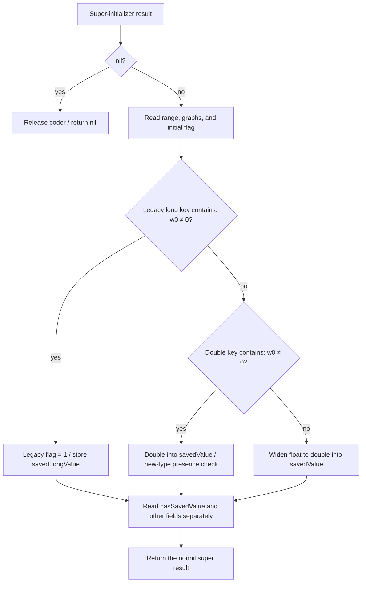

# SA-AE-TARGET-012: Parent decoder's 20 keys, legacy saved values, and Logic's ID getter

[日本語](SA-AE-TARGET-012-parent-decode.md) · [English](SA-AE-TARGET-012-parent-decode.en.md) · [Previous](SA-AE-TARGET-011-fallback-parent-encode.en.md)

**The parent `MAParameterMapping` decoder handles 20 keys: the previous encoder's 19 plus the legacy `kSavedValueKey`.** Its saved-number branches prioritize legacy long, then double, then float. Logic's null-mapping definition of `logicOnlyGInstID` returns 0 without reading an ivar.

These are **static facts about fixed definitions and call sites**. Effective method selection, restored objects, and a save/reload round trip remain unverified. Matching keys alone does not establish restoration of the original mapping.

| Item | Details |
|---|---|
| Status / profile | Static verification and independent publication review complete. Evidence collected 2026-10-05 JST, Logic Pro Creator Studio 12.3.1 / build 6682 |
| Logic ARM64 SHA-256 | `2f141e1a1f7b90a4fb0205ffec3dbe187baf601d20e9acb398acfadcdf050998` |
| MACore ARM64 SHA-256 | `99a4a9adbf79c92046682eb821d8ef35145f4915a29b88839c4f026ae63cd076`. The whole installed universal file is `76ab2a5f50b3ef120786369b5bf8b53dfc87a3b4107438e0894ab5f9b8095c52` |
| Method | Two Ghidra jobs under the shared lock with `-noanalysis -readOnly`. Four fixed definitions / 1224 bytes / 306 instruction words checked against source slices and analysis copies. Separately, 200 bytes of selector stubs and 72 bytes of native import stubs were read directly |
| Evidence | [Manifest](appleevent-parent-decode-manifest.json), [decode-key table](../protocol/appleevent-parent-decode-keys.tsv), [boundary table](../protocol/appleevent-parent-decode-boundaries.tsv) |
| Capability | `runtime_verified=false`, `product_capability=false`. This static investigation performed no Logic operation, connection, or AppleEvent send |

## 1. Entry gates and range swapping

MACore `MAParameterMapping::initWithCoder:` is at `0x0009afd4` / 1148 bytes. It retains incoming coder x2 into x19. At `0x0009b018`, it compares `_objc_opt_class` return values for incoming self and the fixed `MAParameterMapping` class. Equality reaches `NSException raise:format:` at `0x0009b060`. Actual exception raising and propagation were not observed. If that call returns normally, the body continues.

The `_objc_msgSendSuper2` call at `0x0009b088` uses `objc_super = {incoming self, MAParameterMapping class}`, selector `initWithCoder:`, and coder x2. **A nil return branches from `0x0009b090` to the tail, skips every key read, releases the coder, and returns nil.** A nonnil result becomes the destination of subsequent stores. Effective super dispatch remains unverified.

The range mode comes from the Long key when w0 from `containsValueForKey:kRangeMappingModeKey` is nonzero; otherwise it comes from the Bool key `rangeIsFlipped`. For the latter, `MOV w0,w0` at `0x0009b110` zero-extends the 32-bit result before the qword store. This does not establish normalization of the Bool result to 0 or 1.

From `0x0009b120`, **mode zero, signed `rangeLow > rangeHigh`, and `rangeHigh != -1` together cause mode to become 1 and the two qwords to be swapped** (comparisons at `0x0009b12c` / `0x0009b130`, stores at `0x0009b138`–`0x0009b14c`). These instructions do not establish the meaning of `-1`, valid ranges, or initialized runtime values.

## 2. The 20 decode keys

The 20 CFStrings were checked for flags `0x7c8`, length, string pointer, terminator, and actual bytes. The table describes caller conditions on the normal path. Long means `decodeLongForKey:inUnarchiver:`, Bool means `decodeBoolForKey:`, Object means `decodeObjectOfClasses:forKey:`, and Double / Float / Integer mean `decodeDoubleForKey:` / `decodeFloatForKey:` / `decodeIntegerForKey:` respectively.

| Key | Decoder | Local destination / condition |
|---|---|---|
| `rangeLow` | Long | `_rangeLow` qword; the same coder is also passed in the extra x3 argument |
| `rangeHigh` | Long | `_rangeHigh` qword; same extra coder argument |
| `kRangeMappingModeKey` | Long | Into `_mappingRangeMode` qword when contains w0 is nonzero |
| `rangeIsFlipped` | Bool | When that contains w0 is zero, zero-extend w0 into `_mappingRangeMode` |
| `momentaryType` | Bool | Low byte → `_momentaryType` |
| `wasAutoset` | Bool | Low byte → `_wasAutoset` |
| `takeVelocity` | Bool | Low byte → `_takeVelocity` |
| `scalingGraph` | Object | Pass a candidate class-set; retain the returned object, replace the ivar, release the previous object and class-set |
| `alternativeGraph` | Object | Same argument construction and replacement sequence |
| `kIsNewSavedValueKey` | Bool | Low byte → `_isNewSavedValueType`; the double branch later performs a separate contains check |
| `kSavedValueKey` | Long | Highest-priority legacy format; set the legacy flag to 1 and store x0 into `_savedLongValue` qword |
| `kSavedValueDoubleKey` | Double | If legacy contains is zero and double contains is nonzero, d0 → `_savedValue` |
| `kSavedValueFloatKey` | Float | If both legacy and double contains are zero, widen s0 to double into `_savedValue`; no contains check for this key |
| `kHasSavedValueKey` | Bool | After the numeric branches, low byte → `_hasSavedValue` |
| `kFilterMappingKey` | Bool | Low byte → `_filterMapping` |
| `kDisplayIndexKey` | Integer | x0 → `_displayIndex` qword |
| `kGInstIDKey` | Integer | Only the lower 32 bits → declared signed32 `_logicOnlyGInstID`; no range check in this body |
| `kDiscreteStepsKey` | Bool | Low byte → `_isStepped` |
| `kDisplayParameterValueAsPercentageKey` | Bool | Low byte → `_displayParameterValueAsPercentage` |
| `kMappingCreatedFromSmartMapKey` | Bool | Forward the result in x2 to dynamic `setCreatedFromSmartMap:`; setter body unqueried |

There are 24 key-related call sites: four contains calls and 20 value-decoder calls. **All 19 previous encoder keys are included; the sole extra key is `kSavedValueKey`.** This compares static key sets. It does not count keys in an actual archive or mean that all 20 are read in one execution.

For both graphs, `_objc_opt_class` return values for `NSArray` and the fixed `MAGraphPoint` class are passed to `NSSet setWithObjects:`. The NSArray class-return is in x2; the graph class-return and terminating zero are on the stack (`0x0009b1c8` / `0x0009b238`). The set-return is passed in x2 to the object decoder, with the key in x3. **Actual set contents and accepted object classes remain unverified.** ASM supplies the variadic argument omitted from Ghidra's C display.

## 3. Saved-number priority and the remaining legacy conversion

The legacy contains call is at `0x0009b2b8`. A nonzero result sets `_unarchivedSavedFromLong` (offset 40 / byte) to 1 and stores the Long return from `0x0009b2e0` into `_savedLongValue` (offset 48 / declared signed64). **This branch does not write `_savedValue` or convert long to double.** The other branches do not clear the legacy flag or long field either; untouched ivars cannot be assumed zero.

If legacy contains is zero, `0x0009b300` tests the double key. Its nonzero branch stores the double decoded at `0x0009b314`, then separately queries the presence of `kIsNewSavedValueKey` at `0x0009b330`. At `0x0009b334`, it tests **bit0** of that contains return: a clear bit forces `_isNewSavedValueType=1`; a set bit preserves the byte decoded earlier. Presence and the Boolean value stored under that key must not be conflated.

If double contains is zero as well, the float returned at `0x0009b350` is widened by `FCVT d0,s0` at `0x0009b354`. Native coder behavior for a missing float key is unqueried. `_hasSavedValue` is read separately at `0x0009b370`, after the numeric branches, so **it does not gate these numeric reads**.

The previous MACore encoder/helper definitions read `_savedValue`. A later conversion of the legacy long into that field, a different dynamic helper, and save/reload symmetry remain outside these four definitions.

## 4. Super initializer and the 32-bit ID getters

| Fixed definition | Body / metadata |
|---|---|
| `MAMapping::initWithCoder:` | `0x0009a710` / 52 bytes. Calls `_objc_msgSendSuper2` at `0x0009a734` with `objc_super = {incoming self, MAMapping class}` and selector `init`, then returns that result unchanged. Reads neither coder x2 nor archive keys |
| MACore `MAParameterMapping::logicOnlyGInstID` | `0x0009bf38` / 16 bytes, type `i16@0:8`. Reads offset slot `0x001ab4ec` and returns the ivar through `LDR w0` at `0x0009bf40`. Declaration: offset 76 / 4 bytes / signed32. No explicit sign extension to 64 bits |
| Logic `MANullParameterMapping(LogicAdditions)::logicOnlyGInstID` | `0x013f622c` / 8 bytes, type `i16@0:8`. Only `MOV w0,#0` and `RET`; no self or ivar read |

The parent decoder's `kGInstIDKey` store uses `STR w0` at `0x0009b3d0`, keeping only the lower 32 bits of the integer return. Distinguish the signed32 declaration from a value displayed by interpreting x0 as 64 bits. No equivalence to a public track number, UUID, or Remote ID is established.

The Logic getter was rechecked against category row `0x01bd35a4`, imported owner `_OBJC_CLASS_$_MANullParameterMapping`, and each relative method field's base. **If this particular definition is selected**, the previous Logic `destination` body's `SXTW x0,w0` yields 0 with it. This is not observed effective category dispatch or a live destination readback.

The super initializer's fixed metadata points to NSObject as its superclass. Effective native/category selection and initialization failure remain unverified. Residual coder x2 is not an extra argument of selector `init`.

## 5. Verification scope and remaining boundaries

The two saved jobs exited 0, with normal read-only and three export markers. Both `ProgramIdentityReport` results match the expected program name and hash. Installed files, MACore's whole universal image, ARM64 slices, and analysis copies were distinguished when checking all 306 instruction words. The reader checked the fixed 20 CFStrings, 18 selected declared ivars, three MACore / one Logic method rows, selector and native import stubs, and fixup membership. Counts and evidence hashes are recorded in the manifest. An independent publication reader found no semantic discrepancies and rejected three negative checks: a changed instruction word, CFString flags misread as a pointer, and an incorrect base for the relative IMP.

The next bounded targets are the implementations of `decodeLongForKey:inUnarchiver:` (stub `0x00128180`) and `setCreatedFromSmartMap:` (stub `0x0012ef40`), legacy flag/long-field consumers, and Logic's saved-value helper. This task stops at the checked stubs and callers without expanding those callee graphs.

Native coder behavior for missing keys, wrong types, and errors; graph acceptance; abstract-class raising; complete exception cleanup and ownership; initialized null-mapping values; and effective dispatch remain unverified. These static results do not establish a cache-free round trip, original mapping restoration, save/reload/Undo, stable-ID contracts, or additional product AppleEvent capabilities.
