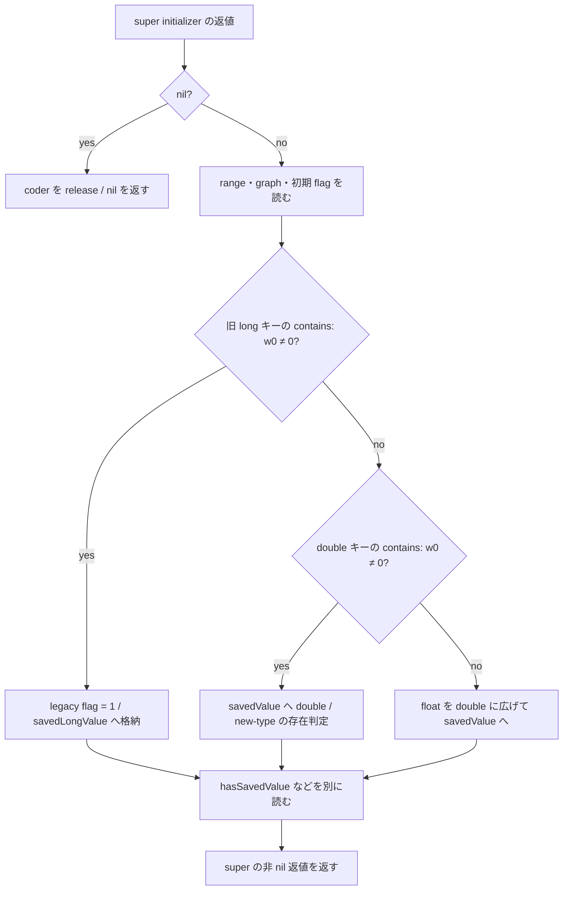

# SA-AE-TARGET-012: 親 decoder の20キー・旧保存値・Logic の ID getter

[日本語](SA-AE-TARGET-012-parent-decode.md) · [English](SA-AE-TARGET-012-parent-decode.en.md) · [前回](SA-AE-TARGET-011-fallback-parent-encode.md)

**親 `MAParameterMapping` の decoder は、前回の19保存キーに旧形式の `kSavedValueKey` を加えた20キーを扱います。** 保存値は旧 long → double → float の順で枝を選びます。Logic の空マッピングにある `logicOnlyGInstID` の定義は、ivar を読まず0を返します。

これは **固定の定義と call site の静的証拠**です。実行中に選ばれる method、復元された object、保存と再読込の往復は未確認です。キーの対応だけでは元の mapping の復元を保証できません。

| 項目 | 内容 |
|---|---|
| 状態 / profile | 静的照合と独立レビュー完了。証拠取得は2026-10-05 JST、Logic Pro Creator Studio 12.3.1 / build 6682 |
| Logic ARM64 SHA-256 | `2f141e1a1f7b90a4fb0205ffec3dbe187baf601d20e9acb398acfadcdf050998` |
| MACore ARM64 SHA-256 | `99a4a9adbf79c92046682eb821d8ef35145f4915a29b88839c4f026ae63cd076`。installed universal 全体は `76ab2a5f50b3ef120786369b5bf8b53dfc87a3b4107438e0894ab5f9b8095c52` |
| 方法 | 共通 lock、Ghidra `-noanalysis -readOnly` の2 job。固定4定義 / 1224 bytes / 306命令ワードを source slice・解析コピーへ照合。別に selector stubs 200 bytes、native import stubs 72 bytes を固定読出し |
| 根拠 | [manifest](appleevent-parent-decode-manifest.json)、[読出しキー表](../protocol/appleevent-parent-decode-keys.tsv)、[境界表](../protocol/appleevent-parent-decode-boundaries.tsv) |
| capability | `runtime_verified=false`、`product_capability=false`。この静的調査では Logic 操作・接続・AppleEvent 送信を行っていない |

## 1. 読出しに入る条件と範囲の入替え

MACore `MAParameterMapping::initWithCoder:` は `0x0009afd4` / 1148 bytes です。incoming coder x2 を retain して x19へ保持します。`0x0009b018` は incoming self と固定 `MAParameterMapping` class に対する `_objc_opt_class` の返値を比較し、一致する枝で `0x0009b060` の `NSException raise:format:` を呼びます。例外の実際の発生・伝播は観測していません。この呼出しが通常 return すれば、本文は後続処理へ進みます。

`0x0009b088` の `_objc_msgSendSuper2` は `objc_super = {incoming self, MAParameterMapping class}`、selector `initWithCoder:`、coder x2 を使います。**返値が nil なら `0x0009b090` から末尾へ進み、すべてのキー読出しを飛ばして coder を release し、nil を返します。** 非 nil の返値が後続の格納先です。実効 super dispatch は未確認です。

range mode は `containsValueForKey:kRangeMappingModeKey` の w0 が非0なら Long のキー、0なら `rangeIsFlipped` の Bool から読みます。後者は `0x0009b110` の `MOV w0,w0` で32 bitをゼロ拡張して qwordへ格納します。Bool の返値を0/1へ正規化する処理だとは主張しません。

`0x0009b120` 以降では、**mode が0、signed `rangeLow > rangeHigh`、`rangeHigh != -1` の三条件を満たすと、modeを1にして二つの qword を入れ替えます**（`0x0009b12c` / `0x0009b130` の比較、`0x0009b138`〜`0x0009b14c` の格納）。`-1` の意味、有効な範囲、実行時の初期値はここから決めません。

## 2. 20個の読出しキー

20個の CFString は flags `0x7c8`、長さ、文字列 pointer、終端、実 byte を照合しました。表は通常経路の caller 側の条件です。Long は `decodeLongForKey:inUnarchiver:`、Bool は `decodeBoolForKey:`、Object は `decodeObjectOfClasses:forKey:`、Double / Float / Integer は各 `decodeDoubleForKey:` / `decodeFloatForKey:` / `decodeIntegerForKey:` を表します。

| キー | 読出し | この body の格納先 / 条件 |
|---|---|---|
| `rangeLow` | Long | `_rangeLow` qword。追加の x3 にも同じ coder を渡す |
| `rangeHigh` | Long | `_rangeHigh` qword。同じ追加 coder 引数 |
| `kRangeMappingModeKey` | Long | contains の w0 が非0の場合、`_mappingRangeMode` qwordへ |
| `rangeIsFlipped` | Bool | 上の contains の w0 が0の場合、w0をゼロ拡張して `_mappingRangeMode` へ |
| `momentaryType` | Bool | 下位 byte → `_momentaryType` |
| `wasAutoset` | Bool | 下位 byte → `_wasAutoset` |
| `takeVelocity` | Bool | 下位 byte → `_takeVelocity` |
| `scalingGraph` | Object | class-set 候補を渡す。返値を retain、ivar を置換、旧 object と class-set を release |
| `alternativeGraph` | Object | 同じ引数構築・置換手順 |
| `kIsNewSavedValueKey` | Bool | 下位 byte → `_isNewSavedValueType`。double 枝では後に別の contains 判定 |
| `kSavedValueKey` | Long | 最優先の旧形式。legacy flag を1にし、x0 → `_savedLongValue` qword |
| `kSavedValueDoubleKey` | Double | 旧キーの contains が0、double の contains が非0なら d0 → `_savedValue` |
| `kSavedValueFloatKey` | Float | 旧・double の contains が両方0なら、s0をdoubleへ広げて `_savedValue`。このキーの contains 判定はない |
| `kHasSavedValueKey` | Bool | 数値の枝の後、下位 byte → `_hasSavedValue` |
| `kFilterMappingKey` | Bool | 下位 byte → `_filterMapping` |
| `kDisplayIndexKey` | Integer | x0 → `_displayIndex` qword |
| `kGInstIDKey` | Integer | 下位32 bitだけ → 宣言 signed32 の `_logicOnlyGInstID`。本文に範囲検査はない |
| `kDiscreteStepsKey` | Bool | 下位 byte → `_isStepped` |
| `kDisplayParameterValueAsPercentageKey` | Bool | 下位 byte → `_displayParameterValueAsPercentage` |
| `kMappingCreatedFromSmartMapKey` | Bool | 返値を動的 `setCreatedFromSmartMap:` の x2へ。setter 本文は未読 |

キー関連 call site は24箇所で、contains が4、値 decoder が20です。**前回encoderの19キーはすべて含まれ、追加は `kSavedValueKey` の1個**です。これは静的なキー集合の比較であり、実際の archive のキー数や、一度の実行で20個すべて読むことを意味しません。

二つの graph は、`NSArray` と固定 `MAGraphPoint` class に対する `_objc_opt_class` の返値を `NSSet setWithObjects:` の引数へ渡します。NSArray の class-return が x2、graph の class-return と終端0が stack です（`0x0009b1c8` / `0x0009b238`）。set-return を object decoder の x2、キーを x3へ渡します。**実際の set の内容・受理される object のクラスは未確認**です。Ghidra C の表示から消えた可変長引数を、ASMで補いました。

## 3. 保存値の優先順と未完了の旧形式変換

旧キーの contains は `0x0009b2b8` です。非0なら `_unarchivedSavedFromLong`（offset 40 / byte）を1にし、`0x0009b2e0` の Long 返値を `_savedLongValue`（offset 48 / signed64 宣言）へ格納します。**この枝は `_savedValue` へ書かず、longからdoubleへの変換もしません。** 他の枝でlegacy flag / long fieldをクリアする処理もなく、触らないivarの値を0と仮定できません。

旧キーの contains が0なら、`0x0009b300` でdoubleキーを判定します。非0の枝は `0x0009b314` で読むdoubleを格納し、`0x0009b330` で `kIsNewSavedValueKey` の存在を別に問い合わせます。`0x0009b334` はその contains 返値の **bit0** を検査し、clearなら `_isNewSavedValueType=1` を強制、setなら先にdecodeしたbyteを保ちます。存在の判定と、そのキーに保存された真偽値を混同しません。

doubleキーの contains も0なら、`0x0009b350` のfloat返値を `0x0009b354` の `FCVT d0,s0` で広げます。floatキーが無い場合のnative coderの挙動は未読です。`_hasSavedValue` は数値の枝の後の `0x0009b370` で別に読むため、**これらの数値読出しをgateしていません**。

前回のMACore encoder/helperは `_savedValue` を読む定義でした。旧longを後でそこへ変換する処理、別の動的helper、保存・再読込の対称性は、今回の4定義では閉じていません。

## 4. super initializer と32 bitの ID getter

| 固定の定義 | 本文 / metadata |
|---|---|
| `MAMapping::initWithCoder:` | `0x0009a710` / 52 bytes。`objc_super = {incoming self, MAMapping class}`、selector `init` で `0x0009a734` の `_objc_msgSendSuper2` を呼び、返値をそのまま返す。coder x2もarchiveキーも読まない |
| MACore `MAParameterMapping::logicOnlyGInstID` | `0x0009bf38` / 16 bytes、type `i16@0:8`。offset slot `0x001ab4ec` を読み、`0x0009bf40` の `LDR w0` でivarを返す。宣言はoffset 76 / 4 bytes / signed32。64 bitへの明示的な符号拡張はない |
| Logic `MANullParameterMapping(LogicAdditions)::logicOnlyGInstID` | `0x013f622c` / 8 bytes、type `i16@0:8`。`MOV w0,#0` と `RET` のみ。self / ivarを読まない |

親decoderの `kGInstIDKey` は `0x0009b3d0` の `STR w0` で、integer返値の下位32 bitだけを格納します。宣言signed32と、x0レジスタを64 bitとして表示した値を区別します。公開トラック番号、UUID、RemoteのIDと同じという証拠はありません。

Logic getterは category row `0x01bd35a4`、imported owner `_OBJC_CLASS_$_MANullParameterMapping`、相対method fieldの各基準を再照合しました。**この定義が実際に選ばれれば**、前回のLogic `destination` の `SXTW x0,w0` と組み合わせた値は0です。実効category dispatchやliveの宛先を読み戻した結果ではありません。

super initializer の固定metadataは NSObject をsuperclassとして指します。ただし、native/categoryの最終選択や初期化失敗は未確認です。selector `init` に、残っているcoder x2を追加の引数として数えません。

## 5. 照合の範囲と残る境界

保存済み2 jobはexit 0、read-onlyと3 export markerが正常でした。両 `ProgramIdentityReport` の program name / expected hash一致を確認し、installed file・MACoreのuniversal全体・ARM64 slice・解析コピーを区別して306命令ワードを照合しています。固定の20 CFString、選んだ18宣言ivar、MACore 3 / Logic 1 のmethod row、selector / native import stubsとfixup membershipをreaderで検査しました。数と根拠hashはmanifestへ記録済みです。別readerの公開レビューでは意味の不一致0件、命令の改変・CFString flagsをpointerと誤認・相対IMPの基準違いの3負例を拒否しました。

次の限定境界は `decodeLongForKey:inUnarchiver:`（stub `0x00128180`）、`setCreatedFromSmartMap:`（stub `0x0012ef40`）の実装、legacy flag / long fieldの利用先、Logic側saved-value helperです。今回はstubとcallerを読んだ範囲に留め、これらのcallee graphへ進んでいません。

**追補:** [SA-AE-TARGET-013](SA-AE-TARGET-013-parent-helpers.md) で、MACore の long decoder・setter・legacy getter 二つの固定定義を照合しました。実効 dispatch、旧longの利用先とdoubleへの移行、Logic側helperは引き続き未確認です。

native coderの欠落キー・型違い・error、graph受理、抽象classのraise、例外時の全cleanupとownership、空mappingの実際の初期値・実効dispatchは未検証です。cacheを使わないround trip、元mappingの復元、保存・再読込・Undo、安定IDの契約や製品AppleEvent capabilityへ、この静的結果を広げません。
