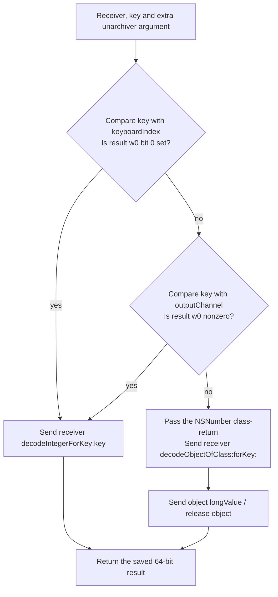

# SA-AE-TARGET-013: Legacy long decoding and three parent-mapping accessors

[日本語](SA-AE-TARGET-013-parent-helpers.md) · [English](SA-AE-TARGET-013-parent-helpers.en.md) · [Previous](SA-AE-TARGET-012-parent-decode.en.md)

**The MACore definition of `decodeLongForKey:inUnarchiver:` decodes two keys as integers; for other keys, it decodes an `NSNumber` object and sends it `longValue`.** The parent decoder's `rangeLow`, `rangeHigh`, `kRangeMappingModeKey` and legacy `kSavedValueKey` all differ from those two strings.

This is evidence from fixed definitions. The effective method selected by a live coder, migration of the legacy value into the current double field, and successful save/reload remain unverified.

| Item | Details |
|---|---|
| Status / profile | Static checks and independent review complete. 2026-10-05, Logic Pro Creator Studio 12.3.1 / build 6682 |
| MACore ARM64 SHA-256 | `99a4a9adbf79c92046682eb821d8ef35145f4915a29b88839c4f026ae63cd076` |
| Installed universal SHA-256 | `76ab2a5f50b3ef120786369b5bf8b53dfc87a3b4107438e0894ab5f9b8095c52`. Distinguish the whole file from its ARM64 slice |
| Method | One Ghidra job under the shared lock with `-noanalysis -readOnly`. Four fixed definitions / 260 bytes / 65 instruction words checked against the installed ARM64 slice and analysis copy |
| Evidence | [Manifest](appleevent-parent-helpers-manifest.json), [ten boundaries](../protocol/appleevent-parent-helpers-boundaries.tsv), [binary identity](SA-IDENTITY-001-binary-inputs.en.md) |
| Capability | `runtime_verified=false`, `product_capability=false`. This investigation performed no Logic operation, connection or AppleEvent send |

## 1. The key chooses the decoding path

The fixed IMP for `NSCoder(MAOverride)::decodeLongForKey:inUnarchiver:` is `0x0009a9c4` / 208 bytes. Category `MAOverride` has the Foundation-imported `NSCoder` as its owner, with method type `q32@0:8@16@24`. The IMP field of relative method row `0x001330c0` resolves to this definition using **row + 8, `0x001330c8`**, as its base. The Ghidra function remains named `FUN_0009a9c4`; no database names or types were edited.

| Key comparison | Branch instruction | Decode in this fixed body |
|---|---|---|
| `keyboardIndex` | `TBNZ w0,#0` at `0x0009aa08`; comparison result bit 0 is set | `decodeIntegerForKey:` at `0x0009aa28` |
| `outputChannel` | Compared only when the first bit is clear. `CBZ w0` at `0x0009aa1c`; any nonzero w0 takes the integer path | The same `decodeIntegerForKey:` |
| Other | Neither comparison takes the integer path | `decodeObjectOfClass:forKey:` at `0x0009aa4c`, then `longValue` at `0x0009aa5c` |

Both CFStrings have length 13 and flags `0x7c8`. Their string pointers, terminators, bytes and CoreFoundation binds were checked. The two comparisons do not both test bit 0.

The four Long keys in the [previous twenty-key table](../protocol/appleevent-parent-decode-keys.tsv) differ from both strings. **If this fixed definition is selected and the comparisons report string equality**, all four take the object path. The caller sends `decodeLongForKey:inUnarchiver:` dynamically; comparing strings does not establish effective dispatch.

## 2. An omitted argument and the object decoder's class argument

The Ghidra C signature displays only three arguments, but metadata and assembly show an **additional incoming object argument in x3**. It is saved at `0x0009a9d8`, retained at `0x0009a9f0`, and released on normal completion at `0x0009aa70`. These are its only uses in the complete 208-byte body. The decode receiver is incoming x0 saved in x21; the extra unarchiver object is not used as that receiver.

The key is incoming x2 retained in x19. The object path **overwrites x3 with the key** at `0x0009aa48`. This x3 must not be confused with the extra incoming unarchiver argument.

`0x0009aa38` loads `NSNumber` from import slot `0x0017c608`, then `0x0009aa3c` calls `_objc_opt_class`. **The decoder's x2 is that call's returned x0**, moved by `MOV x2,x0` at `0x0009aa40`. The C display appears to pass the import pointer directly, so assembly determines this result source. The accepted runtime object classes and native coder body were not examined.

The object decoder's result is retained and sent `longValue` without an additional nil, type or error branch. Both paths save the 64-bit result word in x22 and return it in x0 after normal releases. Return type `q` declares signed64. This does not establish the value on a missing key, wrong type, nil or exception, or prove complete cleanup.

## 3. Three accessors only store or load fields

| Fixed definition | Body and declaration |
|---|---|
| `MAParameterMapping::setCreatedFromSmartMap:` / `0x0009bf88` / 16 bytes | Type `v20@0:8B16`. Offset slot `0x001ab508` → `_createdFromSmartMap`, offset 73 / 1 byte. `STRB w2` at `0x0009bf90` directly stores the argument's low byte; no mask, 0/1 normalization or other call |
| `MAParameterMapping::_savedLongValue` / `0x0009bd60` / 16 bytes | Type `q16@0:8`. Offset slot `0x001ab4dc` → `_savedLongValue`, offset 48 / signed64 / 8 bytes. `LDR x0` at `0x0009bd68` returns the field directly; no conversion, store or other call |
| `MAParameterMapping::_unarchivedSavedFromLong` / `0x0009bd70` / 20 bytes | Type `B16@0:8`. Offset slot `0x001ab4d8` → `_unarchivedSavedFromLong`, offset 40 / 1 byte. After `LDRB`, `AND w0,w8,#1` at `0x0009bd7c` returns only bit 0, rather than treating any nonzero byte as true |

Each body reads its offset slot with `LDRSW`. The declared fixed offset and the offset loaded from the slot at runtime are distinct; an actual object's layout was not validated.

This closes the previously unread setter definition and the two legacy-field getters. **Finding a getter does not establish its consumers or a long-to-double migration.** None of these four bodies performs that conversion. The previous decoder's legacy branch writes the legacy flag and `_savedLongValue`, while the current encoder/helper reads the `_savedValue` double; the processing between them remains unresolved.

## 4. Verification scope and the next boundaries

The one job returned exit 0. Its read-only conditions, identity and three export completion markers, and four C / ASM headers were checked. The Ghidra import hash matches the installed ARM64 slice and current analysis copy, and all 65 instruction words match both. Import metadata is not a cryptographic checksum of database annotations.

The fixed support reads cover four selector stubs / 80 bytes, four native import stubs / 48 bytes, two CFStrings, three ivars and four method rows. The checker rejected three negative cases: missing, duplicate and changed instruction words. A separate reader also checked the meaning and instructions. Counts, hashes and evidence are recorded in the manifest. Raw exports remain local under `Research/raw/ghidra/q-appleevent-parent-helpers-013*` and are excluded from public Git.

The next finite candidates are Logic's `_CLgMainStageProxyDecoder::decodeLongForKey:inUnarchiver:` (`0x018e18e4` / 60 bytes) and MACore's `MAParameterMapping::savedValue` (`0x0009bcfc` / 52 bytes). Metadata and the function inventory establish their locations only; their bodies were not read in this job. The latter has not been established as a legacy-value consumer.

Effective coder/category dispatch, native missing-key / wrong-type / error / exception behavior, graph acceptance, legacy migration, cache-independent save round trips, reload, Undo and public ID contracts remain unresolved. This result adds no product AppleEvent capability.
