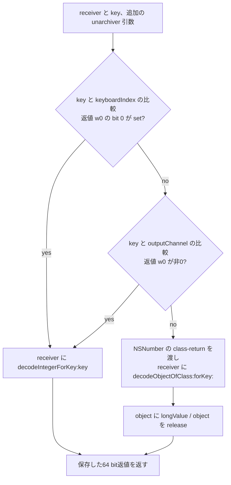

# SA-AE-TARGET-013: 旧 long の読み方と、親 mapping の3アクセサ

[日本語](SA-AE-TARGET-013-parent-helpers.md) · [English](SA-AE-TARGET-013-parent-helpers.en.md) · [前回](SA-AE-TARGET-012-parent-decode.md)

**MACore の `decodeLongForKey:inUnarchiver:` の定義は、二つのキーだけ整数として読み、それ以外は `NSNumber` の object を読んで `longValue` を取り出します。** 親 decoder が使う `rangeLow`・`rangeHigh`・`kRangeMappingModeKey`・旧 `kSavedValueKey` は、いずれも後者に属する文字列です。

これは固定の定義を読んだ結果です。実行中の coder がこの定義を選ぶこと、旧保存値が現在の double へ移行すること、保存と再読込の成功は未確認です。

| 項目 | 内容 |
|---|---|
| 状態 / profile | 静的照合と独立レビュー完了。2026-10-05、Logic Pro Creator Studio 12.3.1 / build 6682 |
| MACore ARM64 SHA-256 | `99a4a9adbf79c92046682eb821d8ef35145f4915a29b88839c4f026ae63cd076` |
| installed universal SHA-256 | `76ab2a5f50b3ef120786369b5bf8b53dfc87a3b4107438e0894ab5f9b8095c52`。全体と ARM64 slice の hash を区別する |
| 方法 | 共通 lock、Ghidra `-noanalysis -readOnly` の1 job。固定4定義 / 260 bytes / 65命令ワードを installed ARM64 slice・解析コピーへ照合 |
| 根拠 | [manifest](appleevent-parent-helpers-manifest.json)、[10件の境界表](../protocol/appleevent-parent-helpers-boundaries.tsv)、[バイナリ識別](SA-IDENTITY-001-binary-inputs.md) |
| capability | `runtime_verified=false`、`product_capability=false`。この調査で Logic 操作・接続・AppleEvent 送信は行っていない |

## 1. キーによって読み方を分ける

`NSCoder(MAOverride)::decodeLongForKey:inUnarchiver:` の固定 IMP は `0x0009a9c4` / 208 bytes です。category `MAOverride` の owner は Foundation から import した `NSCoder`、method type は `q32@0:8@16@24` です。相対 method row `0x001330c0` の IMP field は **row + 8 の `0x001330c8`** を基準にこの定義へ解決します。Ghidra の関数名は `FUN_0009a9c4` のままで、データベースの型や名前は編集していません。

| キー比較 | 分岐する命令 | 固定 body の読出し |
|---|---|---|
| `keyboardIndex` | `0x0009aa08` の `TBNZ w0,#0`。比較返値の bit 0 が set | `0x0009aa28` の `decodeIntegerForKey:` |
| `outputChannel` | 上の bit が clear の場合に比較。`0x0009aa1c` の `CBZ w0` で、全 w0 が非0なら整数枝 | 同じ `decodeIntegerForKey:` |
| その他 | 二つの比較で整数枝に入らない | `0x0009aa4c` の `decodeObjectOfClass:forKey:`、`0x0009aa5c` の `longValue` |

二つの CFString は各13文字、flags `0x7c8`、文字列 pointer・終端・実 byte・CoreFoundation bind を照合しました。「二つとも bit 0 を検査する」とは書きません。

[前回の20キー表](../protocol/appleevent-parent-decode-keys.tsv)にある四つの Long キーは、いずれもこの二つと文字列が異なります。**この固定定義が選ばれ、比較が文字列の一致を返すなら**、四つとも object の枝へ進みます。呼出し元は `decodeLongForKey:inUnarchiver:` へ動的に送信しているため、文字列の一致だけで実効 dispatch を証明したことにはなりません。

## 2. 省かれた引数と、object の class 引数

Ghidra の C には引数が三つだけ表示されていますが、metadata と命令には **incoming x3 の追加 object 引数**があります。`0x0009a9d8` で保存し、`0x0009a9f0` で retain、通常終了の `0x0009aa70` で release します。208 bytes の本文全体では、これ以外の用途はありません。decode の receiver は incoming x0 を保存した x21 で、追加 unarchiver object を receiver にする処理はありません。

key は incoming x2 を retain した x19 です。object の枝では `0x0009aa48` で **key を x3 に上書き**して object decoder に渡します。この x3 と、入口の追加 unarchiver 引数を混同しません。

`0x0009aa38` は import slot `0x0017c608` から `NSNumber` を読み、`0x0009aa3c` で `_objc_opt_class` を呼びます。**decoder の x2 は、その呼出しの返値 x0**です（`0x0009aa40` の `MOV x2,x0`）。C には import pointer をそのまま渡すように見える表示がありますが、ここは命令を優先します。実際に受理される object の型や native coder の処理は読んでいません。

object decoder の返値は retain され、追加の nil・型・error 判定を置かずに `longValue` へ送られます。両枝とも結果の64 bitワードを x22 に保存し、通常の release を経て x0 へ戻します。返値型 `q` は signed64 の宣言です。キー欠落・型違い・nil・例外時の値や、全 cleanup を保証する根拠ではありません。

## 3. 3個のアクセサは、格納・読出しだけ

| 固定の定義 | 本文と宣言の対応 |
|---|---|
| `MAParameterMapping::setCreatedFromSmartMap:` / `0x0009bf88` / 16 bytes | type `v20@0:8B16`。offset slot `0x001ab508` → `_createdFromSmartMap`、offset 73 / 1 byte。`0x0009bf90` の `STRB w2` で引数の下位 byte を直接格納。mask・0/1への正規化・別 call はない |
| `MAParameterMapping::_savedLongValue` / `0x0009bd60` / 16 bytes | type `q16@0:8`。offset slot `0x001ab4dc` → `_savedLongValue`、offset 48 / signed64 / 8 bytes。`0x0009bd68` の `LDR x0` でそのまま返す。変換・格納・別 call はない |
| `MAParameterMapping::_unarchivedSavedFromLong` / `0x0009bd70` / 20 bytes | type `B16@0:8`。offset slot `0x001ab4d8` → `_unarchivedSavedFromLong`、offset 40 / 1 byte。`LDRB` の後、`0x0009bd7c` の `AND w0,w8,#1` で bit 0 だけ返す。「任意の非0なら true」ではない |

各 body は offset slot を `LDRSW` で読みます。宣言の固定 offset と、実行時に slot から読まれる offset を区別し、実際の object layout を検証したとはしません。

これで、前回未読だった setter の定義と legacy field の getter 二つが読めました。**getter を見つけたことは、利用先や long → double の移行を見つけたことではありません。** 今回の四つの本文にその変換はありません。前回 decoder の旧枝は legacy flag と `_savedLongValue` に書く一方、現在の encoder/helper は `_savedValue` の double を読むので、その間の処理は引き続き未解決です。

## 4. 照合した範囲と次の境界

1 job の exit 0、read-only 条件、identity と三つの export 完了 marker、四つの C / ASM header を確認しました。Ghidra の import hash は installed ARM64 slice と現在の解析コピーに一致し、65命令ワードを両者へ照合しました。import metadata の一致は、データベースの注釈を暗号学的に検証するものではありません。

固定の selector stubs 4個 / 80 bytes、native import stubs 4個 / 48 bytes、CFString 2個、ivar 3個、method row 4個を最小範囲で読みました。checker は命令の欠落・重複・改変の3負例を拒否し、別 reader でも意味と命令を照合しました。件数・hash・根拠は manifest に記録しています。生出力はローカル `Research/raw/ghidra/q-appleevent-parent-helpers-013*` にあり、公開 Git には含めません。

次の有限候補は、Logic の `_CLgMainStageProxyDecoder::decodeLongForKey:inUnarchiver:`（`0x018e18e4` / 60 bytes）と MACore の `MAParameterMapping::savedValue`（`0x0009bcfc` / 52 bytes）です。metadata と関数表で定義の所在を確認しただけで、今回の job では本文を読んでいません。後者が旧値の利用先かは未確認です。

実効 coder/category dispatch、native のキー欠落・型違い・error・例外、graph の受理、旧値の移行、cache を使わない保存往復・再読込・Undo・公開IDの契約は残ります。この結果から製品の AppleEvent 対応機能を追加しません。
