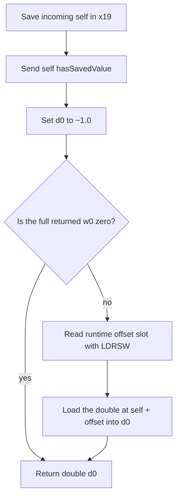

# SA-AE-TARGET-014: The current-double getter and Logic's long decoder

[日本語](SA-AE-TARGET-014-parent-consumers.md) · [English](SA-AE-TARGET-014-parent-consumers.en.md) · [Previous](SA-AE-TARGET-013-parent-helpers.en.md)

**MACore's `savedValue` reads the current `_savedValue` double when `hasSavedValue` returns nonzero, and returns −1.0 when it returns zero. Logic's proxy definition of `decodeLongForKey:inUnarchiver:` sends `longValue` to the object returned by `decodeObjectForKey:`.** Neither of these two fixed definitions migrates the legacy long into the current double.

These results come from checked fixed bodies, metadata and instructions. Effective method selection, processing inside unexamined callees, accepted objects, legacy migration and successful save/reload remain unverified.

| Item | Details |
|---|---|
| Status / profile | Static checks complete; draft pending publication review. 2026-10-07 JST (2026-10-06 UTC), Logic Pro Creator Studio 12.3.1 / build 6682 |
| Logic ARM64 SHA-256 | `2f141e1a1f7b90a4fb0205ffec3dbe187baf601d20e9acb398acfadcdf050998` |
| MACore ARM64 SHA-256 | `99a4a9adbf79c92046682eb821d8ef35145f4915a29b88839c4f026ae63cd076` |
| Installed MACore universal SHA-256 | `76ab2a5f50b3ef120786369b5bf8b53dfc87a3b4107438e0894ab5f9b8095c52`. Distinguish the whole file from its ARM64 slice |
| Method | Two Ghidra jobs under the shared lock with `-noanalysis -readOnly`. Two fixed definitions / 112 bytes / 28 instruction words checked against current installed ARM64 slices and analysis copies |
| Evidence | [Manifest](appleevent-parent-consumers-manifest.json), [ten boundaries](../protocol/appleevent-parent-consumers-boundaries.tsv), [binary identity](SA-IDENTITY-001-binary-inputs.en.md) |
| Capability | `runtime_verified=false`, `product_capability=false`. This investigation performed no Logic operation, connection or AppleEvent send |

## 1. savedValue conditionally returns the current double

The fixed MACore definition of `MAParameterMapping::savedValue` is `0x0009bcfc` / 52 bytes, with method type `d16@0:8`. The IMP field of relative method row `0x001377d8` resolves to this definition using **row + 8, `0x001377e0`**, as its base. The owning class metadata, method list, selector and type were checked.

Incoming receiver x0 is saved in x19 at `0x0009bd08`, then receives `hasSavedValue` at `0x0009bd0c`. Fixed selector stub `0x00129860` resolves to that selector and an `_objc_msgSend` bind. **The effective implementation of this send was not read in this job.**

`FMOV` at `0x0009bd10` uses D-immediate imm8 `0xf0`. Independently expanding it produces IEEE754 bits `0xbff0000000000000`, which represent **−1.0**. The negative hexadecimal quantity displayed by Ghidra ASM is not an integer return value.

**`CBZ w0` at `0x0009bd14` tests whether the entire w0 is zero**. Zero branches to the epilogue at `0x0009bd24` and returns the −1.0 in d0; nonzero reads the field. The bool shown in Ghidra C does not establish a bit-0-only test or prior normalization to 0/1.

The nonzero path reads offset slot `0x001ab4e0` with `LDRSW` at `0x0009bd18` / `0x0009bd1c`, then returns the double loaded by `LDR d0,[x19,x8]` at `0x0009bd20`. The corresponding ivar declaration is `_savedValue`, offset 32 / type `d` / 8 bytes. The declared fixed offset and the offset loaded at runtime are distinct; an actual object's layout was not validated.

This 52-byte body contains no direct legacy-flag or `_savedLongValue` read, field store or long-to-double conversion. **This getter also cannot exclude migration in a callee or another method.** (H014-01–04)

## 2. Logic's proxy decodes an object and sends it longValue

Logic's `_CLgMainStageProxyDecoder::decodeLongForKey:inUnarchiver:` is `0x018e18e4` / 60 bytes, with method type `q32@0:8@16@24`. The IMP field of relative method row `0x01c612a0` resolves to this definition using **row + 8, `0x01c612a8`**, as its base. The owning class metadata and method correspondence were checked.

| Instruction evidence | Flow in the fixed body |
|---|---|
| `0x018e18f0` → stub `0x01b27a00` | `decodeObjectForKey:`. Selector-ref slot `0x0254ba38` and `_objc_msgSend` bind were checked. Incoming receiver x0 and key x2 are passed unchanged |
| `0x018e18f8` / `0x018e18fc` | Retain the object result with `_objc_retainAutoreleasedReturnValue` and save it in x19 |
| `0x018e1900` → stub `0x01b5b040` | Send `longValue` to the saved object |
| `0x018e1904` / `0x018e1908` / `0x018e190c` | Save the `longValue` result x0 in x20 and pass object x19 to `_objc_release` |
| `0x018e1910` / `0x018e191c` | Return the saved 64-bit word unchanged in x0. Type `q` declares signed64 |

**The additional incoming unarchiver argument x3 is not explicitly saved, retained, released, tested or otherwise used in these 60 bytes.** The initial `decodeObjectForKey:` takes its key in x2. Residual x3 at a call is not an additional selector argument or proof of callee use.

Ghidra C displays the initial send as `FUN_01b27a00(param_1)`, omitting the key argument, and makes the temporary `longValue` result look like an ID. Fixed stubs, instructions and method type determine the interpretation here. There is no result-word mask, scalar conversion or overflow check; the result saved in x20 survives the object release and is returned unchanged.

There is no additional nil, type or error branch on the object result, contains query, retry or field update. This normal retain/release sequence does not establish a value for a missing key, wrong type, nil or native failure, or prove all exception-unwind cleanup. (H014-05–08, 10)

## 3. Differences from the previous MACore long decoder

| Fixed-body comparison | MACore / TARGET013 | Logic proxy / TARGET014 |
|---|---|---|
| Decode selection | Compare `keyboardIndex` and `outputChannel` to choose integer or object | No key comparison or integer branch; send `decodeObjectForKey:` |
| Object arguments | Pass the `_objc_opt_class` return for `NSNumber` as the class argument | No class argument or class-restricted decoder send in this body |
| Additional incoming x3 | Used for retain/release in the body | Not explicitly used in the body |
| Long result | Object path returns `longValue`; integer path returns the decoder result | Return the object's `longValue` result |

These are **differences between fixed bodies** in [TARGET013](SA-AE-TARGET-013-parent-helpers.en.md) and this investigation. Which one a particular live coder selects, accepted object classes, and native missing-key or wrong-type behavior remain unverified. The absence of a class argument in this proxy does not establish an absence of internal acceptance checks. (H014-09)

## 4. Verification scope and remaining boundaries

The two saved jobs returned exit 0. The shared lock, read-only conditions, identity and three export completion markers, and two C / ASM headers were checked. Current installed files, the whole MACore universal image, ARM64 slices and analysis copies were distinguished when hashing and checking every one of the 28 instruction words against both source and copy. Matching import metadata is not a cryptographic verification of database annotations.

The minimal fixed support covers three selector stubs / 60 bytes, two native import stubs / 24 bytes, two method rows and owners, and one ivar. Nineteen fixed pointer words and 73 fixed slices were recorded. The checker rejected missing, duplicate and changed instruction words for each program: six negative cases in total. Counts, hashes and ten bilingual facts are recorded in the manifest and boundary table. Raw exports and checkers remain local under `Research/raw/ghidra/parent-consumer-*014*` / `q-appleevent-parent-consumer-014-*` and are excluded from public Git.

The earlier [parent decoder](SA-AE-TARGET-012-parent-decode.en.md) writes the legacy flag and `_savedLongValue`, while the current encoder/helper definitions read the `_savedValue` double. The `savedValue` checked here also directly reads the current double. **These two bodies do not resolve legacy-long consumers or migration into the current double.**

Effective implementations of `hasSavedValue` and `decodeObjectForKey:`, coder/category dispatch, native missing-key / wrong-type / nil / error / exception behavior, runtime layout, legacy migration, cache-independent save round trips, reload, Undo and public-ID contracts remain unresolved. This result adds no product AppleEvent capability.
