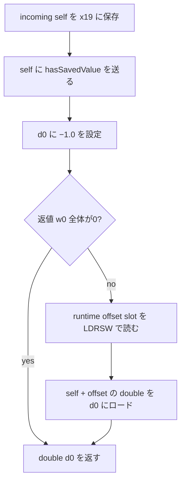

# SA-AE-TARGET-014: 現在 double の getter と、Logic 側の long decoder

[日本語](SA-AE-TARGET-014-parent-consumers.md) · [English](SA-AE-TARGET-014-parent-consumers.en.md) · [前回](SA-AE-TARGET-013-parent-helpers.md)

**MACore の `savedValue` は、`hasSavedValue` の返値が非0なら現在の `_savedValue` double を読み、0なら −1.0 を返します。Logic の proxy にある `decodeLongForKey:inUnarchiver:` は、`decodeObjectForKey:` の返す object に `longValue` を送ります。** 今回の固定2定義には、旧 long を現在の double へ移す処理はありません。

これは固定の本文・metadata・命令を照合した結果です。実行時に選ばれる method、未読 callee 内の処理、object の受理、旧値の移行、保存と再読込の成功は未確認です。

| 項目 | 内容 |
|---|---|
| 状態 / profile | 静的照合完了、公開レビュー待ちのドラフト。2026-10-07 JST（2026-10-06 UTC）、Logic Pro Creator Studio 12.3.1 / build 6682 |
| Logic ARM64 SHA-256 | `2f141e1a1f7b90a4fb0205ffec3dbe187baf601d20e9acb398acfadcdf050998` |
| MACore ARM64 SHA-256 | `99a4a9adbf79c92046682eb821d8ef35145f4915a29b88839c4f026ae63cd076` |
| installed MACore universal SHA-256 | `76ab2a5f50b3ef120786369b5bf8b53dfc87a3b4107438e0894ab5f9b8095c52`。全体と ARM64 slice の hash を区別する |
| 方法 | 共通 lock、Ghidra `-noanalysis -readOnly` の2 job。固定2定義 / 112 bytes / 28命令ワードを現在の installed ARM64 slice・解析コピーへ照合 |
| 根拠 | [manifest](appleevent-parent-consumers-manifest.json)、[10件の境界表](../protocol/appleevent-parent-consumers-boundaries.tsv)、[バイナリ識別](SA-IDENTITY-001-binary-inputs.md) |
| capability | `runtime_verified=false`、`product_capability=false`。この調査で Logic 操作・接続・AppleEvent 送信は行っていない |

## 1. savedValue は現在の double を条件付きで返す

MACore `MAParameterMapping::savedValue` の固定定義は `0x0009bcfc` / 52 bytes、method type は `d16@0:8` です。相対 method row `0x001377d8` の IMP field は **row + 8 の `0x001377e0`** を基準にこの定義へ解決します。owner の class metadata・method list・selector・type を照合しました。

入口の receiver x0 を `0x0009bd08` で x19 に保存し、`0x0009bd0c` で `hasSavedValue` を送ります。固定 selector stub `0x00129860` はこの selector と `_objc_msgSend` bind に解決します。**この送信の実効実装は、今回の job では本文を読んでいません。**

`0x0009bd10` の `FMOV` は D immediate の imm8 `0xf0` です。独立に展開した IEEE754 bits `0xbff0000000000000` は **−1.0** を表します。Ghidra ASM の負の16進表示を、整数の返値と解釈しません。

`0x0009bd14` の **`CBZ w0` は w0 全体が0かを検査**し、0なら `0x0009bd24` の終了部へ進み、d0 の −1.0 を返します。非0なら field を読みます。Ghidra C の bool 表示から「bit 0 だけを見る」「返値は0/1に正規化済み」とは判断しません。

非0の枝は `0x0009bd18` / `0x0009bd1c` で offset slot `0x001ab4e0` を `LDRSW` で読み、`0x0009bd20` の `LDR d0,[x19,x8]` で double を返します。対応する ivar 宣言は `_savedValue`、offset 32 / type `d` / 8 bytes です。宣言の固定 offset と実行時に slot から読む offset を区別し、実際の object layout を検証したとはしません。

この52 bytesには旧 flag・`_savedLongValue` の直接読出し、field の格納、long → double の変換がありません。**callee や他の method で移行する可能性を、この getter だけで否定することもできません。**（H014-01〜04）

## 2. Logic proxy は object を読んで longValue を取り出す

Logic `_CLgMainStageProxyDecoder::decodeLongForKey:inUnarchiver:` は `0x018e18e4` / 60 bytes、method type は `q32@0:8@16@24` です。相対 method row `0x01c612a0` の IMP field は **row + 8 の `0x01c612a8`** を基準にこの定義へ解決します。owner の class metadata と対応を照合しました。

| 命令の根拠 | 固定本文での流れ |
|---|---|
| `0x018e18f0` → stub `0x01b27a00` | `decodeObjectForKey:`。selector ref slot `0x0254ba38` と `_objc_msgSend` bind を照合。incoming receiver x0 と key x2 をそのまま渡す |
| `0x018e18f8` / `0x018e18fc` | object 返値を `_objc_retainAutoreleasedReturnValue` で retain し、x19 に保存する |
| `0x018e1900` → stub `0x01b5b040` | 保存した object へ `longValue` を送る |
| `0x018e1904` / `0x018e1908` / `0x018e190c` | `longValue` の返値 x0 を x20 に保存し、object x19 を `_objc_release` へ渡す |
| `0x018e1910` / `0x018e191c` | 保存した64 bitワードを変更せず x0 に戻して返す。type `q` は signed64 の宣言 |

**入口の追加 unarchiver 引数 x3 は、この60 bytesで保存・retain・release・分岐判定などに明示的には使われません。** 最初の `decodeObjectForKey:` が取るキーは x2 です。呼出し時に x3 が残っていても、selector の追加引数や callee の利用として数えません。

Ghidra C は最初の送信を `FUN_01b27a00(param_1)` と表示して key 引数を省き、`longValue` の一時返値を ID に見せます。ここでは固定 stub・命令・method type を優先します。返値ワードの mask・数値変換・overflow 判定はなく、object の release を経ても x20 に保存した値をそのまま返します。

object 返値に対する追加の nil・型・error 分岐、contains 問い合わせ、retry、field 更新はありません。この通常終了の retain/release は、キー欠落・型違い・nil・native failure 時の値や、例外 unwind の全 cleanup を保証しません。（H014-05〜08、10）

## 3. 前回の MACore long decoder との違い

| 比較する固定本文 | MACore / TARGET013 | Logic proxy / TARGET014 |
|---|---|---|
| 読出しの選択 | `keyboardIndex`・`outputChannel` 比較で integer と object を分ける | キー比較・integer 枝はなく、`decodeObjectForKey:` を送る |
| object の引数 | `NSNumber` に対する `_objc_opt_class` の返値を class 引数へ渡す | この本文には class 引数や class 制約付き decoder 送信がない |
| 入口の追加 x3 | 本文では retain/release に使う | 本文で明示的に使わない |
| long の返値 | object 枝は `longValue`、integer 枝は decoder の返値を返す | object の `longValue` 返値を返す |

これは [TARGET013](SA-AE-TARGET-013-parent-helpers.md) と今回の **固定本文の差**です。特定の live coder がどちらを選ぶか、受理される object class、native のキー欠落や型違いの挙動は未確認です。proxy に class 引数がないことだけで、内部に受理条件がないとはしません。（H014-09）

## 4. 照合した範囲と残る境界

保存した2 jobの exit 0、共通 lock、read-only 条件、identity と三つの export 完了 marker、2個の C / ASM header を確認しました。現在の installed file・MACore universal全体・ARM64 slice・解析コピーを区別してhashを取り、全28命令ワードを両 source/copy へ照合しています。import metadata の一致は、データベースの注釈を暗号学的に検証するものではありません。

最小の固定 support は selector stub 3個 / 60 bytes、native import stub 2個 / 24 bytes、method row と owner 各2件、ivar 1件です。19 fixed pointer words / 73 fixed slices を記録しました。checker は命令の欠落・重複・改変を各 program で拒否し、計6負例が正常です。件数・hash・10件の日英factは manifest と境界表に記録しました。生出力と checker はローカル `Research/raw/ghidra/parent-consumer-*014*` / `q-appleevent-parent-consumer-014-*` に保持し、公開 Git に含めません。

前々回の [親 decoder](SA-AE-TARGET-012-parent-decode.md) は旧 flag と `_savedLongValue` に書き、現在の encoder/helper は `_savedValue` double を読む定義でした。今回の `savedValue` も直接読むのは現在 double です。**旧 long の利用先と現在 double への移行は、今回の2本文では解決しません。**

`hasSavedValue` と `decodeObjectForKey:` の実効実装、coder/category dispatch、native の欠落キー・型違い・nil・error・例外、runtime layout、旧値の移行、cache を使わない保存往復・再読込・Undo・公開IDの契約は残ります。この結果から製品の AppleEvent 対応機能を追加しません。
