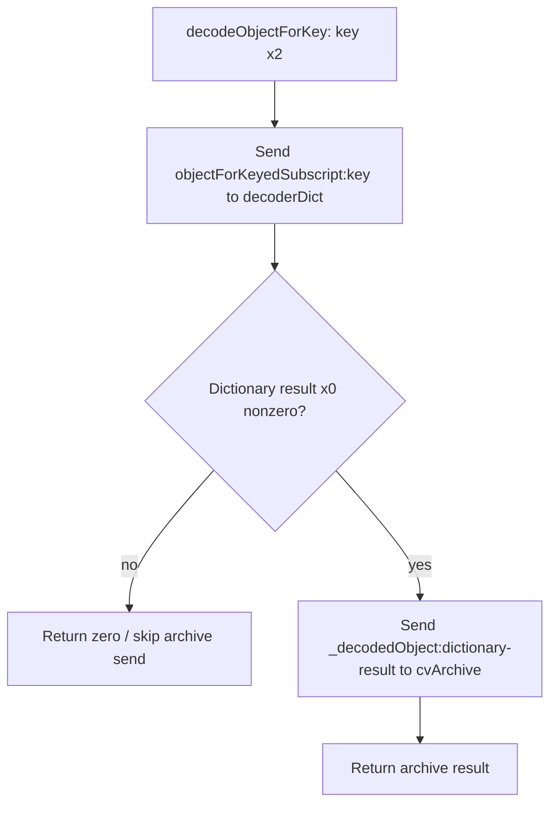

# SA-AE-TARGET-015: Dictionary references and value reads in the Logic proxy decoder

[日本語](SA-AE-TARGET-015-proxy-decoder.md) · [English](SA-AE-TARGET-015-proxy-decoder.en.md) · [Parent decoder](SA-AE-TARGET-012-parent-decode.en.md) · [MACore long helper](SA-AE-TARGET-013-parent-helpers.en.md)

**Logic's `_CLgMainStageProxyDecoder` passes a dictionary result to the archive's `_decodedObject:` only when that result is nonzero.** A zero dictionary result returns zero without sending to the archive. Both Class / Classes wrappers discard their incoming type constraint and forward only the key to `decodeObjectForKey:` on the same receiver.

These findings describe thirteen fixed definitions. Effective runtime dispatch, the reference format accepted by the archive, native missing-key / wrong-type / failure behavior, and successful save and reload remain unverified.

| Item | Evidence |
|---|---|
| Status / profile | Static byte verification and independent body reading complete. 2026-10-06 UTC / 10-07 JST, Logic Pro Creator Studio 12.3.1 / build 6682 |
| Logic ARM64 SHA-256 | `2f141e1a1f7b90a4fb0205ffec3dbe187baf601d20e9acb398acfadcdf050998` |
| Installed / analysis copy | Installed Logic is thin ARM64. Whole file / ARM64 slice / analysis copy bytes and hashes agree. Slice offset 0, 40,710,736 bytes |
| Method | One fixed Ghidra job using the absolute shared lock and `-noanalysis -readOnly`. Thirteen definitions / 880 bytes / 220 instruction words. No additional callee bodies, retry, or database name / type edits |
| Evidence | [Manifest](proxy-decoder-manifest.json), [16-row boundary table](../protocol/appleevent-proxy-decoder-boundaries.tsv), [binary identity](SA-IDENTITY-001-binary-inputs.en.md) |
| Capability | `runtime_verified=false`, `product_capability=false`. No Logic / UI operation, connection, or AppleEvent send in this investigation |

## 1. The two held objects are the dictionary and the archive

Class `0x025be290` / ro `0x02529e78` names `_CLgMainStageProxyDecoder`; its superclass field binds imported `NSObject`. The metaclass is `0x025be330` / ro `0x02529de8`. Instance method list `0x01c61268` contains thirteen rows, and class method list `0x01bdb8f0` contains the factory's single row. Each twelve-byte relative method row resolves its **IMP field relative to row + 8**.

| Ivar declaration | Offset / size | Type | Offset slot |
|---|---|---|---|
| `decoderDict` | 8 / 8 bytes | `@"NSDictionary"` | `0x0258f61c` |
| `cvArchive` | 16 / 8 bytes | `@"_CLgMainStageKeyValueArchive"` | `0x0258f620` |

`initWithDict:andCVArchive:` temporarily retains incoming dictionary x2 and archive x3, then sends superclass `init`. Only a nonzero result receives `_objc_storeStrong` at receiver +8 / +16 (`0x018e17d8` / `0x018e17e4`). It releases the temporary retains and returns the superclass result. A zero result skips both stores.

Factory `decoderWithDict:andCVArchive:` applies `_objc_alloc` to its incoming class receiver and sends `initWithDict:andCVArchive:` using **the allocation result x0 as receiver**. It then releases the temporary retains and autoreleases the initialization result. `.cxx_destruct` passes zero to `_objc_storeStrong` for archive +16 followed by dictionary +8.

These bodies use **fixed +8 / +16 offsets** without loading the runtime offset slots in the table. Metadata type declarations do not establish the actual object classes supplied at runtime. Ghidra's injected C hides retain / release / strong-store calls and the allocation result receiver; instructions determine ownership and receiver flow here.

## 2. The dictionary result becomes the archive argument

`0x018e1880` loads the dictionary from receiver +8; the selector stub at `0x018e1884` sends `objectForKeyedSubscript:` with the unchanged incoming key x2. After retaining the result, `CBZ x0` at `0x018e1894` tests zero. The zero branch sets result register x20 to zero at `0x018e18b4` and skips the archive send.

The nonzero branch loads the archive from +16 and places **the dictionary result in x2** at `0x018e189c` before sending `_decodedObject:` at `0x018e18a0`. The original key is not the archive argument. It releases the dictionary result and autoreleases the returned archive result.

This complete 96-byte body has neither an archive lookup when the dictionary result is zero nor a branch returning the raw dictionary value when the archive result is zero. Native dictionary missing-key behavior, the reference value's type and format, and `_decodedObject:` resolution / type checks / failures are outside this pass.

`containsValueForKey:` only compares the same dictionary subscript result. `CMP x0,0` at `0x018e1b04` and `CSET w19,NE` at `0x018e1b08` create 0/1; the object is released before return. It never sends `_decodedObject:`, so the existence of a dictionary reference does not establish that the archive can return an object.

## 3. Both wrappers leave their Class / Classes constraint unused

| Wrapper | Argument flow in its fixed body |
|---|---|
| `decodeObjectOfClasses:forKey:` / `0x018e1830` / 32 bytes | `MOV x2,x3` at `0x018e1838` overwrites incoming allowed-classes x2 with key x3. `0x018e183c` sends `decodeObjectForKey:` to the same receiver |
| `decodeObjectOfClass:forKey:` / `0x018e1850` / 32 bytes | The same `MOV x2,x3` at `0x018e1858`. `0x018e185c` sends `decodeObjectForKey:` to the same receiver |

Metadata encodings are `@32@0:8@16@24` and `@32@0:8#16@24`; the key is x3 in both. Neither complete fixed wrapper inspects, retains, or forwards the original constraint.

This does not establish that every runtime coder or the archive lacks type checks. Receiver overrides and `_decodedObject:` internals remain separate boundaries. Keep this Logic argument flow distinct from the [MACore long helper](SA-AE-TARGET-013-parent-helpers.en.md) definition that supplies the `NSNumber` class.

## 4. Scalar and bytes decoders send to the decoded object

Four scalar decoders pass the incoming key to `decodeObjectForKey:`, retain the returned object, and send the selector below. They preserve the result across object release before returning it.

| Decoder | Object send | Result preservation / conversion |
|---|---|---|
| Integer | `intValue` / call `0x018e1950` | `SXTW x20,w0` at `0x018e1954` extends signed32 to signed64. This is not `integerValue` |
| Float | `floatValue` / `0x018e19a4` | `FMOV s8,s0` → release → `FMOV s0,s8`. No conversion to another precision in this body |
| Double | `doubleValue` / `0x018e19fc` | `FMOV d8,d0` → release → `FMOV d0,d8` |
| Bool | `boolValue` / `0x018e1a50` | x0 → x20 → x0 without another comparison, mask, or 0/1 normalization. Metadata result is `B` |

None of the four bodies branches on a zero object, checks its class, inspects an error, or supplies a local default. Native nil / wrong-type / exception results remain unverified. The previously read `decodeLongForKey:inUnarchiver:` / `0x018e18e4` / 60 bytes sends `longValue`; it was not exported again in this pass.

`decodeBytesForKey:returnedLength:` saves incoming x3 in x20 as the output pointer. It sends `length` to the result of `decodeObjectForKey:` and **unconditionally writes the 64-bit result with `STR x0,[x20]` at `0x018e1aa8`**. There is no local output-pointer null guard.

It next passes the object to `_objc_retainAutorelease` and sends `bytes` to that call's returned receiver x0 (`0x018e1ab4`). It preserves the bytes pointer, releases the retained object, and returns the same pointer. The complete 80-byte body performs no buffer copy, allocation, class check, or length check. This call sequence is verified statically; pointer lifetime, native accepted types, missing-key results, and failures are not verified.

`versionForClassName:` is eight bytes: it loads archive +16 and tail-sends the same selector. Incoming class-name x2 is forwarded unchanged. There is no local version default; the archive's version semantics were not read in this pass.

## 5. Thirteen definitions and the next unread boundaries

| Selector | Entry | Bytes | Metadata result / arguments |
|---|---|---:|---|
| `initWithDict:andCVArchive:` | `0x018e1770` | 164 | `@32@0:8@16@24` |
| `decodeObjectOfClasses:forKey:` | `0x018e1830` | 32 | `@32@0:8@16@24` |
| `decodeObjectOfClass:forKey:` | `0x018e1850` | 32 | `@32@0:8#16@24` |
| `decodeObjectForKey:` | `0x018e1870` | 96 | `@24@0:8@16` |
| `decodeIntegerForKey:` | `0x018e1934` | 60 | `q24@0:8@16` |
| `decodeFloatForKey:` | `0x018e1984` | 68 | `f24@0:8@16` |
| `decodeDoubleForKey:` | `0x018e19dc` | 68 | `d24@0:8@16` |
| `decodeBoolForKey:` | `0x018e1a34` | 60 | `B24@0:8@16` |
| `decodeBytesForKey:returnedLength:` | `0x018e1a84` | 80 | `r*32@0:8@16^Q24` |
| `containsValueForKey:` | `0x018e1ae8` | 56 | `B24@0:8@16` |
| `versionForClassName:` | `0x018e1b20` | 8 | `q24@0:8@16` |
| `.cxx_destruct` | `0x018e1b28` | 48 | `v16@0:8` |
| Class `decoderWithDict:andCVArchive:` | `0x018e1b58` | 108 | `@32@0:8@16@24` |

Twelve instance definitions and one factory class method total **thirteen definitions / 880 bytes / 220 instruction words**, excluding the already read sixty-byte long decoder. The one job exited zero. Read-only conditions, identity, three export-completion markers, and thirteen C / ASM headers were checked. The checker rejected missing, duplicate, and altered instruction-word negative cases.

Minimal support comprises **eleven selector stubs / 220 bytes**, **eight native import stubs / 96 bytes**, two ivars, class / metaclass ownership and thirteen method rows, and the fixed superclass-send class / `init` reference. Selector dispatch binds `_objc_msgSend`; chained-fixup membership and import names were checked. Forty-seven pointer words / 357 source slices were verified. The boundary table records sixteen facts / 110 instruction anchors. No CFStrings are referenced by these bodies, so none were added.

A separate reader independently checked all 220 instruction words, thirteen method metadata rows, 357 slices, forty-seven pointers, stubs, and fifty-four call sites. Agreement of Ghidra's import identity is not a cryptographic verification of database annotations or effective dispatch. Raw exports and checkers remain local under `Research/raw/ghidra/q-logic-proxy-decoder-015*` / `proxy-decoder-*-015*` and are excluded from public Git. The manifest records source sizes and SHA-256 hashes.

The finite inventory located two next candidates: `_CLgMainStageKeyValueArchive::_decodedObject:` / `0x018e0a04` / 2112 bytes and that class's `versionForClassName:` / `0x018e162c` / 168 bytes. **Neither body was read in TARGET015.** Any later investigation must retain its own evidence rather than be included in this one-job record.

Effective dispatch, actual object classes, native accepted types / missing keys / errors / exceptions, bytes lifetime, archive contents, legacy migration, cache-free save roundtrip / reload / Undo, and the public-ID contract remain open. This pass adds no product AppleEvent capability.
