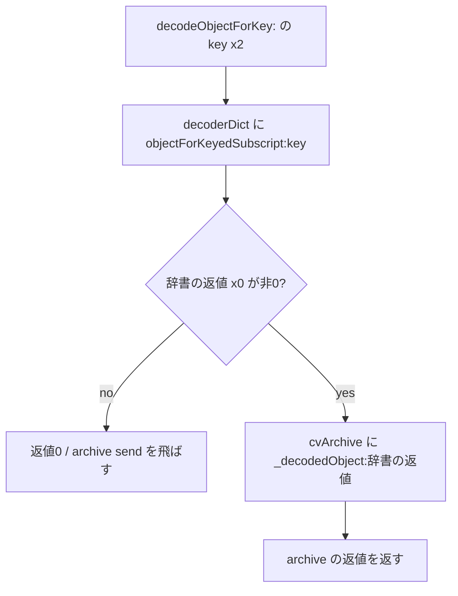

# SA-AE-TARGET-015: Logic proxy decoder の辞書参照と値の読出し

[日本語](SA-AE-TARGET-015-proxy-decoder.md) · [English](SA-AE-TARGET-015-proxy-decoder.en.md) · [親 decoder](SA-AE-TARGET-012-parent-decode.md) · [MACore long helper](SA-AE-TARGET-013-parent-helpers.md)

**Logic の `_CLgMainStageProxyDecoder` は、辞書から得た値が非0の場合だけ、その値を archive の `_decodedObject:` に渡します。** 辞書の結果が0なら、archive を呼ばず0を返します。Class / Classes 付きの二つの wrapper は、入口の型制限引数を使わず、キーだけを同じ receiver の `decodeObjectForKey:` に渡します。

これは固定の13定義を読んだ結果です。実行中にこの定義が選ばれること、archive が受理する参照値の形式、native のキー欠落・型違い・失敗処理、保存と再読込の成功は未確認です。

| 項目 | 内容 |
|---|---|
| 状態 / profile | 静的 byte 照合と別 reader の本文レビュー完了。2026-10-06 UTC / 10-07 JST、Logic Pro Creator Studio 12.3.1 / build 6682 |
| Logic ARM64 SHA-256 | `2f141e1a1f7b90a4fb0205ffec3dbe187baf601d20e9acb398acfadcdf050998` |
| installed と解析コピー | installed Logic は thin ARM64。全体 / ARM64 slice / 解析コピーの byte・hash が一致。slice offset 0、40,710,736 bytes |
| 方法 | 共通絶対 lock、Ghidra `-noanalysis -readOnly` の固定1 job。13定義 / 880 bytes / 220命令ワード。追加 callee 本文・retry・DB の名前 / 型編集なし |
| 根拠 | [manifest](proxy-decoder-manifest.json)、[16件の境界表](../protocol/appleevent-proxy-decoder-boundaries.tsv)、[バイナリ識別](SA-IDENTITY-001-binary-inputs.md) |
| capability | `runtime_verified=false`、`product_capability=false`。この調査では Logic / UI 操作・接続・AppleEvent 送信を行っていない |

## 1. 保持するのは dictionary と archive の二つ

class `0x025be290` / ro `0x02529e78` の owner 名は `_CLgMainStageProxyDecoder`、superclass field は imported `NSObject` です。metaclass は `0x025be330` / ro `0x02529de8`。instance method list `0x01c61268` は13 rows、class method list `0x01bdb8f0` は factory の1 rowです。各12-byte relative method row の **IMP field は row + 8 を基準**に解決します。

| ivar 宣言 | offset / size | type | offset slot |
|---|---|---|---|
| `decoderDict` | 8 / 8 bytes | `@"NSDictionary"` | `0x0258f61c` |
| `cvArchive` | 16 / 8 bytes | `@"_CLgMainStageKeyValueArchive"` | `0x0258f620` |

`initWithDict:andCVArchive:` は入口の dictionary x2 と archive x3 を一時 retain し、superclass `init` を送ります。返値が非0のときだけ、その receiver の +8 / +16 へ `_objc_storeStrong` を呼びます（`0x018e17d8` / `0x018e17e4`）。一時 retain を release し、superclass の返値を返します。0の場合は二つの store を飛ばします。

factory `decoderWithDict:andCVArchive:` は、入口の class receiver に `_objc_alloc` を適用し、**allocation の返値 x0 を receiver**として `initWithDict:andCVArchive:` を送ります。その後、一時 retain を release し、initialization の返値を autorelease して返します。`.cxx_destruct` は archive +16、dictionary +8 の順に `_objc_storeStrong` へ0を渡します。

今回の本文は **固定の +8 / +16** を使い、上表の runtime offset slot をロードしていません。metadata の型宣言は、実際に渡された object の class を証明しません。また Ghidra C の injection は retain・release・strong store や alloc の返値 receiver を省いて表示するため、保持と受信先は命令を優先して確認しました。

## 2. 辞書の結果を archive へ渡す

`0x018e1880` は receiver +8 から dictionary を読み、`0x018e1884` の selector stub は `objectForKeyedSubscript:` を送ります。入口の key x2 はそのまま引数です。返値を retain した後、`0x018e1894` の `CBZ x0` で0を判定します。0なら `0x018e18b4` で返値用 x20 を0にし、archive send を飛ばします。

非0なら +16 から archive を読み、`0x018e189c` で **dictionary の返値を x2** に置いて、`0x018e18a0` で `_decodedObject:` を送ります。archive に渡すのは元の key ではありません。dictionary の返値を release し、archive の返値を autorelease して返します。

この96-byte本文には、dictionary の結果が0のときに archive を検索する枝も、archive の返値が0のときに raw dictionary 値を返す枝もありません。dictionary のキー欠落がどう表現されるか、参照値の型・形式、`_decodedObject:` の解決・型検査・失敗動作は今回の範囲外です。

`containsValueForKey:` は同じ dictionary subscript の返値を比較するだけです。`0x018e1b04` の `CMP x0,0` と `0x018e1b08` の `CSET w19,NE` で0/1を作り、object を release して返します。`_decodedObject:` を呼ばないため、dictionary に参照があるという判定と、archive が object を返せるという判定は一致すると限りません。

## 3. Class / Classes 制限引数は二つの wrapper で使わない

| wrapper | 固定本文の引数処理 |
|---|---|
| `decodeObjectOfClasses:forKey:` / `0x018e1830` / 32 bytes | `0x018e1838` の `MOV x2,x3` で、入口の allowed-classes x2 を key x3 へ上書き。`0x018e183c` で同じ receiver に `decodeObjectForKey:` |
| `decodeObjectOfClass:forKey:` / `0x018e1850` / 32 bytes | `0x018e1858` の同じ `MOV x2,x3`。`0x018e185c` で同じ receiver に `decodeObjectForKey:` |

metadata は前者 `@32@0:8@16@24`、後者 `@32@0:8#16@24` で、key は両者とも x3 に対応します。二つの完全な固定本文には、元の制限引数の検査・保持・転送はありません。

この結果から、実行中の coder 全体や archive 内部に型検査がないとは結論しません。動的な receiver の override や `_decodedObject:` 内部の処理は別の境界です。[MACore long helper](SA-AE-TARGET-013-parent-helpers.md)が `NSNumber` の class を渡す定義と、この Logic wrapper の引数処理も区別します。

## 4. scalar と bytes は、復元した object へ送信する

四つの scalar decoder は入口の key を `decodeObjectForKey:` に渡し、返ってきた object を retain してから次の selector を送ります。その結果を退避し、object を release して返します。

| decoder | object への send | 結果の保持 / 変換 |
|---|---|---|
| Integer | `intValue` / call `0x018e1950` | `0x018e1954` の `SXTW x20,w0` で signed32 → signed64。`integerValue` ではない |
| Float | `floatValue` / `0x018e19a4` | `FMOV s8,s0` → release → `FMOV s0,s8`。この本文で別精度への変換なし |
| Double | `doubleValue` / `0x018e19fc` | `FMOV d8,d0` → release → `FMOV d0,d8` |
| Bool | `boolValue` / `0x018e1a50` | x0 → x20 → x0。追加の比較・mask・0/1正規化なし。metadata result は `B` |

四つの本文には object が0の場合の枝、class 検査、error 引数・検査、局所的な default 値がありません。native の nil / 型違い / 例外時に何が返るかは未確認です。先に読んだ `decodeLongForKey:inUnarchiver:` / `0x018e18e4` / 60 bytes は `longValue` を送る定義で、今回再取得していません。

`decodeBytesForKey:returnedLength:` は入口の x3 を output pointer として x20 に保存します。`decodeObjectForKey:` の object に `length` を送り、**`0x018e1aa8` の `STR x0,[x20]` で64-bit返値を無条件に書き込みます。** output pointer が0かどうかの局所的な guard はありません。

次に object を `_objc_retainAutorelease` に渡し、その返値 receiver x0 に `bytes` を送ります（`0x018e1ab4`）。bytes pointer を退避して object を release し、同じ pointer を返します。80-byte本文に buffer copy・allocation・class / length 検査はありません。この呼出し順は静的に確認できますが、pointer の有効期間・native の受理型・キー欠落・失敗動作は検証していません。

`versionForClassName:` は8 bytesで、+16の archive をロードし、同じ selector へ tail send します。入口の class-name x2 は変更せず渡します。局所的な version default はなく、archive が version を決める意味は今回未読です。

## 5. 13定義の範囲と未読境界

| selector | entry | bytes | metadata result / arguments |
|---|---|---:|---|
| `initWithDict:andCVArchive:` | `0x018e1770` | 164 | `@32@0:8@16@24` |
| `decodeObjectOfClasses:forKey:` | `0x018e1830` | 32 | `@32@0:8@16@24` |
| `decodeObjectOfClass:forKey:` | `0x018e1850` | 32 | `@32@0:8#16@24` |
| `decodeObjectForKey:` | `0x018e1870` | 96 | `@24@0:8@16` |
| `decodeIntegerForKey:` | `0x018e1934` | 60 | `q24@0:8@16` |
| `decodeFloatForKey:` | `0x018e1984` | 68 | `f24@0:8@16` |
| `decodeDoubleForKey:` | `0x018e19dc` | 68 | `d24@0:8@16` |
| `decodeBoolForKey:` | `0x018e1a34` | 60 | `B24@0:8@16` |
| `decodeBytesForKey:returnedLength:` | `0x018e1a84` | 80 | `r*32@0:8@16^Q24` |
| `containsValueForKey:` | `0x018e1ae8` | 56 | `B24@0:8@16` |
| `versionForClassName:` | `0x018e1b20` | 8 | `q24@0:8@16` |
| `.cxx_destruct` | `0x018e1b28` | 48 | `v16@0:8` |
| class `decoderWithDict:andCVArchive:` | `0x018e1b58` | 108 | `@32@0:8@16@24` |

instance の12定義と factory class method の1定義で、合計 **13定義 / 880 bytes / 220命令ワード**です。既読 long の60 bytes は含めません。1 job の exit 0、read-only 条件、identity、三つの export 完了 marker、C / ASM 各13 header を照合しました。命令の欠落・重複・改変の3負例は checker が拒否しました。

最小 support は、直接使う selector stubs **11個 / 220 bytes**、native import stubs **8個 / 96 bytes**、二つの ivar、class / metaclass と13 method rows、superclass send の class / `init` reference です。selector stubs の dispatch は `_objc_msgSend` import に対応し、chained fixup の membership と bind 名を確認しました。47 pointer words / 357 source slices を検証し、16 facts / 110 instruction anchors を境界表へ保存しました。今回の本文に CFString の参照はなく、追加していません。

別 reader は、全220命令ワード、13 method metadata、357 slices、47 pointers、stubs と54 call sitesを独立に照合しました。Ghidra import identity の一致は、DB注釈や実効 dispatch を暗号学的に検証したことにはなりません。生出力と checker はローカル `Research/raw/ghidra/q-logic-proxy-decoder-015*` / `proxy-decoder-*-015*` に保存し、公開 Git へ含めません。manifest に根拠の size / SHA-256 を記録しています。

今回の有限 inventory で所在を確認した次の候補は `_CLgMainStageKeyValueArchive::_decodedObject:` / `0x018e0a04` / 2112 bytes と同クラス `versionForClassName:` / `0x018e162c` / 168 bytes です。**TARGET015 では両者の本文を読んでいません。** 今後の調査で読まれた場合も、この1 jobの証拠に混ぜません。

実効 dispatch、実 object class、native の受理型・キー欠落・error・例外、bytes lifetime、archive 内容、旧値の移行、cacheを使わない保存往復・再読込・Undo・公開ID契約は残ります。この結果から製品の AppleEvent 対応機能を追加しません。
