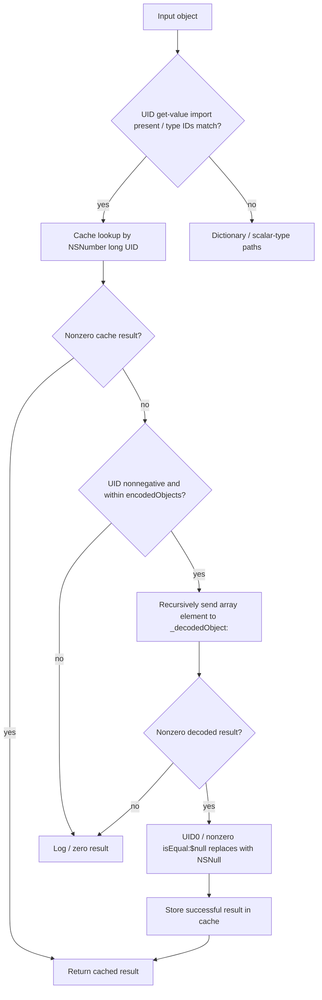

# SA-AE-TARGET-016: UID and type-directed object decoding

[日本語](SA-AE-TARGET-016-archive-dispatch.md) · [English](SA-AE-TARGET-016-archive-dispatch.en.md) · [Proxy decoder](SA-AE-TARGET-015-proxy-decoder.md)

**The proxy reaches a decoder that branches on UIDs, class names and Foundation types.** `_CLgMainStageKeyValueArchive::_decodedObject:` resolves UIDs through a cache and encoded-object array, then routes dictionaries carrying class information to specialized helpers or the fixed `_CLgMainStageObject`. The proxy wrappers ignoring their constraint arguments does not establish that the archive has no type conditions.

| Item | Verified scope |
|---|---|
| Profile | Logic Pro Creator Studio 12.3.1 / build 6682, 2026-10-07 JST (10-06 UTC) |
| Fixed bodies | `_decodedObject:` `0x018e0a04` / 2112 bytes; `versionForClassName:` `0x018e162c` / 168 bytes |
| Byte check | **2 definitions / 2280 bytes / 570 instruction words** match the current installed thin ARM64 image and analysis copy |
| ARM64 SHA-256 | `2f141e1a1f7b90a4fb0205ffec3dbe187baf601d20e9acb398acfadcdf050998` |
| Acquisition | One common-lock Ghidra `-noanalysis -readOnly` job. No additional callee bodies, DB edits or live operations |
| Evidence | [Manifest](archive-dispatch-manifest.json), [14 boundary facts](../protocol/appleevent-archive-dispatch-boundaries.tsv), [binary identity](SA-IDENTITY-001-binary-inputs.md) |
| Application | Static definitions; `runtime_verified=false`, `product_capability=false` |

## 1. Resolve a UID through the encoded-object array

A zero import pointer at `0x02284f30` skips UID testing. Otherwise `CFGetTypeID` and `__CFKeyedArchiverUIDGetTypeID` are compared; equality leads to `__CFKeyedArchiverUIDGetValue`. The UID becomes a `numberWithLong:` key for the cache at receiver +32.

**A cache hit precedes range validation.** `CBNZ x0` at `0x018e0aac` skips sign, count, array and recursion. Only a cache miss tests the UID sign bit at `0x018e0ab0` and unsigned UID >= count at `0x018e0ac4`; invalid values take the logging path with zero result.

A valid index fetches an element from the array at +16 and **recursively sends `_decodedObject:` to self** at `0x018e0aec`. A zero result logs decoding failure. A nonzero result is replaced with `NSNull null` only when UID is0 and the full w0 result of `isEqual:` with string `$null` is nonzero. There is no explicit NSString class test or extra zero check after replacement. It then creates the mutable cache if needed and stores the result by UID.

Cache insertion follows recursion; this body does not insert a placeholder before recursing. Cyclic-reference acceptance, exception cleanup and actual cache contents or lifetime remain unverified. (D016-01–06)

## 2. Dispatch dictionaries using class information

Non-dictionaries pass through only when bit0 of `isKindOfClass` is true for `NSString`, `NSNumber`, `NSData` or `NSDate`; other inputs produce zero. There is no direct raw-`NSArray` pass-through path.

For a dictionary, it looks up `$class`. Zero leads to `$classname`: zero there warns and produces zero, while a nonzero value is recursively decoded and returned. **This is not a raw pass-through for ordinary dictionaries without class information.**

A nonzero `$class` value is recursively decoded and passed to `classForClassName:`. The returned Class participates in Foundation name comparisons through `NSStringFromClass`, and in subclass tests sent with `isSubclassOfClass:`.

| Name / subclass condition | Helper / call anchor |
|---|---|
| Name of `NSArray` / `NSMutableArray` | `_decodedArray:` / `0x018e0d1c` |
| Name of `NSDictionary` / `NSMutableDictionary` | `_decodedDictionary:` / `0x018e0e5c` |
| Name of `NSString` / `NSMutableString` | `_decodedString:` / `0x018e0ef8` |
| Name of `NSAttributedString` / `NSMutableAttributedString` | `_decodedAttributedString:` / `0x018e0f88` |
| Name of `NSColor` | `_decodedColor:` / `0x018e0fd8` |
| Subclass of `WsIdentity` (full w0 result) | `_decodedIdentity:` / `0x018e100c` |
| Name of `MAChannelID` | `_decodeChannelID:` / `0x018e105c` |
| Subclass of `MAMapping` / `MAKeyboardLayer` / `MAGraphPoint` (bit0) | `_decodeDecodableObject:` / `0x018e10e4` |
| Subclass of `_WsChannelUUID` (full w0 result) | Same `_decodeDecodableObject:` / `0x018e10e4` |
| Dictionary taking none of those conditions | Fixed `_CLgMainStageObject` path below |

Name and subclass conditions are distinct. The effective `classForClassName:` implementation and specialized helper bodies are outside these two definitions. Native behavior when class-name resolution fails is unverified. (D016-07–11)

## 3. Fallback passes properties to a fixed class

Fallback enumerates the dictionary keys and recursively decodes each value through self's `_decodedObject:` into a properties dictionary. Any zero decoded value logs corrupt properties and makes the whole result zero.

Successful properties receive `_fileWrapper` at receiver +40 under the `fileWrapper` key. `0x018e1204` then places the **fixed `_CLgMainStageObject` class address `0x025be218`** in x0, calls `objc_alloc`, and sends `initWithProperties:` to the allocation result. This body does not directly allocate the arbitrary resolved Class.

This fixed fallback does not exclude further class creation or side effects inside `_CLgMainStageObject`. The `initWithProperties:` body and effective dispatch remain unread here. (D016-12–13)

## 4. Read version as signed32 from the decoded dictionary

`versionForClassName:` looks up `_classVersions` in `_rootProperties` at receiver +24 and passes the result to `_decodedObject:`. It subscripts that decoded result using incoming className, then **`SXTW x22,w0` at `0x018e16a4`** sign-extends the `intValue` result to signed64.

There is no local nil/type/default branch. Native execution such as a guaranteed zero version for missing data is not established by this body. This is the fixed archive definition behind the proxy's previously reviewed8-byte tail-send. (D016-14)

| Declared ivar | Offset / size | Declared type |
|---|---|---|
| `_topLevel` | 8 / 8 bytes | `NSDictionary` |
| `_encodedObjects` | 16 / 8 bytes | `NSArray` |
| `_rootProperties` | 24 / 8 bytes | `NSDictionary` |
| `_objectsByID` | 32 / 8 bytes | `NSMutableDictionary` |
| `_fileWrapper` | 40 / 8 bytes | `NSFileWrapper` |

The bodies use fixed offsets. Declarations do not verify actual live object classes or layout. Owner, method rows, types and relative IMP bases were checked against current bytes.

## 5. Evidence and remaining boundaries

Verification covers570 words across two definitions,2 method rows,5 ivars,23 selector stubs,15 native import stubs,9 CFStrings and2 internal classes. The checker rejects missing, duplicate and changed instruction words. The boundary table records14 facts /129 instruction anchors. Raw exports and checkers remain local under `Research/raw/ghidra/q-archive-dispatch-016-*` and `archive-dispatch-*-016*`; the manifest records the organized evidence sizes and SHA-256 fingerprints.

Remaining boundaries include specialized helper formats, `classForClassName:`, file-wrapper loading, `_CLgMainStageObject` initialization, exceptions, cycles, cache lifetime, effective dispatch and save/reload roundtrips. Static progress and successful live acceptance are separate. These findings alone do not add a product AppleEvent operation.
