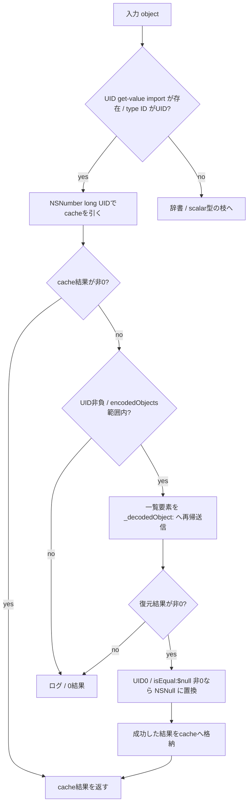

# SA-AE-TARGET-016: UID と型別のオブジェクト復元

[日本語](SA-AE-TARGET-016-archive-dispatch.md) · [English](SA-AE-TARGET-016-archive-dispatch.en.md) · [proxy decoder](SA-AE-TARGET-015-proxy-decoder.md)

**proxy の先には、UID・クラス名・Foundation の型で分ける復元処理があります。** `_CLgMainStageKeyValueArchive::_decodedObject:` は UID を cache / オブジェクト一覧へ対応づけ、クラス情報を持つ辞書を専用 helper か固定の `_CLgMainStageObject` へ渡します。前回の wrapper が制限引数を使わないことだけで、復元処理全体に型の条件がないとは言えません。

| 項目 | 確認した範囲 |
|---|---|
| 対象 | Logic Pro Creator Studio 12.3.1 / build 6682、2026-10-07 JST（10-06 UTC） |
| 固定本文 | `_decodedObject:` `0x018e0a04` / 2112 bytes、`versionForClassName:` `0x018e162c` / 168 bytes |
| byte 照合 | **2定義 / 2280 bytes / 570命令ワード**。現在の installed thin ARM64 / 解析 copy が一致 |
| ARM64 SHA-256 | `2f141e1a1f7b90a4fb0205ffec3dbe187baf601d20e9acb398acfadcdf050998` |
| 取得 | 共通絶対 lock、Ghidra `-noanalysis -readOnly` の1 job。追加 callee 本文・DB編集・実機操作なし |
| 根拠 | [manifest](archive-dispatch-manifest.json)、[14件の境界表](../protocol/appleevent-archive-dispatch-boundaries.tsv)、[バイナリ識別](SA-IDENTITY-001-binary-inputs.md) |
| 適用範囲 | 静的な定義。`runtime_verified=false`、`product_capability=false` |

## 1. UID は一覧へ戻して復元する

入口の import pointer `0x02284f30` が0なら UID 判定を飛ばします。非0なら `CFGetTypeID` と `__CFKeyedArchiverUIDGetTypeID` の結果を比較し、等しい場合に `__CFKeyedArchiverUIDGetValue` を呼びます。得た UID を `numberWithLong:` のキーにし、receiver +32の cache を引きます。

**cache hit は範囲検査より前です。** `0x018e0aac` の `CBNZ x0` は符号・count・一覧・再帰処理を飛ばします。cache miss のときだけ、`0x018e0ab0` で UID の符号bit、`0x018e0ac4` で unsigned の UID >= count を検査し、範囲外はログと0結果へ進みます。

範囲内なら +16の一覧から要素を取得し、**self へ `_decodedObject:` を再帰送信**します（`0x018e0aec`）。返値0なら復元失敗ログへ進みます。非0なら、UID が0で`isEqual:` に文字列 `$null` を渡した返値w0が非0のときだけ `NSNull null` の返値へ置換します。明示的なNSString型検査と、置換後の追加0検査はありません。その後、必要なら mutable dictionary の cache を作り、結果を UID のキーで格納します。

cache の格納は再帰から戻った後です。途中で placeholder を先に入れる本文ではありません。循環参照の受理、例外の cleanup、実際の cache の中身と寿命は今回の証拠では確定しません。（D016-01〜06）

## 2. 辞書はクラス情報で振り分ける

辞書以外では、`NSString`・`NSNumber`・`NSData`・`NSDate` の `isKindOfClass` 結果の bit0 が真なら入力を返し、どれにも該当しなければ0を返します。raw `NSArray` をそのまま返す枝はありません。

辞書なら `$class` を引きます。結果が0のときは `$classname` を引き、それも0なら警告と0結果、非0ならその値を再帰復元した結果を返します。**この枝は「クラス情報のない普通の辞書をそのまま返す」処理ではありません。**

`$class` が非0ならその値を再帰復元し、`classForClassName:` へ渡します。返された Class の `NSStringFromClass` 結果を使う名前比較と、Class へ `isSubclassOfClass:` を送る枝があります。

| 名前 / subclass の条件 | 呼び出す helper / call anchor |
|---|---|
| `NSArray` / `NSMutableArray` の名前 | `_decodedArray:` / `0x018e0d1c` |
| `NSDictionary` / `NSMutableDictionary` の名前 | `_decodedDictionary:` / `0x018e0e5c` |
| `NSString` / `NSMutableString` の名前 | `_decodedString:` / `0x018e0ef8` |
| `NSAttributedString` / `NSMutableAttributedString` の名前 | `_decodedAttributedString:` / `0x018e0f88` |
| `NSColor` の名前 | `_decodedColor:` / `0x018e0fd8` |
| `WsIdentity` の subclass（返値w0全体） | `_decodedIdentity:` / `0x018e100c` |
| `MAChannelID` の名前 | `_decodeChannelID:` / `0x018e105c` |
| `MAMapping` / `MAKeyboardLayer` / `MAGraphPoint` の subclass（bit0） | `_decodeDecodableObject:` / `0x018e10e4` |
| `_WsChannelUUID` の subclass（返値w0全体） | 同じ `_decodeDecodableObject:` / `0x018e10e4` |
| 上の条件を通らない辞書 | 次の固定 `_CLgMainStageObject` の処理 |

名前比較と subclass 判定は交換可能な条件ではありません。`classForClassName:` の実効実装や各 helper の本文は、この2定義には含めません。型を表す名前の解決に失敗したときの native 動作も未検証です。（D016-07〜11）

## 3. fallback は固定クラスへ properties を渡す

専用の条件を通らない辞書は、その key を列挙し、各 value を self の `_decodedObject:` で再帰復元して properties 辞書へ格納します。どれかの返値が0なら corrupt properties のログと、全体の0結果へ進みます。

成功した properties には receiver +40の `_fileWrapper` を `fileWrapper` キーで入れます。その後 `0x018e1204` で **固定の `_CLgMainStageObject` class address `0x025be218`** を x0へ置き、`objc_alloc` の結果へ `initWithProperties:` を送ります。任意の解決済み Class をここで直接 alloc する本文ではありません。

この固定 fallback は、`_CLgMainStageObject` 内部の任意クラス生成や副作用まで否定する根拠ではありません。`initWithProperties:` の本文と実効dispatchは未読です。（D016-12〜13）

## 4. version は復元した辞書から signed32 を読む

`versionForClassName:` は receiver +24の `_rootProperties` から `_classVersions` を引き、その値を `_decodedObject:` に渡します。復元結果へ incoming className をキーとして subscript を送り、`intValue` の返値w0を **`0x018e16a4` の `SXTW x22,w0`** でsigned64へ伸ばして返します。

局所的な nil / 型 / default 分岐はありません。この本文から「欠けたversionは必ず0」といった native の実行結果は判定しません。前回 proxy の8-byte `versionForClassName:` が送る先の、固定定義を読んだ結果です。（D016-14）

| 宣言された ivar | offset / size | 宣言型 |
|---|---|---|
| `_topLevel` | 8 / 8 bytes | `NSDictionary` |
| `_encodedObjects` | 16 / 8 bytes | `NSArray` |
| `_rootProperties` | 24 / 8 bytes | `NSDictionary` |
| `_objectsByID` | 32 / 8 bytes | `NSMutableDictionary` |
| `_fileWrapper` | 40 / 8 bytes | `NSFileWrapper` |

本文は固定のoffsetを使います。上表の宣言は実行中の具体的object型・layoutの確認ではありません。class owner / method row / type / IMPの相対基準は現在のbyteで照合しました。

## 5. 証拠と次の境界

2定義の570ワード、method metadata2件、ivar5件、selector stub23件、native import stub15件、CFString9件、internal class2件を照合しています。命令の欠落・重複・改変の3負例は拒否しました。境界表は14 facts / 129命令 anchorsです。生のGhidra出力と checker はローカルの `Research/raw/ghidra/q-archive-dispatch-016-*` / `archive-dispatch-*-016*` に保持し、整理した根拠のsizeとSHA-256をmanifestへ記録します。

残る境界は、各専用helperの復元形式、`classForClassName:`、file wrapperの読込入口、`_CLgMainStageObject`の初期化、例外・循環参照・cacheの寿命、実効dispatch、保存往復です。独立した静的資料の進展と、実機での受理・成功は分けます。今回の結果だけで、CLIに新しいAppleEvent操作を公開しません。
