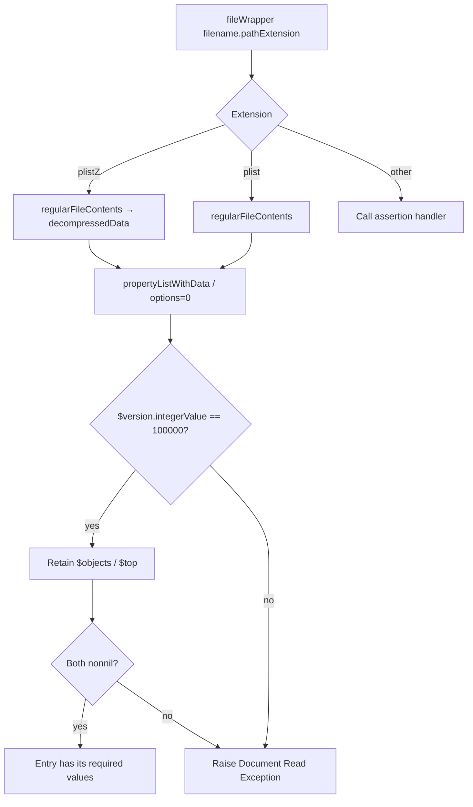
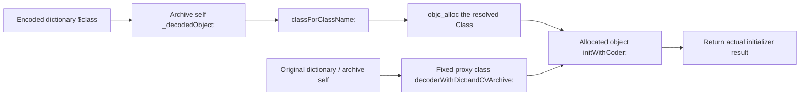

# SA-AE-TARGET-017: From file loading to the decoded class

[日本語](SA-AE-TARGET-017-archive-containers.md) · [English](SA-AE-TARGET-017-archive-containers.en.md) · [UID and type dispatch](SA-AE-TARGET-016-archive-dispatch.md)

**The file entry checks `plist` / `plistZ` and a fixed archive version; the dedicated decoding path allocates the resolved Class and passes a decoder to `initWithCoder:`.** This is a different branch from the previous fallback that passes properties to a fixed class. Five definitions connect the container entry and decoding destination, checked against current binary instructions.

| Item | Checked scope |
|---|---|
| Target | Logic Pro Creator Studio 12.3.1 / build 6682, 2026-10-07 JST (10-06 UTC) |
| Byte verification | **5 definitions / 1736 bytes / 434 instruction words**; installed thin ARM64 and analysis copy match |
| ARM64 SHA-256 | `2f141e1a1f7b90a4fb0205ffec3dbe187baf601d20e9acb398acfadcdf050998` |
| Acquisition | One Ghidra `-noanalysis -readOnly` job through the common absolute lock |
| Evidence | [Manifest](archive-containers-manifest.json), [20 boundary facts](../protocol/appleevent-archive-containers-boundaries.tsv), [binary identity](SA-IDENTITY-001-binary-inputs.md) |
| Applicability | Static definitions; `runtime_verified=false`, `product_capability=false` |

| Fixed definition | Address | Body size |
|---|---|---:|
| `initWithFileWrapper:` | `0x018df7d4` | 824 bytes |
| `classForClassName:` | `0x018dff08` | 160 bytes |
| `_decodeDecodableObject:` | `0x018e08f8` | 200 bytes |
| `valueForKey:` | `0x018e1394` | 172 bytes |
| `rootProperties` | `0x018e1464` | 380 bytes |

## 1. Extension and version are separate checks

The entry first calls super `init`. A nil result skips file processing. Otherwise it compares `filename.pathExtension` with `plistZ`, then `plist`. Both comparisons branch on **full w0 zero/nonzero**. `plistZ` sends `decompressedData` to the contents; a nil result calls `raise:format:` for `Document Read Exception`. The compression implementation is outside this scope.

Other extensions send a failure to `NSAssertionHandler currentHandler`, with source name `CLgMainStageClassicPatchDecoder.m` and line236. Instructions continue if assertion / raise returns normally, but actual exception, termination and unwinding behavior was not tested. (A017-01–04)

The parser is `NSPropertyListSerialization propertyListWithData:options:format:error:`. It receives data in x2, options=0 in x3, a format-out pointer in x4 and an initially nil error-out pointer in x5. The body never reads the returned format; this call alone does not establish accepted XML / binary formats.

The parser result is retained in `_topLevel` (+8). A nil result passes the error's `localizedDescription` to raise. Next, the **64-bit `$version.integerValue` must equal100000**: neither a lower bound nor a per-class version. Then `$objects` is retained in `_encodedObjects` (+16), `$top` in `_rootProperties` (+24), and fileWrapper at +40. The entry requires the first two to be nonnil, without checking actual NSArray / NSDictionary types or UID ranges here. (A017-05–08)

## 2. Two aliases translate older class names

| Input name / condition | Resolved source |
|---|---|
| Bit0 set after comparing `WsKeyboardLayer` | Actual `objc_opt_class` result for `MAKeyboardLayer` |
| Full w0 nonzero after comparing `WsDirectToChannelMIDIParameterMapping` | Actual `objc_opt_class` result for `MAChannelMIDIParameterMapping` |
| Neither alias matches | `NSKeyedUnarchiver classForClassName:`, then `NSClassFromString` only on nil |

After `NSClassFromString`, the actual x0 result is retained, saved and returned. Ghidra's C appears to return the incoming string; the instructions do not support that reading. The declared return type is Class (`#`). No local branch establishes a returned-class subclass or nonnil guarantee. Keep this name resolution distinct from the previous type dispatcher. (A017-09–11)

## 3. The dedicated path allocates the resolved Class

`_decodeDecodableObject:` recursively decodes `$class`, passes the result to `classForClassName:`, and calls `objc_alloc` on that **returned Class**. Separately, it sends `decoderWithDict:andCVArchive:` to fixed `_CLgMainStageProxyDecoder` (`0x025be290`), passing the original dictionary in x2 and archive self in x3. That decoder becomes x2 for `initWithCoder:` on the allocated object, and the actual initializer result is returned. (A017-12–14)

The200-byte body has no local nil/type/subclass/contains/error condition. The [previous dispatcher](SA-AE-TARGET-016-archive-dispatch.md) does have conditions selecting this dedicated path. This body alone does not prove live acceptance of arbitrary classes or files. Proxy factory metadata was checked, while its internals, the destination initializer body and effective dispatch remain outside this scope. (A017-15)

## 4. Missing keys and failed decoding take different paths

`valueForKey:` checks the **raw value** under the incoming key in `_rootProperties`. Nonnil is decoded through `_decodedObject:` and returned. Only a nil raw lookup sends the same key to super `valueForKey:`. A nil decoded result does not trigger a second super fallback. (A017-16)

`rootProperties` does not return the raw dictionary. It creates a new `NSMutableDictionary` with the original count as capacity, enumerates the original keys, recursively decodes each value and stores it under the same key. **It calls the setter without a local nil-result check**, unlike the previously read fixed-object fallback. Native setter behavior on nil, exception cleanup and actual enumeration-mutation behavior were not tested. (A017-17–19)

## 5. Next boundaries

Verification covers434 words,5 method rows,5 ivar declarations,20 selector stubs,11 native import stubs,15 CFStrings (11 ASCII /4 UTF16LE) and1 proxy factory metadata row. Missing, duplicate and changed-word negative cases were rejected, and all anchors for20 facts lie in the fixed bodies. The executed runner's opening docstring retains a prior number/size typo; actual arguments, exports and execution records match these five definitions. Original evidence is preserved and the note is recorded in the manifest.

The next definitions are the dedicated array/dictionary/string and related helpers, plus fixed `_CLgMainStageObject` initialization. Using this as a supported file format still requires native behavior, exceptions/cycles/cache, effective dispatch, comparison with dedicated-project files, and save/reload roundtrips. This static work adds no product AppleEvent operation. (A017-20)
