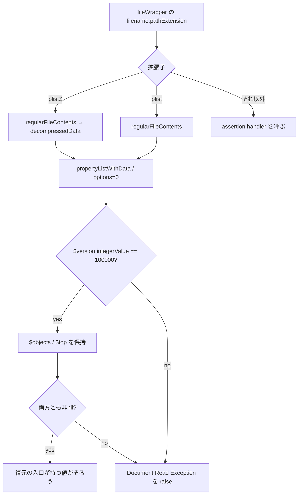
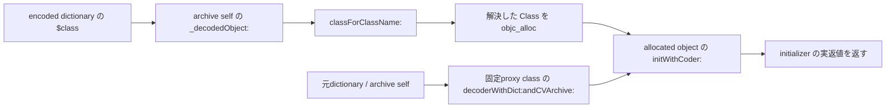

# SA-AE-TARGET-017: ファイルから復元先のクラスへ

[日本語](SA-AE-TARGET-017-archive-containers.md) · [English](SA-AE-TARGET-017-archive-containers.en.md) · [UID・型の振り分け](SA-AE-TARGET-016-archive-dispatch.md)

**ファイルの入口は `plist` / `plistZ` と固定の archive version を確認し、専用の復元経路では、解決したクラスを生成して `initWithCoder:` に渡します。** 前回の「固定クラスへ properties を渡す fallback」と、今回の「解決した Class を生成する専用経路」は別の枝です。入口と復元先をつなぐ5関数を、現在のバイナリの命令と照合しました。

| 項目 | 確認した範囲 |
|---|---|
| 対象 | Logic Pro Creator Studio 12.3.1 / build 6682、2026-10-07 JST（10-06 UTC） |
| byte 照合 | **5定義 / 1736 bytes / 434命令ワード**。installed thin ARM64 と解析 copy が一致 |
| ARM64 SHA-256 | `2f141e1a1f7b90a4fb0205ffec3dbe187baf601d20e9acb398acfadcdf050998` |
| 取得 | 共通絶対 lock、Ghidra `-noanalysis -readOnly` の1 job |
| 根拠 | [manifest](archive-containers-manifest.json)、[20件の境界表](../protocol/appleevent-archive-containers-boundaries.tsv)、[バイナリ識別](SA-IDENTITY-001-binary-inputs.md) |
| 適用範囲 | 静的な定義。`runtime_verified=false`、`product_capability=false` |

| 固定定義 | アドレス | 本文サイズ |
|---|---|---:|
| `initWithFileWrapper:` | `0x018df7d4` | 824 bytes |
| `classForClassName:` | `0x018dff08` | 160 bytes |
| `_decodeDecodableObject:` | `0x018e08f8` | 200 bytes |
| `valueForKey:` | `0x018e1394` | 172 bytes |
| `rootProperties` | `0x018e1464` | 380 bytes |

## 1. ファイルの拡張子と version は別々に確認する

最初に super の `init` を呼び、返値が nil ならファイル処理を飛ばします。非nilなら `filename.pathExtension` をまず `plistZ`、次に `plist` と比較します。両方の比較は返値 **w0全体の0/非0**で分岐します。`plistZ` は内容へ `decompressedData` を送り、返値 nil なら `Document Read Exception` の `raise:format:` を呼びます。圧縮アルゴリズムの実装は今回の範囲外です。

別の拡張子では `NSAssertionHandler currentHandler` に、ソース名 `CLgMainStageClassicPatchDecoder.m` と行236を添えて failure を送ります。assertion / raise が通常 return すれば後続の命令へ進む構造ですが、実際の例外・停止・巻き戻しは未検証です。（A017-01〜04）

parser は `NSPropertyListSerialization propertyListWithData:options:format:error:`。dataをx2、options=0をx3、format出力先をx4、初期nilのerror出力先をx5へ渡します。返されたformat値をこの本文は読みません。したがって、この呼び出しだけで XML / binary などの受理形式は確定しません。

parser結果を `_topLevel`（+8）へ保持し、結果 nil なら error の `localizedDescription` を raise へ渡します。次に `$version` の **64bit `integerValue` が100000と等しいこと**を要求します。「100000以上」でもクラス別versionでもありません。その後、`$objects` を `_encodedObjects`（+16）、`$top` を `_rootProperties`（+24）、fileWrapperを+40へ保持します。入口の条件は前二つが非nilであることだけで、NSArray / NSDictionary の実型やUID範囲をここで確かめる本文ではありません。（A017-05〜08）

## 2. 古いクラス名には2つの対応がある

| 入力名 / 条件 | 解決先 |
|---|---|
| `WsKeyboardLayer` との比較返値の bit0 が1 | `MAKeyboardLayer` に対する `objc_opt_class` の実返値 |
| `WsDirectToChannelMIDIParameterMapping` との比較返値w0全体が非0 | `MAChannelMIDIParameterMapping` に対する `objc_opt_class` の実返値 |
| 上の alias に該当しない | `NSKeyedUnarchiver classForClassName:`、返値nilのときだけ `NSClassFromString` |

`NSClassFromString` の後は、実返値x0をretain・保存して返します。GhidraのCには「入力文字列を返す」ように見える箇所がありますが、命令はそれを裏付けません。宣言の返値は Class（`#`）です。この解決関数には、返されたClassの subclass / 非nil保証を確認する局所分岐はありません。前回の型による振り分けと、この名前解決の役割を分けます。（A017-09〜11）

## 3. 専用経路は解決した Class を生成する

`_decodeDecodableObject:` は `$class` を再帰復元して `classForClassName:` に渡し、その**返された Class**を `objc_alloc` します。別に固定の `_CLgMainStageProxyDecoder`（`0x025be290`）へ `decoderWithDict:andCVArchive:` を送り、元dictionaryをx2、archive selfをx3に渡します。生成したdecoderを、allocated objectの `initWithCoder:` のx2へ渡し、initializerの実返値を返します。（A017-12〜14）

200 bytesの本文には nil / type / subclass / contains / error の局所条件分岐がありません。ただし、[前回の dispatcher](SA-AE-TARGET-016-archive-dispatch.md) が専用経路を選ぶ条件は存在します。ここだけを根拠に、任意クラスや任意ファイルが実機で受理されるとは言えません。proxyのfactory metadataを照合しましたが、factory内部・生成先のinitializer本文・実効dispatchは今回の範囲外です。（A017-15）

## 4. keyが無い場合と、復元に失敗した場合は違う

`valueForKey:` は `_rootProperties` のincoming keyの**生の値**が非nilなら、それを `_decodedObject:` で復元して返します。生の値がnilのときだけ、同じkeyをsuperの `valueForKey:` へ渡します。復元結果がnilになっても、superへ再びfallbackする本文ではありません。（A017-16）

`rootProperties` は、生の辞書をそのまま返すgetterではありません。元のcountをcapacityとして新しい `NSMutableDictionary` を作り、元のkeysを列挙し、各valueを再帰復元して同じkeyで格納します。**復元結果nilの局所検査なしにsetterへ渡します。** 前回の固定object fallbackがnil結果を検査したことと区別します。native setterのnil動作、例外cleanup、列挙中の変更の実際の動作は今回確認していません。（A017-17〜19）

## 5. 次に読むところ

434ワード、method rows5件、ivar宣言5件、selector stubs20件、native import stubs11件、CFStrings15件（ASCII11 / UTF16LE4）、proxy factory metadata1件を照合しました。欠落・重複・変更の3負例は拒否し、境界表20件の各anchorは固定本文にあります。実行runnerの先頭docstringに前回の番号・サイズの誤記が残っていましたが、実行した引数・export・記録は今回の5定義と一致します。元の証拠ファイルを保持し、manifestにも記録しています。

次は、配列・辞書・文字列などの専用helperと固定 `_CLgMainStageObject` の初期化です。保存形式として利用できるかを判断するには、native処理、例外・循環・cache、実効dispatch、専用曲の実ファイルとの照合、保存・再読込の往復をさらに確かめる必要があります。今回の静的解析でCLIのAppleEvent操作は増やしていません。（A017-20）
