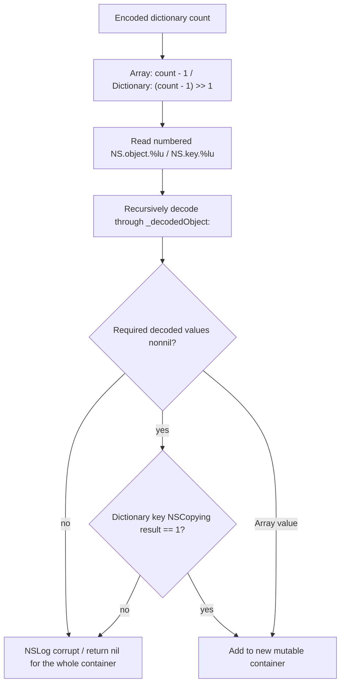
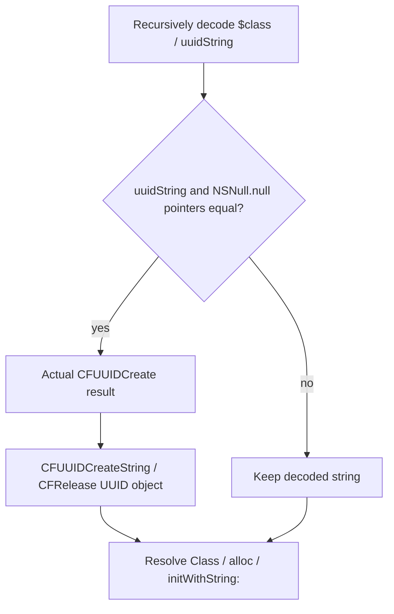

# SA-AE-TARGET-018: Decoding containers, strings and identities

[日本語](SA-AE-TARGET-018-archive-helpers.md) · [English](SA-AE-TARGET-018-archive-helpers.en.md) · [Object dispatch](SA-AE-TARGET-016-archive-dispatch.md) · [File entry](SA-AE-TARGET-017-archive-containers.md)

**The dedicated helpers do not preserve every archived value unchanged.** Arrays and dictionaries have decoding failure conditions; attributed strings receive a fixed attributes dictionary; color decoding ignores the input and returns `clearColor`. A decoded identity string equal to the `NSNull` object takes a path that creates a new UUID. Eight definitions distinguish ordinary reads from substituted values.

| Item | Checked scope |
|---|---|
| Target | Logic Pro Creator Studio 12.3.1 / build 6682, 2026-10-07 JST (10-06 UTC) |
| Byte verification | **8 definitions / 1996 bytes / 499 instruction words**; installed thin ARM64 and analysis copy match |
| ARM64 SHA-256 | `2f141e1a1f7b90a4fb0205ffec3dbe187baf601d20e9acb398acfadcdf050998` |
| Acquisition | One Ghidra `-noanalysis -readOnly` job through the common absolute lock |
| Evidence | [Manifest](archive-helpers-manifest.json), [boundary table](../protocol/appleevent-archive-helpers-boundaries.tsv), [binary identity](SA-IDENTITY-001-binary-inputs.md) |
| Applicability | Static definitions; `runtime_verified=false`, `product_capability=false` |

| Fixed definition | Address | Body size |
|---|---|---:|
| `_decodedArray:` | `0x018dffc0` | 312 bytes |
| `_decodedDictionary:` | `0x018e015c` | 500 bytes |
| `_decodedString:` | `0x018e03d4` | 116 bytes |
| `_decodedAttributedString:` | `0x018e045c` | 152 bytes |
| `_decodedColor:` | `0x018e0518` | 36 bytes |
| `_decodedIdentity:` | `0x018e053c` | 320 bytes |
| `_decodeChannelID:` | `0x018e06cc` | 424 bytes |
| Fixed `_CLgMainStageObject` `initWithProperties:` | `0x018deb58` | 136 bytes |

## 1. Arrays and dictionaries read numbered archive keys

The array uses the source dictionary's `count - 1` as capacity and element count, starting at index0 with `NS.object.%lu` keys. The dictionary uses **64-bit `count - 1` followed by logical right shift1** for capacity, and reads `NS.key.%lu` / `NS.object.%lu` pairs. The index is stored on the stack as a variadic argument to `stringWithFormat:`; Ghidra's C omits this argument.

A nil decoded array value returns nil rather than the partially built array. The dictionary requires a nonnil decoded key and value and a `conformsToProtocol:NSCopying` **comparison value w8 equal to exactly1**. This is not a general nonzero-success test. Failure returns nil and calls a `Corrupt … in MainStage concert archive.` log.

These bodies do not enumerate all source keys to establish order. They also have no local checks for a too-small source count before subtraction or for dictionary key-count parity. Native capacity behavior, large or malformed inputs and exception cleanup remain untested. (A018-01–05)

## 2. Strings, attributes and colors read different data

| Helper | Behavior in this body | Unresolved boundary |
|---|---|---|
| `_decodedString:` | Nonnil raw `NS.bytes` is passed to allocated NSString `initWithData:encoding:`, encoding=4 | Actual data type, invalid text and native initializer failure |
| `_decodedAttributedString:` | Recursively decode the `NSString` key; pass the fixed bound `___NSDictionary0__struct` pointer to `initWithString:attributes:` | Singleton contents, preservation of archived attributes and actual destination acceptance |
| `_decodedColor:` | Ignore the input and return NSColor `clearColor` | Preservation of archived colors, other paths and live displayed colors |

Nil `NS.bytes` logs a failure and returns nil. Nonnil input has no local NSData type test. Encoding4 was checked against SDK `NSUTF8StringEncoding`. Reading `NS.bytes` here is separate from the prior dispatcher's direct NSString passthrough.

The attributed-string object is allocated before recursive string decoding. The body has no branch that avoids the initializer for a nil decoded string. Its attributes argument is the fixed bound singleton pointer; this body reads no archived attributes key. The singleton's contents remain unverified. Color decoding likewise reads no archived components. Neither finding establishes loss of all project attributes or colors: prior dispatch, actual inputs and consumers still matter. (A018-06–10)

## 3. An NSNull identity string takes the new-UUID path

`_decodedIdentity:` recursively decodes `$class` and `uuidString`. It **compares pointers** for the decoded string and `NSNull null` result. Equality calls `CFUUIDCreate`; its actual x0 result is saved and passed in x1 to `CFUUIDCreateString`, then released through `CFRelease`. The newly returned string is the value passed to the initializer.

Ghidra's C appears to pass an allocator as the UUID and set the string to0. ARM64 argument and return-value moves do not support that reading. The condition is neither a dedicated nil test nor a content comparison with `"$null"`.

The decoded class name is then passed to `classForClassName:`. The resolved Class is allocated and receives `initWithString:`. Generated UUID semantics, generation or class-resolution failure, destination acceptance and save/reload identity stability remain unverified. This branch is insufficient evidence for a stable-ID contract. (A018-11–14)

## 4. Channel-ID integer widths and fixed-object copying

`_decodeChannelID:` recursively decodes `$class`, `aliasIndex`, `index` and `type`. After resolving the class name, it sign-extends the32-bit `intValue` of type to64 bits; index and aliasIndex use32-bit `unsignedIntValue` results passed to `channelIDWithType:index:aliasIndex:`. These are different conversions. The receiver is the resolved Class; this body does not directly allocate a fixed MAChannelID. Numerical meaning, range validity and equality with external track/gindex/UUID identifiers do not follow from this body. (A018-15–17)

Fixed `_CLgMainStageObject` `initWithProperties:` temporarily retains incoming properties and calls super `init`. Only a nonnil result sends `copy` to the input, stores the returned object in receiver `_properties` (+8) and releases the former field. This does not establish a deep copy or independent nested values. Nil super initialization skips copy and store; temporary ownership is released before returning that nil result. (A018-18–19)

The proxy factory and its dictionary/archive retention and destruction were read separately in [TARGET015](SA-AE-TARGET-015-proxy-decoder.md). Keep this newly checked fixed-object copy distinct from the proxy decoder arguments and resolved-Class initialization.

## 5. Verification and remaining boundaries

Verification covers all499 instruction words,8 method rows,19 selector stubs,10 native import stubs,12 CFStrings, the NSCopying protocol reference and the directly used `_properties` type/offset. Missing, duplicate and changed-word negative cases were rejected. Instruction anchors for each fact are in the [boundary table](../protocol/appleevent-archive-helpers-boundaries.tsv).

This analysis concerns fixed MainStage archive definitions. It does not establish the full file format of a Logic project's `ProjectData` or which functions ran. Native containers, recursion/cycles/cache, dynamic classes and initializers, actual-file agreement, save/reload and Undo roundtrips remain unverified. No product CLI file or region operation was added. (A018-20)
