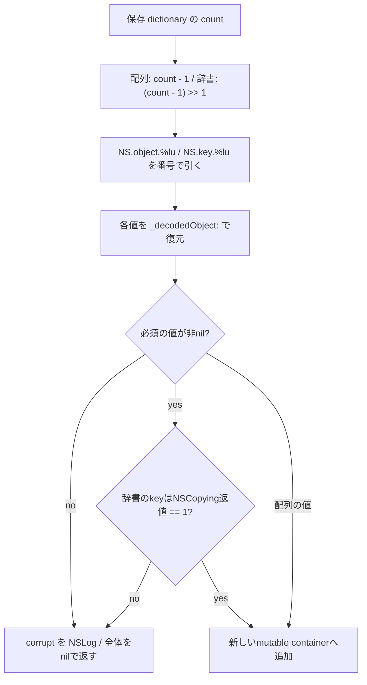
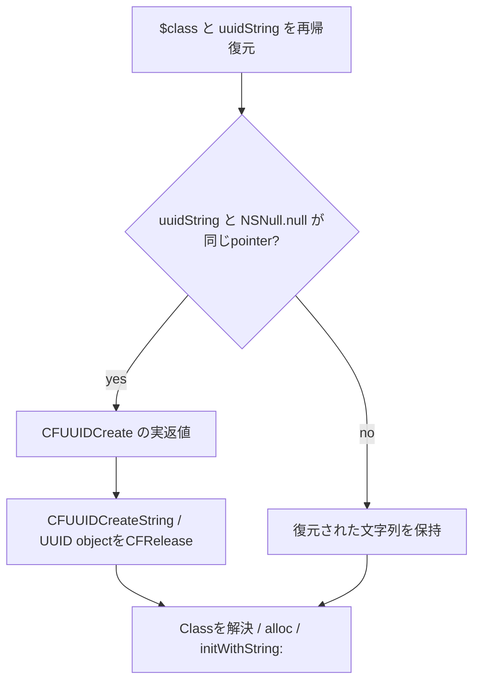

# SA-AE-TARGET-018: 配列・辞書・文字列と識別子の復元

[日本語](SA-AE-TARGET-018-archive-helpers.md) · [English](SA-AE-TARGET-018-archive-helpers.en.md) · [復元の振り分け](SA-AE-TARGET-016-archive-dispatch.md) · [ファイルの入口](SA-AE-TARGET-017-archive-containers.md)

**この archive の専用 helper は、保存された値をすべてそのまま戻す処理ではありません。** 配列・辞書には復元失敗の条件があり、属性付き文字列には固定の属性辞書を渡し、色は入力を読まず `clearColor` を返します。識別子の文字列が `NSNull` と同じオブジェクトなら、新しい UUID を作る経路があります。8関数の命令を照合して、通常の読み出しと置換される値を分けました。

| 項目 | 確認した範囲 |
|---|---|
| 対象 | Logic Pro Creator Studio 12.3.1 / build 6682、2026-10-07 JST（10-06 UTC） |
| byte 照合 | **8定義 / 1996 bytes / 499命令ワード**。installed thin ARM64 と解析 copy が一致 |
| ARM64 SHA-256 | `2f141e1a1f7b90a4fb0205ffec3dbe187baf601d20e9acb398acfadcdf050998` |
| 取得 | 共通絶対 lock、Ghidra `-noanalysis -readOnly` の1 job |
| 根拠 | [manifest](archive-helpers-manifest.json)、[境界表](../protocol/appleevent-archive-helpers-boundaries.tsv)、[バイナリ識別](SA-IDENTITY-001-binary-inputs.md) |
| 適用範囲 | 静的な定義。`runtime_verified=false`、`product_capability=false` |

| 固定定義 | アドレス | 本文サイズ |
|---|---|---:|
| `_decodedArray:` | `0x018dffc0` | 312 bytes |
| `_decodedDictionary:` | `0x018e015c` | 500 bytes |
| `_decodedString:` | `0x018e03d4` | 116 bytes |
| `_decodedAttributedString:` | `0x018e045c` | 152 bytes |
| `_decodedColor:` | `0x018e0518` | 36 bytes |
| `_decodedIdentity:` | `0x018e053c` | 320 bytes |
| `_decodeChannelID:` | `0x018e06cc` | 424 bytes |
| 固定 `_CLgMainStageObject` の `initWithProperties:` | `0x018deb58` | 136 bytes |

## 1. 配列と辞書は、番号付きの保存キーを順に読む

配列は元dictionaryの `count - 1` をcapacityと要素数に使い、添字0から `NS.object.%lu` のキーを作ります。辞書は **64bitの `count - 1` を論理右シフト1**した値をcapacityに使い、`NS.key.%lu` と `NS.object.%lu` の組を読みます。番号は `stringWithFormat:` の可変引数としてstackへ渡されます。GhidraのCではこの添字の引数が見えませんが、命令にはstoreがあります。

配列は復元値がnilなら、途中まで作った配列を返さずnilを返します。辞書は復元keyが非nil、valueが非nil、かつkeyの `conformsToProtocol:NSCopying` の**比較値w8がちょうど1**でなければnilを返します。ここは単なる「非0なら成功」という判定ではありません。どちらも失敗時に `Corrupt … in MainStage concert archive.` のログを呼びます。

これらの本文は、元dictionaryの全キーを列挙して順序を決めるものではありません。countが小さすぎる場合の減算や、辞書のキー数の偶奇を確認する局所的な検査もありません。native capacity処理、巨大値や不正な入力での実動作、例外cleanupは未確認です。（A018-01〜05）

## 2. 文字列・属性・色では読む項目が違う

| helper | この本文がすること | 確定しないこと |
|---|---|---|
| `_decodedString:` | 生の `NS.bytes` が非nilなら、生成したNSStringへ `initWithData:encoding:`、encoding=4 | dataの実型・不正な文字列・initializer失敗のnative動作 |
| `_decodedAttributedString:` | `NSString` キーを再帰復元し、`initWithString:attributes:` へ固定の `___NSDictionary0__struct` のbind pointerを渡す | singletonの内容、保存された属性の再現、この呼び出し先の実受理 |
| `_decodedColor:` | 入力を参照せずNSColorの `clearColor` を返す | 保存された色の再現、別の経路や実機表示の色 |

`NS.bytes` がnilならログを呼びnilを返します。非nilでもNSDataの局所型検査はありません。encoding=4はSDKの `NSUTF8StringEncoding` と照合しました。文字列helperが `NS.bytes` を読むことと、前回のdispatcherがNSStringをそのまま返す経路は別です。

属性付き文字列は再帰復元の前にobjectを生成します。本文には、復元した文字列がnilのときにinitializerを避ける分岐はありません。属性引数は上記の固定singletonへのbind pointerで、保存された属性のキーをこの本文から読み出しません。singleton自体の内容は未確認です。色のhelperも保存された成分を読みません。これだけで曲全体の色・属性が失われると一般化はしません。前段の振り分けと、実際の入力・利用先の確認が必要です。（A018-06〜10）

## 3. NSNull の識別子は新しい UUID の経路へ進む

`_decodedIdentity:` は `$class` と `uuidString` を再帰復元します。復元文字列と `NSNull null` の返値の**pointerを比較**し、一致した枝で `CFUUIDCreate` を呼びます。その返値x0を保存して `CFUUIDCreateString` のUUID引数x1へ渡し、作ったUUID objectを `CFRelease` します。実際にinitializerへ渡すのは、作成された文字列の返値です。

GhidraのCにはallocator値をUUIDとして渡し、文字列を0にするような表示がありますが、ARM64の返値・引数の移動はその読み方を支持しません。この条件はnil専用判定でも、文字列の内容が `"$null"` かを比較する判定でもありません。

その後、復元したclass名を `classForClassName:` に渡し、解決したClassを生成して `initWithString:` に渡します。生成されたUUIDの意味、生成失敗、Class解決失敗、destination initializerの受理、保存・再読込で同じ識別子になることは未確認です。安定IDの契約としてこの枝を採用できる段階ではありません。（A018-11〜14）

## 4. Channel ID の数値の幅と固定 object のcopy

`_decodeChannelID:` は `$class`、`aliasIndex`、`index`、`type` をそれぞれ再帰復元します。Class名を解決したあと、typeの `intValue` の32bitを64bitへ符号拡張し、indexとaliasIndexは `unsignedIntValue` の32bitを使って `channelIDWithType:index:aliasIndex:` へ渡します。これは同じ整数変換ではありません。receiverは解決したClassで、ここで固定MAChannelIDを直接生成する本文ではありません。数値の意味、範囲の妥当性、外部のtrack/gindex/UUIDとの同一性は、この本文だけでは決まりません。（A018-15〜17）

固定 `_CLgMainStageObject` の `initWithProperties:` は入力propertiesを一時保持してsuperの `init` を呼び、返値が非nilのときだけ入力へ `copy` を送り、その返値をreceiverの `_properties`（+8）へ保存し、以前のfieldをreleaseします。深いcopyや、内部valueまで独立することを証明する処理ではありません。super初期化がnilならcopyとstoreを飛ばし、一時保持をreleaseして、その返値を返します。（A018-18・19）

proxyのfactoryとdict/archiveの保持・解放は、[TARGET015](SA-AE-TARGET-015-proxy-decoder.md)で別途読んでいます。ここで新たに確認した固定objectのcopy経路と、proxyへのdecoder引数、解決したClassのinitializerを混同しません。

## 5. 検査と残る境界

全499命令ワード、8 method rows、19 selector stubs、10 native import stubs、12 CFStrings、NSCopyingのprotocol参照と直接参照された `_properties` の型・offsetを照合しました。命令の欠落・重複・変更の3負例は拒否しました。各事実の命令anchorは[境界表](../protocol/appleevent-archive-helpers-boundaries.tsv)にあります。

この解析はMainStage archiveの固定定義に限ります。Logicの専用曲の `ProjectData` 全体のファイル形式や、実際にどの関数が呼ばれたかを確定するものではありません。native container、再帰・循環・cache、動的Classとinitializer、実ファイルとの一致、保存・再読込・Undoの往復は未確認です。製品CLIにファイルやリージョンの操作を追加していません。（A018-20）
