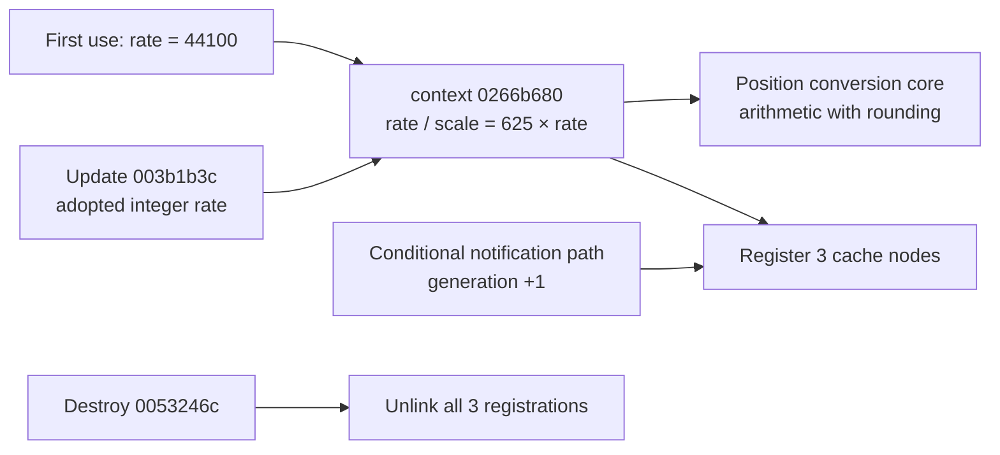

# SA-AE-TIME-002: Position conversion context updates and lifetime

[日本語](SA-AE-TIME-002-context-lifecycle.md) · [English](SA-AE-TIME-002-context-lifecycle.en.md) · [Earlier analysis](SA-AE-TIME-001-position-conversion.en.md)

**44100 is an initial value. A static path later updates the rate and conversion scale.** We also identified generation increments for registered caches and removal of their registrations during context destruction. Following an actual project change to 48/96 kHz has not been verified on the running application.

| Item | Value |
|---|---|
| Date and baseline | 2026-10-02, Logic Pro Creator Studio 12.3.1 / build 6682, `Logic.arm64` |
| Import SHA-256 | `2f141e1a1f7b90a4fb0205ffec3dbe187baf601d20e9acb398acfadcdf050998` |
| Execution | Ghidra `-noanalysis -readOnly`; no events, new connections, or live application operations |
| Evidence | [Follow-up manifest](appleevent-followup-analysis-manifest.json). Addresses are image addresses before slide |

## 1. The rate updater

`FUN_003b1b3c` preserves its integer `x0` input in `x19`. It stores it in global `0x025ecad8` at `0x003b1b9c`, then converts it to double and stores it through the pointer in import slot `0x02283900`, named `globalSampleRate`, at `0x003b1ba8..0x003b1bb4`. This matches store instructions with an import symbol; it is not evidence of executing the function.

The same value updates the shared context from the earlier analysis.

| Instruction range | Established operation |
|---|---|
| `0x003b1bc8..0x003b1bd0` | Store the 64-bit integer rate at `+0` of context `0x0266b680` |
| `0x003b1bd4..0x003b1be0` | Compute integer `625 * rate`, use `SCVTF`, store the double scale at context `+8` |
| `0x003b1c0c..0x003b1c54` | If uninitialized, construct with immediate `44100`, register atexit, then return to the update above |
| `0x003b1be4..0x003b1bf8` | If the old value differs and another global object exists, clear that object's `+0x78` |

The last field's meaning is unresolved. This updater range contains no loop incrementing every registered cache generation. Do not assume that rate updates and cache invalidation always finish within the same call.

## 2. Caller boundaries

Direct updater calls were confirmed at `0x00417bc0` in `FUN_00417ad8` and `0x00417f1c` in `FUN_00417bfc`. Ghidra also lists a data reference in `__LINKEDIT`; it is not counted as an executing caller.

- `FUN_00417ad8` reads a value through virtual getter `+0x60` on the object reached from global `0x0275ff60`, using `44100` for zero/absence (`0x00417b88..0x00417bac`). Another candidate comes from enumeration through virtual `+0x40` / `+0x50`. A nonzero result from `FUN_002cc818` leads to passing the adopted candidate in updater `x0` (`0x00417bb0..0x00417bd8`).
- `FUN_00417bfc` accepts a value in `x1` and forms an absolute-value candidate. For zero, it tries the same virtual getter, with `44100` if no value is obtained. It checks `FUN_002cc818` before calling the updater (`0x00417ee0..0x00417f34`).

The internals of `FUN_002cc818`, virtual getter implementations, and notification order remain unaudited. **Hypothesis, confidence: medium:** these are audio rate selection/change paths. This agrees with the `globalSampleRate` store but does not guarantee equality of project display, hardware rate, and conversion rate under every condition.

## 3. Cache generations and destruction

The earlier analysis established that constructor `FUN_01a125c4` links `context+0x10/+0x48/+0x80` into global list `0x02777108`.

`FUN_00e65474` continues only if the input object's `+8` matches the active object pointer (`0x00e65474..0x00e65494`). It then increments each list node's 32-bit `+0x2c` by 1 (`0x00e654a0..0x00e654bc`). The conversion core compares node `+0x2c` and `+0x30` and rebuilds its cache on a mismatch (`0x019fd5ec..0x019fd61c`, `0x019adec4..0x019adef0`). This establishes how the generation fields connect.

The complete notification sources have not been traced, so invoking this function for every tempo or rate change is not established. Later instructions update the fallback through `FUN_019ae130` and store global map pointer `0x02701798` (`0x00e654f8..0x00e65508`).

The atexit target `FUN_0053246c` searches for `context+0x80/+0x48/+0x10` in order and unlinks each by replacing the preceding node or list head (`0x0053246c..0x00532520`). Its instructions contain no free/delete of the context itself. Registration, invalidation, and removal are distinct operations.

## 4. Resolving the fallback record destination

`FUN_019ae9dc` preserves input `x0` in `x23` and returns it with `mov x0,x23` (`0x019aea00`, `0x019aea74`). Therefore the second destination from the earlier analysis is established as **`0x027771c0 + 0x20 = 0x027771e0`**.

| Field within the record | Statically confirmed store |
|---|---|
| Timestamp portion at `+0` | Mask the nonnegative input with `0x7fffffffffff0000`, preserving the low 16 bits |
| `+0x10` | Clamp `w3` to `50000..9900000` using signed comparisons and store it |
| `+0x18/+0x1c` | Store `w2` and zero |
| `+0x16` | Store the low byte of `w4 << 5` |

The 32-byte initialization, byte `0x60` at `+0`, and byte `0x7f` at `+0xc` were also confirmed (`0x019aea10..0x019aea70`). All side effects of the initial lower call `FUN_01992d7c` remain unaudited. These stores do not establish field units or a schema shared by every record type.

## 5. Remaining work before an external API

1. Match `FUN_002cc818` and virtual getter implementations to establish rate adoption conditions and synchronization order.
2. Trace bounded generation-update notification sources to establish when stale cache values cannot be reused after tempo/rate changes.
3. Validate multiple records, signs, boundaries, and rounding with synthetic fixtures, then compare displayed values with independent readback in a dedicated project experiment.

This investigation narrows static unknowns. Sample units for `sPss`, epoch, persisted results, read-only guarantees, and product capability remain unestablished.
