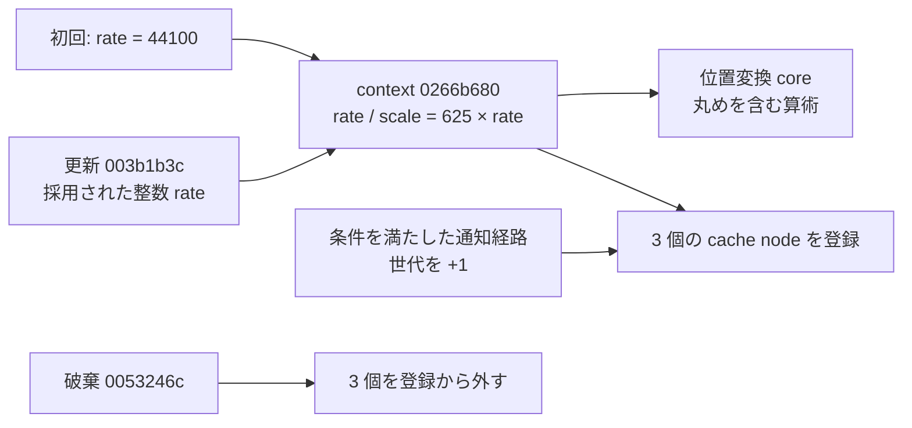

# SA-AE-TIME-002: 位置変換 context の更新と寿命

[日本語](SA-AE-TIME-002-context-lifecycle.md) · [English](SA-AE-TIME-002-context-lifecycle.en.md) · [先行解析](SA-AE-TIME-001-position-conversion.md)

**44100 は初期値です。後から rate と変換 scale を更新する静的経路を確認しました。** さらに、登録された cache の世代を進める処理と、context の破棄時に登録を外す処理を特定しました。実際の曲を 48/96 kHz へ変更したときの追従は、まだ実機で確認していません。

| 項目 | 内容 |
|---|---|
| 日付・基準 | 2026-10-02、Logic Pro Creator Studio 12.3.1 / build 6682、`Logic.arm64` |
| import SHA-256 | `2f141e1a1f7b90a4fb0205ffec3dbe187baf601d20e9acb398acfadcdf050998` |
| 実行 | Ghidra の `-noanalysis -readOnly`。Logic へのイベント・新規接続・実機操作なし |
| 証拠 | [follow-up manifest](appleevent-followup-analysis-manifest.json)。アドレスは slide 前のイメージアドレス |

## 1. rate を更新する関数

`FUN_003b1b3c` は `x0` の整数を `x19` に保持します。`0x003b1b9c` で global `0x025ecad8` に保存し、`0x003b1ba8..0x003b1bb4` では double 化して、import symbol `globalSampleRate` の pointer slot `0x02283900` が指す先に保存します。この関数を実行した証拠ではなく、保存命令と import symbol の照合です。

同じ値で、先行解析の共有 context を更新します。

| 命令範囲 | 確定した処理 |
|---|---|
| `0x003b1bc8..0x003b1bd0` | context `0x0266b680` の `+0` に 64-bit 整数 rate を保存 |
| `0x003b1bd4..0x003b1be0` | 整数の `625 * rate` を計算 → `SCVTF` → context `+8` に double の scale を保存 |
| `0x003b1c0c..0x003b1c54` | 未初期化なら constructor に即値 `44100` を渡し、atexit を登録した後、上の更新へ戻る |
| `0x003b1be4..0x003b1bf8` | 以前の値と異なり、別 global object が存在する場合は、その `+0x78` を 0 にする |

最後の field の意味は未確定です。rate 更新関数のこの範囲に、登録された全 cache の世代を進める loop はありません。rate 更新と cache 無効化が常に同じ呼び出しで完了するとは扱いません。

## 2. 更新元の呼び出し境界

更新関数への直接 call は `FUN_00417ad8` 内の `0x00417bc0` と `FUN_00417bfc` 内の `0x00417f1c` で確認しました。Ghidra の参照一覧には `__LINKEDIT` の data 参照も含まれますが、実行される caller として数えません。

- `FUN_00417ad8` は global `0x0275ff60` が指す object の virtual getter `+0x60` から値を得て、0/不在なら `44100` を候補にします（`0x00417b88..0x00417bac`）。別の候補は virtual `+0x40` / `+0x50` の列挙から作ります。`FUN_002cc818` の返値が非 0 の経路で、採用候補を updater の `x0` に渡します（`0x00417bb0..0x00417bd8`）。
- `FUN_00417bfc` は `x1` の値を受け、絶対値側の候補を作ります。0 の場合は同じ virtual getter を試し、取得できなければ `44100` とします。`FUN_002cc818` の結果を見て updater に渡します（`0x00417ee0..0x00417f34`）。

`FUN_002cc818` の内部、virtual getter の実装、通知順序は未監査です。**Hypothesis、確信度: 中:** これらは音声側の rate 選択・切替経路です。`globalSampleRate` への保存と整合しますが、project の表示値、hardware rate、変換用 rate が全条件で同じという保証にはしません。

## 3. cache 世代と破棄

constructor `FUN_01a125c4` が `context+0x10/+0x48/+0x80` を global list `0x02777108` に結ぶことは先行解析で確認済みです。

`FUN_00e65474` は、入力 object の `+8` が active object pointer と一致した場合だけ先へ進みます（`0x00e65474..0x00e65494`）。その後、list の各 node の `+0x2c` を 32-bit の `+1` で更新します（`0x00e654a0..0x00e654bc`）。変換 core は node の `+0x2c` と `+0x30` を比較し、不一致なら cache を作り直します（`0x019fd5ec..0x019fd61c`、`0x019adec4..0x019adef0`）。これで世代 field の使い方を対応づけられます。

通知元全体を追っていないため、すべてのテンポ変更や rate 変更でこの関数が呼ばれるとは確定していません。後段には fallback 更新 `FUN_019ae130` と global map pointer `0x02701798` の保存もあります（`0x00e654f8..0x00e65508`）。

atexit の対象 `FUN_0053246c` は、context の `+0x80/+0x48/+0x10` を順に探し、前 node または list head を付け替えて外します（`0x0053246c..0x00532520`）。この関数の命令に context 自体の free/delete はありません。登録・無効化・解除を別の処理として扱います。

## 4. fallback record の宛先を確定

`FUN_019ae9dc` は入力の `x0` を `x23` に保ち、最後に `mov x0,x23` で返します（`0x019aea00`、`0x019aea74`）。したがって、先行解析の 2 回目の宛先は **`0x027771c0 + 0x20 = 0x027771e0`** と確定できます。

| record 内の field | 静的に確認した保存 |
|---|---|
| `+0` の timestamp 部分 | 非負側の入力を `0x7fffffffffff0000` で mask。下位 16 bit を保持 |
| `+0x10` | `w3` を signed 比較で `50000..9900000` に clamp して保存 |
| `+0x18/+0x1c` | `w2` と 0 を保存 |
| `+0x16` | `w4 << 5` の下位 byte を保存 |

32 byte の初期化、`+0` の byte `0x60`、`+0xc` の byte `0x7f` も確認しました（`0x019aea10..0x019aea70`）。最初の下位 call `FUN_01992d7c` の全副作用は未監査です。ここから field の単位や全 record type の共通仕様を推定しません。

## 5. 外部 API に進むための残り

1. `FUN_002cc818` と virtual getter の実装を照合し、rate の採用条件と同期順序を確定する。
2. 世代更新の通知元を限定して追い、テンポ・rate 変更後に古い値が再利用されない条件を確認する。
3. synthetic fixture で複数 record・正負・境界・丸めを検証し、その後の専用曲の実験で表示値と独立 readback を比較する。

今回は静的な未解決点を狭めた段階です。`sPss` の sample 単位、epoch、保存結果、読み取り専用性、product capability は未確定のままです。
