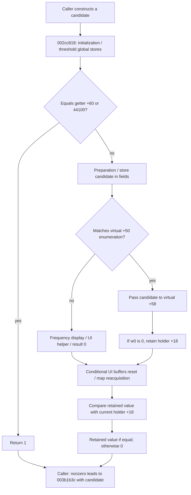

# SA-AE-TIME-003: Rate adoption boundary for position conversion

[日本語](SA-AE-TIME-003-rate-adoption.md) · [English](SA-AE-TIME-003-rate-adoption.en.md) · [Arithmetic](SA-AE-TIME-001-position-conversion.en.md) · [Context updates](SA-AE-TIME-002-context-lifecycle.en.md)

**`FUN_002cc818` performs adoption with side effects. Even an equal candidate can encounter preceding global updates.** The change path writes object fields before checking candidate eligibility, and rejection constructs a frequency display and calls a UI helper. A nonzero return is neither the rate itself nor a general successful read.

| Item | Value |
|---|---|
| Date / baseline | 2026-10-02, Logic Pro Creator Studio 12.3.1 / build 6682, `Logic.arm64` |
| Import SHA-256 | `2f141e1a1f7b90a4fb0205ffec3dbe187baf601d20e9acb398acfadcdf050998` |
| Execution | Static audit of saved `-noanalysis -readOnly` output only. No Logic events, connections, or live operations |
| Evidence | [Native boundaries manifest](appleevent-native-boundaries-manifest.json). Addresses are image addresses before slide |
| Scope | `0x002cc818`, direct callees `0x002c8a10` / `0x002cbccc` / `0x002ccd44`, and rechecking earlier callers |

## 1. Evidence and ABI

| Local output under `Research/raw/ghidra/` | Target |
|---|---|
| `q-appleevent-native-next-003.c` / `q-appleevent-native-next-003-machinecode.txt` | `FUN_002cc818`, 1240 bytes |
| `q-appleevent-native-targets-003.c` / `q-appleevent-native-targets-003-machinecode.txt` | `FUN_002c8a10`, 372 bytes |
| `q-appleevent-time-adoption-callees-003.c` / `q-appleevent-time-adoption-callees-003-machinecode.txt` | `FUN_002cbccc`, 1040 bytes / `FUN_002ccd44`, 780 bytes |
| `q-appleevent-time-rate-callers-002.c` / `q-appleevent-time-rate-callers-002-machinecode.txt` | `FUN_00417ad8` / `FUN_00417bfc` |

Fresh export identities confirm the program name and imported SHA. Full decompilation and large instruction dumps stay outside Git. C's `code *`, post-call parameter aliases, and `FUN_0000ac44` annotations do not establish types or function pointers.

`FUN_002cc818` receives a 64-bit candidate in `x0` and retains it in `x19` at `0x002cc838`. A virtual receiver is **the first pointer `[H]` of `H = *global(0x0275ff60)`**, and its vtable is `[[H]]`. Fields of `H` and of the receiver are distinct. Offsets such as `+0x40` below are byte offsets in that vtable. The concrete class and project/hardware owner remain unresolved.

## 2. Work preceding the equality return

`FUN_002c8a10(1)` returns array entry `0x0261c788`. In general, unsigned `w0 < 13` returns `0x0261c5e8 + sign_extend(w0) * 0x1a0`; other values return null (`0x002c8a28..0x002c8a38`). First use initializes 13 entries through `FUN_002c8b84` and registers atexit (`0x002c8a70..0x002c8b68`). There is no proof that the entry's first pointer is the receiver reached through `H`.

If the entry and its first pointer are nonnull, virtual `+0x40` receives selector `0x12` (`0x002cc83c..0x002cc85c`). With return `A` and candidate `R`, 64-bit registers compute `A * 1000000`, then a signed `SDIV` quotient by `R`. A signed quotient below `3500` selects `-6000` / `-7000`; otherwise both values are `-3500`. `STLR` stores them to globals `0x025d0a88` / `0x025d0a8c` (`0x002cc860..0x002cc89c`). This span has no branch rejecting candidate zero. Arbitrary-input validity and the quotient's meaning or units are not established.

Next, an existing `H` leads to virtual `+0x60`; zero/absence uses immediate `44100`. An equal candidate returns **`1`**, without enumeration or virtual `+0x58` (`0x002cc8a0..0x002cc8d8`). Thus membership in the enumeration is not a common requirement for every nonzero return.

## 3. Eligibility and return on the change path

| Instruction span | Confirmed behavior |
|---|---|
| `0x002cc8dc..0x002cc99c` | Update byte counters `0x025ce578` / `0x025cdbf0`. Bit8 of the latter's incremented result selects separate work involving a sentinel and state |
| `0x002cc9a0..0x002cc9c4` | Retain `FUN_002cbccc`'s return. Absent `H` leads to result 0; existing `H` leads to virtual `+0x118(receiver,0,0)` |
| `0x002cc9c8..0x002cc9d4` | **Before enumeration**, store the candidate in the area pointed to by `[H+0x70]` at `+0` / `+0x10`, and at `H+0x80` |
| `0x002cc9d8..0x002cca34` | Use the signed count from virtual `+0x40(selector=10)`, comparing returns of virtual `+0x50(index,0)` with the candidate. Reacquire count within the loop |
| `0x002ccb04..0x002ccb24` | Only a match leads to virtual `+0x58(receiver,candidate)`. `w0 != 0` gives result 0; `w0 == 0` retains the 64-bit value at `H+0x18` |
| `0x002ccb28..0x002ccb3c` | Call virtual `+0x118` again with the byte at `H+0x122` and zero |
| `0x002ccc18..0x002ccc34` | A nonzero retained value leads to `FUN_019c3fa4(0xd4)`. Reload the global, and return the retained value in `x0` only if it equals the current `H+0x18`; otherwise return 0 |

If enumeration has no match, the candidate is converted to double and an `NSMeasurement` using `NSUnitFrequency::hertz` is passed to a formatter. The formatted string and CFString record `0x02340bc8` (C name `cf_SampleRate__notallowed_`) are passed to `FUN_005881b8`; the result becomes 0 (`0x002cca38..0x002ccaf4`). The UI helper call is confirmed, but actual wording and modal behavior were not observed.

A nonzero return on the change path requires zero status from virtual `+0x58` and a nonzero `H+0x18` that matches at the final check. It does not return the candidate rate. **Hypothesis, confidence: medium:** `H+0x18` acts as state or an active-target mask/token. Bit tests and identity comparisons are confirmed, but its full meaning is unresolved. Field stores before rejection are confirmed; rollback through unaudited callees is not guaranteed.

## 4. Surrounding callees and position map

If `H` exists, virtual `+0x98` returns nonzero `w0`, and `H+0x18` is nonzero, `FUN_002cbccc` retains and returns that value **after the virtual check and before downstream updates** (`0x002cbd00..0x002cbd38`, `0x002cbf34`). Other paths return 0 (`0x002cbe0c`). It updates list members at `+0x2f8/+0x172` (`0x002cbd78..0x002cbda8`), detaches `+0x148` chains and relinks global lists (`0x002cbe14..0x002cbff4`), and copies/zeros shared fields (`0x002cbef8..0x002cbf30`). It is not a read-only status getter.

`FUN_002cc818` ORs the low 16 bits of this return with earlier value `x26` to select subsequent work (`0x002ccb40..0x002ccb50`). Selected branches include imported `UISyncManager::ResetAllParametersBuffers`, virtual `+0xc8`, `FUN_002cb2e8`, and `FUN_002ccd44` (`0x002ccb74..0x002ccc08`). The branch with nonzero `x26 & 0xffff0000` temporarily changes global `0x02622e20` and also calls `FUN_002cd050(0)` at the end. API names come from import metadata. Synchronization completion and all downstream effects remain unproved.

`FUN_002ccd44` acquires a pointer through `global(0x0275ff40)` using `LDAR` (`0x002ccd5c..0x002ccd74`). These instructions correct C's return aliases:

| Instruction span | Confirmed data flow |
|---|---|
| `0x002cce00..0x002cce14` | Store the return of virtual `+0xd0`, or zero on absence, at `0x0261f550` |
| `0x002cce54..0x002cce70` | Pass the return of `FUN_003b1d38(pointer)` in `x2` to `FUN_007abb04(0,shared_value,x2,0)`, storing its return at `0x0261f548` |
| `0x002cce88..0x002cce94` | Store the return of previously audited map resolver `FUN_019adc00(pointer,-1)` at `0x0261f4e8` |
| `0x002cce98..0x002ccfd8` | Zero `H+0x130`; state conditions select additional calls, virtual calls, and counter updates |

The static link to position-map reacquisition is confirmed. It does not establish that `FUN_00e65474` cache-generation updates always accompany it, downstream completion order, or retained-pointer lifetime. Effects visible in this function body do not establish the entire behavior including callees.

## 5. Values callers pass to the updater

Both callers construct a fallback by selecting the **minimum signed enumeration value at least `44100`** from virtual `+0x50(index,0)`, or `44100` on absence/no eligible value (`0x00417b20..0x00417b74`, `0x00417e70..0x00417ec8`).

- `FUN_00417ad8` first uses virtual `+0x60`'s return, or `44100` for zero/absence. It tries the fallback only if adoption returns zero and the first candidate differs from it (`0x00417b88..0x00417bd8`).
- `FUN_00417bfc` uses `CNEG` on signed `x1` to construct a candidate. Zero input leads to the same getter/default (`0x00417c1c`, `0x00417c98..0x00417c9c`, `0x00417ee0..0x00417f34`). The valid domain of arbitrary 64-bit inputs remains unresolved.

The nonzero adoption return controls the branch. Updater `FUN_003b1b3c` receives **the caller's retained candidate** in `x0` (`0x00417bb4..0x00417bc0`, `0x00417f10..0x00417f1c`), not the adoption return as a rate. See [TIME-002](SA-AE-TIME-002-context-lifecycle.en.md) for integer/double/context stores in the updater.

## 6. Remaining bounded frontiers and product gate

**Hypothesis, confidence: medium:** The frequency formatter, `SampleRate` name, and `globalSampleRate` update support an audio-rate switching interpretation. Project display, hardware rate, sample units of position input, epoch, persistence, and live behavior at 48/96 kHz remain unverified.

1. Link assignments to `0x0275ff60` with the receiver's vtable and identify concrete `+0x50/+0x58/+0x60` implementations. Do not assume the owner matches array constructor `FUN_002c8b84`.
2. Follow only necessary spans of `FUN_002cb2e8` / `FUN_002cc1ec` / `FUN_002cd050` / `FUN_019c3fa4` and generation-notification sources to establish state changes, stop/resume behavior, and cache-generation ordering.
3. Validate candidate, return, rounding, and boundary behavior in synthetic fixtures first; a separate dedicated-project experiment can compare display values with independent readback and saved/reloaded results.

This milestone establishes a static adoption boundary. Do not call `FUN_002cc818` as a read-only validator or infer file-placement success or cache consistency from a nonzero return. Until units and target ownership are established, do not publish sample API compatibility for `sPss` or a product capability.
